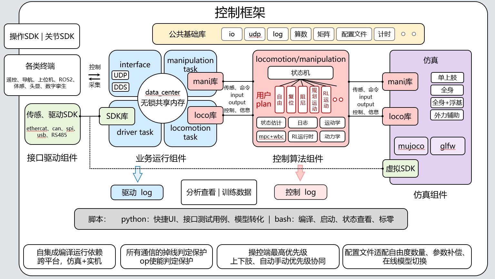

- 这是对OpenLong开源项目的思考

## 硬件开源内容

### 双目相机和三目相机的区别？

最简单地说：

**双目相机 = 两个“眼睛”**，通过两个摄像头看到同一个物体的位置差异，计算出物体的**距离和深度**。

**三目相机 = 三个“眼睛”**，比双目多一个视角，可以获得更多信息，因此在**遮挡、近距离和复杂环境**下通常更稳定。

一句话总结：

> **双目能看出“物体离我多远”，三目是在双目的基础上，通过更多视角让距离判断更稳定、更可靠。**

### BMS是什么？

图中标注的 **BMS** 是 **Battery Management System（电池管理系统）**。

简单来说：

> **BMS 就是机器人的“电池管家”，负责监测和管理电池。**

### 补盲相机有什么用？

**补盲相机**就是用来弥补主相机“看不到的地方”，**补盲相机一般安装在身体或腰部等位置**，用来观察双目相机视野之外的区域。

简单来说：

> **双目相机负责主要的前方视觉，补盲相机负责“照顾死角”，让机器人看得更全面，减少视觉盲区。**

例如机器人前面有一个很近的小物体，双目相机可能因为视野或安装位置看不到，**补盲相机就可以帮助发现它**。

**一句话记忆：补盲相机 = 给机器人“补上看不到的地方”。**

### 手臂总线EtherCAT原因

EtherCAT 的工作原理

- 即时处理：主设备通过线路发送单个数据帧。
- 即时读写：当帧经过每个节点时，设备会读取分配给它的数据，并立即将自己的响应数据写入帧中。
- 无需等待：帧实时返回主设备，每个设备无路由延迟或数据包开销。

主要优势

- 极速：循环时间非常短，通常不到 100 微秒。
- 高精度：采用内置分布式时钟，抖动（定时延迟变化）保持在 1 微秒以内。
- 灵活的布局：无需特殊交换机即可支持线型、星型和树型拓扑结构。

> 臂手总线统一为 EtherCAT，线路简洁。

### 全景相机是什么？

全景环视系统基于嵌入式高性能多媒体处理器，通过在机器人腰部布置四个超广角可见光相机，将采集到的图像信息拼接成一副全景鸟瞰图，并通过显示终端解码显示鸟瞰图。

### 原理图

#### 第1页：头部系统原理图（头部感知单元）

> 功能：机器人头部视觉、显示、感知硬件供电与信号链路。

1. **供电链路** 配电板输出`配电板24V‑2`，线束**头部#2**送入**降压模块24V转12V**，输出DC12V给头部全部设备供电。
    - 降压模块输出DC12V通过**头部#3**给到**头部感知控制器**；
    - DC12V通过**头部#1**直接给**双目相机**供电。
2. **信号链路**
    - 双目相机：Type‑C接口，线束**头部#6 USB**接入头部感知控制器USB口，图像数据上传感知控制器。
    - 头部显示屏：
        - Micro‑B：**头部#7 USB**，接头部感知控制器USB；
        - HDMI：**头部#8 HDMI**，接头部感知控制器HDMI输出，输出画面。
    - 主控（胸腔）：通过网线RJ45，线束**头部#9 RJ45**和头部感知控制器RJ45网口连接，主控下发任务、接收视觉感知数据。

👉简单理解：头部感知控制器是头部的小算力板，双目相机、显示屏全部接在这个板，再回传给胸腔主控。

#### 第2页：电池与BMS电源管理系统（尾部电源）

> 整机能量来源，电池充放电、电池保护、状态采集，安装在机器人尾部。

1. **电池组**：多串电池组，多路电池组线束接到**BMS控制板**。BMS采集每一组电池电压、温度，做过充、过放、过流保护，上报电池状态。
2. **配电板**：整机电源分配中枢。
    - 蓄电池输入：电池高压总输入给到配电板；
    - X16(CAN)：CAN总线，配电板与BMS之间通信，读取电量、故障信息；
    - 总停1：整机急停信号输入。
3. **尾部门面板**：尾部对外接口板，对外充电接口、状态指示灯、外部通信。
    - 充电接口：连接BMS，实现整机充电；
    - 尾部通信：对外调试通信接口。

👉逻辑：电池→BMS保护管理→配电板做整机功率分配，给全身各个模块输出不同电压（72V、24V、12V、5V）。

#### 第3页：胸腔配电、躯干、四肢动力供电图

> 胸腔内部**配电板**输出全部电压给胸腔模块、手臂、腰腿部关节驱动器，区分高压动力电、低压控制电。

- 配电板输出电压

|电压|负载对象|
|---|---|
|12V‑1、12V‑2|遥控开关、继电器、WIFI模组供电|
|24V‑1、24V‑3|主控、上肢分支器、下肢分支器供电|
|72V|腰、腿大关节**高压动力电源**，大扭矩关节电机功率供电|
|5V|各个关节驱动器控制板低压供电|

- 模块解析

1. **遥控开关 + 继电器**：遥控开关机、安全回路，继电器做整机电源通断控制。急停2信号接入安全回路，触发急停切断整机动力电源。
2. **WIFI模组**：整机无线通信，接收远程指令、上传机器人状态数据。
3. **主控**：机器人大脑，运行整机运动控制算法。
4. **上肢分支器 / 下肢分支器**：EtherCAT总线分支集线器，把主控一路EtherCAT总线分成多路，分别给到双臂、双腿，简化机身布线。
5. **72V转48V降压模块**：给**左臂、右臂关节驱动器**供电；手臂关节电压低于腿部大关节。
6. 关节驱动器（腰部90关节、左右腿90周转关节）：
    - DC：动力电源；
    - STO：安全扭矩关断安全信号；
    - EnterCAT（EtherCAT）：总线通信，接收主控运动指令，回传编码器、力矩数据。

> 线束编号：`胸腔#xx`代表胸腔内部线束；`肢体#x`代表通向四肢的线束。

#### 第4页：整机EtherCAT通信总线拓扑图（神经网络）

> 这张图**只画通信，不画电源**，完整展示主控如何连接全部外设与关节驱动器。

1. **主控多个RJ45网口（EtherCAT主站）**
    - LAN1：WIFI模组；
    - LAN2：头部感知控制器；
    - LAN3：调试口（外接电脑调试机器人）；
    - LAN5/LAN6：输出EtherCAT总线，连接全身运动关节。
2. 总线拓扑：主控输出网线，接入**下肢分支器、上肢分支器**，分支器再分线连接：
    - 右腿90周转关节、腰部90关节1、左腿90周转关节
    - 左臂、右臂驱动器

> 关键点：青龙机器人采用**树型EtherCAT拓扑**，使用分支器，而不是传统串联，故障一个关节不会整条总线瘫痪，可靠性更高。

#### 第5页：全身关节串联拓扑图

> 展示机器人**全身所有执行关节的串联关系**（腰、头、左腿全系列关节、右腿全系列关节）。 每个方框=一个关节执行器（伺服驱动器+电机+减速器）；`IN`输入，`OUT`输出，EtherCAT信号依次串联传递。

- 关节列表

1. **腰部关节链**：腰部90关节1 → 腰部90关节2 → 腰部90关节3；
2. **头部关节链**：头部70关节1 → 头部70关节2，控制头部俯仰旋转；
3. **左腿完整关节链**： 左腿90周转关节 → 左侧展关节 → 左前摆关节 → 左120膝关节 → 左踝关节1、左踝关节2；
4. **右腿完整关节链**： 右腿90周转关节 → 右侧展关节 → 右前摆关节 → 右120膝关节 → 右踝关节1、右踝关节2。

> 图纸中`BL24‑02‑0xxxx`：关节之间的线缆物料编号。

### 整机完整信号&电源流向总览

1. **电源路径** 
锂电池包 → BMS保护板 → 配电板（功率分配）  
├─→降压模块 →12V：双目相机、头部感知控制器、显示屏、遥控开关  
├─→24V：胸腔主控、分支器  
├─→72V：腿部大关节动力电  
├─→72V转48V降压：双臂关节  
└─→5V：所有关节驱动器内部控制板供电

2. **通信数据流路径** 
胸腔主控（大脑）  
├─以太网RJ45 → WIFI模组、头部感知控制器、调试电脑  └─EtherCAT实时总线（RJ45）→上/下肢分支器 → 全身腰、腿、手臂全部关节驱动器 
关节回传：力矩、位置、温度故障信息给主控

3. **头部感知数据流** 
双目相机(Type‑C) →头部感知控制器USB → 头部感知控制器RJ45 →胸腔主控； 头部显示屏HDMI由头部感知控制器驱动输出画面。

4. **安全链路** 
整机设置两级急停：配电板总停1、胸腔急停2；STO信号给到所有关节驱动器，紧急情况立刻切断电机扭矩输出，保护机器人本体。

#### 补充设计要点

1. **电源分层**：高压72V给腿部大扭矩关节；手臂降压48V；头部外设降压12V；驱动器控制板5V，不同电压隔离，降低干扰。
2. **总线分离**：WIFI/头部感知用普通以太网；关节运动控制使用EtherCAT实时总线，运动控制与视觉数据网络分开，避免视觉大流量图像数据干扰步态实时控制。
3. **安全机制**：整机继电器电源回路 + 每个关节STO扭矩关断双重安全保护。

## 运动控制框架

一套**实机‑仿真一体化、模块化、多任务并行的人形机器人软件架构**，采用**共享内存做核心数据交换**，把驱动、业务逻辑、运动控制、仿真、上层终端完全解耦，支持双跑：真实硬件/MuJoCo仿真一套代码复用。

整体分为6大层级：**公共基础库 → 接口驱动组件 → 业务运行组件 → 控制算法组件 → 仿真组件 → 上层终端 & 脚本工具层**，底部是整套框架的全局安全与特性约束。

### 一、顶层：公共基础库（黄色模块）

**作用：全工程通用底层工具包，所有模块都可以调用** 包含：

- `io`：文件读写、硬件IO操作
- `udp`：UDP高速通信
- `log`：日志打印管理
- `算数 / 矩阵`：基础数值计算、矩阵运算（代替轻量线性代数库）
- `配置文件`：机器人参数、MPC/WBC权重、连杆质量、关节限位配置加载
- `计时`：高精度时间戳，用于控制周期对齐、时延统计

> 定位：整个软件的**基础工具底座**，上层业务和算法不用重复实现底层功能。

### 二、左侧：接口驱动组件

#### 1. 上层终端：各类终端 + 操作SDK/关节SDK

**人机交互与外部指令入口** 
设备列表：遥控器、导航上位机、ROS2、动作捕捉、头显、数字孪生平台 通信方式：`UDP / DDS` 数据流：

- 控制方向：外部下发指令（行走速度、目标姿态、抓取动作）→ 送入框架
- 采集方向：机器人自身状态（位姿、力矩、电量）回传给上位机显示

#### 2. 底层硬件：传感、驱动SDK

硬件通信协议：`EtherCAT / CAN / SPI / USB / RS485` 负责和驱动器、IMU、力传感器直接对话：

1. **读取**：关节编码器、电机温度、IMU姿态、足端力传感器
2. **下发**：位置/速度/力矩指令给伺服驱动器

#### 3. SDK库

封装上面两套SDK，作为业务任务调用的统一接口，硬件操作逻辑全部收敛在这里。

### 三、中间核心：业务运行组件（蓝色区域）

#### 核心枢纽：`data_center 无锁共享内存`

> **整个框架的数据交换中心！** 无锁共享内存 = 一块内存区域，多个线程/进程**不用锁、低延迟读写机器人全局状态**

- 存放内容：全部关节角度、速度、力矩、基座姿态、规划目标、控制输出、故障标志
- 优势：实时性极高，适合机器人毫秒级控制周期；各个任务独立读写互不阻塞

#### 四个并行任务（多线程运行）

1. **interface task** 负责外部通信：UDP/DDS，接收遥控指令，向外推送机器人状态。对接上层终端。
2. **driver task** 硬件驱动周期任务：周期性读取传感器、下发电机指令，对接底层驱动SDK。**和真实硬件强绑定**。
3. **manipulation task（操作任务）** 上肢操作业务，调用 `mani库`（操作库），处理双臂抓取、操作任务。
4. **locomotion task（ locomotion 行走任务）** 全身运动业务，调用 `loco库`（运动库），负责双足行走、全身平衡运动。

> mani库 / loco库：是业务层和算法层之间的接口封装，业务任务把目标指令传给右侧控制算法组件。

#### 日志输出：`驱动log`

driver task采集到的原始传感器数据保存，用于硬件调试、排查驱动器、总线故障。

### 四、右侧红色：控制算法组件（真正运动控制大脑）

`locomotion/manipulation` 是整个框架的**运动算法核心模块**

#### 1. 用户plan（用户自定义运动模式）

状态机管理多种控制模式，可以自由切换：

- **自由模式**：关节直接控位置，零力矩拖动示教
- **复位**：机器人回到初始站姿
- **阻尼模式**：柔顺控制，外力可以轻松推动机器人
- **规划运动**：预先规划好的轨迹动作
- **RL运动**：强化学习生成的动作策略（论文里扩散/强化学习技能就在这里接入）

#### 2. 内置算法模块

- **状态估计**：融合IMU、关节编码器、力传感器解算机器人真实基座位姿
- **运动学 / 动力学**：正逆解、雅可比矩阵、刚体动力学计算
- **mpc + wbc**：人形机器人经典控制栈 —— **模型预测控制 + 全身控制**，实现稳定双足行走
- **RL运行时**：加载训练好的强化学习策略，输出关节目标
- **日志**：算法输出数据保存 → `控制log` 控制日志可以导出，用于离线数据分析、仿真训练数据采集。

#### 数据流关系

业务层(loco/mani库) → 传入任务目标 → 算法模块计算力矩/位置指令 → 结果写回 `data_center共享内存` → driver task读取指令发给电机。

### 五、紫色区域：仿真组件（实机仿真同源）

实现**一套代码，同时支持真机与仿真运行**

1. `虚拟SDK`：和真实硬件SDK接口完全一致，只是硬件驱动替换成仿真接口
2. `loco库 / mani库`：和实机使用完全相同的业务库，算法代码不用修改
3. 仿真后端：`mujoco`（动力学仿真引擎） + `glfw`（可视化窗口渲染）
4. 仿真模式：
    - 单上肢仿真调试抓取
    - 全身双足行走仿真
    - 全身+浮基漂浮状态仿真
    - 外力辅助仿真（给机器人施加外部扰动，测试平衡控制）

> 开发流程：**先在MuJoCo仿真调试控制算法 → 验证完成后直接切换到真机运行，代码零改动**。

### 六、底部：脚本工具层

- **Python脚本**：快速UI控制面板、自动化接口测试、AI模型格式转换（RL策略、扩散模型）
- **Bash脚本**：一键编译工程、启动控制程序、查看运行状态、机器人标零校准

作用：开发、调试、自动化部署工具链。

### 七、最底部：全局框架特性（架构设计保障）

1. **跨平台编译**：仿真Linux/Windows + 实机嵌入式平台一套代码
2. **通信掉线保护**：UDP/DDS断线判定、安全使能保护，断遥控机器人不会失控
3. **操控优先级管理**：遥控器/上位机优先级规则，手动自动模式安全协同
4. **灵活配置**：配置文件修改机器人自由度、动力学参数、支持在线切换控制模型

### ✨ 完整闭环数据流

1. 遥控/上位机下发任务指令 → interface任务写入共享内存data_center
2. loco/mani业务任务读取目标 → 送入MPC/WBC/RL算法模块计算控制量
3. 计算结果写回共享内存
4. driver任务读取控制指令：
    - 真机：通过EtherCAT下发给电机
    - 仿真：通过虚拟SDK送入MuJoCo
5. 传感器/仿真反馈数据回流到共享内存，形成闭环控制
6. 驱动日志、控制日志保存用于数据分析和训练
