# 数学基础

**全概率公式**：“把<mark style="background: #BBFABBA6;">所有可能的原因</mark>各自的发生概率，乘上它们各自导致<mark style="background: #BBFABBA6;">结果</mark>的概率，再<mark style="background: #FFB8EBA6;">加起来</mark>，就是结果的总概率。”

把 “结果 $A$ 怎么来的” 想成一条分岔路：路先分成几条<mark style="background: #FFB86CA6;">互不相交</mark>的小道 $B₁、B₂、…、Bₙ$，你走且只能走其中一条；每条小道自己再通到 $A$ 的概率已知。，则

$\boxed{P(A)=\sum_{i=1}^{n}P(B_i)\,P(A\mid B_i)}$

**贝叶斯公式**：“看到结果后，把<mark style="background: #BBFABBA6;">原因</mark>的初始可信度按<mark style="background: #BBFABBA6;">谁更能解释这个结果</mark>重新<mark style="background: #FFB8EBA6;">加权</mark>，就是贝叶斯。”

1. 先猜：不管结果，原因 $B_i$ 本身有多大概率？——这叫<mark style="background: #FFB86CA6;">先验</mark> $P(B_i)$。 
2. 再看：如果真是 $B_i$ 搞的，它有多容易弄出眼前这个结果 $A$？——这叫<mark style="background: #FFB86CA6;">似然</mark> $P(A|B_i)$。 
3. 最后把<mark style="background: #FF5582A6;">每条</mark>原因的<mark style="background: #FFB8EBA6;">先验 × 似然</mark>加起来当总蛋糕，把 $B_i$ 那份占蛋糕的比例算出来，就是“看到结果后”$B_i$ 的“后验”概率。

*先验 × 似然 ÷ 总蛋糕 = 后验*

$\boxed{P(B_i|A)=\frac{P(B_i)\,P(A|B_i)}{\sum_j P(B_j)\,P(A|B_j)}}$

**大数定律**：当同一个随机实验重复很多次时，实际结果的平均值会越来越接近理论上的期望值。

$\boxed{\lim_{n \to \infty} \frac{1}{n} \sum_{i=1}^n X_i = \mathbb{E}[X]}$

当独立重复试验的次数 $n$ 趋于无穷时，样本均值 $\displaystyle \frac{1}{n}\sum_{i=1}^n X_i$ <mark style="background: #ADCCFFA6;">几乎必然收敛</mark>到随机变量的数学期望 $\mathbb E[X]$。

---

> [!tip] Roadmap


# 🔺Fundamental Tools

## 🟡基本概念（Basic Concepts）

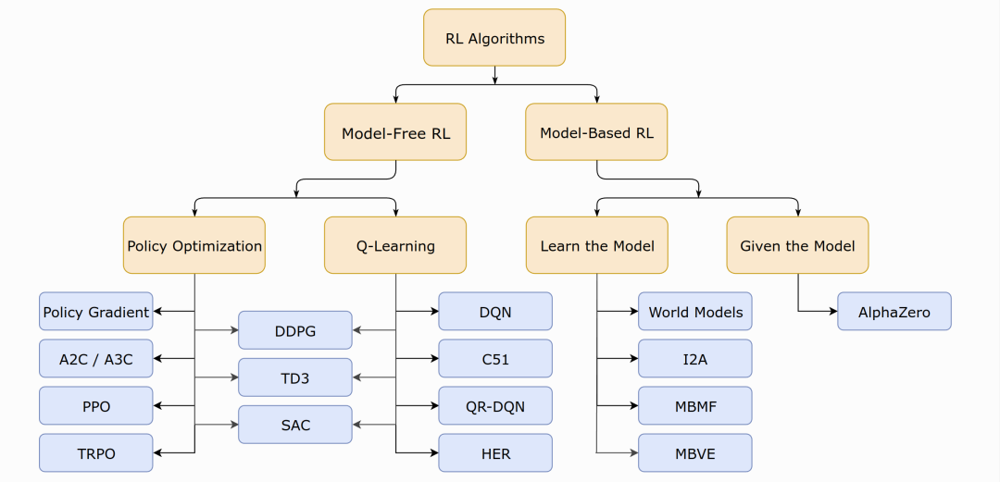

> ([How to define “good”](LessonsPPT/L1-Basic%20concepts.pdf#page=4&annotation=337R))
> 这需要我们找到最优的策略

**Markov Decision Process（马尔可夫决策过程）**：MDP 描述了一个智能体在随机环境里“做什么动作、得到什么回报、世界怎么变化”的完整规则

MDP概念：

- 状态（state）、动作（action）、奖励（reward）
- 状态转移概率（State transition probabilit）： $p(s'|s, a)$
- 奖励概率（Reward probabilit）： $p(r|s, a)$

> ([Markov property: memoryless property](LessonsPPT/L1-Basic%20concepts.pdf#page=26&annotation=396R))
> Markov property: memoryless property 无记忆性

马尔可夫性质：与历史无关（memoryless）  
其他概念：轨迹（trajectory）到达后就停了被称为episode / trail、确定性（deterministic）、随机性（stochastic）、折扣回报（discounted return）

| 名称                                 | 含义                                         | 形式                                                                                                                                                                                                                      | 备注                                    |
| ---------------------------------- | ------------------------------------------ | :---------------------------------------------------------------------------------------------------------------------------------------------------------------------------------------------------------------------- | ------------------------------------- |
| 策略(policy)                         | 从状态映射至所有动作的**概率分布**                        | $\pi(a \lvert s)$：在状态 $s$下选择动作 $a$ 的概率                                                                                                                                                                                  | 策略决定了每个状态下应该执行什么样的动作                  |
| 期望折扣回报(expected discounted return) | reward指**单步**的奖励，return指**多步**的折扣回报        | $G_t = R_{t+1} + \gamma R_{t+2} + \gamma^2 R_{t+3}$ $+ \cdots =\sum_{t=0}^{\infty} \gamma^t R_{t+k+1}$                        - $\gamma \in [0, 1]$ ：折扣因子  <br>- 习惯性写成 $R_{t+1}$，而非 $R_t$，$G_t$ 衡量的是“从这一刻起，未来所有奖励的现值之和” | 评估某个策略的好坏，针对单个trajectory              |
| 值函数 / 状态值函数(state-value function)  | 从状态 $s$ 开始遵循策略 $\pi$ 取得的预期总回报（均值）          | $v_{\pi}(s) = \mathbb{E}_\pi [ G_t \lvert S_t ​=s]$：策略  $\pi$ 的状态-值函数                                                                                                                                                   | 评估某个状态本身的价值，进而反映对应策略的价值               |
| Q函数 / 动作值函数(action-value function) | 从状态$s$开始采取动作 $v$，之后遵循策略 $\pi$ 取得的预期总回报（均值） | $q_{\pi}(s, a) = \mathbb{E}_\pi [ G_t \lvert S_t = s, A_t = a ]$：策略 $\pi$ 的动作-值函数                                                                                                                                       | 评估某个状态下特定动作的价值，注意动作 $a$ 可以不遵循策略 $\pi$ |

## 🟡贝尔曼方程（Bellman Equation）

### 基本形式

每个状态 $S_t$ 的值函数，实际上等于按照策略 $\pi$ 行动后的奖励 $R_{t+1}$ 加上后一个状态 $S_{t+1}$ 的值函数的折扣值 $\gamma G_{t+1}$，也就是即时奖励（immediate reward）和未来奖励（future rewards）的和。这种思想叫做 Bootstrapping（自举法），对应的公式就是贝尔曼方程：  

$$v_π(s) = \mathbb{E}[R_{t+1} + γG_{t+1} | S_t=s] = \sum_{a} \pi(a|s) \sum_{s',r}(s',r|s,a)[r + γ v_π (s')], ∀s∈S$$

贝尔曼方程描述了不同状态之间的值函数的关系。给定策略后求解贝尔曼方程的过程也称之为策略评估（Policy Evaluation）。  

比如有两个策略 $\pi_1$ 和 $\pi_2$，如果对于任何 $s\in \mathcal {S}$， $v_{\pi_1} (s) \geq v_{\pi_2} (s)$ 都成立，那么可以认为 $\pi_1$​ 优于 $\pi_2$​。

### 矩阵-向量形式（Matrix-vector Form）

PPT 形式转化 
> ([Recall that](LessonsPPT/L2-Bellman%20equation.pdf#page=35&annotation=614R))
> 转化前公式

> ([he Bellman equation is](LessonsPPT/L2-Bellman%20equation.pdf#page=36&annotation=620R))
> Bellman equation 括号中是 $s_i,s_j$

贝尔曼方程也可以转化为矩阵-向量形式：  

$$v_\pi = r_\pi + \gamma P_\pi v_\pi$$

- 状态向量： $v_\pi = [v_\pi(s_1), \cdots, v_\pi(s_n)]^T \in \mathbb{R}^n$
- 奖励向量： $r_\pi = [r_\pi(s_1), \cdots, r_\pi(s_n)]^T \in \mathbb{R}^n$
- 状态转移矩阵： $P_\pi \in \mathbb{R}^{n\times n}$，其中 $[P_\pi]_{ij} = p_\pi (s_j|s_i)$，第 $i$ 行，第 $j$ 列的元素是 $p_\pi (s_j|s_i)$

*四个状态时的示例：*  

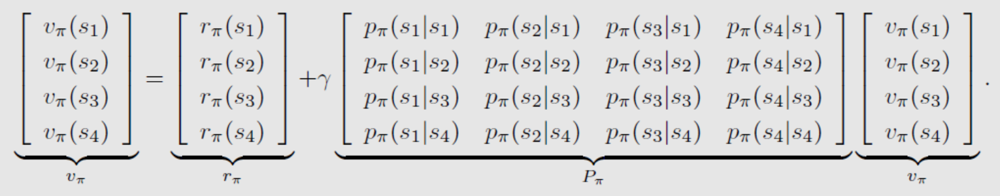

> ([For this specific example](LessonsPPT/L2-Bellman%20equation.pdf#page=37&annotation=623R))
> 例子

### 迭代求解

使用迭代求解的原因：`The closed-form solution` 和 `Matrix-vector form` 计算量大

$$v_{k+1} = r_\pi + \gamma P_\pi v_k$$  
先假设一个 $v_k$ 的值，基于该值计算出 $v_{k+1}$​，进而重复该过程不断计算出 $v_{k+2}, v_{k+3}, \cdots$。  

可以证明，当 $k \to \infty$ 时， $v_k$ <mark style="background: #BBFABBA6;">会收敛到</mark> $v_\pi$。

### 状态值 vs 动作值

$$v_\pi (s) = \sum_{a} \pi (a | s) q_\pi (s, a)$$

<mark style="background: #ABF7F7A6;">状态值</mark>可以看作是策略 $\pi$ 的每个动作值的加权平均。

$$q_\pi (s,a) = \sum_{s', r} p(s', r|s, a) [r + \gamma v_{\pi}(s')]$$ 

<mark style="background: #ABF7F7A6;">动作值</mark>可以通过状态值求解，也可以不依赖于状态值求解。

求解贝尔曼公式，进而得到一个策略所对应的状态值，这样一个过程就被称为策略评价(Policy evaluation)

> [!tip] 我评价了一个策略我得到它的值, 然后我基于它的值再改进策略然后这样循环下去, 最后我就能够得到一个最优的策略

## 🟡贝尔曼最优方程（Bellman Optimality Equation）

RL的目标是<mark style="background: #FF5582A6;">最大化累计奖励</mark>，则<mark style="background: #FFB8EBA6;">必然存在至少一个</mark>最优策略，记作 $\pi_*$，其对任意策略 $\pi$ 都满足： $v_{\pi_*} (s) \geq v_{\pi}(s), \forall s\in \mathcal{S}$。

BOE is tricky yet elegant！

### 基本形式

最优策略共享相同的最优状态值 $v_*$ 与最优动作值 $a_*$​。**寻找最优策略相当于求贝尔曼方程**（$v_\pi、 a_\pi$）的<mark style="background: #FFF3A3A6;">最优解</mark>（$\max_\pi$），则贝尔曼最优方程为：  

$$v_∗ (s) = \max_{π} v_π ( s ) = \max_π \sum_{a} π ( a∣s ) q_π ( s , a )$$

$$q_∗ (s , a) = \max_π q_π (s, a) = \sum_{s',r} p (s',r∣s,a) [r + \gamma v_∗ (s') ]$$​

对应的矩阵-向量形式：

- 贝尔曼最优策略方程

$$v = \max_\pi (r_\pi+\gamma P_\pi v)$$

贝尔曼最优方程是一个特殊的贝尔曼方程，即当策略 $\pi$ 为最优策略 $\pi_*$​ 时的贝尔曼方程：  

$$\pi_* = \arg max_\pi (r_\pi + \gamma P_\pi v_*)$$

$$v_* = (r_{\pi_*}+\gamma P_{\pi_*} v_*)$$

注意：

- 最优状态值唯一，但<mark style="background: #ADCCFFA6;">最优策略并不唯一</mark>
- 对于一个给定系统，其最优状态值和最优策略受奖励值 $r$ 与折扣因子 $\gamma$ 的影响
    - 最优策略不受奖励值的绝对大小影响，但受其相对大小影响
    - 折扣因子<mark style="background: #D2B3FFA6;">越小</mark>（接近0），策略<mark style="background: #D2B3FFA6;">越短视</mark>，反之（接近1）策略越长远

### 迭代求解

考虑贝尔曼最优方程的矩阵-向量形式，设 $f(v) = \max_\pi (r_\pi+\gamma P_\pi v)$，则贝尔曼最优方程可以写作： $v = f ( v )$。

- 其中 $f(v)$为向量， $[f(v)]_s = \max_\pi \sum_a \pi(a|s)q(s, a), \ \forall s\in\mathcal{S}$

基于压缩映射定理（contraction mapping theorem）可知，$v = f(v)$ 的解（即<mark style="background: #BBFABBA6;">最优状态值</mark> $v_*$ ​）<mark style="background: #FF5582A6;">存在且唯一</mark>。可以通过迭代的方式进行求解，即：  

$v_{k+1} = \max_\pi (r_\pi+\gamma P_\pi v_k)$，其中 $k=0, 1,2,\cdots$ 

可以证明，当 $k \to \infty$ 时， $v_k \to v_*$ ​。

通常的<mark style="background: #BBFABBA6;">求解流程</mark>：【实际上就是<mark style="background: #FFB8EBA6;">基于模型</mark>（Model-based）中的值迭代（Value Iteration）算法】

- 对于任意一个状态 $s\in\mathcal{S}$，估计当前的状态值为 $v_k(s)$

- 对于任意一个动作 $a\in\mathcal{A}(s)$，计算 $q_k(s,a) = \sum_{s',r} p(s', r|s, a) [r + \gamma v_k (s')]$ ，$v_k (s')$ 在第一次迭代时取初始值，后续迭代时使用前一轮迭代中更新后的值

- 计算状态 $s$ 下的确定性贪婪策略 $\pi_{k+1}(a|s) = \begin{cases} 1 & a=a_k^*(s) \\ 0 & a≠a_k^*(s) \end{cases}$，$a_k^*(s) = \arg max_a q_k(s, a)$，表示使得当前状态动作值最大的那个动作

- 计算 $v_{k+1}(s) = \max_a q_k (s, a)$，继续下一轮迭代，$v_{k+1}(s)$ 实际上就是上一步的最优动作对应的动作值（因为当前策略下其他动作的概率均为$0$）

在实际应用中，当 $\lVert v_{k+1}(s) -v_{k}(s) \rVert$ 低于某个阈值（如0.001）之后，就可以认为<mark style="background: #BBFABBA6;">算法收敛</mark>了。

由于精确求解贝尔曼方程往往需要极高的计算开销，所以通常<mark style="background: #FF5582A6;">只获得近似解即可</mark>。

> 压缩映射定理（contraction mapping theorem），又称巴拿赫不动点定理（Banach fixed-point theorem）
> 参考：
> - [非常神奇的数学结论有哪些？ - 知乎](https://www.zhihu.com/question/37470096/answer/463044878)
> - [Chapter 3: The Contraction Mapping Theorem - UC Davis Math](https://www.math.ucdavis.edu/~hunter/book/ch3.pdf)
> - [巴拿赫不动点定理 - 维基百科](https://zh.wikipedia.org/wiki/%E5%B7%B4%E6%8B%BF%E8%B5%AB%E4%B8%8D%E5%8A%A8%E7%82%B9%E5%AE%9A%E7%90%86)
> 直观认识：  
> 将世界地图放在一个桌子上，则该桌子上必有一点，其实际位置会和地图上该点的对应位置重合，该点称之为“不动点（fixed point）”。  
> 将该点的<mark style="background: #BBFABBA6;">实际位置视作变量</mark> $x$ ，其在地图上的位置视作函数 $f(x)$ ，则  $f(x)$ 可以视作对于 $x$ 的一种“压缩映射”， $f ( x ) = x$ 的解即为不动点。  
> 
> 数学描述：  
> 若 $\lVert f(x_1)-f(x_2)\rVert \leq \gamma | x_1 - x_2 |$（其中  $\gamma\in (0, 1)$），则 $f$ 为关于 $x$ 的压缩映射。
> 此处 $f(x)$ 与 $x$ 均为向量， $\lVert \cdot \rVert$ 为向量范数（vector norm）
> 例如： $f(x) = 0.5x$，取 $\gamma=0.6$ 则上式成立。
> 
> 压缩映射定理是指，若  $f$ 为压缩映射，则必然存在（exist）一个不动点 $x^*$ 使得 $f(x^*)=x$，且  $x^∗$ 唯一（unique）。
> 求解算法：迭代式算法  
> 对于迭代序列 $x_{k+1} = f(x_k)$，随着 $k \to \infty$，该序列指数收敛至  $x^*$。
> - 例如：以迭代式算法求 $f(x) = 0.5x$ 的不动点，假设 $x_0=10$，则可迭代得到：$x_1=5, x_2=2.5, x_3=1.25, \cdots$，最终会<mark style="background: #FFB86CA6;">逼近于 0</mark>。

$γ$ 比较大的时候，意味着 agent 会比较远视， 他会比较重视未来的 reward，而当 $γ$ 比较小的时候，它会变得近视，return 里面所得到的这个值的大小，主要是由近期所得到的 reward 来决定的。

# 🔺Algorithms Methods

## 🟡基于模型（Model-Based）

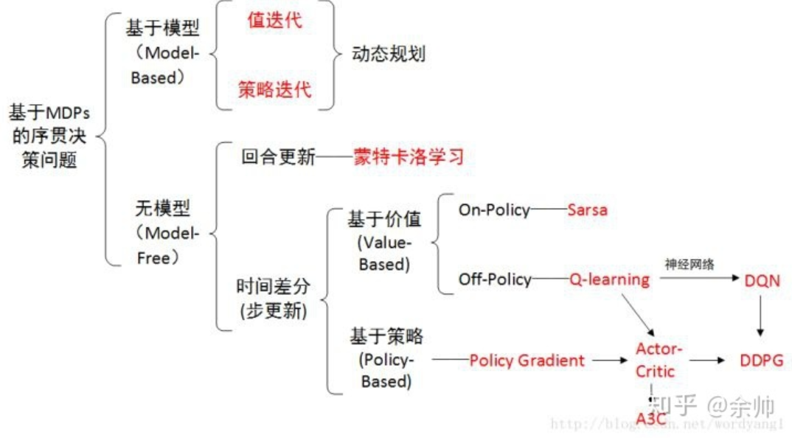

RL算法中存在两种策略：

- 行为策略（Behavior policy）：与环境交互，生成experience采样
- 目标策略（Target policy）：迭代更新，直到收敛至最优策略

据此，可以将RL算法分为两类：

- **On-policy**：Behavior policy 即为 Target policy，例如 MC、Sarsa 等
- **Off-policy**：Behavior policy 与 Target policy 可以不同，例如 Q-learning 等
    - 好处：从别的策略得到的经验中学习，允许更为广泛的探索而不必考虑利用

On-policy可以看作是Off-policy的<mark style="background: #FFF3A3A6;">一种特殊情况</mark>，因为Off-policy允许两种策略相同。


基于模型：环境MDP的模型已知，基于动态规划（DP）求解

- 优：提供了 RL 的理论基础
- 劣：假设过强（完美的环境模型，比如状态转移矩阵），<mark style="background: #FF5582A6;">计算开销过高</mark>

基于模型的方法：

- 策略迭代：收敛速度较快，适用于<mark style="background: #BBFABBA6;">小状态空间</mark>
- 值迭代：计算量较少，适用于<mark style="background: #BBFABBA6;">大状态空间</mark>

*<mark style="background: #D2B3FFA6;">值迭代</mark>可以看作是策略迭代的一种特殊情况*

### 值迭代（Value Iteration）

算法步骤：在第 $k$ 次迭代中

- 策略更新：给定 $v_k$ ，求解对应的策略  $\pi_{k+1} = \arg max_\pi (r_\pi + \gamma P_\pi v_k)$
- 值更新：根据策略  $\pi_{k+1}$ ，计算  $v_{k+1} = r_{\pi_{k+1}} + \gamma P_{\pi_{k+1}} + v_k$

    - *此处的  $v_k$ ​并非状态值，只是一个值，因为其并不满足贝尔曼方程*


算法公式：  
$$v_{k+1} (s) = \max_a \sum_{s', r} p(s', r|s, a) [r + \gamma v_k(s')]$$

伪代码：

```python
v[0] = init_state_value()

while ||v_[k] - v_[k-1]|| >= threshold:
    for s in StateSpace:
        for a in ActionSpace:
            q[a] = calculate_q_value(s, a, v_[k])
    
    	a_star = get_optimal_action(q)

        # policy update
        pi[k+1] = update_policy(a_star)

        # value update
        v[k+1] = update_value(pi[k+1], v_[k])

    k = k + 1
```

**值迭代可以看作将贝尔曼优化方程转为一个更新规则**：<mark style="background: #BBFABBA6;">先计算最优值函数，再从中提取对应的策略作为最优策略</mark>

### 策略迭代（Policy Iteration）

反复执行<mark style="background: #FFF3A3A6;">策略评估</mark>（Policy Evaluation，PE）和<mark style="background: #FFF3A3A6;">策略提升</mark>（Policy Improvement，PI），直至收敛至最优策略。【*能够收敛的要求：有限MDP仅有有限个策略*】

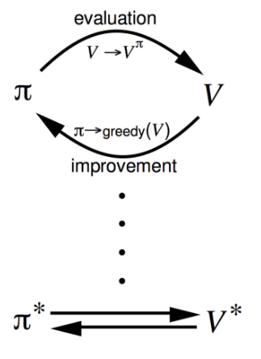

- **策略评估**：评价某个策略本身如何，即计算任意策略  $\pi$ 的状态值函数  $v_{\pi}$ ，称之为预测问题（Prediction Problem ）
$$v_{k+1} (s) = \sum_a \pi (a|s) \sum_{s', r} p(s', r|s, a) [r + \gamma v_k(s')]$$ 
*注意这里与值迭代的区别：值迭代直接求解最优的状态值，而策略评估<mark style="background: #BBFABBA6;">仅是计算当前策略的状态值</mark>（并不一定是最优）*

- **策略提升**：寻找每个状态下的最好的动作
    - 考虑在状态 $s$ 下找到了一个优于现有策略 $\pi$ 的动作 $a = \pi'(s) \neq \pi(s)$ ，则对应的动作值函数  $q_{\pi} (s, a)$ 不低于状态值函数 $v_{\pi} (s)$ ，即：$q_{\pi}(s, \pi'(s)) \geq v_{\pi} (s)$
    - 新策略  $\pi'$ 不差于现有策略  $\pi$ ，即满足：$v_{\pi'} (s) \geq v_{\pi} (s)$
    - 那么策略提升就是以贪心的方式选择每个状态下能使动作值函数最大的动作，进而更新策略：  

$$\pi'(s) = \arg max_a q_\pi (s, a) = \arg max_a \sum_{s', r} p(s', r|s, a) [r + \gamma v_\pi(s')]$$

算法步骤：在第 $k$ 次迭代中，给定策略  $\pi_k​$（随机初始策略： $\pi_0$ ​）

- 策略评估：计算  $\pi_k$ 的状态值  $v_{\pi_k} = r_{\pi_k} + \gamma P_{\pi_k} v_{\pi_k}$

    - *迭代中嵌套迭代，求解每次迭代策略的迭代状态值*

- 策略提升：根据  $\pi_k$ 的状态值 $v_{\pi_k}​​$，求解当前的最优策略 $\pi_{k+1}$ 

伪代码：

```python
pi[0] = init_policy()

while not pi[k].is_converged:
    # policy evaluation
    while ||v_[j] - v_[j-1]|| >= threshold:
        for s in StateSpace:
            v_[j+1][s] = calculate_state_value(pi[k], v_[j][s])
        j = j + 1

    # policy improvement
    for s in StateSpace:
        for a in ActionSpace:
            q[a] = calculate_q_value(s, a, v[j])
    
    	a_star = get_optimal_action(q)
        pi[k+1] = update_policy(a_star)

	k = k + 1
```

近水楼台先得月

**策略迭代中，距离最终目标状态（考虑一个 episode 的最终状态）越近的状态的策略会越早收敛，离目标状态越远的状态的策略会越晚收敛**

### 截断策略迭代（Truncated Policy Iteration）

> ([Compare value iteration and policy iteration](LessonsPPT/L4-Value%20iteration%20and%20policy%20iteration.pdf#page=31&annotation=447R))
> 比较值迭代和策略迭代

截断策略迭代是值迭代与策略迭代的一般化推广；反过来讲，<mark style="background: #BBFABBA6;">值迭代与策略迭代都是截断策略迭代的极端情况</mark>。

值迭代 vs 策略迭代：

- 令  $v_0 = v_{\pi_0}$ ，使得二者具有相同的初始值，便于比较
- 发现：二者的区别在于第四步的  $v_{\pi_1} \neq v_1$ ，因此后续的所有迭代中，二者结果均不相同（收敛前）
    -  $v_{\pi_1}$是由贝尔曼最优方程计算出的状态值，而  $v_1$ 只是一个值（不是状态值）


可以发现，值迭代与策略迭代的根本差异，在于基于贝尔曼最优公式求解状态值的过程

- 值迭代：仅基于初始状态值，<mark style="background: #FF5582A6;">求解一次</mark>贝尔曼最优公式
- 策略迭代：在策略评估部分，每次迭代求解贝尔曼公式（<mark style="background: #FF5582A6;">∞次</mark>）
    - *实际中，当两次迭代的状态值差异不大的时候，可以认为已经收敛了*

而截断策略迭代就是更一般化的情况：迭代 $j$ 次计算状态值，其中  $1\leq j < \infty$ 
  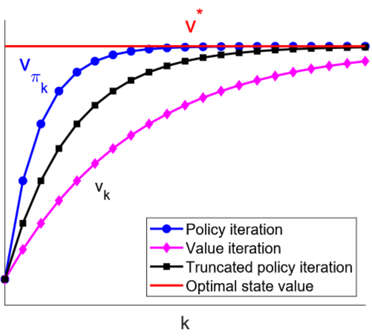
注：实际上，策略评估与策略提升是一种非常通用的强化学习思想（称为<mark style="background: #FFB86CA6;">通用策略迭代，GPI</mark>），并在许多后续的强化学习方法（如蒙特卡洛方法、时序差分学习等）中有着广泛应用。

> Summary

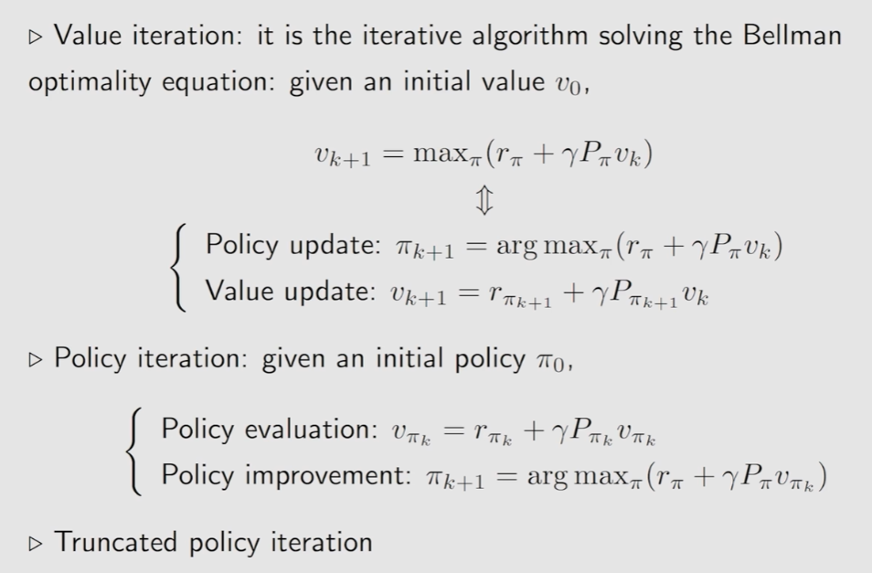
## 🟡蒙特卡洛方法（Monte Carlo Learning）


求解 RL 问题，要么需要模型，要么需要数据。之前介绍了基于模型（model-based）的方法。然而在实际场景中，环境的模型（如状态转移函数）往往是未知的，这就需要用<mark style="background: #BBFABBA6;">无模型（model-free）方法</mark>解决问题。

无模型的方法可以分为两大类：蒙特卡洛方法（Monte Carlo，MC）和时序差分学习（Temporal Difference，TD）。本文介绍蒙特卡洛方法。

蒙特卡洛思想：通过大数据量的样本采样来进行估计【本质上是<mark style="background: #D2B3FFA6;">大数定律的应用</mark>（基于独立同分布采样）】，将策略迭代中依赖于model的部分替换为model-free。

MC的核心idea：并非直接求解 $q_{\pi} (s, a)$ 的准确值，而是基于数据（sample / experience）来估计 $q_{\pi} (s, a)$ 的值。MC 直接通过动作值的定义进行均值估计，即：  
$$q_{\pi}(s, a) = \mathbb{E}_\pi [ G_t | S_t = s, A_t = a ] \approx \frac{1}{N} \sum^N_{i=1} g^{(i)} (s, a) $$

其中  $g^{(i)} (s, a)$ 表示对于  $G_t$ 的第  $i$ 个采样。

### MC Basic

算法步骤：在第  $k$ 次迭代中，给定策略  $\pi_k$ （随机初始策略： $\pi_0$ ​）

- 策略评估：对每个状态-动作对 $(s, a)$，运行无穷（或足够多）次 episode，估算  $q_{\pi_{k}} (s, a)$
- 策略提升：基于估算的 $q_{\pi_{k}} (s, a)$ ，求解迭代策略 $\pi_{k+1}(s) = \arg max_\pi \sum_a \pi(a|s) q_{\pi_{k}}(s, a)$

MC Basic与策略迭代的区别：在第 $k$ 次迭代中

- 策略迭代使用迭代方法求出状态值  $v_{\pi_k}$ ，并基于状态值求出动作值 $q_{\pi_k} (s, a)$
- MC Basic直接<mark style="background: #ABF7F7A6;">基于采样/经验均值</mark>估计 $q_{\pi_k} (s, a)$ （不需要估计状态值）

*MC Basic 只是用来说明 MC 的核心 idea，并不会在实际中应用，因为其非常低效。*

### MC Exploring Starts

思想：提升MC Basic的效率

- 利用数据：对于一个轨迹，从后往前利用 $(s, a)$ 状态-动作对采样做估计
    - 例如：对于轨迹 $s_1 \xrightarrow{a_2} s_2 \xrightarrow{a_4} s_1 \xrightarrow{a_2} s_2 \xrightarrow{a_3} s_5 \xrightarrow{a_1} \cdots$ ，<mark style="background: #BBFABBA6;">从后往前采样</mark>，即先估计  $q_\pi(s_5, a_1)$ ，再估计 $q_\pi(s_2, a_3) = R_{t+4} + \gamma q_\pi(s_5, a_1)$ ，进而估计 $q_\pi(s_1, a_2) = R_{t+3} + \gamma q_\pi(s_2, a_3)$，以此类推
- 更新策略：不必等待所有 episode 的数据收集完毕，直接基于单个 episode 进行估计，类似于截断策略迭代（单次估计不准确，但快）
    - 这是<mark style="background: #FFF3A3A6;">通用策略迭代</mark>（Generalized Policy Iteration，GPI）的思想

<mark style="background: #FFB86CA6;">MC Exploring Starts</mark>

- Exploring：探索每个 $(s, a)$ 状态-动作对
- Starts：从每个状态-动作对开始一个 episode
    - 与 Visit 对应：从其他的状态-动作对开始一个 episode，但其轨迹能经过当前的状态-动作对

### MC ε-Greedy

Exploring Starts 在实际中难以实现(实际和理论存在一个gap)，考虑引入 soft policy：**随机（stochastic）选择动作**

**ε-Greedy策略**：

$\pi(a|s) = \begin{Bmatrix} 1− \frac{\varepsilon}{|A(s)|}(|A(s)|−1), & for \ the \ greedy \ action, \\ \frac{\varepsilon}{|A(s)|}, & for \ other \ |A(s)|−1 \ actions. \end{Bmatrix}$

其中， $\varepsilon \in [0,1]$，$|\mathcal{A}(s)|$ 表示状态 $s$下的动作数量。

- 直观理解：以较高概率选择贪心动作（greedy action），以较低均等概率选择其他动作
- 特性：**选择贪心动作的概率永远不低于选择其他动作的概率**
- 目的：平衡exploitation（探索）和 exploration（利用）
    -  $\varepsilon = 0$ ：侧重于<mark style="background: #BBFABBA6;">利用</mark>，永远选择贪心动作
    -  $\varepsilon = 1$：侧重于<mark style="background: #BBFABBA6;">探索</mark>，以均等概率选择所有动作（均匀分布），探索能力强

**MC ε-Greedy**：在策略提升阶段，求解下式  

$$\pi_{k+1}(s) = \arg max_{\color{red}\pi \in \Pi_\varepsilon} \sum_a \pi(a|s) q_{\pi_{k}}(s, a)$$ 
其中，$\pi \in \Pi_\varepsilon$ ​表示所有 ε-Greedy 策略的集合。得到的最优策略为：

$\pi(a|s) = \begin{Bmatrix} 1− \frac{\varepsilon}{|A(s)|}(|A(s)|−1), & a = a_k^*, \\ \frac{\varepsilon}{|A(s)|}, &  a ≠ a_k^*. \end{Bmatrix}$

MC ε-Greedy 与 MC Basic 和 MC Exploring Starts 的区别：

- 后二者求解的范围是 $\pi \in \Pi$，即<mark style="background: #BBFABBA6;">所有策略的集合</mark>
- 后二者得到的是<mark style="background: #BBFABBA6;">确定性策略</mark>，前者得到的是<mark style="background: #BBFABBA6;">随机策略</mark>

MC ε-Greedy 与 MC Exploring Starts 的唯一区别在于 ε-Greedy 策略，因此 MC ε-Greedy 不需要 Exploring Starts。

MC ε-Greedy 通过探索性牺牲了最优性，但可以通过设置一个较小的 ε（如0.1）进行平衡

- 在实际中，可以为 ε 设置一个较大的初始值，*随着迭代轮数逐渐减小其取值*
- ε 的*值越大*，最终策略的*最优性越差*

最终训练得到的策略，可以去掉 ε，直接使用 greedy 的确定性策略（consistent）。

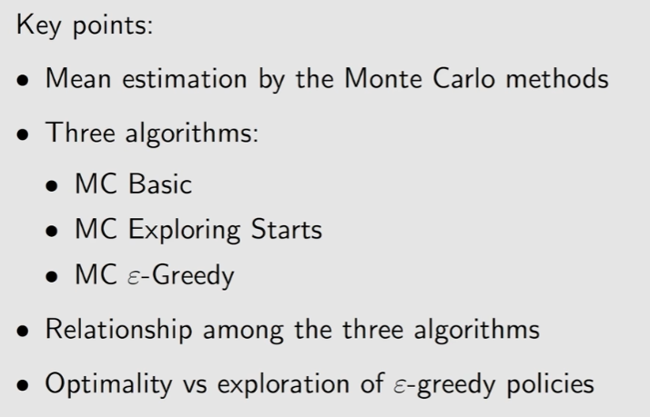

## 🟡随机近似（SA）&随机梯度下降（SGD）

考虑求解均值估计（Mean Estimation）问题，MC 利用采样的算数均值来估计期望，但缺点是需要等待所有样本收集完毕后再进行计算。  
另一种求解思路：用<mark style="background: #BBFABBA6;">增量和迭代方法</mark>进行计算，有多少数据利用多少数据。

举例：如何增量和迭代式地计算均值？  
设 $w_{k+1} = \frac{1}{k} \sum_{i=1}^{k} x_i$​，可知

$$w_{k+1} = w_k - \frac{1}{k} (w_k - x_k)$$

基于该方式，只需要基于过去的均值计算结果 $w_k$ 和新采样 $x_k$​，即可计算出总体均值【思路上有点像是EWMA】。采样数量越多，计算结果越准确。

可以对上式进一步推广，得到 

$$w_{k+1} = w_k - {\color{red}\alpha_k} (w_k - x_k)$$

其中 $\alpha_k>0$。可以证明，当 $\alpha_k$ 满足一定条件时，其<mark style="background: #BBFABBA6;">迭代的计算结果会收敛至期望值</mark>。这是一种特殊的随机近似（SA）/随机梯度下降（SGD）算法。

随机近似（Stochastic Approximation，SA）：一类随机迭代算法，<mark style="background: #BBFABBA6;">适用于方程求解或优化问题</mark>，但不需要目标函数/方程的表达式/导数形式。

### Robbins-Monro（RM）算法

目标：在不知道  $g(w)$ 的具体形式的情况下（视作黑盒），求解  $g(w) = 0$ ，设其解为  $w^*$ 。

-  $g(w)$ 须为单调递增

RM算法：  
$$w_{k+1} = w_k - a_k \tilde{g} (w_k, \eta_k)$$

> ([the problem becomes a root-finding problem: g(w) = 0. The corresponding RM algorithm is](LessonsPPT/L7-Temporal-Difference%20Learning.pdf#page=7&annotation=644R))
> The problem becomes a root-finding problem: g(w) = 0. The corresponding RM algorithm is

$$w_{k+1} = w_k - a_k \tilde{g} (w_k, \eta_k) = w_k - a_k (w_k - x_k)$$

- $w_k$：对 $w^*$ 的第 $k$ 次估计
- $\tilde{g} (w_k, \eta_k) = g(w_k) + \eta_k$​，其中 $\eta_k$ 是噪声，因此 $\tilde{g}$ 表示对 $g$ 的带有噪声的观测
- $a_k>0$：系数

RM算法依赖于数据：

- 输入序列：  ${w_k}$
- 带噪声的输出序列： $\{ \tilde{g} (w_k, \eta_k) \}$

*RM定理（收敛性）*：在RM算法中，当以下三个条件成立时， $w_k$ ​会按照概率 1（w.p.1）收敛至 $w^*$

1. $g(w)$ 的梯度需满足： $0 < c_1 \leq \nabla_{w} g(w) \leq c_2, \ \forall w$
    1. $g$ 须为单调递增，以保证 $g(w)=0$ 的<mark style="background: #FFF3A3A6;">解存在且唯一</mark>
    2. $g$ 的梯度（对于多元函数，导数沿梯度方向取最大值）须有上界，以避免函数发散

2. $a_k$​ 需满足： $\textstyle\sum_{k=1}^{\infty} a_k = \infty$ 且 $\textstyle\sum_{k=1}^{\infty} a_k^2 < \infty$
    1. 平方和小于无穷：随着 $k \to \infty$， $a_k$ 收敛至 0
    2. 和等于无穷： $a_k$​ 收敛至 0 的速度不能太快

3. $\eta_k$ 需满足：  $\mathbb{E} [\eta_k | \mathcal{H}_k] = 0$ 且  $\mathbb{E} [\eta_k^2 | \mathcal{H}_k] < \infty$ 
    1. $\eta_k$​ 的均值为 $0$ 且方差有界
    2. 常见情形：${\eta_k}$ 为独立同分布随机序列（但不要求是正态分布）

$a_k$​ 的常见选择：$a_k = \frac{1}{k}$（或非常小的常数，为了避免最近采样的权重下降）

- $\sum_{k=1}^{\infty} a_k = \infty$

> 欧拉常数（Euler-Mascheroni constant)  
> $\gamma = \lim_{n \to \infty} (\sum_{k=1}^{n}\frac{1}{k} - \ln n) \approx 0.557$
> 当 $n \to \infty$ 时， $\ln n \to \infty$，因此可知 $\sum_{k=1}^{\infty}\frac{1}{k} = \infty$

- $\textstyle \sum_{k=1}^{\infty} a_k^2 < \infty$

> 巴塞尔问题（Basel Problem）  
> $\sum_{k=1}^{\infty}\frac{1}{k^2} = \frac{\pi^2}{6} < \infty$

### 随机梯度下降(Stochastic Gradient Descent，SGD)

SGD是RM算法的一种<mark style="background: #BBFABBA6;">特殊情况</mark>。

目标：求解以下优化问题  

$$\min_w \ J(w) = \mathbb{E} [f(w, X)]$$

- $w$：<mark style="background: #FF5582A6;">待优化参数</mark>，让目标函数达到最小
- $X$：随机变量， $\mathbb{E}$ 是关于 $X$ 的期望
- $w$ 与 $X$ 可以是标量或向量，函数 $f(\cdot)$ 为标量

*最小化用梯度下降，最大化用梯度上升*

> 求解方法1：GD（Gradient Descent）

$w_{k+1} = w_k - \alpha_k \nabla_w \mathbb{E}[f(w_k, X)] = w_k - \alpha_k \mathbb{E}[\nabla_w f(w_k, X)]$

- 缺陷：期望难以直接计算

> 求解方法2：BGD（Batch Gradient Descent），基于<mark style="background: #BBFABBA6;">数据采样</mark>计算期望

$\mathbb{E}[\nabla_w f(w_k, X)] \approx \frac{1}{n} \sum_{i=1}^{n} \nabla_w f(w_k, x_i)$（ $n$ 次采样）  
$w_{k+1} = w_k - \alpha_k \frac{1}{n} \sum_{i=1}^{n} \nabla_w f(w_k, x_i)$

- 缺陷： $w_k$ 的每次迭代都需要很多采样

> **求解方法3：随机梯度下降（Stochastic Gradient Descent）SGD**  

$w_{k+1} = w_k - \alpha_k \nabla_w f(w_k, x_k)$

- 与GD的差异：将真实梯度（true gradient） $\mathbb{E}[\nabla_w f(w_k, X)]$ 替换为随机梯度（stochastic gradient） $\nabla_w f(w_k, x_k)$
- 与BGD的差异：仅采样一次（$n=1$）

_SGD收敛性_：若以下三个条件成立，则 $w_k$ 会按照概率1（w.p.1）收敛至 $w^*$（ $\nabla_w \mathbb{E} [f(w, X)] = 0$的解）

1. $0 < c_1 \leq \nabla_{w}^2 f(w, X) \leq c_2$（二阶梯度）,$f(\cdot)$ 是严格凸函数（标量）
2. $\textstyle\sum_{k=1}^{\infty} a_k = \infty$ 且 $\textstyle\sum_{k=1}^{\infty} a_k^2 < \infty$
3. ${x_k}_{k=1}^{\infty}$ 为独立同分布（i.i.d）

SGD的收敛模式：

- 当 $w_k$ 距离 $w^*$ 较远时，SGD的<mark style="background: #FFB86CA6;">表现与GD相似</mark>，即 $w_k$ 随着迭代不断向 $w^*$ 逼近
- 当 $w_k$​ 距离 $w^*$ 较近时，SGD会<mark style="background: #FFB86CA6;">表现出较大的随机性</mark>，即 $w_k$ 在 $w^*$ 附近波动

### BGD / MBGD / SGD

| 算法                | 形式                                                                                     | 说明                                             |
| ----------------- | -------------------------------------------------------------------------------------- | ---------------------------------------------- |
| BGD               | $w_{k+1} = w_k - \alpha_k \frac{1}{n} \sum_{i=1}^{n} \nabla_w f(w_k, x_i)$             | 基于所有采样，最接近于均值                                  |
| MBGD (mini batch) | $w_{k+1} = w_k - \alpha_k \frac{1}{m} \sum_{j \in \mathcal{I}_k} \nabla_w f(w_k, x_j)$ | 基于部分采样（ $\vert \mathcal{I}_k \vert=m \leq n$ ） |
| SGD               | $w_{k+1} = w_k - \alpha_k \nabla_w f(w_k, x_k)$                                        | 基于单个采样                                         |

MBGD可以视作BGD和SGD的一种中间情况

- $m=1$：MBGD即为 SGD
- $m=n$：MBGD接近于 BGD，但不完全相同
    - BGD 对每个采样使用 1 次，MBGD 是从 $n$ 个采样中随机选取 $n$ 次，每个采样被使用的次数可能超过一次【大概是有放回和不放回的区别】


## 🟡时序差分学习（Temporal Difference，TD）


  

先前的内容介绍了如何在无模型（model-free）的情况下，基于蒙特卡洛方法（Monte Carlo，MC）来进行策略评估。实际上，无模型的强化学习方法还有另外一个重要分支：时序差分学习（Temporal Difference，TD）。

最基础的时序差分学习估计状态值，而后续提出的Sarsa和Q-learning方法则直接对动作值进行估计。

*注：时序差分的原理部分依赖于随机优化理论，可参阅本文后续的随机近似（SA）&随机梯度下降（SGD）章节。*

### TD for state values

#### Basic TD

最原始的 TD Learning 算法：在策略评估中估计给定策略 $\pi$ 的状态值 $v_\pi$，本质上是在无模型的情况下求解贝尔曼方程（解法类似于RM算法，详见后一章节）。

- $v_{t+1}(s_t) = v_t(s_t) - \alpha(s_t) [v_t (s_t) - [r_{t+1} + \gamma v_t(s_{t+1})] ]$
    - $\alpha_t (s_t)$ 是学习率，通常设为很小的常数
- $v_{t+1} (s) = v_t (s), \quad \forall s \neq s_t$

在 $t =0, 1,2, \cdots$ 时刻，更新被访问状态 $s_t$ 的状态值估计 $v_{t+1}(s_t)$，但不更新其他未访问状态的状态值估计。

**TD的目标**：使得估计值 $v_{t}(s_t)$ 接近 $\bar{v}_t$​（对于估计动作值的 TD 算法而言，是使得 $q_t(s_t, a_t)$接近于 $\bar{q}_t$
$$\underbrace{v_{t+1}(s_t)}_{\text{new estimation}} = \underbrace{v_t(s_t)}_{\text{current estimation}} - \alpha(s_t) [\overbrace{v_t (s_t) -\underbrace{r_{t+1} + \gamma v_t(s_{t+1})}_{\text{TD target} \ \bar{v}_t}}^{\text{TD target} \ \delta_{t}}]$$

- **TD target**： $\bar{v}_t = r_{t+1} + \gamma v_t(s_{t+1})$
- **TD error**： $\delta_t = v_t (s_t) - [r_{t+1} + \gamma v_t(s_{t+1})] = v_{t}(s_t) - \bar{v}_t$
    - 是 $t$ 和 $t+1$ 两个时刻的 difference
    - 描述了 $v_t$ 与 $v_\pi$ 之间的差异（ $v_t$是对 $v_\pi$​ 的估计）：若 $v_t = v_\pi$​，则 $\delta_t = 0$

这种最原始的 TD 算法不能用来估计动作值，也不能用来搜索最优策略。

注：不同文献和资料中的公式表述存在差异，比如Sutton书中（参考资料2）的TD形式如下：  
$V(S_t) \gets V(S_t) + \alpha [R_{t+1} + \gamma V(S_{t+1}) - V(S_t)]$

TD算法本质上是求解贝尔曼期望方程（Bellman Expectation Equation）：  
$v_\pi(s) = \mathbb{E} [R + \gamma v_\pi (S') | S = s], \quad s \in S$

TD 算法的收敛性：如满足以下条件，则当 $t \to \infty$ 时， $v_t(s)$ 可以收敛至 $v_\pi(s)$（w.p.1， $\forall s \in \mathcal{S}$）  ,$\textstyle\sum_{t} a_t(s) = \infty$ 且 $\textstyle\sum_{t} a_t^2(s) < \infty$ 需要对每个状态访问很多次（理论上是无穷次）

#### TD vs MC

| TD / Sarsa                            | MC                                   |
| ------------------------------------- | ------------------------------------ |
| Online：可以使用每步的 reward，立即更新状态/动作值      | Offline：需要等待每个 episode 数据采集完毕        |
| Continuing & Episodic tasks           | 仅 Episodic tasks                     |
| Bootstrapping：依赖于初始估计和历史估计            | Non-bootstrapping：直接估计，不依赖初始值        |
| Lower estimation variance：只依赖少数几个随机变量 | Higher estimation variance：依赖的随机变量较多 |

TD估计的期望是有偏的，因为其依赖于初始估计（Bootstrapping），但随着数据量的增加，最终会收敛到正确的估计值；相反，MC的期望是无偏估计。

### Sarsa (TD for action values)

#### Basic Sarsa

目标：估计给定策略 $\pi$ 的动作值 $q_\pi(s, a)$
数据：$\{ s_t, a_t, r_{t+1}, s_{t+1}, a_{t+1} \}$

**SARSA（State-Action-Reward-State-Action）** 算法：

$$q_{t+1} (s_{t}, a_t) = q_{t} (s_{t}, a_t) - \alpha_t (s_t, a_t) [q_{t} (s_t, a_t) - [r_{t+1} + \gamma {\color{red} q_t (s_{t+1}, a_{t+1})}]]$$

$$q_{t+1} (s, a) = q_t (s, a), \quad \forall (s, a) \neq (s_t, a_t)$$

- $\alpha_t (s_t, a_t)$ 是取决于 $s_t$ ​和 $a_t$ 的学习率

*与原始 TD 算法的差异：将公式中的 $v(s_t)$ 替换为 $q(s_t, a_t)$，因此Sarsa是TD算法的动作值估计的版本*

Sarsa求解贝尔曼期望方程的动作值形式：  
$q_\pi(s, a) = \mathbb{E} [R + \gamma q_\pi (S', A') | s, a], \quad \forall s, a$

其中， $R \sim p (R | s ,a)$，$S' \sim p(S' | s, a)$，$A' \sim \pi(A' | S')$（$\sim$ 表示服从某种概率分布）。

注意到 Sarsa 所依赖的 5 个变量中，在给定 $s_t$ 和 $a_t$​ 的情况下，只有 $a_{t+1}$ 依赖于策略 $\pi_t$，而 $r_{t+1}$ ​和 $s_{t+1}$ 本身并不依赖于策略，而是依赖于转移概率分布（通过采样确定）。

Sarsa 收敛性类似于 TD，略。

Sarsa+ 策略提升的完整算法：（也属于GPI框架）

- 更新动作值（策略评估）：Sarsa 的公式，略
- 更新策略（策略提升）：ε-Greedy 方法，基于 $q_{t+1} (s_t, a)$ 立即更新

$\pi_{k+1}(a|s_t) = \begin{cases} 1− \frac{\varepsilon}{|A(s)|}(|A(s)|−1), & if \ a = arg max_{a} \ q_{t+1}(s_t,a) \\ \frac{\varepsilon}{|A(s)|}, &  otherwise \end{cases}$

Sarsa有两个变体：Expected Sarsa 和 n-step Sarsa

#### 变体1：Expected Sarsa

$q_{t+1} (s_{t}, a_t) = q_{t} (s_{t}, a_t) - \alpha_t (s_t, a_t) [q_{t} (s_t, a_t) - [r_{t+1} + \gamma {\color{red} \mathbb{E} q_t (s_{t+1}, A)}]]$
- $q_{t+1} (s, a) = q_t (s, a), \quad \forall (s, a) \neq (s_t, a_t)$

其中， $\mathbb{E} q_t (s_{t+1}, A) = v_t (s_{t + 1})$  是状态值而非动作值

Expected Sarsa求解以下形式的贝尔曼公式：  
$q_\pi (s, a) = \mathbb{E} [R_{t+1} + \gamma v_\pi(S_{t+1}) | S_t =s, A_t =a]$

与Sarsa的区别：

- 改变了TD Target
- 需要更多的计算量，但减少了随机变量个数（不需要对 $a_{t+1}$ 采样），随机性减少

#### 变体2：n-step Sarsa

n-step Sarsa是Sarsa的推广，统一了Sarsa和MC的思想

- Sarsa基于单步采样进行估计，MC基于∞步采样进行估计，因此n-step Sarsa相当于是二者的折中
- n-step Sarsa既不是online的，也不是offline的（或者是是特殊的online方法）

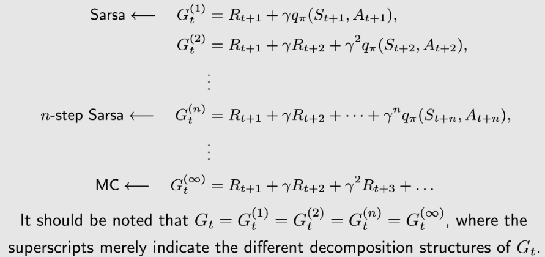

公式及其他细节略。  
n-step Sarsa本身仅用于策略估计，也可以和策略提升相结合。

### Q-learing (TD for optimal action values)

Q-learing直接估计最优动作值，因此不需要策略评估-策略提升的过程。

- $q_{t+1} (s_{t}, a_t) = q_{t} (s_{t}, a_t) - \alpha_t (s_t, a_t) [q_{t} (s_t, a_t) - [r_{t+1} + \gamma {\color{red} \max_{a \in \mathcal{A}} q_t (s_{t+1}, a)}]]$
- $q_{t+1} (s, a) = q_t (s, a), \quad \forall (s, a) \neq (s_t, a_t)$

Q-learing和Sarsa在公式上的唯一区别是TD target（公式的红字部分）。每个状态下，Q-learing在对action进行优化，但Sarsa只是依据当前策略选择action。

Sarsa求解贝尔曼方程，但Q-learing求解贝尔曼最优方程：  
$q(s, a) = \mathbb{E} [ R_{t+1} + \gamma \max_a q(s_{t+1}, a) | S_t =s, A_t = a ], \ \forall s,a$

此外，Sarsa属于on-policy算法，而Q-learing属于off-policy算法。

- Sarsa所需的 $a_{t+1}$ 依赖于 $\pi_t$​，之后根据动作值估计来更新策略为 $\pi_{t+1}$​，可见其行为策略与目标策略相同
- Q-learing所需的数据为 ${(s_t, a_t, r_{t+1}, s_{t+1})}$，这4个变量都不依赖于特定策略（或者说可以由任意策略生成），因此其行为策略与目标策略可以不同
    - *二者相同时，Q-learing即为on-policy*

Q-learing算法步骤（off-policy）：  
由行为策略 $\pi_B$ 生成若干 episode，每个 episode 包含 $\{ s_0, a_0, r_1, s_1, a_1, r_2, \cdots \}$。

- 例子： $\pi_B$​ 可以取 $\varepsilon =1$的 ε-Greedy，保证对每个动作等概率探索

在每个 episode 的每个时间步 $t=0,1,2,\cdots$ 中：

- 更新最优动作值（q-value）的估计：Q-learing的公式，略
- 更新目标策略 $\pi_T$： $\pi_{T, t+1} = \begin{cases} 1 & if \ a = arg max_{a} \ q_{t+1}(s_t,a) \\  0 & otherwise \end{cases}$​
    - 是 greedy，但不是 ε-greedy（不需要探索）

对于 off-policy 的 Q-learing 而言，行为策略的探索性越强，其目标策略收敛于最优策略的速度越快。

### TD算法汇总

所有估计动作值的TD算法可以由下式统一表示：  
$$q_{t+1} (s_{t}, a_t) = q_{t} (s_{t}, a_t) - \alpha_t (s_t, a_t) [q_{t} (s_t, a_t) - {\color{blue} \bar{q}_t}]$$
其中， $\bar{q}_t$ 为TD target，而TD算法的目标即使得 $q_t(s_t,a_t)$ 接近 $\bar{q}_t$，或者说缩小TD error（ $q_{t} (s_t, a_t) - {\bar{q}_t}$）。

不同算法的差异在于 $\bar{q}_t$​ 的形式不同：【注意到，TD和MC实际上是有关联的，主要差异是采样的数量不同】
 
| 算法             | $\bar{q}_t$形式                                                                                      |
| -------------- | -------------------------------------------------------------------------------------------------- |
| Sarsa          | $\bar{q}_t = r_{t+1} + \gamma q_{t} (s_{t+1}, a)$                                                  |
| Expected-Sarsa | $\bar{q}_t = r_{t+1} + \gamma \sum_a \pi_t(a\|s_{t+1}) q_{t} (s_{t+1})$                            |
| n-step Sarsa   | $\bar{q}_t = r_{t+1} + \gamma r_{t+2} + \cdots + \gamma^{n} q_{t} (s_{t+n}, a_{t+n})$              |
| Q-learning     | $\bar{q}_t = r_{t+1} + \gamma \textstyle\max_a q_{t} (s_{t+1}, a)$                                 |
| Monte Carlo    | $\bar{q}_t = r_{t+1} + \gamma r_{t+2} + \cdots + \gamma^{\infty} r_{t+\infty}$​（均为单步折扣奖励，没有 $q_t$） |

不同算法求解的公式也不同：  
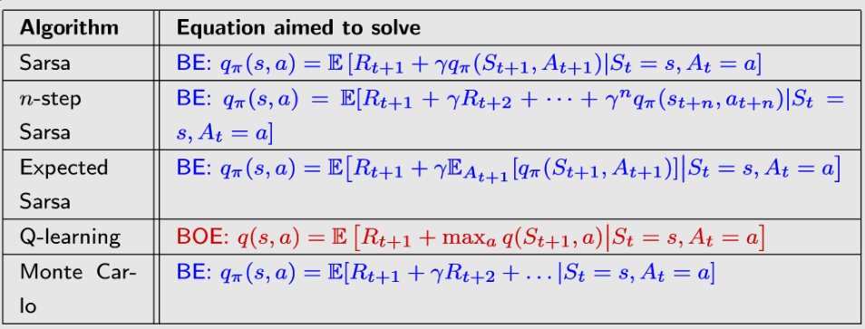


## 🟡值函数近似（Value function approximation）


  

在先前的方法中，状态/动作值均以表格的（tabular）形式呈现。但是当状态/动作空间较大或者连续时，以上<mark style="background: #FFF3A3A6;">算法会面临存储开销和泛化能力的问题</mark>。因此，考虑<mark style="background: #BBFABBA6;">通过特定函数的形式近似状态值</mark>。

### Basic idea

*A simple example*  

假设状态值 $v(s)$ 与状态 $s$ 之间呈线性关系，设 $\hat{v}(s, w)$ 是对 $v(s)$ 的估计，则有下式：  

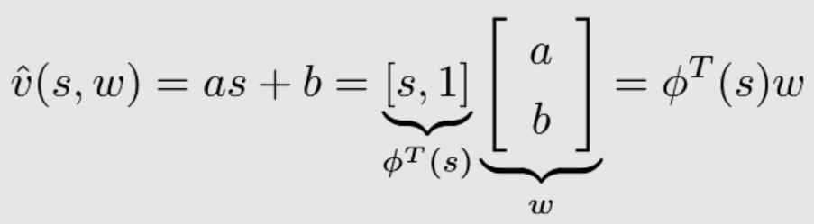

其中， $w$ 为参数向量， $\phi(s)$ 为状态 $s$ 的特征向量。  
这样做的好处在于大大降低了存储开销：不需要存储每个状态值，只需要存储 $w$（即 $a$ 和 $b$ 两个参数）即可。但是弊端在于通过函数近似得到的结果并不一定准确。这种思想可以继续推广到高阶及非线性函数，以提升估计的准确性。

**值函数近似的idea**：使用参数化（parameterized）的函数近似状态和动作值，即 $\hat{v}(s, w) \approx v_\pi(s)$，其中 $w \in \mathbb{R}^m$ 是参数向量。

好处：
(1) 便于存储：只需要存储参数，不需要存储状态，而参数的维度往往远小于状态的数量；(2) 泛化能力：当访问一个状态后，参数值发生改变，则整个函数估计发生改变，其余未被访问的状态的状态值同样会发生改变，因此不需要访问每个状态来完成学习过程。

#### 目标函数（objective function）

值函数近似的目标是使得估计值尽可能接近真实状态值，其**目标函数**为：  

$$J(w) = \mathbb{E} [ (v_\pi(S) - \hat{v}(S,w))^2 ]$$

值函数近似的目标，即找到能够使得 $J(w)$最小的 $w$。本质上是做策略评估中的状态值估计。  

其中， $S \in \mathcal{S}$ 为随机变量，其概率分布为平稳分布（stationary distribution），描述长期行为（long-run behavior），也被称为steady-state distribution或limiting distribution【一个随机过程/马尔可夫过程中的概念】。

直观理解：如果一个agent按照一个给定策略运行了足够久，其马尔可夫过程最终会达到一个平稳状态【即模型（状态转移概率）是稳定的】。

设 $\{ d_\pi (s) \}_{s\in \mathcal{S}}$​ 表示策略 $\pi$ 下的马尔可夫过程的平稳分布，有 $d_\pi (s) \geq 0$ 且 $\sum_{s\in \mathcal{S}} d_\pi(s) =1$。则值函数近似的目标函数可以写作：

$$J(w) = \mathbb{E} [ (v_\pi(S) - \hat{v}(S,w))^2 ] = \sum_{s\in \mathcal{S}} d_\pi (s) (v_\pi(S) - \hat{v}(S,w))^2$$ 
其中， $d_\pi (s)$ 表示agent处于状态 $s$ 的概率，同时也是该状态的（重要性）权重值，因此上式可以看作是对不同状态的估计误差的平方的加权平均。

#### 优化算法（optimization algorithm）

采用随机梯度下降（SGD）算法优化（最小化）目标函数 $J(w)$（推导过程略）：  
$$w_{t+1} = w_t - \alpha_t (v_\pi(s_t) - \hat{v}(s_t, w_t)) \nabla_w \hat{v}(s_t, w_t)$$

注意到其中 $v_\pi(s_t)$ 是未知的，其可以用MC或TD近似：

- **MC with 值函数近似**：用 $g_t$（从 $s_t$ 出发的累计折扣回报）近似 $v_\pi(s_t)$
    - $w_{t+1} = w_t - \alpha_t (g_t - \hat{v}(s_t, w_t)) \nabla_w \hat{v}(s_t, w_t)$
- **TD with 值函数近似**：用 $r_{t+1} + \gamma \hat{v}(s_{t+1}, w_t)$近似 $v_\pi(s_t)$
    - $w_{t+1} = w_t - \alpha_t [r_{t+1} + \gamma \hat{v}(s_{t+1}, w_t) - \hat{v}(s_t, w_t)] \nabla_w \hat{v}(s_t, w_t)$
    -  TD target： $r_{t+1} + \gamma \hat{v}(s_{t+1}, w_t)$
    - *实际上这种方法并不是在优化原本的目标函数，而是在优化另一个相关的目标函数，称作projected Bellman error（详细内容略）*

$\hat{v} (s, w)$ 的形式选择：早期用线性函数，目前通用神经网络（Neural Network，NN）来拟合未知非线性函数。线性函数的好处在于其理论性非常容易分析，弊端在于其特征向量（比如其阶数）难以选择。  
若 $\hat{v} (s, w)$ 为线性函数，则其等价于 tabular representation，因此可以将 tabular representation 看作 linear function approximation 的一种特殊情况。

### Sarsa / Q-learning with function approximation

#### Sarsa with function approximation

其实就是把TD with function approximation中的状态值换为动作值：  
$w_{t+1} = w_t + \alpha_t [r_{t+1} + \gamma \hat{q}(s_{t+1}, a_{t+1}, w_t) - \hat{q}(s_t, a_t, w_t)] \nabla_w \hat{q}(s_t, a_t, w_t)$

和 Tabular Sarsa 的区别：不是直接更新动作值 $q(s,a)$，而是更新参数值 $w$。

采用 ε-Greedy 方法进行策略提升：  
$\pi_{k+1}(a|s_t) = \begin{cases} 1− \frac{\varepsilon}{|A(s)|}(|A(s)|−1), & if \ a = arg \max_{a \in \mathcal{A}(s_{t})} \ \hat q_{t}(s_t,a, \omega_{t+1}) \\ \frac{\varepsilon}{|A(s)|}, &  otherwise \end{cases}$

注意其中的 $\hat{q}(s_t, a, w_{t+1})$ 需要通过函数计算得到。

#### Q-learning with function approximation

$$w_{t+1} = w_t + \alpha_t [r_{t+1} + \gamma {\color{red} \max_{a \in \mathcal{A}(s_{t+1})} \hat{q}(s_{t+1}, a_{t}, w_t)} - \hat{q}(s_t, a_t, w_t)] \nabla_w \hat{q}(s_t, a_t, w_t)$$

### ⭐DQN (Deep Q-learning)

尽管在Q-learning with function approximation中，可以使用神经网络作为 $\hat{q} (s, a, w)$，但其需要复杂的底层运算（如求梯度），因此提出了DQN（Deep Q-learning / Deep Q Network）作为替代。

DQN的**目标函数/损失（loss）函数**：  

$$J(w) = \mathbb{E} \Big[ \Big(R + \gamma \max_{\alpha \in \mathcal{A} (S') } \hat{q} (S', a, w) - \hat{q} (S, A ,w) \Big) ^2 \Big]$$

其中， $(S,A,R,S')$ 均为随机变量，$R + \gamma \max_{\alpha \in \mathcal{A} (S') } \hat{q} (S', a, w) - \hat{q} (S, A ,w)$ 为Q-learning的TD error，也即Bellman optimlity error，当该值为0时取得最优。

#### 关键技术1：两个网络

直接采用梯度下降优化损失函数并不容易，因为其中两项都包含 $w$，求梯度较复杂。一个简单的思路是，将 $y = R + \gamma \textstyle \max_{\alpha \in \mathcal{A} (S') } \hat{q} (S', a, w)$视作常数，只需求解 $\hat{q} (S, A ,w)$ 的梯度即可。  
因此，DQN引入了两个网络的设计：

- main network：对应 $\hat{q} (S, A ,w)$
- target network：对应 $\hat{q} (S', a, w_T)$

main network的参数 $w$ 实时更新，但target network的参数 $w_T$​ 并非实时更新，而是隔一段时间把main network的 $w$ 赋值过来，因此在这段时间内，$w_T$ 可以被视为常数。

DQN的basic idea：使用梯度下降（GD）优化损失函数，对应梯度为：  

$$\nabla_w J = \mathbb{E} \Big[ \Big(R + \gamma \max_{\alpha \in \mathcal{A} (S') } {\color{red} \hat{q} (S', a, w_T) } - {\color{blue} \hat{q} (S, A ,w) } \Big) {\color{blue} \nabla_w \hat{q} (S, A ,w) } \Big]$$

训练过程（详见下）：在每次迭代中，DQN从回放缓存（replay buffer）中取mini-batch采样 ${(s, a, r, s')}$，以 $s$ 和 $a$ 作为输入计算得到 $y_T = r + \gamma \textstyle \max_{\alpha \in \mathcal{A} (s') } \hat{q} (s', a, w_T)$，并基于mini-batch ${ (s, a, y_T) }$ 最小化损失函数 $( y_T - \hat{q} (s, a ,w) )^2$ 以训练main network。之后，将main network的参数 $w$ 赋值给target network的 $w_T$。

#### 关键技术2：经验回放（Experience replay）

DQN在收集经验采样后，将其存储在回放缓存（replay buffer） $\mathcal{B} = { (s, a, r, s') }$ 中。当需要使用采样训练神经网络时，从回放缓存中按照均匀分布（uniform distribution）随机取mini-batch的采样 ，该过程称为经验回放。

- 均匀分布：对所有 $(s, a)$ 对等概率访问（不等概率的话，需要先验知识才能确定哪些 $(s, a)$对更重要
    - 这里是把 $(S,A)$ 对看作一个随机变量
- 回放缓存：经验采样的采集有先后顺序，直接按照其顺序使用可能不满足均匀分布的要求，因此将过往经验先存起来再均匀采样，去除采样间的相关性

实际上经验回放也可以用于tabular Q-learning中，还能提高其采样效率（因为可以重复利用）。

#### DQN算法步骤（off-policy）

目标：从行为策略 $\pi_b$​ 生成的经验采样中，学习一个最优的 target network 以近似最优动作值  
在每次迭代中：

1. 从回放缓存 $\mathcal{B}$ 中均匀取 mini-batch 采样
2. 对于每个采样 $(s, a, r, s')$，计算 $y_T = r + \gamma \textstyle \max_{\alpha \in \mathcal{A} (s') } \hat{q} (s', a, w_T)$，其中 $w_T$ 为target network的参数
3. 使用mini-batch采样 ${ (s, a, y_T) }$ 更新main network，以最小化损失函数 $( y_T - \hat{q} (s, a ,w) )^2$

每 $C$ 次迭代后，将 $w$ 赋值给 $w_T$​。  
*注意：这里的表述与DQN原论文不同（原论文的NN更高效），但本质是一样的。*

## 🟡策略梯度方法（Policy Gradient Methods）


  

在先前的内容中，策略用表（tabular）的形式进行表达，其也可以用函数的形式进行表达（尤其是当状态空间或动作空间连续或非常大时），优势在于降低存储开销和提升泛化能力。

之前的方法（值函数近似）称之为 Value-based，而策略梯度（Policy Gradient）和**Actor-Critic**均为 Policy-based。Value-based 方法围绕状态值/动作值设计，而 Policy-based 优化关于策略的目标函数，从而直接得到最优策略。

### Basic Policy Gradient

将策略表示为参数化函数： $\pi(a|s, \theta)$，其中 $\theta \in \mathbb{R} ^m$ 为参数向量， $\pi$ 是关于 $\theta θ$ 的函数。  
其他写法：$\pi(a,s, \theta)$， $\pi_\theta(a|s)$， $\pi_\theta(a,s)$

与tabular representation的区别：

1. 最优策略：不是能够最大化每个状态值的策略，而是能够最大化特定scalar metrics的策略
2. 动作概率：不能直接获取，需要进行计算
3. 策略更新：不能直接更新，需要通过改变参数 θ \theta θ来进行改变

策略梯度方法通过优化指定目标函数 $J(\theta)$，直接得到最优策略：  

$$\theta_{t+1} = \theta_t + \alpha \nabla_\theta J(\theta_t)$$

目标函数 $J(\theta)$ 通常有以下两种类型：平均状态值 $\bar{v}_\pi$ 和平均单步奖励 $\bar{r}_\pi$。实际上，当折扣因子 $\gamma<1$ 时，二者是等价的： $\bar{r}_\pi = (1- \gamma) \bar{v}_\pi$。

#### 目标函数1：平均状态值

平均状态值（average state value / average value）：  
$\bar{v}_\pi = \sum_{s\in{\mathcal{S}}} d(s) v_\pi(s) = \mathbb{E}[v_\pi(S)]$
其中， $d(s) \geq 0$ 且 $\sum_{s\in{\mathcal{S}}} d(s) =1$，因此 $d(s)$ 既可以看作是状态 $s$ 的权重，也可以看作是随机变量 S S S的概率分布。

其他形式： $\bar{v}_\pi = \mathbb{E} \Big[\sum_{t=0}^{\infty} \gamma^t R_{t+1} \Big]$

向量形式： $\bar{v}_\pi = d^T v_\pi$

在常见的情况下， $d$ 是取决于 $\pi$ 的平稳分布，即 $d_\pi(s)$，其具有以下性质：  
$d^T_\pi P_\pi = d^T_\pi$
其中， $P_\pi$​ 是状态转移概率矩阵。

#### 目标函数2：平均单步奖励

平均单步奖励（average one-step reward / average reward）  
$\bar{r}_\pi = \sum_{s\in{\mathcal{S}}} d(s) r_\pi(s) = \mathbb{E}[r_\pi(S)]$
其中， $S \sim d_\pi$​，$d_\pi$为平稳分布。 $r_\pi(s) = \sum_{a\in\mathcal{A}} \pi(a|s) r(s, a)$为策略 $\pi$ 在状态 $s$ 下取得的平均单步奖励，而 $r(s, a) = \mathbb{E} [R|s, a] = \sum_r r p(r | s, a)$。

另一种形式：  
假设 agent 遵循一个策略生成了奖励为 $(R_{t+1}, R_{t+2}, \cdots)$ 的 trajectory，其平均单步奖励为：  
$\lim_{n \to \infty} \frac{1}{n} \mathbb{E} \Big[ \sum_{k=1}^{n} R_{t+k} | S_t = s_0 \Big]$
其中， $s_0$ 为该 trajectory 的起始状态。考虑无穷多步的极限，上式等价于【似乎是与平稳随机过程有关，时间平均等于统计平均，不确定】：  
$\lim_{n \to \infty} \frac{1}{n} \mathbb{E} \Big[ \sum_{k=1}^{n} R_{t+k} \Big] = \bar{r}_\pi$

#### PG梯度计算

策略梯度方法的梯度计算可以统一总结为下式：  
$\nabla_\theta J(\theta) = \sum_{s\in\mathcal{S}} \eta (s) \sum_{a\in\mathcal{A}} \nabla_\theta \pi (a|s, \theta) q_\pi(s, a)$
其中：

- $J(\theta)$ 可以为 $\bar{v}_\pi$ ，$\bar{r}_\pi$，​或  $\bar{v}_\pi^0$
- $=$ 可以为相等、约等 $\approx$、成比例 $\propto$
- $\eta$ 是状态的分布或权重（如上文中的 $d_\pi$​）

进一步地，可以**基于下式计算梯度**：  

$$\nabla_\theta J(\theta) = \mathbb{E} [\nabla_\theta \ln\pi (A|S, \theta) q_\pi(S, A) ]$$ 

其中， $S\sim\eta$ 且 $A\sim\pi(A|S, \theta)$。通过随机采样的方式估计期望，则有：  

$$\nabla_\theta J(\theta) \approx \nabla_\theta \ln\pi (A|S, \theta) q_\pi(S, A)$$

注意：为了计算对数 $\ln$，对所有的 $s, a,\theta$，策略必须满足：$\pi(a|s, \theta) > 0$。即：策略必须是随机性（stochastic）的，且为探索性（exploratory）的。(确定性策略见后续介绍的[Actor-Critic](https://blog.csdn.net/LvGreat/article/details/135454738?spm=1001.2014.3001.5501)中的DPG)  
这可以通过softmax实现，将向量从 $(-\infty,+\infty)$ 限界至 $(0,1)$。softmax限界后的形式为：  

$$\pi(a|s, \theta) = \frac{e^{h(s, a, \theta)}}{\textstyle\sum_{a' \in \mathcal{A}} e^{h(s, a', \theta)}}$$

其中， $h(s, a, \theta)$ 类似于特征函数，具体由神经网络确定。

> 推导：  
> 已知 $\frac{\mathrm{d} \ln x}{\mathrm{d} x} = \frac{1}{x}$，则 $\nabla \ln f(x) = \frac{\nabla f(x)}{f(x)}$​，故有： $\nabla_\theta \ln \pi(a|s, \theta) = \frac{\nabla_\theta \pi(a|s, \theta)}{\pi(a|s, \theta)}$
> 进一步地， $\pi$ 的梯度可以计算为： ${\nabla_\theta \pi(a|s, \theta)} = {\pi(a|s, \theta)} \nabla_\theta \ln \pi(a|s, \theta)$ 
> 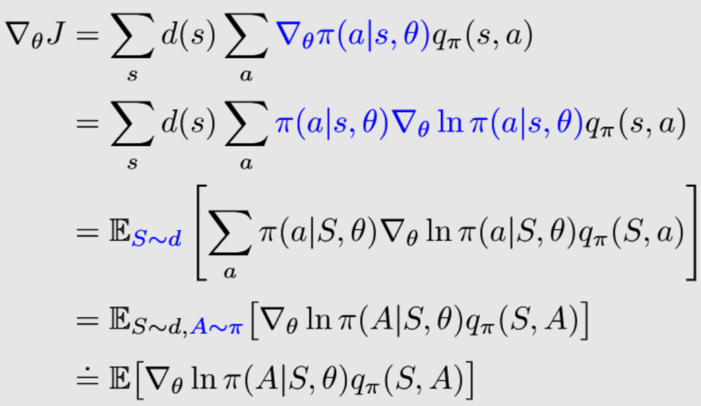

### REINFORCE

策略梯度（PG）方法基于梯度上升方法最大化目标函数：  

$\theta_{t+1} = \theta_t + \alpha \mathbb{E} \big[ \nabla_\theta \ln\pi (A|S, \theta_t) q_\pi(S, A) \big]$

实际中，通过随机采样的方式估计期望与 $q_\pi(s_t, a_t)$，有：  

$\theta_{t+1} = \theta_t + \alpha \nabla_\theta \ln\pi (a_t|s_t, \theta_t) q_t(s_t, a_t)$

注意：$A\sim\pi(A|S,\theta)$， $a_t$ ​的采样依赖于状态 $s_t$ 下的策略 $\pi(\theta_t)$，因此策略梯度是on-policy方法。

估计 $q_\pi(s_t,a_t)$ 有两种方法：

- 蒙特卡洛（MC）：REINFORCE（策略梯度的代表性算法）
- 时序差分（TD）：[Actor-Critic系列算法](https://blog.csdn.net/LvGreat/article/details/135454738?spm=1001.2014.3001.5501)

REINFORCE**算法步骤**（伪代码）：  
初始化： $\pi(a|s, \theta)$， $\gamma \in (0,1)$， $\alpha >0$
目标：最大化 $J(\theta)$
步骤：在第 $k$ 次迭代中，选择策略 $\pi(\theta_k)$ 的起始状态 $s_0$，设其episode为 ${ s_0, a_0, r_1, \cdots, s_{T-1}, a_{T-1}， r_T }$

- 在每个时间步 $t=0,1,\cdots, T - 1$：
    - 值更新（蒙特卡洛方法）：$q_t(s_t,a_t) = \textstyle \sum_{k=t+1}^T \gamma^{k-t-1} r_k$
    - 策略更新：更新参数 $\theta_{t+1}$，公式见上
        - *注意：蒙特卡洛是offline的，需要整个episode的数据，所以这里更新完参数后不立即使用策略去采集数据
- $\theta_k = \theta_T$，在下次迭代中生成下一组 episode 的数据

##  🟡演员-评论家模型（Actor-Critic Methods）

Actor-Critic属于[策略梯度（PG）](https://blog.csdn.net/LvGreat/article/details/135454543?spm=1001.2014.3001.5501)方法，实际上是将[值函数近似](https://blog.csdn.net/LvGreat/article/details/135454426?spm=1001.2014.3001.5501)和策略梯度方法进行了结合。

- Actor：策略更新，Actor用来执行动作与环境交互
- Critic：策略评估 / 值估计，Critic用来评估Actor的好坏

### Basic actor-critic / QAC

与策略梯度算法对应，Actor即为策略梯度算法中执行策略更新的部分（通过更新参数 θ \theta θ），而Critic是估计 $q_t(s_t,a_t)$ 的算法。QAC（Q actor-critic）是最简单的actor-critic算法，也是一种on-policy方法。

QAC vs. REINFOCE：估计 $q_t(s_t,a_t)$ 的方法不同

- REINFORCE：蒙特卡洛（MC）
- QAC：时序差分（TD）

**QAC算法**：【简单理解：**QAC = Sarsa with function estimation + Policy Gradient**】

- Critic（值更新 / 策略评估）：采用Sarsa with function estimation的方法估计 $q_t(s_t,a_t)$

$$w_{t+1} = w_t + \alpha_w [r_{t+1} + \gamma {q}(s_{t+1}, a_{t+1}, w_t) - {\color{blue} {q}(s_t, a_t, w_t)}] {\color{blue} \nabla_w {q}(s_t, a_t, w_t)}$$

- Actor（策略更新 / 策略提升）：采用策略梯度（PG）的方法（同REINFROCE）更新策略

$$\theta_{t+1} = \theta_t + \alpha_\theta \nabla_\theta \ln\pi (a_t|s_t, \theta_t) {\color{blue} q_t(s_t, a_t, w_{t+1}) }$$

### A2C (Advantage actor-critic)

A2C的基本思想：在QAC中引入baseline来减少估计的方差（variance）。

> 理论基础：引入baseline $b(S)$ 后，策略梯度（期望）不会发生改变，但其方差会减小（推导略），即  
> $$\nabla_\theta J (\theta) = \mathbb{E}_{S\sim\eta,A\sim\pi} [\nabla_\theta \ln\pi (A|S, \theta) q_\pi(S, A) ] = \mathbb{E}_{S\sim\eta,A\sim\pi} [\nabla_\theta \ln\pi (A|S, \theta) (q_\pi(S, A) {\color{blue} - b(S))} ]$$ 
> 其中，  $b(S)$ 为关于 $S$ 的标量函数。  
> 使得方差最小的最优baseline形式为：  
> $$b^*(s) = \frac{ \mathbb{E}_{A\sim\pi} [ {\color{blue} | \nabla_\theta \ln\pi (A|s, \theta_t) |^2} {\color{red} q(S,A)} ] }{ \mathbb{E}_{A\sim\pi} [ {\color{blue} | \nabla_\theta \ln\pi (A|s, \theta_t) |^2} ] } $$
> 但直接应用此式过于复杂，因此在实际中选择次优baseline，去掉权重项  $|| \nabla_\theta \ln\pi (A|s, \theta_t) ||^2$，有：  $b(s) = \mathbb{E}_{A\sim\pi} [q(S,A)] = v_\pi(s)$
> 即将 $s$ 的状态值作为baseline。

在 actor（策略更新）中**引入状态值作为baseline**，即：  

$$\theta_{t+1} = \theta_{t} + \alpha \mathbb{E} [\nabla_\theta \ln\pi (A|S, \theta_t) [ q_\pi(S, A) - v_{\pi} (s)] ] = \theta_{t} + \alpha \mathbb{E} [\nabla_\theta \ln\pi (A|S, \theta_t)  \delta_\pi(S, A) ]$$ 

其中， $\delta_\pi(S, A) = q_\pi(S, A) - v_\pi (S)$ 是优势函数（advantage function），表示当前状态下的特定动作相对于当前策略的优势。对应的随机采样公式为：  

$$\theta_{t+1} = \theta_{t} + \alpha \nabla_\theta \ln\pi (a_t|s_t, \theta_t) [ q_\pi(s_t, a_t) - v_{t} (s_t) ] = \theta_{t} + \alpha \nabla_\theta \ln\pi (a_t|s_t, \theta_t)  \delta_\pi(s_t, a_t)$$

进一步地，优势函数可以由TD error近似（推导略），好处是只需要一个神经网络近似 v t v_t vt​即可，不需要再近似 q t q_t qt​。这就是A2C（也称为TD actor-critic）算法，其**优势函数**的具体形式为：  

$\delta_t = r_{t+1} + \gamma v_{t} (s_{t+1}) - v_t (s_t)$

*注：

- 优势函数在文献中通常记作  A 
- 这里的直觉是，动作值的相对值比其绝对值更重要

**A2C的完整算法**（on-policy）：

- TD error（优势函数）： ${\color{darkred} \delta_t} = r_{t+1} + \gamma v_{t} (s_{t+1}) - v_t (s_t)$
- Critic（值更新 / 策略评估）： $w_{t+1} = w_t + \alpha_w {\color{darkred} \delta_t} {\nabla_w {v}(s_t, w_t)}$
    - *注意这里与QAC的区别：QAC用的是Sarsa，A2C用的是TD，因此这里用状态值而非动作值
- Actor（策略更新 / 策略提升）： $\theta_{t+1} = \theta_t + \alpha_\theta {\color{darkred} \delta_t} \nabla_\theta \ln\pi (a_t|s_t, \theta_t)$

### Off-policy AC

AC 算法本身是on-policy的，但是可以通过**重要性采样（Importance Sampling）** 将其转为off-policy算法。  
实际上，重要性采样可以应用于任何需要求期望的算法（如MC、TD等）。

#### 重要性采样（Importance Sampling）

重要性采样：基于概率分布 $p_1$​ 上对随机变量 $X$ 的采样，估计概率分布 $p_0$ 上 $X$ 的期望 $\mathbb{E}[X]$。  
应用场景：难以直接在  $p_0$ 上计算 $X$ 的期望，但可以很容易在 $p_1$​ 上对进行 $X$ 采样。例如： $p_0$​ 是连续分布，或 $p_0$​ 的形式未知（如其为神经网络）。

${\color{red} \mathbb{E}_{X\sim p_0} [X] } = \sum_x p_0(x) x = \sum_x {\color{blue} p_1(x)} \underbrace{\frac{p_0(x)}{\color{blue} p_1(x)} x}_{f(x)} = {\color{red} \mathbb{E}_{X\sim p_1} [f (X)] }$

其中， $[f (X)] EX∼p1$ 可以由对 $f(X)$ 的采样均值直接估计（大数定律），即：  

${\color{red} \mathbb{E}_{X\sim p_0} [X] } \approx \bar{f} = \frac{1}{n} \sum_{i=1}^{n} f(x_i) {\color{red} = \frac{1}{n} \sum_{i=1}^{n} {\color{blue} \frac{p_0(x_i)}{p_1(x_i)} } x_i }$

其中， $\frac{p_0(x_i)}{p_1(x_i)}$ 是重要性权重（importance weight），其大于 1 表明 $x_i$ 在 $p_0$ 下被采样的概率更高，小于 1 表明在 $p_1$​ 下被采样的概率更高。

#### Off-policy PG

由行为策略 $\beta$ 生成经验采样，目标是最大化下式：  

$J(\theta) = \sum_{s \in \mathcal{S}} d_\beta (s) v_\pi (s) = \mathbb{E}_{S \sim d_\beta} [v_\pi (S)]$

其中， $d_\beta$​为策略 $\beta$ 下的平稳分布。（注意此式与**策略梯度**中 $J(\theta)$为平均状态值 $\bar{v}_\pi$时公式的区别）  
对应的梯度为：  

$\nabla_\theta J(\theta) = \mathbb{E}_{S \sim \rho, A \sim \beta} \Big[ \frac{\pi(A|S, \theta)}{\beta(A|S)} \nabla_\theta \ln \pi (A|S, \theta) q_\pi (S, A) \Big]$

式中 $\rho$ 是一个状态分布，$\frac{\pi(A|S, \theta)}{\beta(A|S)}$ 是重要性权重。注意$A \sim \beta$ 而非 $A \sim \pi$。

#### Off-policy AC

基于前文分析，Off-policy AC的算法为：  

$$\theta_{t+1} = \theta_t + \alpha_{\theta} \frac{π(a_t|s_t,θ_t)}{β(a_t|s_t)} \nabla_θlnπ(a_t|s_t,θ_t)[r_{t+1} + γ v_t(s_{t+1})−vt(s_t)]= θ_t + α_θ \frac{π(a_t|s_t,θ_t)}{β(a_t|s_t)} \nabla_θ lnπ(a_t|s_t,θ_t) δ_t(s_t,a_t)$$

算法步骤及伪代码类似于A2C，主要是多了重要性权重 $\frac{\pi(a_t|s_t, \theta_t)}{\beta(a_t|s_t)}$。

### DPG (Deterministic AC)

先前的PG及AC算法均为随机性（stochastic）策略，实际上也存在确定性（deterministic）策略的AC算法，即DPG（Deterministic Policy Gradient）。  
确定性策略相对于随机性策略的优势：随机性策略只能处理有限个动作的情况（比如，神经网络的输出是有限的），而确定性策略可以处理连续的动作空间。

确定性策略记作： $a = \mu (s, \theta)$，也可以简记为 $\mu (s)$。  
$\mu$ 是从状态空间 $\mathcal{S}$ 到动作空间 $\mathcal{A}$ 的映射，可以由神经网络表示。

DPG为off-policy方法（动作不依赖于具体策略），其梯度计算如下：  

$$\nabla_θ J ( θ ) = \sum_{s ∈ S} ρ_μ ( s ) \nabla_θ μ ( s ) ( \nabla_a q μ ( s , a ) ) ∣_{a = μ ( s )} = \mathbb{E}_{S∼ρ_μ} [ \nabla_{\theta} \mu(s) ( \nabla_a q_μ ( s , a ) ) ∣_{a = μ ( s )} ]$$

其中， $\rho_\mu$ 是一个状态分布。$(\nabla_a q_\mu (s, a))|_{a= \mu (s)}$​表示先对 $q_\mu(s,a)$求关于 $a$ 的梯度，再将其中 $a$ 的替换为 $\mu(s)$。  
对应的随机梯度上升算法为：  

$$\theta_{t+1} = \theta_t + \alpha_\theta \nabla_\theta \mu(s_t) (\nabla_a q_\mu (s_t, a)) |_{a=\mu(s)}$$

DPG**算法步骤**（伪代码）：  

初始化：行为策略 $\beta (a|s)$；确定性目标策略$\mu(s, \theta_0)$，其中 $\theta_0$​ 为初始参数向量；值函数 $v(s, w_0)$，其中 $w_0$ 为初始参数向量。($^*\beta$也可以被替换为 $\mu$+噪音)

目标：最大化 $J(\theta)$
步骤：在每个episode的第 $t$ 个时间步中，遵循行为策略 $\beta$ 产生动作 $a_t$ ​并获得  $r_{t+1}$ 和 $s_{t+1}$

- TD error（优势函数）： 

$$ {\color{darkred} \delta_t} = r_{t+1} + \gamma q(s_{t+1}, \mu(s_{t+1}, \theta_t), w_t) - q(s_t, a_t, w_t)$$
 
- Critic（值更新 / 策略评估）：

$$w_{t+1} = w_t + \alpha_w {\color{darkred} \delta_t} \nabla_w q(s_t, a_t, w_t) $$

，即TD+值函数估计

- Actor（策略更新 / 策略提升）：  
$$\theta_{t+1} = \theta_t + \alpha_\theta \nabla_\theta \mu(s_t, \theta_t) (\nabla_a q (s_t, a, w_{t+1})) |_{a=\mu(s_t)} $$

注意到DPG中包含了 $q(s,a,w)$，其可以由两种方式确定：

- 线性函数： $q(s,a,w) = \phi^T (s,a) \omega$，其中 $\phi(s,a)$ 是特征向量。这是 DPG 原论文中采用的方法，缺陷在于特征向量的选择比较困难，且线性函数的拟合能力有限
- 神经网络：即后续的DDPG（Deep deterministic policy gradient）方法

## PPO

