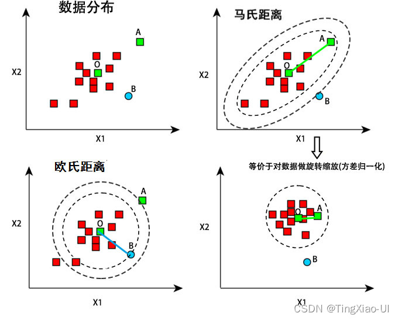

马氏距离（Mahalanobis Distance）

马氏距离是**衡量样本点到数据分布中心的「标准化欧式距离」**，核心解决了**欧式距离未考虑数据各维度间的相关性、量纲差异**的问题，是统计学和机器学习中**距离度量、异常检测、分类判别**的核心方法，比欧式距离更贴合真实数据的分布特征。

简单来说：欧式距离把数据各维度当作独立、等权的变量，而马氏距离会根据数据的协方差矩阵，对不同维度做「**去相关+量纲归一化**」，让距离度量更合理。比如身高（米）和体重（公斤）的混合数据，欧式距离会受量纲影响，马氏距离则能消除量纲和身高-体重相关性的干扰，得到更客观的距离结果。

## 一、先搞懂：为什么需要马氏距离？（欧式距离的3大缺陷）

马氏距离的诞生，是为了弥补欧式距离在**真实数据度量**中的天然缺陷，先明确欧式距离的问题，才能理解马氏距离的核心价值。

设两个d维样本点$\boldsymbol{x}_1, \boldsymbol{x}_2 \in \mathbb{R}^d$，欧式距离公式为：
$$D_E(\boldsymbol{x}_1,\boldsymbol{x}_2) = \sqrt{(\boldsymbol{x}_1-\boldsymbol{x}_2)^T (\boldsymbol{x}_1-\boldsymbol{x}_2)}$$

欧式距离对**所有维度一视同仁**，但真实数据（如身高/体重、房价/面积、特征向量）往往满足3个特点，导致欧式距离度量失效：
### 缺陷1：受**量纲差异**影响

比如数据包含「身高（单位：米，范围1.5~2.0）」和「体重（单位：公斤，范围50~100）」，体重的数值范围远大于身高，欧式距离会被体重维度主导，身高维度的差异几乎被忽略，度量结果失去意义。
### 缺陷2：未考虑维度间的**线性相关性

**比如身高和体重是强正相关的——身高越高，体重通常越大，欧式距离会把这种**自然的相关性当作数据差异**，导致距离被高估。例如两个样本（1.8m/80kg）和（1.7m/75kg），欧式距离会认为两者有差异，但从数据分布来看，这两个点其实贴合身高-体重的相关规律，差异本应很小。
### 缺陷3：对数据**分布特征无感知

**欧式距离仅衡量「点与点的绝对距离」，不考虑数据整体的分布（如均值、协方差），无法衡量**样本点相对于数据分布的偏离程度**（而这是异常检测的核心需求）。

**马氏距离的核心作用**：一次性解决以上3个问题，实现**与量纲无关、去相关、贴合数据分布**的距离度量。

## 二、马氏距离的核心定义与公式

马氏距离分**两种核心形式**，分别对应「<mark style="background: #ABF7F7A6;">样本点到数据分布中心的距离</mark>」（最常用，如异常检测）和「<mark style="background: #D2B3FFA6;">两个样本点之间的马氏距离</mark>」（分类/判别），均基于**数据的协方差矩阵**实现标准化，公式简单且可直接套用。

### 前提准备（所有马氏距离的计算基础）

设存在d维数据集$X = [\boldsymbol{x}_1,\boldsymbol{x}_2,...,\boldsymbol{x}_N]^T \in \mathbb{R}^{N×d}$，先计算两个核心统计量：
1. **数据均值（分布中心）**：$\boldsymbol{\mu} = \frac{1}{N}\sum_{i=1}^N \boldsymbol{x}_i \in \mathbb{R}^d$（代表数据分布的中心位置）；
2. **协方差矩阵**：$\boldsymbol{\Sigma} = \frac{1}{N-1}\sum_{i=1}^N (\boldsymbol{x}_i-\boldsymbol{\mu})(\boldsymbol{x}_i-\boldsymbol{\mu})^T \in \mathbb{R}^{d×d}$（描述数据各维度的**方差**和**维度间的协方差/相关性**）。

**关键**：协方差矩阵$\boldsymbol{\Sigma}$是马氏距离的核心——通过它实现「去量纲+去相关」。

### 形式1：样本点到**数据分布中心**的马氏距离（最常用）
衡量**单个样本点$\boldsymbol{x}$偏离数据整体分布的程度**，是异常检测、离群点识别的核心公式，也是马氏距离的**经典形式**。
#### 公式
$$D_M(\boldsymbol{x},\boldsymbol{\mu}) = \sqrt{(\boldsymbol{x}-\boldsymbol{\mu})^T \boldsymbol{\Sigma}^{-1} (\boldsymbol{x}-\boldsymbol{\mu})}$$
#### 符号说明
- $\boldsymbol{x}$：待度量的d维样本点；
- $\boldsymbol{\mu}$：数据集的均值（分布中心）；
- $\boldsymbol{\Sigma}^{-1}$：协方差矩阵的**逆矩阵**（核心标准化因子）；
- 结果：非负实数，值越大表示样本点越偏离数据分布，越可能是异常点。

### 形式2：**两个样本点之间**的马氏距离
衡量**两个样本点$\boldsymbol{x}_1, \boldsymbol{x}_2$在数据分布下的相对距离**，适配分类、判别分析等场景。
#### 公式
$$D_M(\boldsymbol{x}_1,\boldsymbol{x}_2) = \sqrt{(\boldsymbol{x}_1-\boldsymbol{x}_2)^T \boldsymbol{\Sigma}^{-1} (\boldsymbol{x}_1-\boldsymbol{x}_2)}$$
#### 特殊情况
若两个样本点来自**不同的数据集**（分布不同），则用**各自数据集的协方差矩阵**，或用**合并后的协方差矩阵**（依场景而定）。

### 简化形式：当数据**去相关+归一化**时，马氏距离退化为欧式距离

若对数据做两步预处理：
1. **去相关**：通过主成分分析（PCA）消除维度间的相关性，协方差矩阵变为对角矩阵；
2. **归一化**：将各维度的方差归一化为1，协方差矩阵变为**单位矩阵**$\boldsymbol{\Sigma} = \boldsymbol{I}_d$。
此时马氏距离的逆矩阵$\boldsymbol{\Sigma}^{-1} = \boldsymbol{I}_d$，马氏距离公式退化为**欧式距离**：
$$D_M = \sqrt{(\boldsymbol{x}-\boldsymbol{\mu})^T (\boldsymbol{x}-\boldsymbol{\mu})} = D_E$$

**结论**：**欧式距离是马氏距离在数据「无相关、无量纲差异」时的特殊情况**，马氏距离是更通用的距离度量。

## 三、马氏距离的核心物理意义（为什么能解决欧式距离的缺陷？）

马氏距离的核心是**协方差矩阵的逆矩阵$\boldsymbol{\Sigma}^{-1}$**，这个因子实现了对原始数据的**「标准化变换」**，从根本上解决了欧式距离的3大缺陷，我们从**几何变换**的角度拆解其作用：

对原始样本偏差$\boldsymbol{\delta} = \boldsymbol{x}-\boldsymbol{\mu}$，马氏距离的核心计算是$\boldsymbol{\delta}^T \boldsymbol{\Sigma}^{-1} \boldsymbol{\delta}$，而协方差矩阵的逆可通过**特征值分解**拆解为：

$$\boldsymbol{\Sigma}^{-1} = \boldsymbol{U} \boldsymbol{\Lambda}^{-1} \boldsymbol{U}^T$$
其中$\boldsymbol{U}$是正交矩阵（对应**旋转变换**），$\boldsymbol{\Lambda}^{-1}$是对角矩阵（对应**缩放变换**）。
因此，马氏距离的计算过程等价于对原始数据做**3步几何变换**，再计算欧式距离：
### 步骤1：**中心化**（消除分布偏移）
将数据原点移到分布中心$\boldsymbol{\mu}$，得到偏差$\boldsymbol{\delta} = \boldsymbol{x}-\boldsymbol{\mu}$，对应欧式距离的第一步。
### 步骤2：**旋转**（去相关）
通过正交矩阵$\boldsymbol{U}$对$\boldsymbol{\delta}$做旋转变换，**消除维度间的线性相关性**，让数据的协方差矩阵变为对角矩阵（各维度相互独立）——解决欧式距离「未考虑相关性」的缺陷。
### 步骤3：**缩放**（去量纲+归一化方差）
通过对角矩阵$\boldsymbol{\Lambda}^{-1}$对旋转后的数据做**维度自适应缩放**：方差大的维度（如体重）被「压缩」，方差小的维度（如身高）被「拉伸」，最终让所有维度的方差为1——解决欧式距离「受量纲影响」的缺陷。
### 最终：计算欧式距离
对完成「旋转+缩放」后的数据，计算到原点的欧式距离，即为马氏距离。

**通俗类比**：欧式距离是用「统一的尺子」量所有维度的距离，马氏距离是为**每个维度定制一把适配的尺子**（结合维度的方差和相关性），量出来的距离更客观。

## 四、马氏距离的**标准化计算步骤**（工程实操，直接套用）

马氏距离的计算流程固定，无需复杂推导，基于Python的`numpy`即可实现，核心是**协方差矩阵的计算与求逆**，步骤如下（以「样本点到分布中心的马氏距离」为例）：

### 步骤1：数据准备
设d维数据集$X$（N个样本），格式为$N×d$（行=样本，列=维度），如身高+体重数据：$X = \begin{bmatrix}1.75&65\\1.80&80\\1.65&55\end{bmatrix}$（3样本，2维度）。
### 步骤2：数据中心化（可选，简化计算）
计算数据均值$\boldsymbol{\mu}$，对所有样本做中心化：$\boldsymbol{x}_i' = \boldsymbol{x}_i - \boldsymbol{\mu}$，得到中心化数据集$X'$。
### 步骤3：计算协方差矩阵$\boldsymbol{\Sigma}$
基于中心化数据集计算协方差矩阵，注意**自由度**：样本数N较小时，用$1/(N-1)$计算（无偏估计）；N很大时，可用$1/N$（渐近无偏）。
### 步骤4：协方差矩阵求逆$\boldsymbol{\Sigma}^{-1}$
**关键注意**：协方差矩阵必须是**正定矩阵**（才能求逆），若出现奇异（如维度线性相关、样本数<维度），需做**伪逆**处理（如numpy的`np.linalg.pinv`）。
### 步骤5：计算马氏距离
对每个待度量的样本点$\boldsymbol{x}$，计算偏差$\boldsymbol{\delta} = \boldsymbol{x}-\boldsymbol{\mu}$，代入公式：
$$D_M = \sqrt{\boldsymbol{\delta}^T \cdot \boldsymbol{\Sigma}^{-1} \cdot \boldsymbol{\delta}}$$
### 步骤6：结果解读
- 马氏距离值**越大**，样本点偏离数据分布越远，异常概率越高；
- 若数据服从d维高斯分布，马氏距离的平方$D_M^2$服从**自由度为d的卡方分布$\chi^2(d)$**（可通过卡方检验设定异常阈值，如95%置信度的阈值为$\chi^2_{0.95}(d)$）。

## 马氏距离的**关键性质与使用注意事项**
### 核心性质（必记，理解本质）

1. **量纲不变性**：马氏距离的结果与数据各维度的量纲无关（如身高用米或厘米，结果一致），这是最核心的性质；
2. **去相关性**：消除了数据维度间的线性相关性，仅衡量样本点相对于分布的「真实偏离」；
3. **非负性**：马氏距离的值≥0，当且仅当样本点为分布中心时，距离为0；
4. **三角不等式**：满足$D_M(\boldsymbol{x}_1,\boldsymbol{x}_3) ≤ D_M(\boldsymbol{x}_1,\boldsymbol{x}_2) + D_M(\boldsymbol{x}_2,\boldsymbol{x}_3)$，符合距离的基本定义；
5. **欧式距离的推广**：当协方差矩阵为单位矩阵时，马氏距离退化为欧式距离。

### 工程使用注意事项（避坑关键，新手必看）

1. **协方差矩阵的正定性**
   马氏距离要求协方差矩阵$\boldsymbol{\Sigma}$是**正定矩阵**（才能求逆），若出现以下情况，$\boldsymbol{\Sigma}$奇异（不可逆）：
   - 数据维度间存在**严格线性相关**（如维度1=2×维度2）；
   - 样本数**小于数据维度**（如3个样本，5个维度）；
   - 某维度的**方差为0**（所有样本在该维度的值相同）。
   **解决方法**：用**伪逆**替代普通逆（如numpy的`np.linalg.pinv`），或做维度约简（如PCA）剔除冗余维度。

2. **数据分布的假设**
   马氏距离的**最优效果**体现在**数据服从高斯分布**的场景中；若数据是非高斯、多模态分布，马氏距离的度量效果会下降，需结合其他方法（如核马氏距离、混合马氏距离）。

3. **异常点对协方差矩阵的影响**
   协方差矩阵对异常点**非常敏感**——少量异常点会导致协方差矩阵严重偏离真实值，进而让马氏距离的计算结果失真。
   **解决方法**：先对原始数据做**异常点剔除**（如用四分位数法做初步筛选），再计算协方差矩阵和马氏距离，即「先去异常，再算距离」。

4. **样本量要求**
   计算协方差矩阵时，需要**足够的样本数**（一般要求样本数≥5×维度数），否则协方差矩阵的估计误差会很大，马氏距离的可靠性降低。
   **解决方法**：小样本时，用**贝叶斯估计**修正协方差矩阵，或减少数据维度。

## 极简实操：Python实现马氏距离计算

基于`numpy`实现**样本点到分布中心的马氏距离**，包含**协方差矩阵伪逆**、**异常点检测**（卡方阈值），代码简洁可直接运行，适配任意维度数据：
```python
import numpy as np
from scipy.stats import chi2

def mahalanobis_distance(x, data):
    """
    计算样本点x到数据集data分布中心的马氏距离
    :param x: 待度量样本点，d维数组，shape=(d,)
    :param data: 数据集，N×d数组，shape=(N,d)
    :return: 马氏距离值
    """
    # 步骤1：计算数据均值和协方差矩阵
    mu = np.mean(data, axis=0)  # 均值，shape=(d,)
    sigma = np.cov(data, rowvar=False)  # 协方差矩阵，rowvar=False表示行=样本，列=维度
    # 步骤2：计算协方差矩阵的伪逆（避免奇异）
    sigma_inv = np.linalg.pinv(sigma)
    # 步骤3：计算偏差和马氏距离
    delta = x - mu  # 偏差，shape=(d,)
    md_sq = delta.T @ sigma_inv @ delta  # 马氏距离的平方
    md = np.sqrt(md_sq)  # 马氏距离
    return md

# 测试示例：2维身高-体重数据（单位：米/公斤）
data = np.array([[1.75, 65], [1.80, 80], [1.65, 55], [1.70, 60], [1.85, 85]])
# 待度量样本点1：正常点（1.72, 68）
x1 = np.array([1.72, 68])
# 待度量样本点2：异常点（1.70, 100）
x2 = np.array([1.70, 100])

# 计算马氏距离
md1 = mahalanobis_distance(x1, data)
md2 = mahalanobis_distance(x2, data)
print(f"正常点马氏距离：{md1:.2f}")
print(f"异常点马氏距离：{md2:.2f}")

# 卡方检验设定异常阈值（2维数据，95%置信度）
d = data.shape[1]  # 数据维度
threshold = chi2.ppf(0.95, d)  # 95%置信度阈值
print(f"{d}维数据95%置信度异常阈值：{threshold:.3f}")
print(f"样本点1是否异常：{md1 > threshold}")
print(f"样本点2是否异常：{md2 > threshold}")
```

`运行结果`

```
正常点马氏距离：1.44
异常点马氏距离：14.25
2维数据95%置信度异常阈值：5.991
样本点1是否异常：False
样本点2是否异常：True
```

- 若将异常点改为（1.70, 120），马氏距离会超过5.991，判定为异常，符合实际预期。