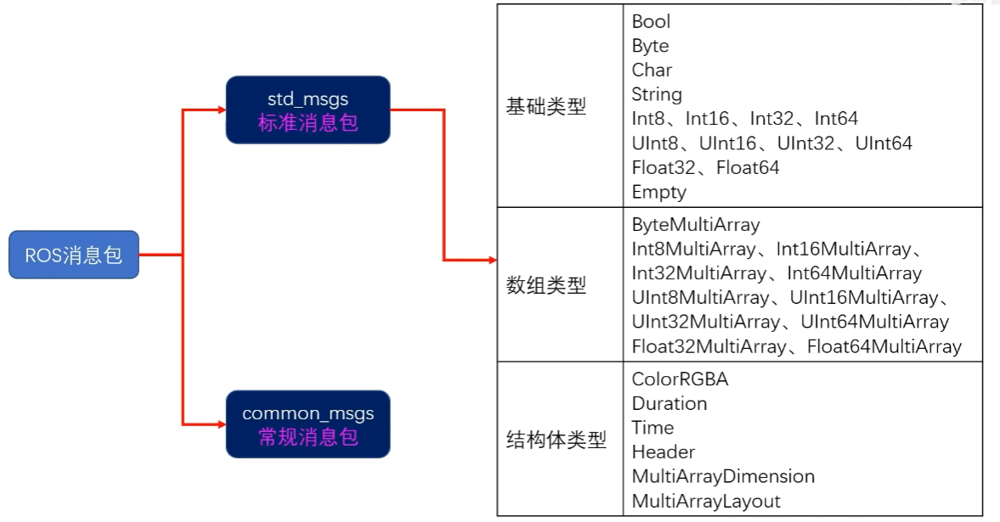
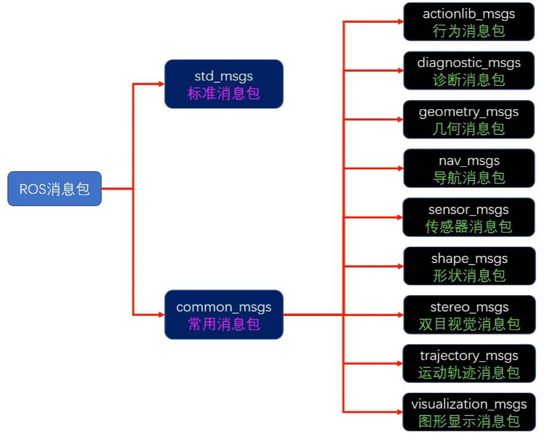
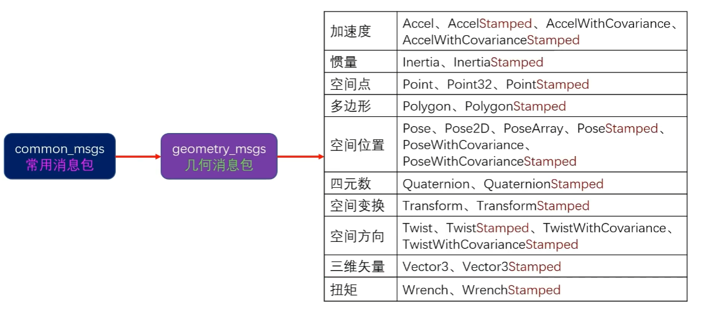
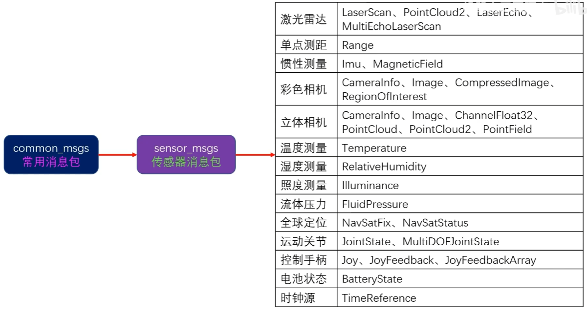

## 标准消息包

消息类型


## 几何消息包

常规消息包






## 自定义消息类型

生成自定义消息的步骤
1. 创建新软件包，依赖项message_generation、message_runtime。
2. 软件包添加msg目录，新建自定义消息文件，以.msg结尾。
3. 在CMakeLists.txt中，将新建的`.msg`文件加入*add_message_files()*。
4. 在CMakeLists.txt中去掉generate_messages()注释符号，将依赖的其他消息包名称添加进去。
5. 在CMakeLists.txt中，将message_runtime 加入 catkin_package()的CATKIN_DEPENDS
6. 在package.xml中，将message_generation、message_runtime加入`<build_depend>和<exec_depend>`。
7. 编译软件包，生成新的自定义消息类型


构建消息功能包
```
catkin_create_pkg qq_msgs roscpp rospy std_msgs message_generation message_runtime
```

在src下新建msg文件夹，新建Carry.msg文件

```
string grade
int64 star
string data
```

CMake编译规则
```cmake
## Generate messages in the 'msg' folder
add_message_files(
  FILES
  Carry.msg
)

## Generate added messages and services with any dependencies listed here
generate_messages(
  DEPENDENCIES
  std_msgs
)

CATKIN_DEPENDS message_generation message_runtime roscpp rospy std_msgs
```

package.xml
```xml
  <buildtool_depend>catkin</buildtool_depend>
  <build_depend>message_generation</build_depend>
  <build_depend>message_runtime</build_depend>
  <build_depend>roscpp</build_depend>
  <build_depend>rospy</build_depend>
  <build_depend>std_msgs</build_depend>
  <build_export_depend>roscpp</build_export_depend>
  <build_export_depend>rospy</build_export_depend>
  <build_export_depend>std_msgs</build_export_depend>
  <exec_depend>message_generation</exec_depend>
  <exec_depend>message_runtime</exec_depend>
  <exec_depend>roscpp</exec_depend>
  <exec_depend>rospy</exec_depend>
  <exec_depend>std_msgs</exec_depend>
```

查看消息结构
```
rosmsg show qq_msgs/Carry 
```


## 在ROS中使用自定义消息类型(C++节点)

在之前的ssr_pkg中修改发布者节点chao_node.cpp
```cpp
#include "ros/ros.h"
#include <std_msgs/String.h>
#include <qq_msgs/Carry.h>

int main(int argc, char *argv[])
{
    //执行 ros 节点初始化
    ros::init(argc,argv,"chao_node");
    //创建 ros 节点句柄 understand a helper
    ros::NodeHandle nh;
    ros::Publisher pub = nh.advertise<qq_msgs::Carry>("player_chao",10);

    ros::Rate loop_rate(10);
    //控制台输出 


    while(ros::ok())
    {
        printf("let's go!\n");
        qq_msgs::Carry msg; // Generate a message package
        msg.grade = "wang_zhe";
        msg.star = 66;
        msg.data = "Good player!";
        pub.publish(msg);
        loop_rate.sleep();
    }

    return 0;
}
```

然后修改CMake，表明编译顺序
```cmake
find_package(catkin REQUIRED COMPONENTS
  roscpp
  rospy
  std_msgs
  qq_msgs
)

add_dependencies(chao_node qq_msgs_generate_messages_cpp) # 为节点编译添加依赖项
```

修改xml
```xml
  <buildtool_depend>catkin</buildtool_depend>
  <build_depend>roscpp</build_depend>
  <build_depend>rospy</build_depend>
  <build_depend>std_msgs</build_depend>
  <build_depend>qq_msgs</build_depend>
  <build_export_depend>roscpp</build_export_depend>
  <build_export_depend>rospy</build_export_depend>
  <build_export_depend>std_msgs</build_export_depend>
  <exec_depend>roscpp</exec_depend>
  <exec_depend>rospy</exec_depend>
  <exec_depend>std_msgs</exec_depend>
  <exec_depend>qq_msgs</exec_depend>
```

在之前的atr_pkg中修改订阅者节点ma_node.cpp
```cpp
#include "ros/ros.h"
#include <std_msgs/String.h>
#include <qq_msgs/Carry.h>

void chao_callback(qq_msgs::Carry msg)
{
    ROS_WARN(msg.grade.c_str());
    ROS_WARN("%d star",msg.star);
    ROS_INFO(msg.data.c_str());
}

void yao_callback(std_msgs::String msg)
{
    ROS_WARN(msg.data.c_str());
}

int main(int argc, char *argv[])
{
    setlocale(LC_ALL,"zh_CN.UTF-8");
    //执行 ros 节点初始化
    ros::init(argc,argv,"ma_node");
    //创建 ros 节点句柄 understand a helper
    ros::NodeHandle nh;
    ros::Subscriber sub = nh.subscribe("player_chao",10,chao_callback);
    ros::Subscriber sub_2 = nh.subscribe("player_yao",10,yao_callback);

    //控制台输出 


    while(ros::ok())
    {
        ros::spinOnce();
    }

    return 0;
}
```

然后修改CMake，表明编译顺序
```cmake
find_package(catkin REQUIRED COMPONENTS
  roscpp
  rospy
  std_msgs
  qq_msgs
)

add_dependencies(ma_node qq_msgs_generate_messages_cpp) # 为节点编译添加依赖项
```

修改xml
```xml
  <buildtool_depend>catkin</buildtool_depend>
  <build_depend>roscpp</build_depend>
  <build_depend>rospy</build_depend>
  <build_depend>std_msgs</build_depend>
  <build_depend>qq_msgs</build_depend>
  <build_export_depend>roscpp</build_export_depend>
  <build_export_depend>rospy</build_export_depend>
  <build_export_depend>std_msgs</build_export_depend>
  <exec_depend>roscpp</exec_depend>
  <exec_depend>rospy</exec_depend>
  <exec_depend>std_msgs</exec_depend>
  <exec_depend>qq_msgs</exec_depend>
```

编译
启动核心roscore
```
rosrun ssr_pkg chao_node
```

```
rosrun atr_pkg ma_node
```

## 在ROS中使用自定义消息类型(Python节点)

在之前的ssr_pkg中的scripts修改发布者节点chao_node_py.py
```python
#!/usr/bin/python3
# -*- coding: utf-8 -*-

import rospy
from std_msgs.msg import String
from qq_msgs.msg import Carry

if __name__ == "__main__":
    rospy.init_node("chao_node_py")
    rospy.logwarn("Let's go my bro!")

    pub = rospy.Publisher("kai_hei_qun",Carry,queue_size=10)

    rate = rospy.Rate(10)

    while not rospy.is_shutdown():
        rospy.loginfo("let's go")
        msg = Carry()
        msg.grade =50
        msg.star = 66
        msg.data = "I will carry you!"
        pub.publish(msg)
        rate.sleep()
```

然后修改CMake，表明编译顺序
```cmake
find_package(catkin REQUIRED COMPONENTS
  roscpp
  rospy
  std_msgs
  qq_msgs
)
```

修改xml
```xml
  <buildtool_depend>catkin</buildtool_depend>
  <build_depend>roscpp</build_depend>
  <build_depend>rospy</build_depend>
  <build_depend>std_msgs</build_depend>
  <build_depend>qq_msgs</build_depend>
  <build_export_depend>roscpp</build_export_depend>
  <build_export_depend>rospy</build_export_depend>
  <build_export_depend>std_msgs</build_export_depend>
  <exec_depend>roscpp</exec_depend>
  <exec_depend>rospy</exec_depend>
  <exec_depend>std_msgs</exec_depend>
  <exec_depend>qq_msgs</exec_depend>
```

在之前的atr_pkg中的scripts中修改订阅者节点ma_node_py.py
```python
#!/usr/bin/python3
# -*- coding: utf-8 -*-

import rospy
from std_msgs.msg import String
from qq_msgs.msg import Carry

def chao_callback(msg):
    rospy.logwarn(msg.grade)
    rospy.logwarn(str(msg.star)+"star")
    rospy.loginfo(msg.data)

def yao_callback(msg):
    rospy.logwarn(msg.data)


if __name__ == "__main__":
    rospy.init_node("ma_node_py")
    rospy.logwarn("Let's go my bro! --ma")

    sub = rospy.Subscriber("kai_hei_qun",Carry,chao_callback,queue_size=10)
    sub = rospy.Subscriber("kai_hei_qun_yao",String,yao_callback,queue_size=10)
    
    rospy.spin()
```

然后修改CMake，表明编译顺序
```cmake
find_package(catkin REQUIRED COMPONENTS
  roscpp
  rospy
  std_msgs
  qq_msgs
)
```

修改xml
```xml
  <buildtool_depend>catkin</buildtool_depend>
  <build_depend>roscpp</build_depend>
  <build_depend>rospy</build_depend>
  <build_depend>std_msgs</build_depend>
  <build_depend>qq_msgs</build_depend>
  <build_export_depend>roscpp</build_export_depend>
  <build_export_depend>rospy</build_export_depend>
  <build_export_depend>std_msgs</build_export_depend>
  <exec_depend>roscpp</exec_depend>
  <exec_depend>rospy</exec_depend>
  <exec_depend>std_msgs</exec_depend>
  <exec_depend>qq_msgs</exec_depend>
```


编译
启动核心roscore
```
rosrun ssr_pkg chao_node_py.py 
```

```
rosrun atr_pkg ma_node_py.py 
```