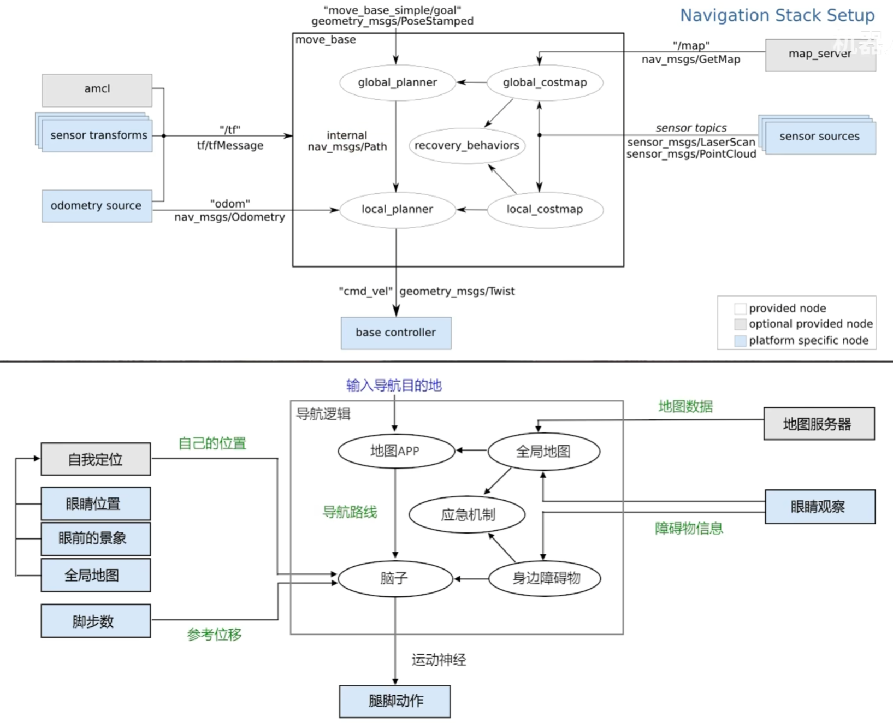
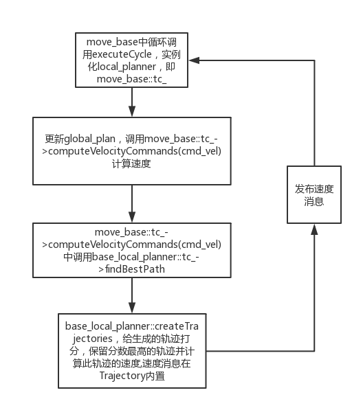
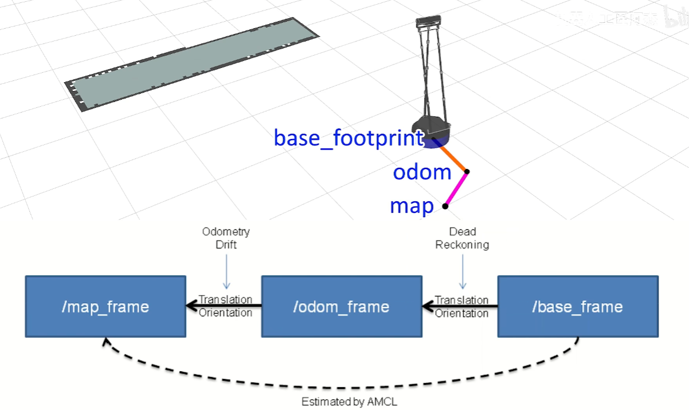

## 框架结构



## move_base Package

move_base node links together a global and local planner.

1. `move_base 导航节点`
2. `map_server 地图服务节点`
3. sensor sources 多个传感器节点
4. odometry source 里程计节点
5. sensor transform 传感器位置的 tf
6. `acml 定位节点`

导航共有三个核心功能：

1. 定位，[amcl](https://zhida.zhihu.com/search?content_id=3441512&content_type=Article&match_order=1&q=amcl&zhida_source=entity)（adaptive Monte Carlo localization）实现，简单来说就是放很多个 `pose(x, y, θ )`，然后估计下哪个 `pose` 从地图中看到的跟雷达的数据最符合。

2. 全局规划，意思就是全局，规划。

3. [局部规划](https://zhida.zhihu.com/search?content_id=3441512&content_type=Article&match_order=1&q=%E5%B1%80%E9%83%A8%E8%A7%84%E5%88%92&zhida_source=entity)，根据实时测的数据规划，尽量沿着全局规划走，但可以实现动态避障。

从简单的功能描述可以看出来，**定位**跟**局部规划**最难，定位用到了[粒子滤波](https://zhida.zhihu.com/search?content_id=3441512&content_type=Article&match_order=1&q=%E7%B2%92%E5%AD%90%E6%BB%A4%E6%B3%A2&zhida_source=entity)，局部规划的“尽量”跟“动态”听起来就不是很靠谱，实现起来自然有些困难。我从定位开始研究，然后到规划的基础costmap，最后研究规划，在这之上顺便再研究些其他的细枝末节。

## ROS navigation中各package的作用

### 1.Nav_Core

该包定义了整个导航系统关键包的接口函数，包括`base_global_planner`, `base_local_planner`以及`recovery_behavior`的接口。里面的函数全是**虚函数**，所以该包只是起到规范接口的作用，真正功能的实现在相应的包当中。**之后添加自己编写的全局或局部导航算法也需要在这里声明。**

### 2.move_base

该包是整个 `navigation stack` 当中进行宏观调控的 `manager`。它主要干的事情是这样的: 

- 维护一张全局地图（基本上是不会更新的，一般是静态costmap类型）
- 维护一张局部地图（实时更新，costmap类型）
- 维护一个全局路径规划器 `global_planner` 完成全局路径规划的任务
- 维护一个局部路径规划器 `base_local_planner` 完成局部路径规划的任务。 
- 提供一个对外的服务，负责监听 `nav_msgs::goal` 类型的消息
- 调动全局规划器规划全局路径，再将全局路径送进局部规划器，局部规划器结合周围障碍信息（从其维护的costmap中查询），全局路径信息，目标点信息采样速度并评分获得最高得分的轨迹（即是采样的最佳速度）
- 返回速度值，由 move_base 发送 Twist 类型的 cmd_vel 消息上，从而控制机器人移动，完成导航任务。

### 3.global_planner、navfn、carrot_planner

在 nav_core 包中有关于 BaseGlobalPlanner 接口的定义，这三个包都继承并实现了 nav_core 中定义的 BaseGlobalPlanner 类，前两者都包含了`A*`和`Dijkstra`算法的实现，可以说 global_planner 是 navfn 的升级版，代码结构更优，更清晰。

> 注：当前ros版本中默认使用的是navfn。carrot_planner是另外一种全局的路径规划

**global_planner:**

A*、Dijstra、prm、人工势场、单元分解、快速搜索树（RRT）等

### 4.base_local_planner、dwa_local_planner

这两个package是关于*局部路径规划*，机器人运动速度的具体生成在此包当中完成。目前有两种局部路径规划算法实现，一是航迹推算法（TrajectoryROS），一是动态窗口法(DWA)，该包内部的默认实现是航迹推算法，但是留出了DWA的定义接口，DWA的实现在dwa_local_planner中。两者都是继承并实现了nav_core中定义的BaseLocalPlanner类

base_local_planner: 


**local_planner:**

base_local_planner、dwa_local_planner、teb_local_planner、eband_local_planner、asr_ftc_local_planner、dwb_local_planner

### 5.map_server

该package的主要功能是通过map_server节点读取yaml配置文件、加载pgm地图文件，发布 static_map service，发布 map_metadata 和 map 的topic。命令行如下：

```
rosrun map_server map_server 1.yaml
```

另外map_server还提供地图保存的功能，floor 1为要保存的地图名称，命令如下：
`
```
rosrun map_server map_saver -f floor1
```

### 6.AMCL

该包是一个二维移动机器人的概率定位系统，它实现了自适应（或KLD采样）蒙特卡罗定位方法，该方法使用粒子滤波器根据已知地图 ( 先验地图 ) 跟踪机器人的姿态。

### 7.rotate_recovery、clear_costmap_recovery

这两个包都继承自 nav_core 中定义的 recovery_behavior 类， 具体实现是：当导航发现无路可走的时候，机器人在原地旋转，并更新周围障碍物信息看是否有动态障碍物运动开，如果能够找到路就继续走。

在move_base当中，默认使用的是recovery_behavior，先进行一次旋转，然后进行一次小半径的障碍物更新，然后再进行一次旋转，再进行一次大范围的障碍物更新，每进行一次recovery_behavior，都会重新尝试进行一次局部寻路，如果没找到，才会再执行下一个recovery_behavior。这两个包的代码非常简单，不看也不会影响理解偏差，所以可以不用浪费时间看，当然因为简单要看也是分分钟的事。

### 8.costmap_2d

该包以层的概念来组织图层，move_base中默认的层有static_layer（通过订阅map_server的/map主题）来生成，obstacle_layer根据传感器获得的反馈来生成障碍物图层， inflation_layer 则是将前两个图层的信息综合进行缓冲区扩展。

## 环境配置

获取驱动源码
```
git clone https://github.com/6-robot/wpb_home.git
```

安装依赖项
```
cd wpb_home/wpb_home_bringup/scripts/
./install_for_noetic.sh
```

编译
```
cd ~/catkin_ws
catkin_make
```

这两条命令来进行建图操作

```
roslaunch wpr_simulation wpb_gmapping.launch 
```

```
rosrun wpr_simulation keyboard_vel_ctrl
```

将地图保存为文件
```
rosrun map_server map_saver -f map
```

地图会保存到 Home 目录下，`map.pgm`、`map.yaml`，将两个地图文件复制到`/home/shihanbo/catkin_ws/src/wpr_simulation/maps`文件夹下


## 导航代码编写

shihanbo@ros:~/catkin_ws/src$ 功能包创建
```
catkin_create_pkg nav_pkg roscpp rospy move_base_msgs actionlib
```

在该功能包下新建`launch`文件夹，新建`nav.launch`，编写代码
```c
<!-- 1. `move_base 导航节点`
2. `map_server 地图服务节点`
3. `acml 定位节点` -->

<launch>
    <!--- Run move_base -->
    <node pkg="move_base" type="move_base" name="move_base">
        <rosparam file="$(find wpb_home_tutorials)/nav_lidar/costmap_common_params.yaml" command="load" ns="global_costmap" />
        <rosparam file="$(find wpb_home_tutorials)/nav_lidar/costmap_common_params.yaml" command="load" ns="local_costmap" />
        <rosparam file="$(find wpb_home_tutorials)/nav_lidar/global_costmap_params.yaml" command="load" />
        <rosparam file="$(find wpb_home_tutorials)/nav_lidar/local_costmap_params.yaml" command="load" />
        <param name="base_global_planner" value="global_planner/GlobalPlanner" /> 
        <param name="base_local_planner" value="wpbh_local_planner/WpbhLocalPlanner" />
    </node>

    <!-- Run map server -->
    <node pkg="map_server" type="map_server" name="map_server" args="$(find wpr_simulation)/maps/map.yaml"/>

    <!--- Run AMCL -->
    <node pkg="amcl" type="amcl" name="amcl"/>

    <!--- Run rviz -->
    <node name="rviz" pkg="rviz" type="rviz" args="-d $(find wpr_simulation)/rviz/nav.rviz"/>
</launch>
```


## 运行

```
roslaunch wpr_simulation wpb_stage_robocup.launch 
```

```
roslaunch nav_pkg nav.launch 
```

运行rviz，配置环境`RobotModel`，`Map`，发布导航节点 `2D Nav Goal`

添加`Path`，显示路线

## 全局规划器

广度优先 Dijkstra 算法
深度优先 A* 算法

| 全局规划器          | 变量名称                          |
| -------------- | ----------------------------- |
| Navfn          | navfn/NavfnROS                |
| Global_planner | global_planner/Global_planner |
| Carrot_planner | carrot_planner/Carrot_planner |

launch文件参数修改`<param name="base_global_planner" value="global_planner/GlobalPlanner" />`

默认参数是Dijkstra，如果想要修改为$A^*$需要加上如下两行代码
`<param name="GlobalPlanner/use_dijkstra" value="false" />`
`<param name="GlobalPlanner/use_grid_path" value="true" />`
<param name="base_global_planner" value="global_planner/GlobalPlanner" />
<param name="base_global_planner" value="global_planner/GlobalPlanner" />
<param name="GlobalPlanner" value="global_planner/GlobalPlanner" />

目前电脑算力足够，不需要修改规划器。默认足够

## AMCL定位算法

Adaptive Monte Carlo Localization 自适应蒙特卡洛定位算法

粒子滤波：理解为偏差的分身，用里程计记录机器人一段位移，同时记录雷达扫描到的障碍物特征，在Rviz中让机器人本体和分身也移动一样的距离，把雷达扫描到的障碍物特征叠加上去，然后开始进行末位淘汰。依次去掉偏差的机器人，留下匹配最好的作为新的本体。原来的本体给他降级。依次裂开循环叠加特征得到最好的路径。

https://wiki.ros.org/amcl

参考`/home/shihanbo/catkin_ws/src/wpb_home/wpb_home_tutorials/nav_lidar/amcl_diff.launch`

```c
<launch>
<node pkg="amcl" type="amcl" name="amcl" output="screen">
  <!-- Publish scans from best pose at a max of 10 Hz -->
  <param name="odom_model_type" value="diff"/>
  <param name="odom_alpha5" value="0.1"/>
  <param name="transform_tolerance" value="0.2" />
  <param name="gui_publish_rate" value="10.0"/>
  <param name="laser_max_beams" value="30"/>
  <param name="min_particles" value="50"/>
  <param name="max_particles" value="500"/>
  <param name="kld_err" value="0.05"/>
  <param name="kld_z" value="0.99"/>
  <param name="odom_alpha1" value="0.2"/>
  <param name="odom_alpha2" value="0.2"/>
  <!-- translation std dev, m -->
  <param name="odom_alpha3" value="0.8"/>
  <param name="odom_alpha4" value="0.2"/>
  <param name="laser_z_hit" value="0.5"/>
  <param name="laser_z_short" value="0.05"/>
  <param name="laser_z_max" value="0.05"/>
  <param name="laser_z_rand" value="0.5"/>
  <param name="laser_sigma_hit" value="0.2"/>
  <param name="laser_lambda_short" value="0.1"/>
  <param name="laser_lambda_short" value="0.1"/>
  <param name="laser_model_type" value="likelihood_field"/>
  <!-- <param name="laser_model_type" value="beam"/> -->
  <param name="laser_likelihood_max_dist" value="2.0"/>
  <param name="update_min_d" value="0.2"/>
  <param name="update_min_a" value="0.5"/>
  <param name="odom_frame_id" value="odom"/>
  <param name="resample_interval" value="1"/>
  <param name="transform_tolerance" value="0.1"/>
  <param name="recovery_alpha_slow" value="0.0"/>
  <param name="recovery_alpha_fast" value="0.0"/>
</node>
</launch>
```



amcl节点和里程计的tf输出机制，acml节点负责输出`map`到`odom`的tf，里程计负责输出`odom`到`base_footprint`的tf，从而形成一条完整的`map`到`base_footprint`。也就是地图到机器人地盘的tf关系。

Amcl节点切换本体和分身，是通过在map到base_footprint的这段tf上，产生跳跃突变实现的。

所以在导航过程中，经常能看到机器人的位置一蹦一蹦的，感觉像掉帧了一样，这就是amcl节点输出的这段tf产生突变的结果。而里程计输出的odom到base_footprint这段tf，通常是保持连续变化的，不会突然跳变。

测试：

```
roslaunch wpr_simulation wpb_stage_robocup.launch 
```

```
roslaunch nav_pkg nav.launch 
```

```
rviz
```

Rviz中Topic订阅`/map`话题,添加PoseArray订阅`/particlecloud`话题。修改颜色试试

## 代价地图 Costmap

走进这个区域就可能会撞墙。

`/global_costmap` 全局代价地图，给地图里的所有障碍物都加上这个会掉血的区域。给全局规划器 `/global_planner` 来生成全图范围的导航路线。

/local_costmap 局部代价地图，只在机器人身边的一个小范围内生成障碍物的掉血区域，主要是给局部规划器 `/local_planner` 避障用的。

运行仿真和rviz，在rviz中建立全局和局部代价图，保存为文件到 nav_pkg ，新建 rviz 创建 nav.rviz

测试

```
roslaunch wpr_simulation wpb_stage_robocup.launch 
```

```
roslaunch nav_pkg nav.launch 
```

## 代价地图参数设置

在vscode中打开wpb_home_turorials文件，打开nav_lidar文件，找到launch相关文件和yaml相关文件；

### costmap_common_params.yaml文件参数设置

```
robot_radius: 0.25 (机器人的底盘半径)
inflation_radius: 0.5 (膨胀区域的半径)
obstacle_range: 6.0 (这里的意思是把激光雷达扫描的6米范围内的障碍物都加到代价地图里，该数值一般设置为激光雷达的有效检测距离，可以适当调小一些以确保障碍物检测都是有效可靠的；)
raytrace_range: 6.0 (在激光雷达的扫描范围内，所有被激光雷达射线穿透的栅格都会被认为没有障碍物存在，这个主要用于清除动态障碍物的残留影子；)
observation_sources: base_lidar (动态障碍物的观测来源，这里设置的是底盘上的激光雷达base_lidar;)
base_lidar: {
    data_type: LaserScan,
    topic: /scan, 
    marking: true, 
    clearing: true
    }
```

### global_costmap_params.yaml设置

全局代价地图的参数文件：
```
global_costmap:
	global_frame:map （地图坐标系的名称）
	robot_base_frame:base_footprint （机器人底盘坐标系的名称）
	static_map:true （是否将map_server发过来的地图数据作为初始地图）
	update_frequency:1.0 （地图更新频率）
	publish_frequency:1.0 （地图的发布频率）
	transform_tolerance:1.0 （延迟容忍值，单位秒）
```

### local_costmap_params.yaml设置

局部代价地图的参数文件：
```
local_costmap:
	global_frame:odom (地图坐标系)
	robot_base_frame:base_footprint
	static_map:false （是否使用之前SLAM建好的全局地图）
	rolling_window:true  （局部代价地图的范围是否跟着机器人一起移动）
	width:3.0 （局部代价地图的范围尺寸参数，单位米）
	height:3.0
	update_frequency:10.0 （局部代价地图的更新频率，单位HZ）
	publish_frequency:10.0
	transform_tolerance:1.0

```

测试

```
roslaunch wpr_simulation wpb_stage_robocup.launch 
```

```
roslaunch nav_pkg nav.launch 
```

## 恢复行为 | Recovery Behaviors

recovery_behaviors是一种导航应急机制，这个机制会在导航陷入停滞时尝试刷新周围的障碍物信息，然后**重新进行全局路径规划**，试图让导航过程回到正轨上；

- 恢复行为的默认流程：

导航过程中如果机器人被困住了，会进入 “保守重置” 状态，此时会清除地图中一定范围的障碍物信息，然后重新规划导航路线，如果可以正常规划，就恢复到正常导航状态，反之进入下一步 “旋转清除”，机器人会原地旋转，用激光雷达彻底扫描周围，避免雷达盲区内的障碍物残留信息没被刷新，旋转完毕再规划导航路线，如果可以正常规划，就恢复到正常导航状态，反之进入下一步 “激进重置” 状态，此时会对更大范围的障碍物信息进行清除，查看能否正常规划导航路线，如果还是不能脱困就进入 “旋转清除状态” 再转一圈，旋转结束后如果还是无法规划出导航路线就放弃导航任务；

官方的两个重置行为并没有什么实际效果，完全依赖两个旋转清除功能，实际使用中可以根据机器人的特性和任务需求重新设计恢复行为的机制。

### 恢复行为的参数设置

在恢复行为的默认流程中，两个重置行为的代码是相同的，只是参数设置有所区别；

```
recovery_behaviors:
	- name:'rotate_recovery' (旋转清除行为)
	  type:'rotate_recovery/RotateRecovery' 
	- name:'reset_recovery' (恢复行为)
	  type:'clear_costmap_recovery/ClearCostmapRecovery'

reset_recovery:
	reset_distance:1.84
	layer_name:["obstacle_layer"]

```

(不常用)该行为会让机器人在几个点之间来回走动，可能会碰到障碍物
move_slow_and_clear/MoveSlowAndClear

恢复行为主要是为全局路径规划服务的，可以把参数写入到全局代价地图的参数里（global_costmap_params.yaml文件）

### ROS中地图的分层结构

1. Static 静态地图
2. Obstacles 障碍物地图
3. Inflation 膨胀地图
4. Master rviz中看到的地图，由上述三层合并而成的地图

重置行为清除的是障碍物层级的地图，指的是激光雷达过去探测到的障碍物残影，而新检测到的障碍物信息会立刻刷新进来，叠加上map_server发来的静态地图作为重新路径规划的地图依据；

reset_distance表示将机器人底盘为中心的正方形边长以外的障碍层区域全部清除；
reset_distance为0表示将障碍层的所有信息全部清除；
