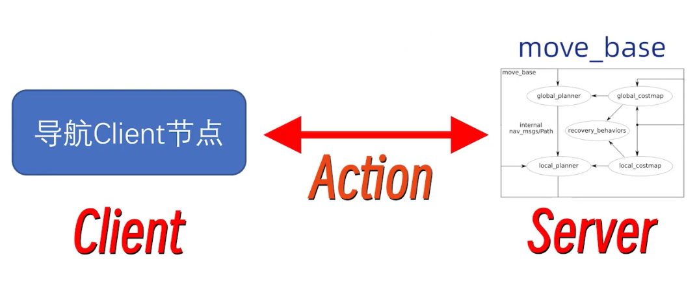

根据提供的搜索结果，以下是对DWA规划器、TEB规划器进行的详细对比分析：

### DWA（Dynamic Window Approach）规划器

- **特点**：
  - DWA是一种经典且相对简单的局部路径规划方法，适用于动态环境中快速做出决策。
  - 通过在机器人可能采取的动作的“动态窗口”内搜索最佳速度配置，以最小化到达目标的成本。
  - 优点是计算效率高，实现简单，适用于资源有限的系统。
  - 缺点是可能产生不平滑的轨迹，尤其是在需要精确姿态控制或复杂环境导航时。

### TEB（Timed Elastic Bands）规划器

- **特点**：
  - TEB是一种更为复杂的局部规划方法，使用时间弹性带模型来优化轨迹，不仅考虑位置而且考虑机器人的姿态。
  - 相较于DWA，TEB能提供更加平滑和优化的轨迹，特别是在需要考虑机器人体态（如机器人朝向）的应用场景。
  - TEB允许在运动过程中调整机器人的朝向，以减少到达目标点后的姿态调整，但在某些情况下可能导致路径不够直接或在启动及接近目标时有不必要的动作。
  - 适用于需要更细致路径控制和姿态管理的机器人，特别适合于具有非holonomic约束（如差速驱动的机器人）的系统。
  - 通过构建一个时间相关的弹性带模型来综合考虑机器人的动态约束、路径优化以及避障需求。

### 对比分析

- **计算效率**：
  - DWA由于其简单性，计算效率较高，适合资源有限的系统。
  - TEB由于需要进行更复杂的优化计算，计算效率相对较低，但能提供更优的路径和姿态规划。

- **路径平滑性**：
  - DWA可能产生不平滑的轨迹，特别是在复杂环境中。
  - TEB提供的轨迹更加平滑和优化，尤其是在需要考虑机器人姿态控制的场景中。

- **适用场景**：
  - DWA适用于需要快速反应和决策的动态环境。
  - TEB适用于需要细致路径控制和姿态管理的场景，尤其是在机器人的朝向控制方面。

- **动态约束处理**：
  - DWA主要关注避障和到达目标，对机器人动态约束的处理不如TEB全面。
  - TEB在规划过程中综合考虑了机器人的动态约束，提供了更符合机器人实际运动学特性的路径。

如果需要快速反应和计算效率，DWA可能是更好的选择；如果需要更平滑的路径和精细的姿态控制，TEB可能更为合适。

## 导航的Action编程接口

在使用 Navigation 导航系统中，不能每次都手动设置导航目标点，所以需要编写程序代码实现导航功能。所以需要导航接口，Navigation 有多个导航接口，ROS官方推荐使用 Action 接口实现导航功能。  
通过C++实现导航的Action Client 节点。




### 坐标导航的 C++ 编程实现

新建文件 /home/shihanbo/catkin_ws/src/nav_pkg/src/nav_client.cpp


```cpp
/*********************************************************************
* Software License Agreement (BSD License)
* 
*  Copyright (c) 2017-2020, Waterplus http://www.6-robot.com
*  All rights reserved.
* 
*  Redistribution and use in source and binary forms, with or without
*  modification, are permitted provided that the following conditions
*  are met:
* 
*   * Redistributions of source code must retain the above copyright
*     notice, this list of conditions and the following disclaimer.
*   * Redistributions in binary form must reproduce the above
*     copyright notice, this list of conditions and the following
*     disclaimer in the documentation and/or other materials provided
*     with the distribution.
*   * Neither the name of the WaterPlus nor the names of its
*     contributors may be used to endorse or promote products derived
*     from this software without specific prior written permission.
* 
*  THIS SOFTWARE IS PROVIDED BY THE COPYRIGHT HOLDERS AND CONTRIBUTORS
*  "AS IS" AND ANY EXPRESS OR IMPLIED WARRANTIES, INCLUDING, BUT NOT
*  LIMITED TO, THE IMPLIED WARRANTIES OF MERCHANTABILITY AND FITNESS
*  FOR A PARTICULAR PURPOSE ARE DISCLAIMED. IN NO EVENT SHALL THE
*  COPYRIGHT OWNER OR CONTRIBUTORS BE LIABLE FOR ANY DIRECT, INDIRECT,
*  FOOTPRINTAL, SPECIAL, EXEMPLARY, OR CONSEQUENTIAL DAMAGES (INCLUDING,
*  BUT NOT LIMITED TO, PROCUREMENT OF SUBSTITUTE GOODS OR SERVICES;
*  LOSS OF USE, DATA, OR PROFITS; OR BUSINESS INTERRUPTION) HOWEVER
*  CAUSED AND ON ANY THEORY OF LIABILITY, WHETHER IN CONTRACT, STRICT
*  LIABILITY, OR TORT (INCLUDING NEGLIGENCE OR OTHERWISE) ARISING IN
*  ANY WAY OUT OF THE USE OF THIS SOFTWARE, EVEN IF ADVISED OF THE
*  POSSIBILITY OF SUCH DAMAGE.
*********************************************************************/

#include <ros/ros.h>
#include <move_base_msgs/MoveBaseAction.h>
#include <actionlib/client/simple_action_client.h>

typedef actionlib::SimpleActionClient<move_base_msgs::MoveBaseAction> MoveBaseClient;

int main(int argc, char** argv)
{
  ros::init(argc, argv, "nav_client");

  //tell the action client that we want to spin a thread by default
  MoveBaseClient ac("move_base", true);

  //wait for the action server to come up
  while(!ac.waitForServer(ros::Duration(5.0)))
  {
    ROS_INFO("Waiting for the move_base action server to come up");
  }

  move_base_msgs::MoveBaseGoal goal;

  goal.target_pose.header.frame_id = "map";
  goal.target_pose.header.stamp = ros::Time::now();

  goal.target_pose.pose.position.x = -3.0;
  goal.target_pose.pose.position.y = 2.0;
  goal.target_pose.pose.orientation.w = 1.0;

  ROS_INFO("Sending goal");
  ac.sendGoal(goal);

  ac.waitForResult();

  if(ac.getState() == actionlib::SimpleClientGoalState::SUCCEEDED)
    ROS_INFO("Mission complete!");
  else
    ROS_INFO("Mission failed ...");

  return 0;
}
```

添加编译规则

```cmake
add_executable(nav_client src/nav_client.cpp)

add_dependencies(nav_client ${${PROJECT_NAME}_EXPORTED_TARGETS} ${catkin_EXPORTED_TARGETS})

target_link_libraries(nav_client
  ${catkin_LIBRARIES}
)
```

编译测试

```
roslaunch wpr_simulation wpb_stage_robocup.launch 
```

```
roslaunch nav_pkg nav.launch 
```

```
rosrun nav_pkg nav_client 
```

### 坐标导航的 Python 编程实现

/home/shihanbo/catkin_ws/src/nav_pkg/scripts/nav_client.py

```python
#!/usr/bin/env python3
# coding=utf-8

import rospy
import actionlib
from move_base_msgs.msg import MoveBaseAction, MoveBaseGoal

if __name__ == "__main__":
    rospy.init_node("nav_client")
    # 生成一个导航请求客户端
    ac = actionlib.SimpleActionClient('move_base',MoveBaseAction)
    # 等待服务器端启动
    ac.wait_for_server()

    # 构建目标航点消息
    goal = MoveBaseGoal()
    # 目标航点的参考坐标系
    goal.target_pose.header.frame_id="map"
    # 目标航点在参考坐标系里的三维数值
    goal.target_pose.pose.position.x = -3.0
    goal.target_pose.pose.position.y = 2.0
    goal.target_pose.pose.position.z = 0.0
    # 目标航点在参考坐标系里的朝向信息
    goal.target_pose.pose.orientation.x = 0.0
    goal.target_pose.pose.orientation.y = 0.0
    goal.target_pose.pose.orientation.z = 0.0
    goal.target_pose.pose.orientation.w = 1.0

    # 发送目标航点去执行
    ac.send_goal(goal)
    rospy.loginfo("开始导航……")
    ac.wait_for_result()
    rospy.loginfo("导航结束！")
```

打开这个终端增加权限

```
cd scripts/
```

```
chmod +x nav_client.py 
```

测试

```
roslaunch wpr_simulation wpb_stage_robocup.launch 
```

```
roslaunch nav_pkg nav.launch 
```

```
rosrun nav_pkg nav_client.py
```


## 航点导航插件介绍、集成和启动

安装该功能包到工作空间，编译
```
git clone https://github.com/6-robot/waterplus_map_tools.git
```

运行
```
roslaunch waterplus_map_tools add_waypoint_simulation.launch 
```

Rviz 新增了 `Add Waypoint` 图标，点击图标，依次选择目标点和方向进行导航测试。

保存航点信息 文件为 `.xml`，可以查看文件，查看编码格式
```
rosrun waterplus_map_tools wp_saver 
```

重启终端，运行 `gazebo` 仿真
```
roslaunch wpr_simulation wpb_map_tool.launch 
```

在rviz中将机器人放到门口外面

运行 激活 机器人运动
```
rosrun wpr_simulation demo_map_tool
```

在/home/shihanbo/catkin_ws/src/nav_pkg/launch/nav.launch添加
```
<node pkg="waterplus_map_tools" type="wp_navi_server" name="wp_navi_server" output="screen" />

<node pkg="waterplus_map_tools" type="wp_manager" name="wp_manager" output="screen" />
```

复制`/home/shihanbo/catkin_ws/src/wpr_simulation/rviz/map_tool.rviz`文件到`/home/shihanbo/catkin_ws/src/nav_pkg/rviz`文件夹下

修改24行代码 `map_tool.rviz`
```
<node name="rviz" pkg="rviz" type="rviz" args="-d $(find nav_pkg)/rviz/map_tool.rviz"/>
```

启动航点导航启动仿真
```
roslaunch wpr_simulation wpb_stage_robocup.launch 
```

启动航点导航
```
roslaunch nav_pkg nav.launch 
```

运行 激活 机器人运动指定航点导航
```
rosrun nav_pkg wp_node
```

### 航点导航 C++ 实现

/home/shihanbo/catkin_ws/src/nav_pkg/src/wp_node.cpp

```cpp
/*********************************************************************
* Software License Agreement (BSD License)
* 
*  Copyright (c) 2017-2020, Waterplus http://www.6-robot.com
*  All rights reserved.
* 
*  Redistribution and use in source and binary forms, with or without
*  modification, are permitted provided that the following conditions
*  are met:
* 
*   * Redistributions of source code must retain the above copyright
*     notice, this list of conditions and the following disclaimer.
*   * Redistributions in binary form must reproduce the above
*     copyright notice, this list of conditions and the following
*     disclaimer in the documentation and/or other materials provided
*     with the distribution.
*   * Neither the name of the WaterPlus nor the names of its
*     contributors may be used to endorse or promote products derived
*     from this software without specific prior written permission.
* 
*  THIS SOFTWARE IS PROVIDED BY THE COPYRIGHT HOLDERS AND CONTRIBUTORS
*  "AS IS" AND ANY EXPRESS OR IMPLIED WARRANTIES, INCLUDING, BUT NOT
*  LIMITED TO, THE IMPLIED WARRANTIES OF MERCHANTABILITY AND FITNESS
*  FOR A PARTICULAR PURPOSE ARE DISCLAIMED. IN NO EVENT SHALL THE
*  COPYRIGHT OWNER OR CONTRIBUTORS BE LIABLE FOR ANY DIRECT, INDIRECT,
*  FOOTPRINTAL, SPECIAL, EXEMPLARY, OR CONSEQUENTIAL DAMAGES (INCLUDING,
*  BUT NOT LIMITED TO, PROCUREMENT OF SUBSTITUTE GOODS OR SERVICES;
*  LOSS OF USE, DATA, OR PROFITS; OR BUSINESS INTERRUPTION) HOWEVER
*  CAUSED AND ON ANY THEORY OF LIABILITY, WHETHER IN CONTRACT, STRICT
*  LIABILITY, OR TORT (INCLUDING NEGLIGENCE OR OTHERWISE) ARISING IN
*  ANY WAY OUT OF THE USE OF THIS SOFTWARE, EVEN IF ADVISED OF THE
*  POSSIBILITY OF SUCH DAMAGE.
*********************************************************************/
/* @author Zhang Wanjie                                             */

#include <ros/ros.h>
#include <std_msgs/String.h>

void NavResultCallback(const std_msgs::String &msg)
{
    ROS_WARN("[NavResultCallback] %s",msg.data.c_str());
}

int main(int argc, char** argv)
{
    ros::init(argc, argv, "wp_node");

    ros::NodeHandle n;
    ros::Publisher nav_pub = n.advertise<std_msgs::String>("/waterplus/navi_waypoint", 10);
    ros::Subscriber res_sub = n.subscribe("/waterplus/navi_result", 10, NavResultCallback);

    sleep(1);
    
    std_msgs::String nav_msg;
    nav_msg.data = "2"; # 修改的参数
    nav_pub.publish(nav_msg);

    ros::spin();

    return 0;
}
```

添加编译规则
```cmake
add_executable(wp_node src/wp_node.cpp)

add_dependencies(wp_node ${${PROJECT_NAME}_EXPORTED_TARGETS} ${catkin_EXPORTED_TARGETS})

target_link_libraries(wp_node
  ${catkin_LIBRARIES}
)
```

编译测试

启动航点导航启动仿真
```
roslaunch wpr_simulation wpb_stage_robocup.launch 
```

启动航点导航
```
roslaunch nav_pkg nav.launch 
```

运行 激活 机器人运动指定航点导航
```
rosrun nav_pkg wp_node
```

### 航点导航 Python 实现

新建/home/shihanbo/catkin_ws/src/nav_pkg/scripts/wp_node.py

```python
#!/usr/bin/env python3
# coding=utf-8

import rospy
from std_msgs.msg import String

# 导航结果回调函数
def resultNavi(msg):
    rospy.loginfo("导航结果 = %s",msg.data)

if __name__ == "__main__":
    rospy.init_node("wp_node")
    # 发布航点名称话题
    navi_pub = rospy.Publisher("/waterplus/navi_waypoint",String,queue_size=10)
    # 订阅导航结果话题
    result_sub = rospy.Subscriber("/waterplus/navi_result",String,resultNavi,queue_size=10)
    # 延时1秒钟，让后台的话题发布操作能够完成
    rospy.sleep(1)
    # 构建航点名称消息包
    msg = String()
    msg.data = '2'
    # 发送航点名称消息包
    navi_pub.publish(msg)
    # 构建循环让程序别退出，等待导航结果
    rospy.spin()
```

打开这个终端增加权限

```
cd scripts/
```

```
chmod +x wp_node.py
```

启动航点导航启动仿真
```
roslaunch wpr_simulation wpb_stage_robocup.launch 
```

启动航点导航
```
roslaunch nav_pkg nav.launch 
```

运行 激活 机器人运动指定航点导航
```
rosrun nav_pkg wp_node.py
```
