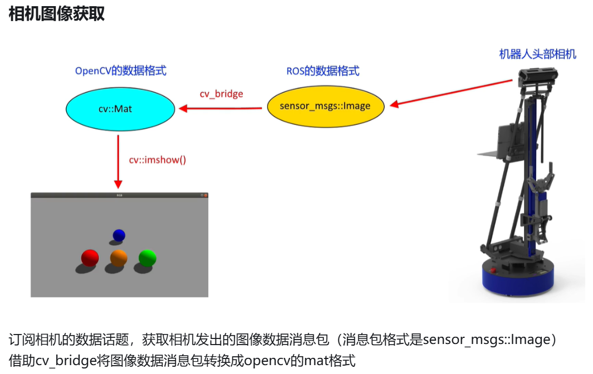

### ROS 中的相机话题


| 话题(Topic)         | 消息(Message)  |
| ----------------- | ------------ |
| /image_raw        | 相机的原始数据      |
| /image_color      | 相机的彩色图像数据    |
| /image_color_rect | 畸变矫正后的彩色图像数据 |
| /camera_info      | 相机相关的参数      |



### 相机图像获取的 C++ 实现

创建包
```
catkin_create_pkg cv_pkg roscpp cv_bridge
```

创建节点 `cv_image_node.cpp`

```cpp
#include <ros/ros.h>
#include <sensor_msgs/Image.h>
#include <cv_bridge/cv_bridge.h>
#include <opencv2/opencv.hpp>

using namespace cv;

void Cam_RGB_Callback(const sensor_msgs::Image msg) {
    cv_bridge::CvImagePtr cv_ptr;
    try {
        cv_ptr = cv_bridge::toCvCopy(msg, sensor_msgs::image_encodings::BGR8);
    } catch (cv_bridge::Exception& e) {
        ROS_ERROR("cv_bridge exception: %s", e.what());
        return;
    }

    Mat imgOriginal = cv_ptr->image;
    imshow("RGB", imgOriginal);
    waitKey(1);
}

int main(int argc, char**argv) {
    ros::init(argc, argv, "cv_image_node");
    ros::NodeHandle nh;
    ros::Subscriber rgb_sub = nh.subscribe("/kinect2/qhd/image_color_rect", 1, Cam_RGB_Callback);
    namedWindow("RGB");
    ros::spin();
}
```

修改CMakeLists.txt 添加
```
find_package(OpenCV REQUIRED)
```

```
# include
  ${catkin_INCLUDE_DIRS}
  ${OpenCV_INCLUDE_DIRS}
)
```

```
add_executable(cv_image_node src/cv_image_node.cpp)

add_dependencies(cv_image_node ${${PROJECT_NAME}_EXPORTED_TARGETS} ${catkin_EXPORTED_TARGETS})

target_link_libraries(cv_image_node
  ${catkin_LIBRARIES} ${OpenCV_LIBS}
)
```

编译 `catkin_make`

打开仿真环境
```
roslaunch wpr_simulation wpb_balls.launch
```

打开仿真环境中的相机
```
rosrun cv_pkg cv_image_node
```

### 颜色目标识别与定位的 C++ 实现

1、颜色空间转换 RGB → HSV
2、二值化 分割提取目标物
3、计算目标物的质心坐标

新建 `cv_hsv_node.cpp`
```cpp
#include <ros/ros.h>
#include <cv_bridge/cv_bridge.h>
#include <sensor_msgs/image_encodings.h>
#include <opencv2/imgproc/imgproc.hpp>
#include <opencv2/highgui/highgui.hpp> 

using namespace cv;
using namespace std;

static int iLowH = 10;
static int iHighH = 40;

static int iLowS = 90; 
static int iHighS = 255;

static int iLowV = 1;
static int iHighV = 255;

void Cam_RGB_Callback(const sensor_msgs::Image msg)
{
    //ROS_INFO("Cam_RGB_Callback");
    cv_bridge::CvImagePtr cv_ptr;
    try
    {
        cv_ptr = cv_bridge::toCvCopy(msg, sensor_msgs::image_encodings::BGR8);
    }
    catch (cv_bridge::Exception& e)
    {
        ROS_ERROR("cv_bridge exception: %s", e.what());
        return;
    }

    Mat imgOriginal = cv_ptr->image;
    
    //将RGB图片转换成HSV
    Mat imgHSV;
    vector<Mat> hsvSplit;
    cvtColor(imgOriginal, imgHSV, COLOR_BGR2HSV);

    //在HSV空间做直方图均衡化
    split(imgHSV, hsvSplit);
    equalizeHist(hsvSplit[2],hsvSplit[2]);
    merge(hsvSplit,imgHSV);
    Mat imgThresholded;

    //使用上面的Hue,Saturation和Value的阈值范围对图像进行二值化
    inRange(imgHSV, Scalar(iLowH, iLowS, iLowV), Scalar(iHighH, iHighS, iHighV), imgThresholded); 

    //开操作 (去除一些噪点)
    Mat element = getStructuringElement(MORPH_RECT, Size(5, 5));
    morphologyEx(imgThresholded, imgThresholded, MORPH_OPEN, element);

    //闭操作 (连接一些连通域)
    morphologyEx(imgThresholded, imgThresholded, MORPH_CLOSE, element);

    //遍历二值化后的图像数据
    int nTargetX = 0;
    int nTargetY = 0;
    int nPixCount = 0;
    int nImgWidth = imgThresholded.cols;
    int nImgHeight = imgThresholded.rows;
    int nImgChannels = imgThresholded.channels();
    //printf("w= %d   h= %d   size = %d\n",nImgWidth,nImgHeight,nImgChannels);
    for (int y = 0; y < nImgHeight; y++)
    {
        for(int x = 0; x < nImgWidth; x++)
        {
            //printf("%d  ",imgThresholded.data[y*nImgWidth + x]);
            if(imgThresholded.data[y*nImgWidth + x] == 255)
            {
                nTargetX += x;
                nTargetY += y;
                nPixCount ++;
            }
        }
    }
    if(nPixCount > 0)
    {
        nTargetX /= nPixCount;
        nTargetY /= nPixCount;
        printf("颜色质心坐标( %d , %d )  点数 = %d\n",nTargetX,nTargetY,nPixCount);
        //画坐标
        Point line_begin = Point(nTargetX-10,nTargetY);
        Point line_end = Point(nTargetX+10,nTargetY);
        line(imgOriginal,line_begin,line_end,Scalar(255,0,0));
        line_begin.x = nTargetX; line_begin.y = nTargetY-10; 
        line_end.x = nTargetX; line_end.y = nTargetY+10; 
        line(imgOriginal,line_begin,line_end,Scalar(255,0,0));
    }
    else
    {
        printf("目标颜色消失...\n");
    }

    //显示处理结果
    imshow("RGB", imgOriginal);
    imshow("HSV", imgHSV);
    imshow("Result", imgThresholded);
    cv::waitKey(5);
}

int main(int argc, char **argv)
{
    ros::init(argc, argv, "cv_hsv_node");
   
    ros::NodeHandle nh;
    ros::Subscriber rgb_sub = nh.subscribe("kinect2/qhd/image_color_rect", 1 , Cam_RGB_Callback);

    ros::Rate loop_rate(30);

    //生成图像显示和参数调节的窗口空见
    namedWindow("Threshold", WINDOW_AUTOSIZE);

    createTrackbar("LowH", "Threshold", &iLowH, 179); //Hue (0 - 179)
    createTrackbar("HighH", "Threshold", &iHighH, 179);

    createTrackbar("LowS", "Threshold", &iLowS, 255); //Saturation (0 - 255)
    createTrackbar("HighS", "Threshold", &iHighS, 255);

    createTrackbar("LowV", "Threshold", &iLowV, 255); //Value (0 - 255)
    createTrackbar("HighV", "Threshold", &iHighV, 255);

    namedWindow("RGB"); 
    namedWindow("HSV"); 
    namedWindow("Result"); 
    while( ros::ok())
    {
        
        ros::spinOnce();
        loop_rate.sleep();
    }
}
```

```
add_executable(cv_hsv_node src/cv_hsv_node.cpp)

add_dependencies(cv_hsv_node ${${PROJECT_NAME}_EXPORTED_TARGETS} ${catkin_EXPORTED_TARGETS})

target_link_libraries(cv_hsv_node
  ${catkin_LIBRARIES} ${OpenCV_LIBS}
)
```

打开仿真环境
```
roslaunch wpr_simulation wpb_balls.launch
```

打开仿真环境中的相机
```
rosrun cv_pkg cv_hsv_node
```

LowV 拉成 0 显示全了

让球移动
```
rosrun wpr_simulation ball_random_move 
```

### ROS 颜色目标跟随的 C++ 实现

添加 `cv_follow_node.cpp`
```cpp
#include <ros/ros.h>
#include <cv_bridge/cv_bridge.h>
#include <sensor_msgs/image_encodings.h>
#include <opencv2/imgproc/imgproc.hpp>
#include <opencv2/highgui/highgui.hpp>
#include <geometry_msgs/Twist.h>

using namespace cv;
using namespace std;

static int iLowH = 10;
static int iHighH = 40;

static int iLowS = 90; 
static int iHighS = 255;

static int iLowV = 1;
static int iHighV = 255;

geometry_msgs::Twist vel_cmd;   //速度消息包
ros::Publisher vel_pub;                     //速度发送

void Cam_RGB_Callback(const sensor_msgs::Image msg)
{
    cv_bridge::CvImagePtr cv_ptr;
    try
    {
        cv_ptr = cv_bridge::toCvCopy(msg, sensor_msgs::image_encodings::BGR8);
    }
    catch (cv_bridge::Exception& e)
    {
        ROS_ERROR("cv_bridge exception: %s", e.what());
        return;
    }

    Mat imgOriginal = cv_ptr->image;

    //将RGB图片转换成HSV
    Mat imgHSV;
    vector<Mat> hsvSplit;
    cvtColor(imgOriginal, imgHSV, COLOR_BGR2HSV);

    //在HSV空间做直方图均衡化
    split(imgHSV, hsvSplit);
    equalizeHist(hsvSplit[2],hsvSplit[2]);
    merge(hsvSplit,imgHSV);
    Mat imgThresholded;

    //使用上面的Hue,Saturation和Value的阈值范围对图像进行二值化
    inRange(imgHSV, Scalar(iLowH, iLowS, iLowV), Scalar(iHighH, iHighS, iHighV), imgThresholded); 

    //开操作 (去除一些噪点)
    Mat element = getStructuringElement(MORPH_RECT, Size(5, 5));
    morphologyEx(imgThresholded, imgThresholded, MORPH_OPEN, element);

    //闭操作 (连接一些连通域)
    morphologyEx(imgThresholded, imgThresholded, MORPH_CLOSE, element);

    //遍历二值化后的图像数据
    int nTargetX = 0;
    int nTargetY = 0;
    int nPixCount = 0;
    int nImgWidth = imgThresholded.cols;
    int nImgHeight = imgThresholded.rows;
    int nImgChannels = imgThresholded.channels();
    printf("横向宽度= %d   纵向高度= %d \n",nImgWidth,nImgHeight);
    for (int y = 0; y < nImgHeight; y++)
    {
        for(int x = 0; x < nImgWidth; x++)
        {
            if(imgThresholded.data[y*nImgWidth + x] == 255)
            {
                nTargetX += x;
                nTargetY += y;
                nPixCount ++;
            }
        }
    }
    if(nPixCount > 0)
    {
        nTargetX /= nPixCount;
        nTargetY /= nPixCount;
        printf("颜色质心坐标( %d , %d )  点数 = %d\n",nTargetX,nTargetY,nPixCount);
        //画坐标
        Point line_begin = Point(nTargetX-10,nTargetY);
        Point line_end = Point(nTargetX+10,nTargetY);
        line(imgOriginal,line_begin,line_end,Scalar(255,0,0),3);
        line_begin.x = nTargetX; line_begin.y = nTargetY-10; 
        line_end.x = nTargetX; line_end.y = nTargetY+10; 
        line(imgOriginal,line_begin,line_end,Scalar(255,0,0),3);
        //计算机器人运动速度
        float fVelFoward = (nImgHeight/2-nTargetY)*0.002;     //差值*比例
        float fVelTurn = (nImgWidth/2-nTargetX)*0.003;           //差值*比例
        vel_cmd.linear.x = fVelFoward;
        vel_cmd.linear.y = 0;
        vel_cmd.linear.z = 0;
        vel_cmd.angular.x = 0;
        vel_cmd.angular.y = 0;
        vel_cmd.angular.z = fVelTurn;
    }
    else
    {
        printf("目标颜色消失...\n");
        vel_cmd.linear.x = 0;
        vel_cmd.linear.y = 0;
        vel_cmd.linear.z = 0;
        vel_cmd.angular.x = 0;
        vel_cmd.angular.y = 0;
        vel_cmd.angular.z = 0;
    }

    //显示处理结果
    imshow("RGB", imgOriginal);
    imshow("Result", imgThresholded);
    cv::waitKey(1);

    vel_pub.publish(vel_cmd);
    printf("机器人运动速度( linear.x= %.2f , angular.z= %.2f )\n",vel_cmd.linear.x,vel_cmd.angular.z);
}

int main(int argc, char **argv)
{
    ros::init(argc, argv, "cv_follow_node");
   
    ros::NodeHandle nh;
    ros::Subscriber rgb_sub = nh.subscribe("kinect2/qhd/image_color_rect", 1 , Cam_RGB_Callback);
    vel_pub = nh.advertise<geometry_msgs::Twist>("/cmd_vel", 30);

    ros::Rate loop_rate(30);

    //生成图像显示和参数调节的窗口空见
    namedWindow("Threshold", WINDOW_AUTOSIZE);

    createTrackbar("LowH", "Threshold", &iLowH, 179); //Hue (0 - 179)
    createTrackbar("HighH", "Threshold", &iHighH, 179);

    createTrackbar("LowS", "Threshold", &iLowS, 255); //Saturation (0 - 255)
    createTrackbar("HighS", "Threshold", &iHighS, 255);

    createTrackbar("LowV", "Threshold", &iLowV, 255); //Value (0 - 255)
    createTrackbar("HighV", "Threshold", &iHighV, 255);

    namedWindow("RGB"); 
    namedWindow("Result"); 
    while( ros::ok())
    {
        ros::spinOnce();
        loop_rate.sleep();
    }
}
```

```
add_executable(cv_follow_node src/cv_follow_node.cpp)

add_dependencies(cv_follow_node ${${PROJECT_NAME}_EXPORTED_TARGETS} ${catkin_EXPORTED_TARGETS})

target_link_libraries(cv_follow_node
  ${catkin_LIBRARIES} ${OpenCV_LIBS}
)
```

编译

打开仿真环境
```
roslaunch wpr_simulation wpb_balls.launch
```

打开仿真环境中的相机
```
rosrun cv_pkg cv_follow_node
```

LowV 拉成 0 显示全了

让机器人跟着球移动
```
rosrun wpr_simulation ball_random_move
```


### ROS 人脸检测的 C++实现

添加 `cv_face_detect_node.cpp`
```cpp
#include <ros/ros.h>
#include <cv_bridge/cv_bridge.h>
#include <sensor_msgs/image_encodings.h>
#include <opencv2/imgproc/imgproc.hpp>
#include <opencv2/highgui/highgui.hpp>
#include <opencv2/objdetect/objdetect.hpp>

using namespace cv;

static CascadeClassifier face_cascade;

static Mat frame_gray;
static std::vector<Rect> faces;
static std::vector<cv::Rect>::const_iterator face_iter;

void callbackRGB(const sensor_msgs::Image msg)
{
    cv_bridge::CvImagePtr cv_ptr;
    try
    {
        cv_ptr = cv_bridge::toCvCopy(msg, sensor_msgs::image_encodings::BGR8);
    }
    catch (cv_bridge::Exception& e)
    {
        ROS_ERROR("cv_bridge exception: %s", e.what());
        return;
    }

    Mat imgOriginal = cv_ptr->image;

    // 转换成黑白图像
    cvtColor( imgOriginal, frame_gray, CV_BGR2GRAY );
	equalizeHist( frame_gray, frame_gray );

    // 检测人脸
	face_cascade.detectMultiScale( frame_gray, faces, 1.1, 9, 0|CASCADE_SCALE_IMAGE, Size(30, 30) );

    // 在彩色原图中标注人脸位置
    if(faces.size() > 0)
    {
        std::vector<cv::Rect>::const_iterator i;
        for (face_iter = faces.begin(); face_iter != faces.end(); ++face_iter) 
        {
            cv::rectangle(
                imgOriginal,
                cv::Point(face_iter->x , face_iter->y),
                cv::Point(face_iter->x + face_iter->width, face_iter->y + face_iter->height),
                CV_RGB(255, 0 , 255),
                2);
        }
    }
    imshow("faces", imgOriginal);
    waitKey(1);
}


int main(int argc, char **argv)
{
    cv::namedWindow("faces");
    ros::init(argc, argv, "cv_face_detect_node");

    ROS_INFO("cv_face_detect_node");

    std::string strLoadFile;
    char const* home = getenv("HOME");
    strLoadFile = home;
    strLoadFile += "/catkin_ws";
    strLoadFile += "/src/wpr_simulation/config/haarcascade_frontalface_alt.xml";

    bool res = face_cascade.load(strLoadFile);
	if (res == false)
	{
		ROS_ERROR("fail to load haarcascade_frontalface_alt.xml");
        return 0;
	}
    ros::NodeHandle nh;
    ros::Subscriber rgb_sub = nh.subscribe("/kinect2/qhd/image_color_rect", 1 , callbackRGB);

    ros::spin();
    return 0;
}
```

```
add_executable(cv_face_detect_node src/cv_face_detect_node.cpp)

add_dependencies(cv_face_detect_node ${${PROJECT_NAME}_EXPORTED_TARGETS} ${catkin_EXPORTED_TARGETS})

target_link_libraries(cv_face_detect_node
  ${catkin_LIBRARIES} ${OpenCV_LIBS}
)
```

编译

打开仿真环境
```
roslaunch wpr_simulation wpr1_single_face.launch 
```

打开仿真环境中的相机
```
rosrun cv_pkg cv_face_detect_node
```

移动机器人识别人脸
```
rosrun wpr_simulation keyboard_vel_ctrl 
```

### ROS 相机图像获取的 Python 实现

创建包
```
catkin_create_pkg image_pkg rospy sensor_msgs cv_bridge
```

新建文件夹 `scripts` 新建文件 `image_node.py`

```python
#!/usr/bin/env python3
# coding=utf-8

import rospy
import cv2
from sensor_msgs.msg import Image
from cv_bridge import CvBridge, CvBridgeError

# 彩色图像回调函数
def Cam_RGB_Callback(msg):
    bridge = CvBridge()
    try:
        cv_image = bridge.imgmsg_to_cv2(msg, "bgr8")
    except CvBridgeError as e:
        rospy.logerr("格式转换错误: %s", e)
        return

    # 弹出窗口显示图片
    cv2.imshow("RGB", cv_image)
    cv2.waitKey(1)

# 主函数
if __name__ == "__main__":
    rospy.init_node("cv_image_node")
    # 订阅机器人视觉传感器Kinect2的图像话题
    rgb_sub = rospy.Subscriber("/kinect2/qhd/image_color_rect",Image,Cam_RGB_Callback,queue_size=10)
    rospy.spin()
```

打开这个终端增加权限

```
cd scripts/
```

```
chmod +x image_node.py 
```

编译

打开仿真环境
```
roslaunch wpr_simulation wpb_balls.launch 
```

打开仿真环境中的相机
```
rosrun image_pkg image_node.py
```

移动球
```
rosrun wpr_simulation ball_random_move 
```


### ROS 颜色目标识别与定位的 Python

demo_cv_hsv

```python
#!/usr/bin/env python3
# coding=utf-8

import rospy
import cv2
import numpy as np
from sensor_msgs.msg import Image
from cv_bridge import CvBridge, CvBridgeError

hue_min = 10
hue_max = 40
satu_min = 90
satu_max = 255
val_min = 1
val_max = 255

def Cam_RGB_Callback(msg):
    global hue_min, hue_max, satu_min, satu_max, val_min, val_max
    
    bridge = CvBridge()
    try:
        cv_image = bridge.imgmsg_to_cv2(msg, "bgr8")
    except CvBridgeError as e:
        rospy.logerr("格式转换错误: %s", e)
        return

    # 将RGB图片转换成HSV
    hsv_image = cv2.cvtColor(cv_image, cv2.COLOR_BGR2HSV)

    # 在HSV空间做直方图均衡化
    h, s, v = cv2.split(hsv_image)
    v = cv2.equalizeHist(v)
    hsv_image = cv2.merge([h, s, v])

    # 使用Hue,Saturation和Value的阈值范围对图像进行二值化
    th_image = cv2.inRange(hsv_image, (hue_min, satu_min, val_min), (hue_max, satu_max, val_max))

    # 开操作 (去除一些噪点)
    element = cv2.getStructuringElement(cv2.MORPH_RECT, (5, 5))
    th_image = cv2.morphologyEx(th_image, cv2.MORPH_OPEN, element)

    # 闭操作 (连接一些连通域)
    th_image = cv2.morphologyEx(th_image, cv2.MORPH_CLOSE, element)

    # 遍历二值化后的图像数据
    target_x, target_y, pix_count = 0, 0, 0
    image_height, image_width = th_image.shape[:2]
    
    for y in range(image_height):
        for x in range(image_width):
            if th_image[y, x] == 255:
                target_x += x
                target_y += y
                pix_count += 1

    if pix_count > 0:
        target_x //= pix_count
        target_y //= pix_count
        print(f"颜色质心坐标( {target_x} , {target_y} )  点数 = {pix_count}")
        # 画坐标
        cv2.line(cv_image, (target_x-10, target_y), (target_x+10, target_y), (255, 0, 0), 2)
        cv2.line(cv_image, (target_x, target_y-10), (target_x, target_y+10), (255, 0, 0), 2)
    else:
        print("目标颜色消失...")

    # 显示处理结果
    cv2.imshow("RGB", cv_image)
    cv2.imshow("HSV", hsv_image)
    cv2.imshow("Result", th_image)
    cv2.waitKey(5)

def nothing(x):
    pass

if __name__ == "__main__":
    rospy.init_node("demo_cv_hsv", anonymous=True)
    
    rgb_sub = rospy.Subscriber("kinect2/qhd/image_color_rect", Image, Cam_RGB_Callback, queue_size=1)

    cv2.namedWindow("Threshold")
    cv2.createTrackbar("hue_min", "Threshold", hue_min, 179, nothing)
    cv2.createTrackbar("hue_max", "Threshold", hue_max, 179, nothing)
    cv2.createTrackbar("satu_min", "Threshold", satu_min, 255, nothing)
    cv2.createTrackbar("satu_max", "Threshold", satu_max, 255, nothing)
    cv2.createTrackbar("val_min", "Threshold", val_min, 255, nothing)
    cv2.createTrackbar("val_max", "Threshold", val_max, 255, nothing)

    cv2.namedWindow("RGB")
    cv2.namedWindow("HSV")
    cv2.namedWindow("Result")

    rate = rospy.Rate(30)
    while not rospy.is_shutdown():
        hue_min = cv2.getTrackbarPos("hue_min", "Threshold")
        hue_max = cv2.getTrackbarPos("hue_max", "Threshold")
        satu_min = cv2.getTrackbarPos("satu_min", "Threshold")
        satu_max = cv2.getTrackbarPos("satu_max", "Threshold")
        val_min = cv2.getTrackbarPos("val_min", "Threshold")
        val_max = cv2.getTrackbarPos("val_max", "Threshold")
        
        rate.sleep()

    cv2.destroyAllWindows()
```

### ROS 颜色目标跟随的 Python 实现

demo_cv_follow

```python
#!/usr/bin/env python3
# coding=utf-8

import rospy
import cv2
import numpy as np
from sensor_msgs.msg import Image
from cv_bridge import CvBridge, CvBridgeError
from geometry_msgs.msg import Twist

hue_min = 10
hue_max = 40
satu_min = 90
satu_max = 255
val_min = 1
val_max = 255

vel_cmd = Twist()
vel_pub = None

def Cam_RGB_Callback(msg):
    global hue_min, hue_max, satu_min, satu_max, val_min, val_max
    global vel_cmd, vel_pub
    
    bridge = CvBridge()
    try:
        cv_image = bridge.imgmsg_to_cv2(msg, "bgr8")
    except CvBridgeError as e:
        rospy.logerr("格式转换错误: %s", e)
        return

    # 将RGB图片转换成HSV
    hsv_image = cv2.cvtColor(cv_image, cv2.COLOR_BGR2HSV)

    # 在HSV空间做直方图均衡化
    h, s, v = cv2.split(hsv_image)
    v = cv2.equalizeHist(v)
    hsv_image = cv2.merge([h, s, v])

    # 使用Hue,Saturation和Value的阈值范围对图像进行二值化
    th_image = cv2.inRange(hsv_image, (hue_min, satu_min, val_min), (hue_max, satu_max, val_max))

    # 开操作 (去除一些噪点)
    element = cv2.getStructuringElement(cv2.MORPH_RECT, (5, 5))
    th_image = cv2.morphologyEx(th_image, cv2.MORPH_OPEN, element)

    # 闭操作 (连接一些连通域)
    th_image = cv2.morphologyEx(th_image, cv2.MORPH_CLOSE, element)

    # 遍历二值化后的图像数据
    target_x, target_y, pix_count = 0, 0, 0
    image_height, image_width = th_image.shape[:2]
    
    for y in range(image_height):
        for x in range(image_width):
            if th_image[y, x] == 255:
                target_x += x
                target_y += y
                pix_count += 1

    print(f"横向宽度= {image_width}   纵向高度= {image_height}")

    if pix_count > 0:
        target_x //= pix_count
        target_y //= pix_count
        print(f"颜色质心坐标( {target_x} , {target_y} )  点数 = {pix_count}")
        # 画坐标
        cv2.line(cv_image, (target_x-10, target_y), (target_x+10, target_y), (255, 0, 0), 3)
        cv2.line(cv_image, (target_x, target_y-10), (target_x, target_y+10), (255, 0, 0), 3)
        
        # 计算机器人运动速度
        vel_forward = (image_height/2 - target_y) * 0.001
        vel_turn = (image_width/2 - target_x) * 0.0005
        vel_cmd.linear.x = vel_forward
        vel_cmd.angular.z = vel_turn
    else:
        print("目标颜色消失...")
        vel_cmd.linear.x = 0
        vel_cmd.angular.z = 0

    # 显示处理结果
    cv2.imshow("RGB", cv_image)
    cv2.imshow("Result", th_image)
    cv2.waitKey(1)

    vel_pub.publish(vel_cmd)
    print(f"机器人运动速度( linear.x= {vel_cmd.linear.x:.2f} , angular.z= {vel_cmd.angular.z:.2f} )")

def nothing(x):
    pass

if __name__ == "__main__":
    rospy.init_node("demo_cv_follow", anonymous=True)
    
    rgb_sub = rospy.Subscriber("kinect2/qhd/image_color_rect", Image, Cam_RGB_Callback, queue_size=1)
    vel_pub = rospy.Publisher("/cmd_vel", Twist, queue_size=30)

    cv2.namedWindow("Threshold")
    cv2.createTrackbar("hue_min", "Threshold", hue_min, 179, nothing)
    cv2.createTrackbar("hue_max", "Threshold", hue_max, 179, nothing)
    cv2.createTrackbar("satu_min", "Threshold", satu_min, 255, nothing)
    cv2.createTrackbar("satu_max", "Threshold", satu_max, 255, nothing)
    cv2.createTrackbar("val_min", "Threshold", val_min, 255, nothing)
    cv2.createTrackbar("val_max", "Threshold", val_max, 255, nothing)

    cv2.namedWindow("RGB")
    cv2.namedWindow("Result")

    rate = rospy.Rate(30)
    while not rospy.is_shutdown():
        hue_min = cv2.getTrackbarPos("hue_min", "Threshold")
        hue_max = cv2.getTrackbarPos("hue_max", "Threshold")
        satu_min = cv2.getTrackbarPos("satu_min", "Threshold")
        satu_max = cv2.getTrackbarPos("satu_max", "Threshold")
        val_min = cv2.getTrackbarPos("val_min", "Threshold")
        val_max = cv2.getTrackbarPos("val_max", "Threshold")
        
        rate.sleep()

    cv2.destroyAllWindows()
```

### ROS 人脸检测的 Python 实现

```python
#!/usr/bin/env python3
# coding=utf-8

import rospy
import cv2
from sensor_msgs.msg import Image
from cv_bridge import CvBridge, CvBridgeError

# 彩色图像回调函数
def Cam_RGB_Callback(msg):
    bridge = CvBridge()
    cv_image = bridge.imgmsg_to_cv2(msg, "bgr8")
    #转换为灰度图
    gray_img=cv2.cvtColor(cv_image, cv2.COLOR_BGR2GRAY)
    #创建一个级联分类器
    face_casecade = cv2.CascadeClassifier('/home/robot/catkin_ws/src/wpb_home/wpb_home_python/config/haarcascade_frontalface_alt.xml')
    #人脸检测
    face = face_casecade.detectMultiScale(gray_img, 1.3, 5)
    for (x,y,w,h) in face:
        #在原图上绘制矩形
        cv2.rectangle(cv_image,(x,y),(x+w,y+h),(0,0,255),3)
    # 弹出窗口显示图片
    cv2.imshow("face window", cv_image)
    cv2.waitKey(1)
    
# 主函数
if __name__ == "__main__":
    rospy.init_node("demo_cv_face_detect")
    # 订阅机器人视觉传感器Kinect2的图像话题
    rgb_sub = rospy.Subscriber("/kinect2/hd/image_color_rect",Image,Cam_RGB_Callback,queue_size=10)
    rospy.spin()
```