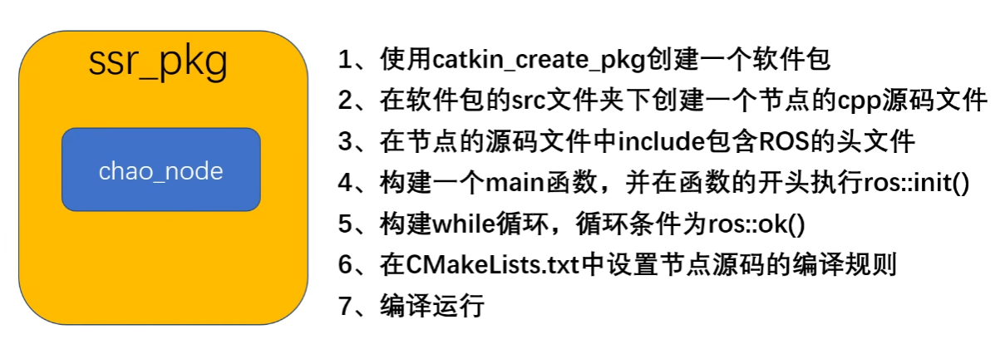

**Node节点不能脱离Package包而独立存在**
## 创建Package包

创建在~/catkin ws/src文件夹里
```
cd catkin_ws/src/
```

catkin_create_pkg *<包名>* **<依赖项列表>**
```
catkin_create_pkg ssr_pkg rospy roscpp std_msgs
```

## 回访依赖项

指令 `roscd` 在终端中进入指定软件包的文件地址，例
```
roscd roscpp
```

## 创建Node节点

这里用了一个超声波案例，在ssr_pkg功能包src下创建chao_node.cpp文件
```cpp
#include "ros/ros.h"

int main(int argc, char *argv[])
{
    //执行 ros 节点初始化
    ros::init(argc,argv,"chao_node");
    //创建 ros 节点句柄(非必须)
    ros::NodeHandle n;
    //控制台输出 hello world
    ROS_INFO("hello world!");
 
    return 0;
}
```

## 源码编译

在功能包中的CMakeLists.txt下复制
```cmake
# add_executable(${PROJECT_NAME}_node src/ssr_pkg_node.cpp)

# target_link_libraries(${PROJECT_NAME}_node
#   ${catkin_LIBRARIES}
# )
```
放到末尾修改为

```cmake
add_executable(chao_node src/chao_node.cpp)

target_link_libraries(chao_node
  ${catkin_LIBRARIES}
)
```

进行编译，在catkin_ws下进行`catkin_make`

## 运行Node节点

加载环境变量
```
source ~/catkin_ws/devel/setup.bash
```

```
rosrun ssr_pkg chao_node 
```

## 总结

