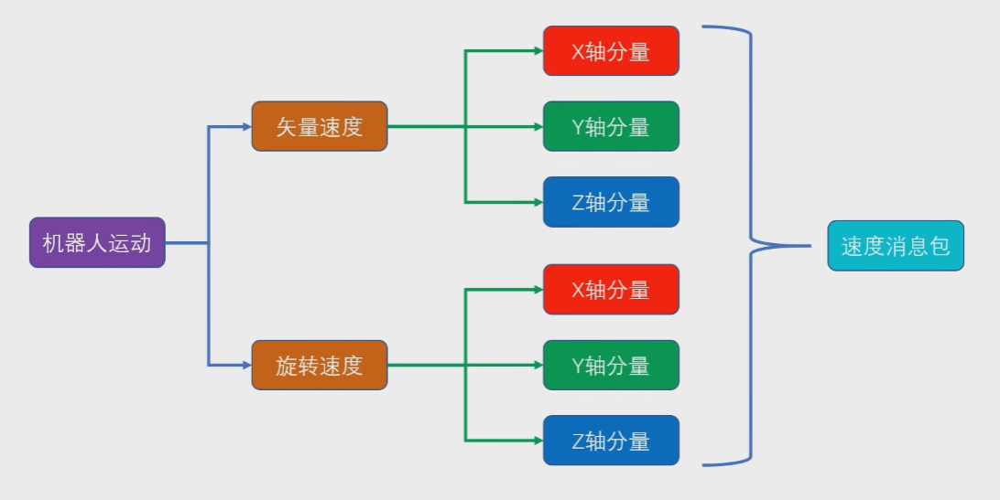

矢量运动+旋转路径

首先确定机器人的中心，建立*坐标系*x,y,z,那么任何方向的运动姿态可以看成矢量合成，再次建立*旋转坐标系*，滚转Roll，俯仰Pitch，偏航Yaw，这样机器人在三维空间的任何旋转可以看成三个轴的旋转运动的合成。

旋转单位：弧度/秒 



查看geoometry_msgs速度消息包，看到为浮点数float64，linear为矢量速度x，y，z；angular为旋转速度；

一般机器人的配套源码中通常有一个*核心节点*，核心节点既能够直接*驱动机器人的底层硬件*，同时向上还会*订阅一个速度话题*(/cmd_vel = command_velocity)，我们只需要编写一个新的节点，**向这个速度话题发送数据包**(消息类型：geometry_msgs/Twist)，就能实现对机器人的速度控制。

借助一个开源工程来完成机器人和环境的仿真(git clone https://github.com/6-robot/wpr_simulation.git)

这里之前下载过，只需要进入wpr_simulation文件夹打开终端 `git push` 更新到最新即可

启动仿真环境
```
roslaunch wpr_simulation wpb_simple.launch
```

运行节点
```
rosrun wpr_simulation demo_vel_ctrl
```

可以看到机器人向前移动

## 手动实现

实现思路

1. 构建一个新的软件包，包名叫做*vel_pkg*
2. 在软件包中新建一个节点，节点名叫做 *vel_node*
3. 在节点中，向ROS大管家NodeHandle申请发布话题 `/cmd_vel` 并拿到发布对象`vel_pub`
4. 构建一个`geometry_msgs/Twist`类型的消息包`vel_msg`，用来承载要发送的速度值
5. 开启一个while循环，不停的使用`vel_pub`对象发送速度消息包`vel_msg`

构建一个新的软件包，包名叫做 *vel_pkg*
```
catkin_create_pkg vel_pkg roscpp rospy geometry_msgs
```

在其src文件夹下创建节点*vel_node.cpp*

编写代码
```cpp
#include <ros/ros.h>
#include <geometry_msgs/Twist.h>

int main(int argc, char *argv[])
{
    ros::init(argc, argv, "vel_node");

    ros::NodeHandle n;
    ros::Publisher vel_pub = n.advertise<geometry_msgs::Twist>("/cmd_vel",10);

    geometry_msgs::Twist vel_msg;
    vel_msg.linear.x = 0.1;
    vel_msg.linear.y = 0;
    vel_msg.linear.z = 0;
    vel_msg.angular.x = 0;
    vel_msg.angular.y = 0;
    vel_msg.angular.z = 0;

    ros::Rate r(30);
    while (ros::ok())
    {
        vel_pub.publish(vel_msg);
        r.sleep();
    }
    return 0;
}
```

添加CMake，编译

启动roscore，执行
```
roslaunch wpr_simulation wpb_simple.launch 
```

```
rosrun vel_pkg vel_node
```

## Python实现

在vel_pkg功能包下创建scripts文件夹，创建节点*vel_py_node.py*

```python
#!/usr/bin/python3
# -*- coding: utf-8 -*-

import rospy
from geometry_msgs.msg import Twist

if __name__ == "__main__":
    rospy.init_node("vel_py_node")

    vel_pub = rospy.Publisher("cmd/vel", Twist, queue_size=10)

    vel_msg = Twist()
    vel_msg.linear.x = 0.1

    rate =rospy.Rate(30)
    while not rospy.is_shutdown():
        vel_pub.publish(vel_msg)
        rate.sleep()
```

添加执行权限
```
chmod +x vel_py_node.py
```

启动roscore，执行
```
roslaunch wpr_simulation wpb_simple.launch 
```

```
rosrun vel_pkg vel_py_node.py
```
