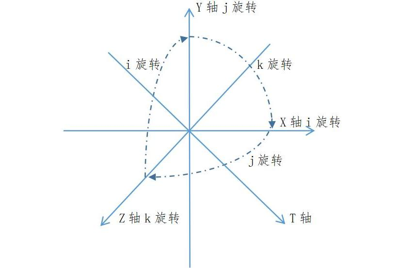
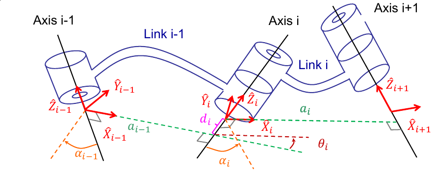
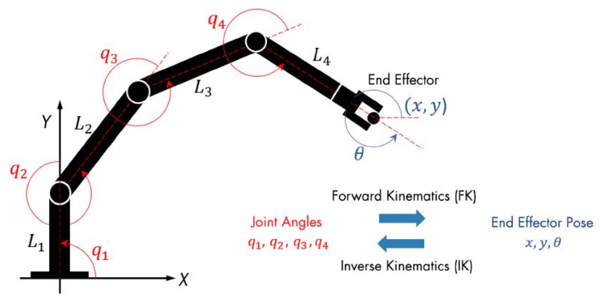
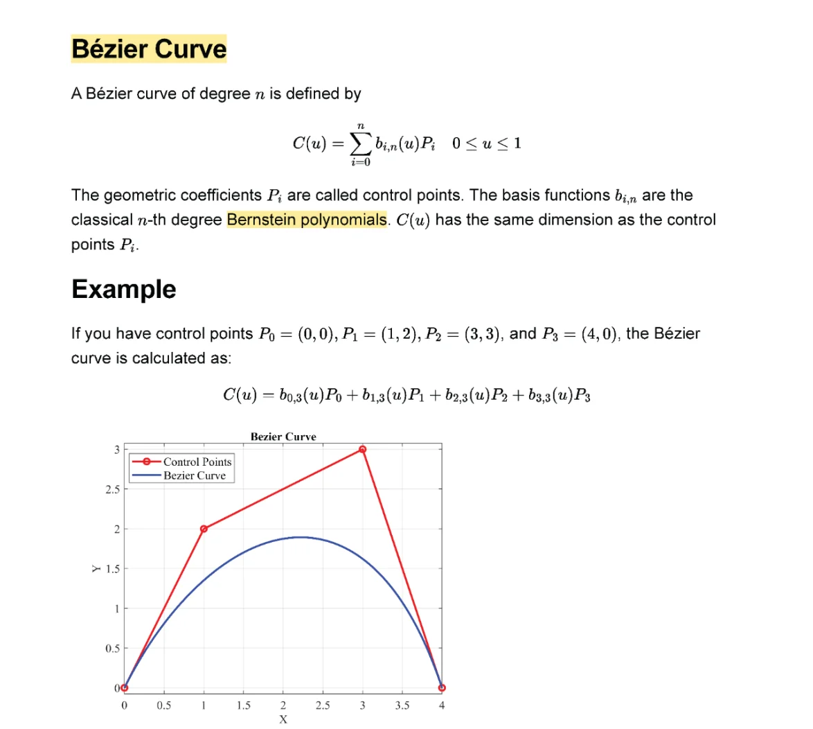

https://www.bilibili.com/video/BV1oa4y1v7TY/?spm_id_from=333.337.search-card.all.click&vd_source=5b692f8be609178b27207d56f3ad73b0

逆向运动学：解析法/数值法（牛顿-拉弗森）、奇异性分析、多解处理

空间变换是机器人学（位姿描述、DH法、运动学）、计算机图形学的基础，核心是通过矩阵运算描述刚体在三维空间中的平移、旋转、缩放及复合变换，同时包含**坐标系之间的齐次变换**（机器人学最常用）。 

两种坐标表示 空间点/刚体的位置有**直角坐标**（笛卡尔坐标）和**齐次坐标**两种表示，**齐次坐标是机器人学的标配**（可将平移+旋转融合为一个矩阵，避免分开计算）。 

1. **三维直角坐标**：点$P=(x,y,z)$，用**3×1列向量**表示：$P=\begin{bmatrix}x\\y\\z\end{bmatrix}$ 

2. **三维齐次坐标**：给直角坐标加1个维度，用**4×1列向量**表示：$P_h=\begin{bmatrix}x\\y\\z\\1\end{bmatrix}$ 
- 刚体的位姿（位置+姿态）：用**4×4齐次变换矩阵**表示（平移+旋转融合），是机器人DH法、位姿求解的核心。 

## 二维空间变换公式（基础） 

先掌握二维变换，三维变换是其直接延伸，二维齐次坐标为 **3×1**，变换矩阵为 **3×3**。 

1. <mark style="background: #ABF7F7A6;">二维平移变换</mark> 点 $P(x,y)$ 沿 $x$ 轴移 $t_x$，沿 $y$ 轴移 $t_y$，**齐次变换矩阵**： 

$$T_{trans}(t_x,t_y) = \begin{bmatrix}1 & 0 & t_x\\0 & 1 & t_y\\0 & 0 & 1\end{bmatrix}$$

变换后点：$P'_h = T_{trans} \cdot P_h$ 

2. <mark style="background: #ABF7F7A6;">二维旋转变换</mark> 点 $P(x,y)$ 绕**坐标原点**逆时针旋转 $\theta$ 角，**齐次变换矩阵**： 

$$T_{rot}(\theta) = \begin{bmatrix}\cos\theta & -\sin\theta & 0\\\sin\theta & \cos\theta & 0\\0 & 0 & 1\end{bmatrix}$$

**绕任意点 $P_0(x_0,y_0)$ 旋转**：先平移到原点→旋转→平移回原位置，复合变换

$T=T_{trans}(x_0,y_0) \cdot T_{rot}(\theta) \cdot T_{trans}(-x_0,-y_0)$ 

3. <mark style="background: #ABF7F7A6;">二维缩放变换</mark> 点 $P(x,y)$ 沿 $x$ 轴缩放 $s_x$，沿 $y$ 轴缩放 $s_y$，**齐次变换矩阵**： 

$$T_{scale}(s_x,s_y) = \begin{bmatrix}s_x & 0 & 0\\0 & s_y & 0\\0 & 0 & 1\end{bmatrix}$$ 
## 三维空间基础变换公式（核心常用） 

三维空间包含**平移、旋转、缩放**，其中**平移+旋转是机器人学核心**（缩放几乎不用），重点掌握**齐次变换矩阵**，所有变换均满足：**变换后齐次坐标 = 变换矩阵 × 原齐次坐标**（$P'_h = T \cdot P_h$）。 

1. 三维平移变换（纯位置变化，无姿态变化） 点 $P(x,y,z)$ 沿$x/y/z$ 轴分别平移 $t_x/t_y/t_z$，**4×4齐次平移矩阵**（机器人位姿的位置部分）： 
$$T_{trans}(t_x,t_y,t_z) = \begin{bmatrix}1 & 0 & 0 & t_x\\0 & 1 & 0 & t_y\\0 & 0 & 1 & t_z\\0 & 0 & 0 & 1\end{bmatrix}$$ 
**物理意义**：机器人末端执行器从一个位置平移到另一个位置，无旋转时的位姿变换。

2. 三维旋转变换（纯姿态变化，无位置变化） 绕**坐标轴**的旋转是基础（绕任意轴旋转可由其组合而来），旋转矩阵为 **3×3**（姿态矩阵），扩展为 **4×4齐次旋转矩阵**时，右下角补 $[0,0,0,1]$ 即可。 

（1）绕 **x轴** 旋转 $\alpha$角（横滚角Roll） **3×3旋转矩阵 $R_x(\alpha)$**（机器人DH法的扭角旋转）： 
$$R_x(\alpha) = \begin{bmatrix}1 & 0 & 0\\0 & \cos\alpha & -\sin\alpha\\0 & \sin\alpha & \cos\alpha\end{bmatrix}$$ 
**4×4 齐次旋转矩阵 $T_x(\alpha)$**： 
$$T_x(\alpha) = \begin{bmatrix}1 & 0 & 0 & 0\\0 & \cos\alpha & -\sin\alpha & 0\\0 & \sin\alpha & \cos\alpha & 0\\0 & 0 & 0 & 1\end{bmatrix}$$

（2）绕 **y轴** 旋转 $\beta$角（俯仰角Pitch） **3×3旋转矩阵 $R_y(\beta)$**： 
$$R_y(\beta) = \begin{bmatrix}\cos\beta & 0 & \sin\beta\\0 & 1 & 0\\-\sin\beta & 0 & \cos\beta\end{bmatrix}$$ 
**4×4齐次旋转矩阵 $T_y(\beta)$**： 
$$T_y(\beta) = \begin{bmatrix}\cos\beta & 0 & \sin\beta & 0\\0 & 1 & 0 & 0\\-\sin\beta & 0 & \cos\beta & 0\\0 & 0 & 0 & 1\end{bmatrix}$$ 
⚠️ 绕 **y轴** 旋转的矩阵**有一个负号**，是右手坐标系的固有属性，机器人学中极易出错，需牢记！

（3）绕 **z轴** 旋转 $\theta$角（偏航角Yaw，机器人DH法的关节角旋转） **3×3旋转矩阵 $R_z(\theta)$**： 
$$R_z(\theta) = \begin{bmatrix}\cos\theta & -\sin\theta & 0\\\sin\theta & \cos\theta & 0\\0 & 0 & 1\end{bmatrix}$$ 
**4×4齐次旋转矩阵 $T_z(\theta)$**： $$T_z(\theta) = \begin{bmatrix}\cos\theta & -\sin\theta & 0 & 0\\\sin\theta & \cos\theta & 0 & 0\\0 & 0 & 1 & 0\\0 & 0 & 0 & 1\end{bmatrix}$$
（4）绕 **任意轴** 旋转（<mark style="background: #ADCCFFA6;">工程拓展</mark>） 绕空间任意轴$\vec{n}=(n_x,n_y,n_z)$（单位向量）旋转 $\phi$角，用**罗德里格斯（Rodrigues）旋转公式**（机器人姿态插值、轨迹规划常用）： 

$$R(\vec{n},\phi) = \cos\phi \cdot I + (1-\cos\phi) \cdot \vec{n}\vec{n}^T + \sin\phi \cdot \hat{n}$$ 
其中：$I$ 为 3×3单位 矩阵，$\hat{n}=\begin{bmatrix}0 & -n_z & n_y\\n_z & 0 & -n_x\\-n_y & n_x & 0\end{bmatrix}$（$\vec{n}$的反对称矩阵）。 

3. 三维缩放变换（工程极少用，仅作补充） 沿 $x/y/z$轴 缩放$s_x/s_y/s_z$，**4×4齐次缩放矩阵**： $$T_{scale}(s_x,s_y,s_z) = \begin{bmatrix}s_x & 0 & 0 & 0\\0 & s_y & 0 & 0\\0 & 0 & s_z & 0\\0 & 0 & 0 & 1\end{bmatrix}$$ 
## 三维空间复合变换公式（平移+旋转融合） 

1. 复合变换的核心规则 
- **矩阵乘法顺序**：**先旋转，后平移**（机器人学固定顺序，与变换的物理过程一致），且**从右到左**执行（矩阵乘法不满足交换律，顺序错则结果完全错误）。 

- 例：先绕z轴旋转$\theta$，再沿x轴平移$a$，沿z轴平移$d$，复合变换矩阵为： 

$$T = T_{trans}(a,0,d) \cdot T_z(\theta) \quad (\text{先执行右侧的}T_z(\theta)，再执行左侧的T_{trans})$$ 
- 多个变换：如旋转1 → 旋转2 → 平移1 → 平移2，复合矩阵$T=T_{平移2} \cdot T_{平移1} \cdot T_{旋转2} \cdot T_{旋转1}$。

2. 机器人 **DH法** 专属复合变换（最常用实操公式） DH法中相邻坐标系 ${i-1}→{i}$ 的变换，是 
- 绕 <mark style="background: #BBFABBA6;">z轴</mark> 转 $θ_i$ 
- 沿 <mark style="background: #BBFABBA6;">z轴</mark> 移 $d_i$ 
- 沿 <mark style="background: #BBFABBA6;">x轴</mark> 移 $a_i$ 
- 绕 <mark style="background: #BBFABBA6;">x轴</mark> 转 $α_i$ 的复合
- 最终的**DH变换矩阵 $A_i$**（4×4）是机器人运动学的核心公式，直接套用： 

$$A_i = T_z(\theta_i) \cdot T_{trans}(0,0,d_i) \cdot T_{trans}(a_i,0,0) \cdot T_x(\alpha_i) = \begin{bmatrix}\cos\theta_i & -\sin\theta_i\cos\alpha_i & \sin\theta_i\sin\alpha_i & a_i\cos\theta_i\\\sin\theta_i & \cos\theta_i\cos\alpha_i & -\cos\theta_i\sin\alpha_i & a_i\sin\theta_i\\0 & \sin\alpha_i & \cos\alpha_i & d_i\\0 & 0 & 0 & 1\end{bmatrix}$$ 
**总变换**：基座坐标系 ${0}$ → 末端坐标系 ${n}$ 的位姿变换$T_{0n}=A_1 \cdot A_2 \cdot ... \cdot A_n$（按关节顺序连乘）。 

## 坐标系之间的位姿变换公式（机器人位姿求解核心） 

机器人学中常需要**将点/刚体的位姿从一个坐标系转换到另一个坐标系**（如从末端坐标系转换到基座坐标系，或反之），核心是**齐次变换矩阵的正用与逆用**。

1. 从子坐标系 ${B}$ 到基坐标系 ${A}$ 的变换（正变换） 设： 

- 坐标系 ${B}$ 在坐标系 ${A}$ 中的**位姿变换矩阵**为 $T_{AB}$（4×4，描述 ${B}$ 相对于 ${A}$ 的位置 + 姿态）； 
- 点 $P$ 在 ${B}$ 中的齐次坐标为$P_B$，在 ${A}$ 中的齐次坐标为$P_A$。 则**变换公式**：$\boldsymbol{P_A = T_{AB} \cdot P_B}$ 
- **物理意义**：机械臂末端的点在末端坐标系中的坐标，转换为基座坐标系中的坐标（运动学正解）。 

1. 从基坐标系 ${A}$ 到子坐标系 ${B}$ 的变换（逆变换） 求 $T_{AB}$ 的**逆矩阵 $T_{AB}^{-1}$**，则**变换公式**：$\boldsymbol{P_B = T_{AB}^{-1} \cdot P_A}$ 
2. **齐次变换矩阵的逆矩阵快速求解**（无需通用矩阵求逆，机器人学专属技巧）： 设 $T_{AB} = \begin{bmatrix}R & \vec{t}\\0 & 1\end{bmatrix}$（$R$ 为 3×3旋转矩阵，$\vec{t}$ 为3×1平移向量，0为`[0,0,0]`），则：

$$T_{AB}^{-1} = \begin{bmatrix}R^T & -R^T\vec{t}\\0 & 1\end{bmatrix}$$

其中 $R^T$ 是旋转矩阵的转置（旋转矩阵是**正交矩阵**，逆=转置，大幅简化计算）。 

3. 多坐标系之间的变换（链式法则） 坐标系 $C$ → ${B}$ 的变换为$T_{BC}$，${B}$ → ${A}$ 的变换为 $T_{AB}$，则 $C$→ ${A}$ 的变换：$\boldsymbol{T_{AC} = T_{AB} \cdot T_{BC}}$ 点 $P$ 在 $C$ 中坐标 $P_C$，在 ${A}$ 中坐标：$P_A = T_{AC} \cdot P_C = T_{AB} \cdot T_{BC} \cdot P_C$。 

## 刚体位姿的插值变换公式（机器人路径规划常用） 

机器人路径规划中，需要在两个位姿之间生成**平滑的插值轨迹**（如从位姿 $T_1$ 到 $T_2$），核心是**位置的线性插值 + 姿态的球面插值（SLERP）**，避免姿态突变。

1. 位置插值（线性插值，LERP） 设初始位置 $\vec{p}_1=(x_1,y_1,z_1)$，目标位置 $\vec{p}_2=(x_2,y_2,z_2)$，插值参数 $t∈[0,1]$，则任意时刻位置： $$\vec{p}(t) = (1-t)\vec{p}_1 + t\vec{p}_2$$
2. 姿态插值（球面插值，SLERP，避免万向锁） 设初始旋转矩阵$R_1$，目标旋转矩阵$R_2$，插值参数$t∈[0,1]$，先将旋转矩阵转化为**四元数**$q_1,q_2$（四元数是机器人姿态插值的标配，无万向锁），则： $$q(t) = q_1 \cdot (q_1^{-1} \cdot q_2)^t$$ 
再将插值后的四元数$q(t)$转化为旋转矩阵$R(t)$，得到任意时刻的姿态。 ### 3. 位姿复合插值 将位置插值和姿态插值融合为齐次变换矩阵，任意时刻位姿： $$T(t) = \begin{bmatrix}R(t) & \vec{p}(t)\\0 & 1\end{bmatrix}$$ **物理意义**：机械臂末端从初始位姿到目标位姿的平滑轨迹，无位置/姿态突变，是路径规划的基础。 
## 关键补充：旋转矩阵的性质

3×3旋转矩阵$R$是描述刚体姿态的核心，满足3个关键性质，工程中用于**验证矩阵是否为合法旋转矩阵**： 

1. **正交性**：$R^T \cdot R = I$，$R^{-1} = R^T$（逆=转置，大幅简化计算）； 
2. **行列式为1**：$\det(R)=1$（若行列式=-1，为镜像变换，非刚体旋转）； 
3. **保长度/保夹角**：旋转后点的距离、向量的夹角不变（刚体运动的本质）。 

## 公式速查表

| 变换类型                | 适用场景          | 核心公式（4×4 齐次矩阵）                                                                                                    |
| ------------------- | ------------- | ----------------------------------------------------------------------------------------------------------------- |
| 绕 $z$ 轴旋转 $θ$       | DH 法关节角旋转     | $T_z(\theta)=\begin{bmatrix}\cos\theta&-\sin\theta&0&0\\\sin\theta&\cos\theta&0&0\\0&0&1&0\\0&0&0&1\end{bmatrix}$ |
| 绕 $x$ 轴旋转 $α$       | DH 法连杆扭角旋转    | $T_x(\alpha)=\begin{bmatrix}1&0&0&0\\0&\cos\alpha&-\sin\alpha&0\\0&\sin\alpha&\cos\alpha&0\\0&0&0&1\end{bmatrix}$ |
| 沿 $x$ 移 $a、z$ 移 $d$ | DH 法连杆偏距 / 长度 | $T_{trans}(a,0,d)=\begin{bmatrix}1&0&0&a\\0&1&0&0\\0&0&1&d\\0&0&0&1\end{bmatrix}$                                 |
| DH 变换矩阵 $A_i$       | 相邻坐标系变换       | $A_i=T_z(θ_i)T_{trans}(0,0,d_i)T_{trans}(a,0,0)T_x(α_i)$                                                          |
| 坐标变换（B→A）           | 位姿求解          | $T_{AB}^{-1}=\begin{bmatrix}R^T&-R^T\vec{t}\\0&1\end{bmatrix}$                                                    |
| 位姿插值                | 路径规划          | $T(t)=\begin{bmatrix}R(t)&(1-t)\vec{p}_1+t\vec{p}_2\\0&1\end{bmatrix}$                                            |

## 四元数

四元数是**三维空间旋转的“紧凑编码”**，将**旋转轴**$\vec{n}=(n_x,n_y,n_z)$ 和**旋转角度** $\theta$ 融合为4个实数，通过一套极简的运算实现旋转的**表示、叠加、插值**，其核心作用是**替代欧拉角和旋转矩阵，高效、无歧义地处理三维刚体的姿态变换**。 

$$q=w+xi+yj+zk$$

完美解决了欧拉角**万向锁**、旋转矩阵**维度高、计算繁**的问题

> [!tip] 先解决核心痛点：为什么不用欧拉角/旋转矩阵？ 

| 方法场景                                             | 形式             | 核心缺点                                             |
| ------------------------------------------------ | -------------- | ------------------------------------------------ |
| **欧拉角**（Roll/Pitch/Yaw）：人机交互、参数整定（仅显示，不用于计算）     | 3 个角度（α,β,γ）   | **万向锁**（旋转到某一角度丢失 1 个自由度，导致无法旋转）；旋转叠加顺序敏感，计算易出错  |
| **旋转矩阵**：坐标系变换、DH 法（位姿矩阵融合）                      | 3×3 矩阵（9 个实数）  | 维度高、计算量大（矩阵乘法）；冗余存储（9 个数仅 3 个独立）；需验证正交性（避免非刚体旋转） |
| **四元数**：姿态估计（IMU 解算）、轨迹插值（MPC/WBC）、旋转叠加（多关节姿态融合） | 4 个实数（w,x,y,z） | 不直观，需简单转换                                        |

<mark style="background: #ABF7F7A6;">代数形式</mark>（通用计算）四元数 $q$ 由**1个实部** $w$ 和**3个虚部** $x,y,z$ 组成，记为： 
$$\boldsymbol{q = w + xi + yj + zk}$$

也可表示为 <mark style="background: #ABF7F7A6;">向量形式</mark>（工程代码中常用，如C++/Python的数组）：

$$\boldsymbol{q = [w, x, y, z]^T} \quad \text{或} \quad q = [x, y, z, w]^T$$ 
> 注：工程中两种向量顺序均有使用，**核心是统一顺序**（如IMU解算用$[w,x,y,z]$，ROS中用$[x,y,z,w]$），避免转换错误。 

<mark style="background: #ABF7F7A6;">轴角形式</mark>（物理意义，机器人核心） 这是四元数**最核心的工程形式**，直接对应**三维旋转的本质**：绕**单位旋转轴**$\vec{n}=(n_x,n_y,n_z)$**（模长=1）旋转 $\theta$ 角**，此时四元数的4个参数为： 

$$\boldsymbol{w = \cos\frac{\theta}{2}, \quad x = n_x\sin\frac{\theta}{2}, \quad y = n_y\sin\frac{\theta}{2}, \quad z = n_z\sin\frac{\theta}{2}}$$

**物理意义**：四元数的4个参数直接由旋转轴和旋转角推导，无任何冗余，这是其无万向锁的根本原因。 

<mark style="background: #ABF7F7A6;">单位四元数</mark>

（1）模长计算公式 对于四元数 $q=[w,x,y,z]$，模长 $||q||$ 为： $$||q|| = \sqrt{w^2 + x^2 + y^2 + z^2}$$
（2）归一化方法 若四元数模长≠1，需除以模长得到单位四元数$q_{norm}$： $$q_{norm} = \frac{q}{||q||} = \left[ \frac{w}{||q||}, \frac{x}{||q||}, \frac{y}{||q||}, \frac{z}{||q||} \right]$$ 
**工程场景**：IMU解算、姿态插值后必须做归一化（浮点运算会引入误差，导致模长偏离1）。 

<mark style="background: #ABF7F7A6;">两个特殊四元数（工程常用）</mark>

- **单位元四元数**：$q=[1,0,0,0]$，对应**无旋转**（旋转角$\theta=0°$，$\sin0=0$，$\cos0=1$）； 
- **共轭四元数**：对于$q=[w,x,y,z]$，共轭$q^*=[w,-x,-y,-z]$，用于**旋转逆操作**（绕原轴旋转$-θ$角）。 

<mark style="background: #ABF7F7A6;">四元数的核心工程操作（直接套用，无需推导） </mark>

机器人学中四元数的核心操作只有**4个**：**轴角↔四元数转换**、**四元数↔旋转矩阵转换**、**四元数乘法（旋转叠加）**、**四元数球面插值（SLERP）**，所有操作均有**现成公式**，直接套用即可。 

操作1：轴角 ↔ 四元数（核心转换，物理意义） 机器人中旋转的原始描述多为**轴角**（如“绕z轴转90°”），需转换为四元数计算，反之亦然。 

 （1）轴角→四元数（直接用轴角形式公式） 已知旋转轴$\vec{n}=(n_x,n_y,n_z)$（单位向量）、旋转角$\theta$，则四元数： 
 $$w=\cos\frac{\theta}{2}, \ x=n_x\sin\frac{\theta}{2}, \ y=n_y\sin\frac{\theta}{2}, \ z=n_z\sin\frac{\theta}{2}$$
 
 **例**：绕 z轴 旋转90°，$\vec{n}=(0,0,1)$，$\theta=90°$，则$w=\cos45°=\frac{\sqrt{2}}{2}$，$x=y=0$，$z=\sin45°=\frac{\sqrt{2}}{2}$，四元数$q=[\frac{\sqrt{2}}{2},0,0,\frac{\sqrt{2}}{2}]$。 
 
（2）四元数→轴角（反推物理意义） 已知单位四元数$q=[w,x,y,z]$，反推旋转轴 $\vec{n}$ 和旋转角 $\theta$： 

$$\theta = 2\arccos(w), \quad n_x=\frac{x}{\sin\frac{\theta}{2}}, \quad n_y=\frac{y}{\sin\frac{\theta}{2}}, \quad n_z=\frac{z}{\sin\frac{\theta}{2}}$$ 
> 注：若$\theta=0°$（$w=1$），$\sin\frac{\theta}{2}=0$，此时旋转轴无意义（无旋转）。 

 操作2：四元数 ↔ 旋转矩阵（机器人位姿融合） 机器人学中**位姿矩阵**（4×4）由**旋转矩阵**（3×3）和**平移向量**（3×1）组成，四元数需转换为旋转矩阵才能融入位姿矩阵，这是DH法、坐标系变换的必备步骤。 
 
 （1）<mark style="background: #ABF7F7A6;">四元数→旋转矩阵</mark>（核心公式，必须熟记） 已知单位四元数$q=[w,x,y,z]$，对应的3×3旋转矩阵 $R(q)$ 为：

$$ R(q) = \begin{bmatrix} 1-2y^2-2z^2 & 2xy-2zw & 2xz+2yw \\ 2xy+2zw & 1-2x^2-2z^2 & 2yz-2xw \\ 2xz-2yw & 2yz+2xw & 1-2x^2-2y^2 \end{bmatrix} $$

**工程技巧**：此公式为固定模板，代码中直接按元素赋值即可，无需推导。 
 
（2）<mark style="background: #ABF7F7A6;">旋转矩阵→四元数</mark>（解算用） 已知3×3旋转矩阵$R$（正交、行列式=1），转换为单位四元数$q=[w,x,y,z]$，取**模长最大的分量**计算（避免数值误差）：
 
$$ \begin{cases} w = \frac{1}{2}\sqrt{1+R_{11}+R_{22}+R_{33}} \\ x = \frac{R_{32}-R_{23}}{4w} \\ y = \frac{R_{13}-R_{31}}{4w} \\ z = \frac{R_{21}-R_{12}}{4w} \end{cases} $$ 
 注：若$w=0$（旋转角180°），换用$x/y/z$的计算公式，工程代码中会做分支判断。 
 
 操作3：四元数乘法（旋转叠加，机器人多关节姿态融合） 四元数的**乘法**对应**三维旋转的叠加**，这是四元数最核心的运算之一，用于**多关节机器人的姿态融合**（如机械臂各关节旋转叠加为末端姿态）、**连续旋转的复合**。 
 
（1）乘法定义 设两个单位四元数$q_1=[w_1,x_1,y_1,z_1]$（旋转1：轴$\vec{n_1}$，角$\theta_1$）、$q_2=[w_2,x_2,y_2,z_2]$（旋转2：轴$\vec{n_2}$，角$\theta_2$），则两者的乘积$q=q_2 \otimes q_1$（**先执行$q_1$，再执行$q_2$**）为：
  $$ \begin{cases} w = w_1w_2 - x_1x_2 - y_1y_2 - z_1z_2 \\ x = w_1x_2 + x_1w_2 + y_1z_2 - z_1y_2 \\ y = w_1y_2 - x_1z_2 + y_1w_2 + z_1x_2 \\ z = w_1z_2 + x_1y_2 - y_1x_2 + z_1w_2 \end{cases} $$
  
（2）工程关键规则 - **顺序敏感**：四元数乘法**不满足交换律**（$q_2 \otimes q_1 \neq q_1 \otimes q_2$），对应旋转的**先后顺序**（先转$q_1$再转$q_2$，与矩阵乘法顺序一致）； 
   
- **结果归一化**：乘积后的四元数需重新归一化（浮点运算误差），保证是单位四元数； 
- **旋转逆操作**：若要抵消旋转$q$，乘以其共轭$q^*$即可（$q \otimes q^* = [1,0,0,0]$，无旋转）。
   
 （3）工程示例 机器人先绕x轴转30°（$q_1$），再绕z轴转90°（$q_2$），则末端总旋转为 $q=q_2 \otimes q_1$，直接计算乘积即可，无万向锁、无矩阵乘法的繁琐。 
 
操作4：四元数球面插值（SLERP，机器人轨迹规划核心） 机器人路径规划中，需要在**两个姿态之间生成平滑的插值轨迹**（如从姿态$q_1$到$q_2$），四元数的**球面插值**（SLERP）是最优方法，**无万向锁、插值平滑**，替代欧拉角的线性插值（会出现速度突变）。 

（1）<mark style="background: #ABF7F7A6;">插值公式</mark> 已知初始单位四元数$q_1$、目标单位四元数$q_2$，插值参数$t∈[0,1]$（$t=0$为$q_1$，$t=1$为$q_2$），则任意时刻的四元数$q(t)$为： 

$$q(t) = q_1 \otimes \left( q_1^* \otimes q_2 \right)^t$$

**工程简化公式**（直接计算）： 设四元数夹角$\phi = \arccos(q_1^* \cdot q_2)$（点积），则：

$$q(t) = \frac{\sin(1-t)\phi}{\sin\phi} q_1 + \frac{\sin t\phi}{\sin\phi} q_2$$ 
（2）核心优势 
- **球面插值**：四元数在**四维单位球面**上插值，对应三维旋转的**匀速旋转**，轨迹平滑； 
- **无万向锁**：全程无自由度丢失，任意姿态均可插值； 
- **速度均匀**：插值参数$t$与旋转角度成正比，适合机器人速度规划（MPC/WBC）。 

（3）工程步骤 
 1. 归一化$q_1$、$q_2$（确保单位）； 
 2. 计算点积，若点积为负，取$q_2=-q_2$（保证插值路径最短）； 
 3. 代入简化公式计算$q(t)$； 
 4. 对$q(t)$归一化，得到最终姿态。 

## 四元数常用转换速查表

| 转换类型     | 已知条件                                          | 计算公式                                                                                                   |
| -------- | --------------------------------------------- | ------------------------------------------------------------------------------------------------------ |
| 轴角→四元数   | 旋转轴 $\vec{n}=(n_x,n_y,n_z)$，角$\theta$         | $w=\cos\frac{\theta}{2},x=n_x\sin\frac{\theta}{2},y=n_y\sin\frac{\theta}{2},z=n_z\sin\frac{\theta}{2}$ |
| 四元数→轴角   | 单位四元数$[w,x,y,z]$                              | $\theta=2\arccos(w),n_x=x/\sin\frac{\theta}{2},n_y=y/\sin\frac{\theta}{2},n_z=z/\sin\frac{\theta}{2}$  |
| 四元数→旋转矩阵 | 单位四元数$[w,x,y,z]$                              | 见操作2的固定3×3矩阵公式                                                                                         |
| 四元数乘法    | $q_1=[w_1,x_1,y_1,z_1],q_2=[w_2,x_2,y_2,z_2]$ | 见操作3的4个分量计算公式                                                                                          |
| SLERP插值  | $q_1,q_2,t∈[0,1]$                             | $q(t)=\frac{\sin(1-t)\phi}{\sin\phi}q_1+\frac{\sin t\phi}{\sin\phi}q_2$（$\phi=\arccos(q_1^*·q_2)$）     |

## DH参数法

一、核心建系规则

对相邻坐标系 $\{i-1\}$（连杆$L_{i-1}$）和 $\{i\}$（连杆$L_i$），**$z_i$ 轴为关节 $J_i$ 运动轴线**，四步建系： 
1. $z_i$：沿 $J_i$ 轴线（旋转/移动轴），方向任意； 
2. $x_i$：沿 $z_{i-1}$ 与 $z_i$ 的**公垂线**，指向 $z_{i-1}$ 轴； 
3. $O_i$：$x_i$ 与 $z_i$ 的交点（坐标系 $\{i\}$ 原点）； 
4. $y_i$：右手定则，$y_i = z_i \times x_i$（叉乘）。 

**基座$\{0\}$**：$z_0$与$J_1$轴线重合，$x_0$水平向前；**末端$\{n\}$**：$z_n$与$J_n$轴线重合，$x_n$沿执行器抓取方向。 

二、4个DH参数定义（旋转/移动关节通用） 

参数对应 $\{i-1\}→\{i\}$ 的关系，**2个连杆参数（固定）+ 2个关节参数（1变1定）**，单位：角度（弧度）、长度（米）。 

|参数符号|名称|类型|物理意义/测量方式|旋转关节（R）|移动关节（P）|
| ---- | ---- | ---- | ---- | ---- | ---- |
|$\alpha_{i-1}$|连杆扭角|**连杆参数（固定）**|绕$x_{i-1}$轴，$z_{i-1}→z_i$的旋转角（右手定则）|固定值|固定值|
|$a_{i-1}$|连杆长度|**连杆参数（固定）**|沿$x_{i-1}$轴，$z_{i-1}→z_i$的公垂线长度|固定值|固定值|
|$d_i$|连杆偏距|关节参数|沿$z_i$轴，$x_{i-1}→x_i$的平移距离|**固定值**|**变量（随关节移动）**|
|$\theta_i$|关节角|关节参数|绕$z_i$轴，$x_{i-1}→x_i$的旋转角（右手定则）|**变量（随关节旋转）**|**固定值**|

**核心**：连杆参数$\boldsymbol{(\alpha_{i-1},a_{i-1})}$永远固定，关节参数仅**1个变量**，另一个固定。

三、核心变换矩阵（唯一公式，直接代入）

1. 单连杆 DH 变换矩阵$A_i$（${i−1}→{i}$）

$A_i$ ​为 4×4 齐次变换矩阵，**所有机械臂通用**，是 DH 法的核心公式，直接代入 DH 参数即可：

$$ \boldsymbol{A_i} = \begin{bmatrix} \cos\theta_i & -\sin\theta_i\cos\alpha_{i-1} & \sin\theta_i\sin\alpha_{i-1} & a_{i-1}\cos\theta_i \\ \sin\theta_i & \cos\theta_i\cos\alpha_{i-1} & -\cos\theta_i\sin\alpha_{i-1} & a_{i-1}\sin\theta_i \\ 0 & \sin\alpha_{i-1} & \cos\alpha_{i-1} & d_i \\ 0 & 0 & 0 & 1 \end{bmatrix} $$

**物理意义**：若点$P$在 $\{i\}$ 中齐次坐标为 $P_i$，则在$\{i-1\}$中为$\boldsymbol{P_{i-1}=A_i·P_i}$（矩阵乘法）。 

2. $A_i$推导的4步基础变换（验证/理解用） $A_i$由4次基础齐次变换**从右到左**连乘而来，顺序不可变： 

$$A_i = \text{Rot}(z,\theta_i)·\text{Trans}(z,d_i)·\text{Trans}(x,a_{i-1})·\text{Rot}(x,\alpha_{i-1})$$

其中： 
- 绕x轴旋转：$\text{Rot}(x,\alpha)=\begin{bmatrix}1&0&0&0\\0&\cos\alpha&-\sin\alpha&0\\0&\sin\alpha&\cos\alpha&0\\0&0&0&1\end{bmatrix}$ 
- 绕z轴旋转：$\text{Rot}(z,\theta)=\begin{bmatrix}\cos\theta&-\sin\theta&0&0\\\sin\theta&\cos\theta&0&0\\0&0&1&0\\0&0&0&1\end{bmatrix}$ 
- 沿x轴平移：$\text{Trans}(x,a)=\begin{bmatrix}1&0&0&a\\0&1&0&0\\0&0&1&0\\0&0&0&1\end{bmatrix}$ 
- 沿z轴平移：$\text{Trans}(z,d)=\begin{bmatrix}1&0&0&0\\0&1&0&0\\0&0&1&d\\0&0&0&1\end{bmatrix}$ 

## 机器人正运动学（DH法标配，实操直接套用）

 一、核心符号与定义（速查对照）

|符号|含义|单位/形式|
| ---- | ---- | ---- |
|$\boldsymbol{q=[q_1,q_2,...,q_n]^T}$|关节变量向量|旋转关节：$\theta_i$（弧度）；移动关节：$d_i$（米）|
|$\{0\}$~$\{n\}$|基座坐标系~末端执行器坐标系|右手笛卡尔坐标系|
|$\boldsymbol{A_i}$|单连杆DH变换矩阵|4×4齐次矩阵（$\{i-1\}→\{i\}$）|
|$\boldsymbol{T_{0n}}$|总位姿变换矩阵|4×4齐次矩阵（$\{0\}→\{n\}$，正运动学最终解）|
|$\boldsymbol{R_{0n}}$|末端姿态旋转矩阵|3×3正交矩阵（从$T_{0n}$提取）|
|$\boldsymbol{p_{0n}=[x,y,z]^T}$|末端位置向量|三维坐标（米，从$T_{0n}$提取）|
|$n$|机器人关节数|正整数（2/4/6等）|

**核心关系**：**关节变量→$A_i$→$T_{0n}$→位置+姿态**，正运动学为**唯一映射**。

二、基础核心公式（必记，所有场景通用）

1. 单连杆DH变换矩阵$\boldsymbol{A_i}$（通用唯一公式）

描述相邻坐标系 $\{i-1\}$ 到 $\{i\}$ 的位姿变换，直接代入DH参数即可，**旋转/移动关节通用**：

$$
\boldsymbol{A_i} = \begin{bmatrix}
\cos\theta_i & -\sin\theta_i\cos\alpha_{i-1} & \sin\theta_i\sin\alpha_{i-1} & a_{i-1}\cos\theta_i \\
\sin\theta_i & \cos\theta_i\cos\alpha_{i-1} & -\cos\theta_i\sin\alpha_{i-1} & a_{i-1}\sin\theta_i \\
0 & \sin\alpha_{i-1} & \cos\alpha_{i-1} & d_i \\
0 & 0 & 0 & 1
\end{bmatrix}
$$

**参数说明**：
- $\alpha_{i-1}$：连杆扭角（固定，绕$x_{i-1}$轴，$z_{i-1}→z_i$）；
- $a_{i-1}$：连杆长度（固定，沿$x_{i-1}$轴，$z_{i-1}→z_i$公垂线长度）；
- $d_i$：连杆偏距（旋转关节固定，移动关节为变量）；
- $\theta_i$：关节角（旋转关节为变量，移动关节固定）。

2. 总位姿变换矩阵（正运动学核心求解公式）

n轴机械臂，基座到末端的总变换为**单步矩阵按关节顺序连乘**，**顺序不可颠倒**：

$$
\boldsymbol{T_{0n} = A_1 \cdot A_2 \cdot A_3 \cdot ... \cdot A_n}
$$

**关键规则**：矩阵乘法满足结合律，不满足交换律，分步连乘更易计算（$T_{02}=A_1A_2$→$T_{03}=T_{02}A_3$→...→$T_{0n}$）。

3. 总位姿矩阵标准形式（结果提取基础）

$T_{0n}$为4×4齐次矩阵，融合**姿态旋转矩阵**和**位置向量**，形式固定：

$$
\boldsymbol{T_{0n}} = \begin{bmatrix}
\boldsymbol{R_{0n}} & \boldsymbol{p_{0n}} \\
0 & 1
\end{bmatrix} = \begin{bmatrix}
r_{11} & r_{12} & r_{13} & x \\
r_{21} & r_{22} & r_{23} & y \\
r_{31} & r_{32} & r_{33} & z \\
0 & 0 & 0 & 1
\end{bmatrix}
$$

三、结果提取公式（直接从$T_{0n}$拿答案）

无需额外计算，从总位姿矩阵中**直接提取**末端**位置**和**姿态**，是工程实操最终目标。

1. 末端位置（三维坐标）

前3行第4列的数值，直接取：

$$
\boldsymbol{x = T_{0n}(1,4),\quad y = T_{0n}(2,4),\quad z = T_{0n}(3,4)}
$$

位置向量：$\boldsymbol{p_{0n} = \begin{bmatrix}x\\y\\z\end{bmatrix}}$。

2. 末端姿态（旋转矩阵）

前3行前3列的3×3子矩阵，直接取：

$$
\boldsymbol{R_{0n}} = \begin{bmatrix}
T_{0n}(1,1) & T_{0n}(1,2) & T_{0n}(1,3) \\
T_{0n}(2,1) & T_{0n}(2,2) & T_{0n}(2,3) \\
T_{0n}(3,1) & T_{0n}(3,2) & T_{0n}(3,3)
\end{bmatrix}
$$

**姿态转换**（按需使用）：
- 旋转矩阵→欧拉角（Roll/Pitch/Yaw）：工程显示用，注意万向锁；
- 旋转矩阵→四元数：控制/插值用，无万向锁，公式参考四元数速查。

四、标准化求解流程公式（6步通解，附公式衔接）

已知**机械结构DH参数**、**关节变量 $q_i$**，求解**末端位姿**，流程与公式一一对应，直接套用：

1. **建系**：按DH规则建立$\{0\}$~$\{n\}$（无公式，规则约束）；
2. **参数表**：整理$\alpha_{i-1},a_{i-1},d_i,\theta_i$（无公式，测量/提取）；
3. **算$A_i$**：代入**单连杆DH变换矩阵公式**计算$A_1~A_n$；
4. **算$T_{0n}$**：代入**总位姿变换矩阵公式**连乘；
5. **代变量**：将关节变量$q_i$（$\theta_i/d_i$）代入$T_{0n}$，消去符号得数值矩阵；
6. **提结果**：代入**位置/姿态提取公式**，得到$x,y,z$和$R_{0n}$。

五、常用简化公式（工程高频场景，减少计算量）

机械臂DH参数常为$0°/90°/180°$，代入三角函数值（$\cos0=1,\sin0=0;\cos90=0,\sin90=1;\cos180=-1,\sin180=0$），可快速简化$A_i$，以下为**最常用3种场景**：

场景1：$\alpha_{i-1}=0°$（$z_{i-1}∥z_i$，平面机械臂/多轴平行关节）
$$
A_i = \begin{bmatrix}
\cos\theta_i & -\sin\theta_i & 0 & a_{i-1}\cos\theta_i \\
\sin\theta_i & \cos\theta_i & 0 & a_{i-1}\sin\theta_i \\
0 & 0 & 1 & d_i \\
0 & 0 & 0 & 1
\end{bmatrix}
$$

场景2：$\alpha_{i-1}=90°$，$a_{i-1}=0$（垂直关节，无连杆长度，6轴工业臂高频）
$$
A_i = \begin{bmatrix}
\cos\theta_i & 0 & \sin\theta_i & 0 \\
\sin\theta_i & 0 & -\cos\theta_i & 0 \\
0 & 1 & 0 & d_i \\
0 & 0 & 0 & 1
\end{bmatrix}
$$

场景3：$\theta_i=0°$（关节无旋转，移动关节/初始位姿）
$$
A_i = \begin{bmatrix}
1 & -\cos\alpha_{i-1} & \sin\alpha_{i-1} & a_{i-1} \\
0 & \cos\alpha_{i-1} & -\sin\alpha_{i-1} & 0 \\
0 & \sin\alpha_{i-1} & \cos\alpha_{i-1} & d_i \\
0 & 0 & 0 & 1
\end{bmatrix}
$$

六、DH参数表标准模板（公式输入基础）

整理参数是公式计算的前提，模板固定，**一行一个连杆，一列一个参数**，变量用符号，固定值填数值（弧度/米）：

|连杆编号$i$|扭角$\alpha_{i-1}$|长度$a_{i-1}$|偏距$d_i$|关节角$\theta_i$|关节类型|
| ---- | ---- | ---- | ---- | ---- | ---- |
|1|$\alpha_0$|$a_0$|$d_1$|$\theta_1$（变/定）|R/P|
|2|$\alpha_1$|$a_1$|$d_2$|$\theta_2$（变/定）|R/P|
|...|...|...|...|...|...|
|n|$\alpha_{n-1}$|$a_{n-1}$|$d_n$|$\theta_n$（变/定）|R/P|
**标注**：R（旋转关节，$\theta_i$变，$d_i$定）；P（移动关节，$d_i$变，$\theta_i$定）。

## 逆运动学

**正运动学是「给关节角度，算末端位姿」
逆运动学是「给末端期望位姿，算需要的关节角度」**

机器人的关节电机只能直接控制**关节变量**（旋转关节的角度$\theta_i$、移动关节的位移$d_i$）

但实际作业中，我们只知道末端要到达的**空间位姿**（如抓取点的坐标$(x,y,z)$+抓取姿态Roll/Pitch/Yaw），逆运动学就是连接「作业目标」和「关节控制」的**唯一桥梁**，没有逆运动学，机器人就无法完成任何指定的空间作业。
### 核心定义与映射关系
| 类型       | 已知条件                                    | 求解目标                                                | 核心公式                                         | 解的特性          | 工程作用          |
| -------- | --------------------------------------- | --------------------------------------------------- | -------------------------------------------- | ------------- | ------------- |
| **正运动学** | 关节变量$\boldsymbol{q}=[q_1,q_2,...q_n]^T$ | 末端位姿$\boldsymbol{X}=[x,y,z,\phi_x,\phi_y,\phi_z]^T$ | $\boldsymbol{X}=f(\boldsymbol{q})$（如DH法矩阵连乘） | **唯一解**       | 验证关节角度对应的末端位置 |
| **逆运动学** | 末端期望位姿$\boldsymbol{X}_d$                | 关节变量$\boldsymbol{q}_d=[q_{d1},q_{d2},...q_{dn}]^T$  | $\boldsymbol{q}=f^{-1}(\boldsymbol{X})$      | **多解/唯一解/无解** | 轨迹规划、作业点位控制   |

### 关键符号说明

- $\boldsymbol{q}$：**关节空间**变量，n维向量（n为关节数），旋转关节$q_i=\theta_i$（弧度），移动关节$q_i=d_i$（米）；
- $\boldsymbol{X}$：**操作空间**末端位姿，6维向量（通用），前3维为**位置**$(x,y,z)$（米），后3维为**姿态**（如Roll/Pitch/Yaw、四元数、旋转矩阵，弧度）；
- $f(\cdot)$：正运动学映射函数（非线性，由机器人机械结构决定，如DH变换矩阵连乘的解析表达式）；
- $f^{-1}(\cdot)$：逆运动学映射函数（非线性，无通用解析形式，需根据机器人结构单独求解）。
### 核心前提：机器人的自由度

逆运动学的解的存在性，由机器人的**自由度（DOF）**决定：
1. **自由度≥6**：6轴及以上机器人（如工业6轴臂），能实现三维空间的**任意位姿**（3维位置+3维姿态），称为**全自由度机器人**，对大部分作业位姿有解；
2. **自由度<6**：如4轴SCARA、2轴平面臂，只能实现**部分位姿**（如SCARA只能实现平面内3自由度：2维位置+1维旋转），称为**欠自由度机器人**，仅对符合其自由度的位姿有解。
## 逆运动学的核心问题：解的特性

逆运动学**解不唯一**，所有求解方法都要围绕**解的存在性、多解性、最优解选择**展开。
### 1. 无解（不存在解）

当**末端期望位姿$\boldsymbol{X}_d$超出机器人的工作空间**，或**欠自由度机器人的期望位姿超出其自由度范围**时，逆运动学**无解**。

- 例子1：6轴机器人的臂长有限，期望位姿在机器人reachable workspace之外，无法到达；
- 例子2：2轴平面臂只能在XY平面运动，期望位姿有Z轴高度，必然无解。

**工程判断**：先通过机器人**工作空间分析**，确认期望位姿在可达范围内，再求解逆运动学。
### 2. 唯一解

少数特殊机器人结构/特殊位姿下，逆运动学有**唯一解**。
- 例子：3轴直角坐标机器人（X/Y/Z线性移动），末端位置与关节位移一一对应，逆运动学直接解出$x=d_1、y=d_2、z=d_3$，唯一解。

### 3. 多解（最常见，核心难点）

**串联关节机器人（如6轴工业臂）的逆运动学几乎都是多解**——同一个末端位姿，能通过**不同的关节角度组合**实现，这是由机器人的**关节冗余**和**机械结构的旋转特性**导致的。
- 经典例子：6轴工业臂的**肘上（Elbow Up）**和**肘下（Elbow Down）**位姿，末端位姿完全相同，但关节角度完全不同，是最典型的两组多解。

**工程关键**：多解时必须**选择最优解**，否则机器人可能出现**关节急动、碰撞、超出关节限位**等问题，最优解的选择原则会在后续工程部分详细说明。

逆运动学的求解方法分为**解析解法**和**数值解法**，这是工程上的**唯一实用分类**——两者适用场景完全不同，解析解法是**工业机器人的首选**，数值解法是**通用兜底方案**，所有机器人的逆运动学求解都逃不出这两类方法。
### 核心分类对比（先选方法，再谈求解）
| 求解方法   | 核心思路                | 适用场景                  | 解的特点       | 工程优势                     | 工程缺陷                     |
|------------|-------------------------|---------------------------|----------------|------------------------------|------------------------------|
| **解析解法** | 利用机器人**结构特殊性**（如关节正交、平行、球腕），通过**几何分析/代数推导**得到关节变量的**显式解析公式** | 具有**特殊结构**的机器人：6轴工业臂（球腕）、SCARA、平面臂 | 解析解（公式可直接计算） | 计算速度极快（微秒级）、结果精准、可直接用于实时控制 | 仅适用于特殊结构，无通用解法，推导过程繁琐 |
| **数值解法** | 将逆运动学转化为**非线性方程组的求解问题**，通过**迭代算法**逐步逼近最优解，无需依赖机器人结构 | **任意结构**的机器人：冗余自由度机器人（7轴/9轴）、非标定制机器人 | 数值近似解     | 通用性极强（所有机器人都能用）、无需推导公式 | 计算速度较慢、存在迭代收敛问题、对初始值敏感 |

### 解析解法（工业首选，6轴机器人核心）

6轴工业臂的**标准简化结构**是「**肩-肘-腕**」结构+球腕，这是几乎所有商用6轴臂的通用结构，也是解析解法能实现的**核心前提**，先明确这个结构：
1. **球腕（Spherical Wrist）**：机器人的4、5、6轴关节轴线**交于同一点**（腕部中心点$P_w$），这是6轴臂最关键的结构特性，能将逆运动学拆分为**位置逆解**和**姿态逆解**，互不干扰；
2. **肩-肘关节**：1、2、3轴为**位置关节**，仅控制腕部中心点$P_w$的三维位置$(x_w,y_w,z_w)$；
3. **腕关节**：4、5、6轴为**姿态关节**，仅控制末端相对于腕部中心点的姿态（Roll/Pitch/Yaw），且不改变$P_w$的位置。

基于这个结构，6轴球腕机器人的解析解法能通过**几何法**快速求解，步骤标准化，**无需复杂的矩阵运算**，工程上直接套用即可。

### 解析解法的核心：6轴球腕机器人的标准化求解步骤（几何法）

以最通用的**6轴旋转关节机器人**（球腕，1-3轴控位置，4-6轴控姿态）为例，拆解为**7步标准化流程**，每一步都有明确的求解目标和几何公式，直接套用即可。
#### 前提准备
1. 已知：末端期望位姿$\boldsymbol{X}_d=[x_d,y_d,z_d,R_d,P_d,Y_d]^T$（位置+姿态），机器人DH参数/连杆几何参数（臂长$l_1,l_2,l_3$、关节轴线位置等）；
2. 关键：根据机器人结构，确定**腕部中心点** $P_w$ 与末端执行器原点 $P_e$ 的相对位置——因球腕特性，$P_w$到$P_e$的向量 $\boldsymbol{\vec{w_e}}$ 是**固定值**（与姿态无关），故$P_w = P_e - \boldsymbol{\vec{w_e}}$（由末端姿态旋转后得到）；
3. 目标：求解6个关节角$\theta_1,\theta_2,\theta_3,\theta_4,\theta_5,\theta_6$。

#### 步骤1：求解关节1（$\theta_1$）——绕基座Z轴旋转，确定腕部在XY平面的方位

关节1的旋转直接决定腕部中心点$P_w$在XY平面的投影位置，通过**平面几何的反正切函数**求解：
$$\theta_1 = \arctan2(y_w, x_w) \pm \Delta\theta_1$$

其中$(x_w,y_w,z_w)$是腕部中心点坐标，$\Delta\theta_1$由机器人肩部结构的偏置决定（无偏置时$\Delta\theta_1=0$），$\arctan2(y,x)$是工程首选的反正切函数（能确定象限，避免角度歧义）。
**多解**：$\theta_1$和$\theta_1+\pi$通常是两组解，对应机器人的**左右臂位姿**。

#### 步骤2：求解关节2（$\theta_2$）和关节3（$\theta_3$）——肩、肘关节旋转，确定腕部的Z高度

1、2、3轴的连杆组成**平面三连杆结构**，腕部中心点$P_w$的坐标由这三个关节共同决定，通过**余弦定理+三角函数**将3维位置问题转化为**平面三角形问题**，逐一求解$\theta_2$和$\theta_3$。
核心是利用连杆长度$l_1,l_2$和$P_w$的空间坐标，计算出三角形的三边长度，再通过余弦定理求角度：

$$\cos\alpha = \frac{a^2 + b^2 - c^2}{2ab}$$
$$\theta_2 = \arctan2(z_w - h, r) \mp \alpha, \quad \theta_3 = \frac{\pi}{2} - \beta \mp \gamma$$

其中$h$是肩部基座高度，$r$是$P_w$到Z轴的水平距离，$\alpha,\beta,\gamma$为三角形的辅助角度。

**多解**：这一步会得到**肘上**和**肘下**两组解，是6轴机器人最核心的多解来源。

#### 步骤3：求解**关节4（$\theta_4$）、关节5（$\theta_5$）、关节6（$\theta_6$）**——腕关节姿态逆解

因球腕特性，4、5、6轴的姿态逆解**与位置无关**，仅由末端期望姿态和前3个关节角的姿态决定：

1. 先通过正运动学，计算前3个关节角确定的**腕部坐标系姿态**$\boldsymbol{R}_{03}$；
2. 末端期望姿态为$\boldsymbol{R}_{06}$，则腕关节（4-6轴）的相对姿态为$\boldsymbol{R}_{36} = \boldsymbol{R}_{03}^T \cdot \boldsymbol{R}_{06}$（正交矩阵的逆=转置）；
3. 利用球腕的关节正交特性，将$\boldsymbol{R}_{36}$拆解为3个旋转关节的角度，通过**旋转矩阵的元素与三角函数的对应关系**直接求解$\theta_4,\theta_5,\theta_6$：

$$\theta_4 = \arctan2(R_{36}(1,3), -R_{36}(2,3))$$
$$\theta_5 = \arctan2(\sqrt{R_{36}(1,3)^2 + R_{36}(2,3)^2}, R_{36}(3,3))$$
$$\theta_6 = \arctan2(R_{36}(3,2), R_{36}(3,1))$$

**多解**：$\theta_5$和$\pi-\theta_5$是一组解，对应腕部的**翻转位姿**。

#### 解析解法的核心结果
6轴球腕机器人的解析解通常有**8组左右**（由$\theta_1$、$\theta_2/\theta_3$、$\theta_5$的多解组合而成），工程上只需从其中选择**最优解**即可。

### 数值解法（通用兜底，非标机器人核心）

对于**无特殊结构的机器人**（如7轴冗余臂、非标多关节机器人），无法通过解析法推导公式，此时用**数值解法**——核心是将逆运动学的**非线性映射问题**转化为**非线性最小二乘问题**，通过**迭代算法**逐步逼近满足末端位姿要求的关节变量。

数值解法的**核心优势是通用性**——**任意结构、任意自由度的机器人都能解**，无需考虑机械结构，只需有正运动学的解析表达式（或仿真模型）即可，是机器人学中的**通用逆解方法**。

### 数值解法的核心思想（所有迭代算法的基础）
1. **误差定义**：设当前关节变量为$\boldsymbol{q}_k$，通过正运动学得到当前末端位姿$\boldsymbol{X}_k = f(\boldsymbol{q}_k)$，则**末端位姿误差**为：
   $$\Delta\boldsymbol{X}_k = \boldsymbol{X}_d - \boldsymbol{X}_k$$
   其中$\Delta\boldsymbol{X}_k$是6维误差向量（3维位置误差+3维姿态误差，姿态误差通常用**旋转向量/轴角**表示，避免万向锁）；
2. **线性近似**：利用**雅可比矩阵**将**关节变量的微小变化**$\Delta\boldsymbol{q}_k$与**末端位姿的微小误差**$\Delta\boldsymbol{X}_k$建立**线性映射**（这是数值解法的核心，雅可比矩阵的核心作用）：
   $$\Delta\boldsymbol{X}_k \approx \boldsymbol{J}(\boldsymbol{q}_k) \cdot \Delta\boldsymbol{q}_k$$
   其中$\boldsymbol{J}(\boldsymbol{q}_k)$是6×n维雅可比矩阵（n为关节数），由当前关节位姿决定；
3. **迭代更新**：通过雅可比矩阵的逆/伪逆，求解关节变量的修正量$\Delta\boldsymbol{q}_k$，并更新关节变量，直到末端位姿误差$\Delta\boldsymbol{X}_k$小于**工程阈值**（如$10^{-6}$米，$10^{-6}$弧度）：
   $$\boldsymbol{q}_{k+1} = \boldsymbol{q}_k + \boldsymbol{J}^\dagger(\boldsymbol{q}_k) \cdot \Delta\boldsymbol{X}_k$$
   其中$\boldsymbol{J}^\dagger$是雅可比矩阵的**摩尔-彭罗斯伪逆**（n≠6时用伪逆，n=6时用逆矩阵）。

### 数值解法的经典算法：牛顿-拉夫逊法（工程最常用）
上述核心思想对应的就是**牛顿-拉夫逊法**，是逆运动学数值解法的**基础算法**，标准化迭代步骤如下（工程直接套用）：

标准化迭代步骤

1. **初始化**：给定末端期望位姿$\boldsymbol{X}_d$，选择**关节初始值**$\boldsymbol{q}_0$（工程上通常取机器人当前关节位姿，或零位），设置收敛阈值$\epsilon$（如$10^{-6}$），迭代次数$k=0$；
2. **正运动学计算**：由$\boldsymbol{q}_k$计算当前末端位姿$\boldsymbol{X}_k = f(\boldsymbol{q}_k)$，计算位姿误差$\Delta\boldsymbol{X}_k$；
3. **收敛判断**：若$||\Delta\boldsymbol{X}_k|| < \epsilon$，迭代收敛，$\boldsymbol{q}_k$即为逆解；若迭代次数超过最大值（如1000次），收敛失败，无解；
4. **雅可比计算**：计算当前关节位姿下的雅可比矩阵$\boldsymbol{J}(\boldsymbol{q}_k)$；
5. **关节修正**：计算雅可比伪逆$\boldsymbol{J}^\dagger$，求解$\Delta\boldsymbol{q}_k = \boldsymbol{J}^\dagger \cdot \Delta\boldsymbol{X}_k$；
6. **更新关节**：$\boldsymbol{q}_{k+1} = \boldsymbol{q}_k + \alpha \cdot \Delta\boldsymbol{q}_k$（$\alpha$为**步长因子**，0<α≤1，防止迭代发散）；
7. **迭代**：$k=k+1$，返回步骤2。

<mark style="background: #ADCCFFA6;">数值解法的改进：阻尼最小二乘法（工程避坑首选）</mark>

基础牛顿-拉夫逊法有个致命问题：**当雅可比矩阵奇异（如机器人处于奇异位形）时，伪逆会失效，迭代发散**。
工程上的改进方法是**阻尼最小二乘法**，在雅可比伪逆中加入**微小阻尼项**，提升迭代的**数值稳定性**，即使在奇异位形附近也能收敛，是工业上的**主流数值解法**，修正后的伪逆公式为：
$$\boldsymbol{J}^\dagger = \boldsymbol{J}^T (\boldsymbol{J}\boldsymbol{J}^T + \lambda^2 \boldsymbol{I})^{-1}$$
其中$\lambda$为**阻尼系数**（通常取$10^{-6}~10^{-3}$），$\boldsymbol{I}$为单位矩阵，阻尼项能避免分母为0，彻底解决奇异位形的发散问题。

<mark style="background: #ABF7F7A6;">数值解法的核心特点</mark>

1. **通用性**：任意机器人结构都能解，只需正运动学表达式；
2. **对初始值敏感**：初始关节位姿$\boldsymbol{q}_0$越接近真实解，迭代收敛越快，否则可能收敛到局部最优解，甚至发散；
3. **近似解**：解是数值近似解，存在微小误差（但能满足工程精度要求）；
4. **计算速度**：比解析解法慢（毫秒级），但能满足大部分非实时控制场景。

## 雅可比矩阵

一、核心符号定义（速查对照）

|符号|含义|维度/单位|
| ---- | ---- | ---- |
|$\boldsymbol{\dot{X}}$|末端扭速度向量（线速度+角速度）|6×1：$[v_x,v_y,v_z,\omega_x,\omega_y,\omega_z]^T$（m/s、rad/s）|
|$\boldsymbol{\dot{q}}$|关节速度向量|n×1：旋转关节$\dot{\theta}_i$（rad/s），移动关节$\dot{d}_i$（m/s）|
|$\boldsymbol{J}(\boldsymbol{q})$|雅可比矩阵|**6×n**（空间机器人）；**3×n**（平面机器人，2维线速度+1维角速度）|
|$\boldsymbol{J}_i$|雅可比矩阵第$i$列（单个关节的速度贡献）|6×1|
|$\boldsymbol{z}_i$|第$i$个关节轴线的单位方向向量|3×1|
|$\boldsymbol{p}$|基座系下末端原点的位置向量|3×1|
|$\boldsymbol{p}_i$|基座系下第$i$个关节原点的位置向量|3×1|
|$\boldsymbol{F}$|末端操作空间力/力矩向量|6×1：$[F_x,F_y,F_z,M_x,M_y,M_z]^T$（N、N·m）|
|$\boldsymbol{\tau}$|关节空间力/力矩向量|n×1（N、N·m）|
|$n$|机器人关节数|正整数（2/4/6等）|
|$\boldsymbol{I}$|单位矩阵|维度匹配场景|

**核心**：$\boldsymbol{J}(\boldsymbol{q})$是**关节变量$\boldsymbol{q}$的函数**，位姿变化则雅可比矩阵数值变化。

二、核心速度映射公式（雅可比基本定义）

 1. 空间机器人（通用6维）
雅可比的核心线性映射关系，**所有场景的基础公式**：
$$\boldsymbol{\dot{X}} = \boldsymbol{J}(\boldsymbol{q}) \cdot \boldsymbol{\dot{q}}$$

2. 平面机器人（简化3维，$v_x,v_y+\omega_z$）
仅保留平面内速度分量，雅可比为3×n维，映射关系：
$$\begin{bmatrix}v_x\\v_y\\\omega_z\end{bmatrix} = \boldsymbol{J}_\text{平面}(\boldsymbol{q}) \cdot \boldsymbol{\dot{q}}$$

三、几何法（矢量法）构建雅可比矩阵（手动计算首选）

**逐列构建**，每列对应单个关节对末端速度的贡献，旋转/移动关节分开计算，直接拼接列向量得到雅可比矩阵：$\boldsymbol{J} = [\boldsymbol{J}_1, \boldsymbol{J}_2, ..., \boldsymbol{J}_n]$

 1. 旋转关节（R）列向量公式（6维）
关节绕$\boldsymbol{z}_i$旋转，同时贡献**线速度**和**角速度**，前3行为线速度、后3行为角速度：
$$\boldsymbol{J}_i = \begin{bmatrix}\boldsymbol{z}_i \times (\boldsymbol{p} - \boldsymbol{p}_i) \\\boldsymbol{z}_i\end{bmatrix}$$
- 叉乘：$\boldsymbol{z}_i \times (\boldsymbol{p} - \boldsymbol{p}_i)$ 按右手坐标系计算，符合圆周运动线速度公式$v=\omega \times r$；
- 物理意义：线速度由关节旋转的圆周运动产生，角速度沿关节轴线直接传递。

2. 移动关节（P）列向量公式（6维）
关节沿$\boldsymbol{z}_i$平移，仅贡献**线速度**，角速度分量为0：
$$\boldsymbol{J}_i = \begin{bmatrix}\boldsymbol{z}_i \\\boldsymbol{0}_{3×1}\end{bmatrix}$$
- $\boldsymbol{0}_{3×1}=[0,0,0]^T$，移动关节无旋转，故末端无角速度贡献。

 3. 平面机器人简化列向量（3维）
仅保留$x,y$线速度和$z$轴角速度，旋转/移动关节公式简化：
- 旋转关节：$\boldsymbol{J}_i = \begin{bmatrix}\boldsymbol{z}_z \times (\boldsymbol{p}-\boldsymbol{p}_i)_{xy} \\\boldsymbol{z}_z\end{bmatrix}$（$\boldsymbol{z}_z=[0,0,1]^T$，取叉乘的$x,y$分量）
- 移动关节：
$$
\boldsymbol{J}_i = \begin{bmatrix}
\boldsymbol{z}_i \big|_{x} \\
\boldsymbol{z}_i \big|_{y} \\
0
\end{bmatrix}
$$（取$\boldsymbol{z}_i$的$x,y$分量）

四、微分法（解析法）构建雅可比矩阵（代码编写首选）

通过正运动学解析式求**偏导数**得到，直接计算雅可比矩阵的每个元素，适合符号计算工具（SymPy/Matlab）自动求解。

1. 元素级公式
雅可比矩阵第$i$行第$j$列元素，等于**末端扭速度第$i$分量**对**关节速度第$j$分量**的偏导数：

$$J_{ij} = \frac{\partial X_i(\boldsymbol{q})}{\partial q_j}$$

 2. 矩阵整体公式
末端位姿向量$\boldsymbol{X}(\boldsymbol{q})=[x,y,z,\phi_x,\phi_y,\phi_z]^T$（$\phi$为姿态角），雅可比为$\boldsymbol{X}$对关节变量$\boldsymbol{q}$的**偏导数矩阵**：

$$\boldsymbol{J}(\boldsymbol{q}) = \frac{\partial \boldsymbol{X}(\boldsymbol{q})}{\partial \boldsymbol{q}} = \begin{bmatrix}
\frac{\partial x}{\partial q_1} & \frac{\partial x}{\partial q_2} & ... & \frac{\partial x}{\partial q_n} \\
\frac{\partial y}{\partial q_1} & \frac{\partial y}{\partial q_2} & ... & \frac{\partial y}{\partial q_n} \\
\frac{\partial z}{\partial q_1} & \frac{\partial z}{\partial q_2} & ... & \frac{\partial z}{\partial q_n} \\
\frac{\partial \phi_x}{\partial q_1} & \frac{\partial \phi_x}{\partial q_2} & ... & \frac{\partial \phi_x}{\partial q_n} \\
\frac{\partial \phi_y}{\partial q_1} & \frac{\partial \phi_y}{\partial q_2} & ... & \frac{\partial \phi_y}{\partial q_n} \\
\frac{\partial \phi_z}{\partial q_1} & \frac{\partial \phi_z}{\partial q_2} & ... & \frac{\partial \phi_z}{\partial q_n}
\end{bmatrix}$$

五、雅可比逆/伪逆公式（控制核心，关节速度求解）

由核心映射公式反解关节速度$\boldsymbol{\dot{q}}$，分**方阵（6轴机器人）**和**长方矩阵（n≠6）**两种情况，是操作空间速度控制的关键公式。

1. 6轴机器人（雅可比6×6方阵，非奇异）
雅可比矩阵**非奇异**（$\det(\boldsymbol{J})≠0$，非奇异位形），直接求**逆矩阵**：
$$\boldsymbol{\dot{q}} = \boldsymbol{J}^{-1}(\boldsymbol{q}) \cdot \boldsymbol{\dot{X}}$$

2. 非6轴机器人（雅可比6×n长方矩阵，n≠6）
无普通逆矩阵，求**摩尔-彭罗斯伪逆**（列满秩，工程中均满足）：
$$\boldsymbol{\dot{q}} = \boldsymbol{J}^\dagger(\boldsymbol{q}) \cdot \boldsymbol{\dot{X}}$$

**伪逆计算公式**：
$$\boldsymbol{J}^\dagger = \boldsymbol{J}^T \cdot (\boldsymbol{J} \cdot \boldsymbol{J}^T)^{-1}$$

3. 数值稳定型伪逆（工程常用，规避奇异位形）
加入微小阻尼$\lambda$（如$\lambda=10^{-6}$），提升奇异位形附近的计算稳定性，避免关节速度溢出：
$$\boldsymbol{J}^\dagger = \boldsymbol{J}^T \cdot (\boldsymbol{J} \cdot \boldsymbol{J}^T + \lambda^2 \boldsymbol{I})^{-1}$$

六、力/力矩映射公式（虚功原理，力控制核心）

雅可比矩阵的**转置**建立**操作空间力/力矩**与**关节空间力/力矩**的线性映射，是机器人力控制、阻抗控制的基础公式：
$$\boldsymbol{\tau} = \boldsymbol{J}^T(\boldsymbol{q}) \cdot \boldsymbol{F}$$
**反解末端力**（已知关节力矩，求末端输出力）：
$$\boldsymbol{F} = (\boldsymbol{J}^T)^\dagger \cdot \boldsymbol{\tau}$$

七、常用特例公式（2轴平面旋转机械臂，几何法）

工程最基础案例，直接套用，验证手动计算结果，雅可比为**3×2维**，连杆长度$l_1、l_2$，关节角$\theta_1、\theta_2$，末端位置

$x=l_1\cos\theta_1+l_2\cos(\theta_1+\theta_2)$，$y=l_1\sin\theta_1+l_2\sin(\theta_1+\theta_2)$：

$$\boldsymbol{J}(\theta_1,\theta_2) = \begin{bmatrix}
-l_1\sin\theta_1-l_2\sin(\theta_1+\theta_2) & -l_2\sin(\theta_1+\theta_2) \\
l_1\cos\theta_1+l_2\cos(\theta_1+\theta_2) & l_2\cos(\theta_1+\theta_2) \\
1 & 1
\end{bmatrix}$$

**奇异位形**：$\theta_2=0°$（机械臂伸直），雅可比前2行前2列行列式为0，末端无法沿x轴负方向运动。

八、核心公式使用规则（避坑关键）

1. **坐标系统一**：所有向量（$\boldsymbol{z}_i、\boldsymbol{p}、\boldsymbol{p}_i$）必须定义在**同一个坐标系**（通常为基座坐标系$\{0\}$）；
2. **单位统一**：长度为**米**，角度/角速度为**弧度/弧度每秒**，力为**牛**，力矩为**牛·米**；
3. **维度匹配**：空间机器人用6维公式，平面机器人用3维公式，不可混用；
4. **位姿相关性**：每次计算前需更新关节变量$\boldsymbol{q}$，重新计算雅可比矩阵，不可复用不同位姿的雅可比；
5. **奇异位形**：方阵$\det(\boldsymbol{J})=0$、长方矩阵秩亏时，禁止直接求普通逆，需用**阻尼伪逆**或规避位形。

## 贝塞尔曲线

贝塞尔曲线是**带 “权重牵引” 的参数化插值曲线**。

以**参数** $t∈[0,1]$ 为核心（t 从 0 到 1 遍历曲线全程），通过**伯恩斯坦基函数**将若干控制点的位置加权融合，最终生成一条**光滑、连续、无折角**的曲线，且曲线始终落在**控制点构成的凸包**内（不会超出控制点的包围区域）

