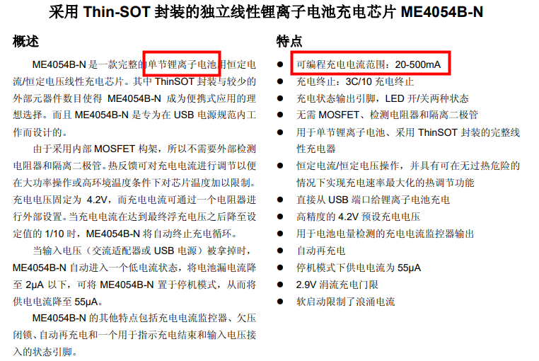
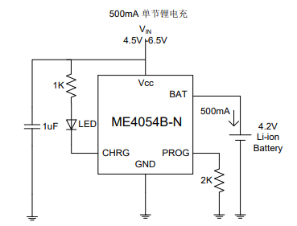
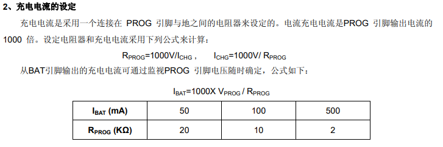
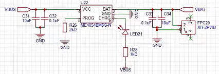
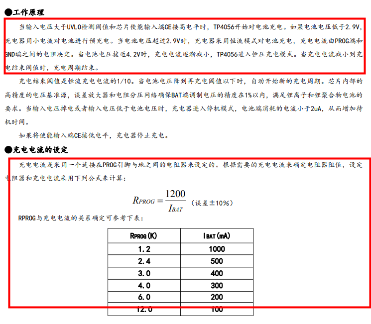
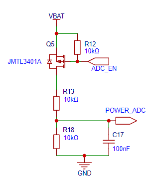
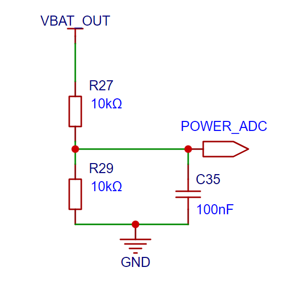

## 充电管理

**需求：希望产品可以不接电源、外出使用**

所以需要添加一颗锂电池用于供电，这里的锂电池我们选择动力电池，因为普通锂电池最大输出电流在1C左右，也就是2000mah的电池，最大输出2A电流，而动力电池可以到10C，这是由打印头的电源需求决定的。

**需求：一颗2000mah的锂电池，电压3.7-4.2V，充电电流1000ma内**

项目中使用 [ME4054B-N](https://item.szlcsc.com/485645.html) 作为充电管理方案，充电电流最大500mA，而且封装较小。

可以根据实际情况，调整PROG接口的电阻阻值，用以修改充电电流：2k(调整)

[FYI](https://item.szlcsc.com/772193.html): 也可以使用TP4056，可以获得更大的充电电流，但是封装大，不好布局

原理图

## 电量检测

需求：因为是电池供电的产品，我们需要知道<mark style="background: #ABF7F7A6;">电池剩余电量</mark>是多少，所以需要添加一个电量检测电路。

电量检测的技术原理是使用<mark style="background: #ADCCFFA6;">电阻分压原理</mark>，把电池电压分压后，通过芯片ADC进行读取，和电位器读取原理类似，最终再通过ADC值转换出电压值，电池电压在缺电3.3V，满电4.2V，这样我们就可以按比例估算出剩余的电量。

另外，为了节省功耗，可以在电池端添加一个 [MOS管](https://item.szlcsc.com/372770.html)，<mark style="background: #BBFABBA6;">控制检测的开关</mark>，这样，在不需要读取电量时，就可以关闭MOS管，降低功耗，**(新版本添加了开关后，不需要MOS管开关模块，VBAT经过开关后接R13即可)**。

这里使用PMOS控制开关: 当ADC_EN为 低电平，此时PMOS导通，可以读取 POWER_ADC 的值。

新版本
