## 前言

[硬件基础视频](https://www.bilibili.com/video/BV1gHSyY3E6q/?spm_id_from=333.337.search-card.all.click&vd_source=5b692f8be609178b27207d56f3ad73b0)

工具

- 直流稳压电源
- 万用表
- 示波器

> 电路设计安全要点

220V~ 别碰，碰了有可能没机会学习电路知识了

> [!tip] 人体安全电压：交流电压36V，交流电流10mA

直流稳压电源(50V 50mA)的作用：把220V高压的交流电转换为低压的直流电(直流电压选0~30V的)，安全

> [!danger] 如果没办法的时候，测试触电要用手指头背部，触电手会收缩，如果手心触电会握住更紧,用右手，离心脏更远

## 电阻

**欧姆定律**

$$U = IR$$

-  $U$ 表示电压（单位：伏特 $V$） 24V，15，12V，5V，3.3V，1.8V
-  $I$  表示电流（单位：安培 $A$）
-  $R$ 表示电阻（单位：欧姆 $Ω$）一般以 kΩ 为主

**电阻阻值识别**

[阻值识别](https://www.zhihu.com/question/638032621/answer/3380864487)

- 第一个色环：第一个有效数字;
- 第二个色环：第二个有效数字;
- 第三个色环：第三个有效数字;(四色环没有这部分)
- 第四个色环：表示倍率;
- 第五个色环：表示误差，即精度;

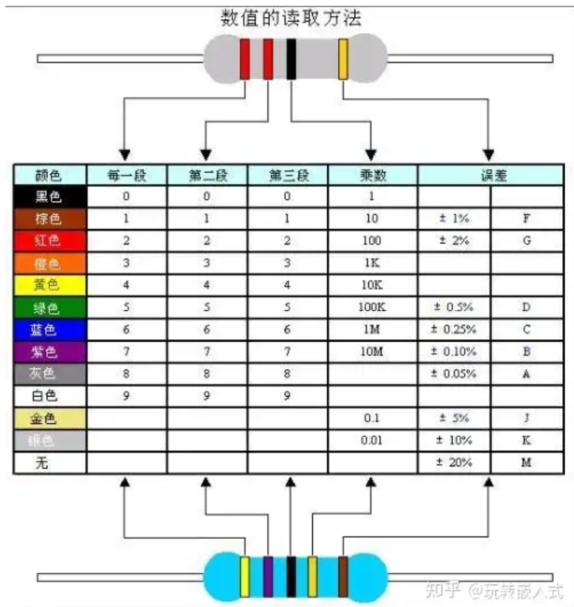

贴片电阻读数

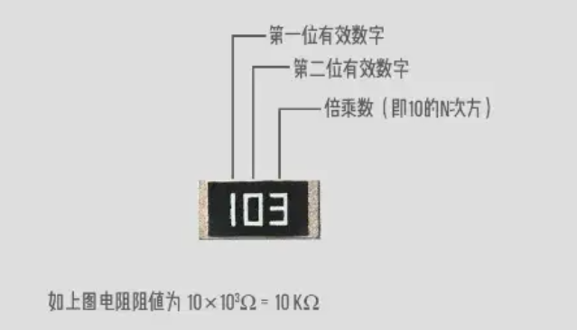

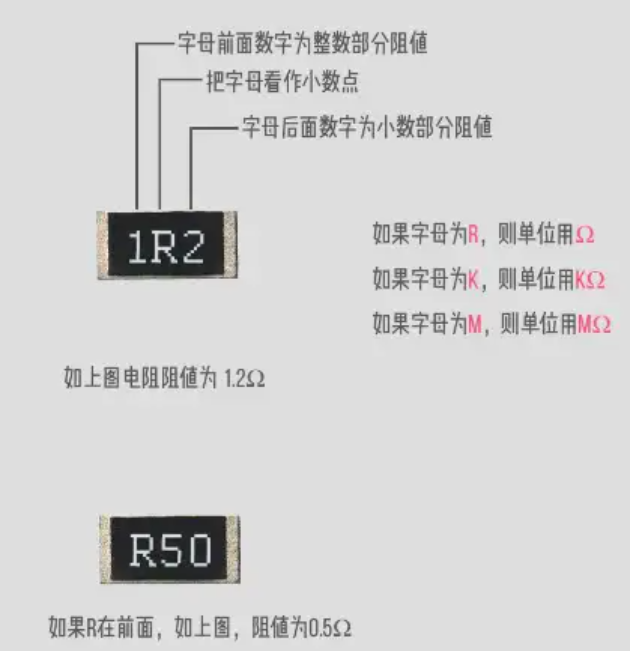

**在线电阻阻值识别**

[四色环电阻值计算器](https://lzltool.cn/four-resistor-calc)
[数字标注电阻计算器](https://lzltool.cn/num-resistor-calc)
[色环电阻在线计算器](https://www.tskau.com/component/shdzjsq)
[SMD贴片电阻阻值计算器](https://www.tskau.com/component/smdzz)

**电阻的功率公式**

$P = U·I$

$P = U² / R$

$P = I²·R$

P —— 功率，单位瓦特（W）  
U —— 电阻两端电压，单位伏特（V）  
I —— 流过电阻的电流，单位安培（A）  
R —— 电阻值，单位欧姆（Ω）

> 设计电路过程中，<mark style="background: #FF5582A6;">一定不能够超过电阻的额定功率</mark>，否则电阻发热会很严重。

**电阻的限流作用**

当供电电压大于负载的工作电压时，可以<mark style="background: #BBFABBA6;">利用电阻限流</mark>

(注意: 电路中<mark style="background: #FFB86CA6;">不能超过电阻的功率</mark>，同时尽可能只工作在供电电压与负载工作电压相差不大或者工作电流很小的场景)

**电阻的分流公式**

电阻分流公式(并联):  $I_{总} = I_{1} + I_{2} + I_{3}$

**电阻的分压公式**

电阻分压的基本计算公式（也叫“分压定律”）如下：

$V_{\text{out}} = V_{\text{in}} \cdot \frac{R_2}{R_1 + R_2}$

- $V_{\text{in}}$：输入电压  
- $R_1$：串联的第一个电阻  
- $R_2$：与输出端并联的第二个电阻（即分压电阻）  
- $V_{\text{out}}$：从 $R_2$ 两端取出的输出电压  

适用于两个电阻串联、并从其中一个电阻两端取电压的场景。

更多场合使用

$$V_R = \frac{(V_1 - V_2)* R_1}{R_1 + R_2} + V_2$$

很多时候 V2 是 GND

**上拉电阻、下拉电阻**

**上拉电阻：** 连接在信号线和电源（VCC）之间。当没有外部驱动时，电阻将信号线“拉”到高电平。 
**下拉电阻：** 连接在信号线和地（GND）之间。当没有外部驱动时，电阻将信号线“拉”到低电平。
**例子：** 按钮/按键电路。当按键未按下时，上拉电阻确保MCU的输入引脚为高电平；当按键按下时，引脚被直接连接到GND，变为低电平。
## 电容

- 电容简单来说就是两块不连通的导体加上中间的绝缘材料

有极性电容（分正负极）

|   |   |   |
|---|---|---|
|类型|特点|应用场景|
|**电解电容**|容量大，有正负极，有标记负极。|电源滤波|
|**固态电容**|寿命长、内阻低，色带标示负极。|电源滤波|
|**钽电容**|体积小，性能稳定，有横线标记正极|精密电路|
|**法拉电容**|容量极大，外壳上清晰标注负极方向|能量储存|

无极性电容（不分正负极）

|          |               |                             |
| -------- | ------------- | --------------------------- |
| 类型       | 特点            | 应用场景                        |
| **陶瓷电容** | 体积小，价格便宜      | 高频滤波、退耦、振荡、信号耦合             |
| **瓷片电容** | 圆片状陶瓷电容，价格便宜  | 普通滤波、耦合、按键消抖                |
| **薄膜电容** | 性能稳定          | 常用于音频、开关电源、交流电机、谐振和 EMI 抑制。 |
| **可调电容** | 可通过旋钮或螺丝微调电容量 | 用于射频调谐、振荡电路、需要校准的定制频率电路     |


- 高频小容量 → 陶瓷C0G
- 板级去耦 → 陶瓷X7R
- 大容量储能 → 铝电解
- 超低ESR → 聚合物铝或钽聚合物
- 高耐压交流 → 薄膜PP
- 法拉级备份 → 超级电容

**电容特性**

> 电容两端电压<mark style="background: #FFB86CA6;">不能发生突变</mark>特性

电容两端的相对电压不能突变，只要电容不充电或放电，电容两端的电压就不变，注意:电容两端的相对电压不能突变，但是<mark style="background: #BBFABBA6;">两端的电压可以同时突变</mark>

只有电容电路，开关闭合一瞬间相当于电路短路，所以需要加<mark style="background: #FF5582A6;">电感</mark>

电容可以简单理解成一个小电池，电容的充电速度与电容大小以及充电电流有关。

> 电容的充电时间常数: $\tau = R * C$

一个 RC 充电到 63%，两个 RC 充电到 86%，三个 RC 充电到 95%，三到五个 `τ` 值就认为充满了

> 利用电容储能特性可以实现<mark style="background: #BBFABBA6;">上电延时</mark>  

> 利用电容的储能特性可以实现<mark style="background: #BBFABBA6;">断电延时</mark>   (断电小灯泡慢慢熄灭)

**为什么很多电路和芯片上面都要加电容?**

<mark style="background: #FF5582A6;">电容的稳压功能和滤波功能</mark>，电源旁边的大电容 → 稳定电压，芯片旁边的小电容 → 去除高频噪声

**耦合作用**：传递交流信号，阻断直流，**例子**：音频设备中传递声音信号

**容抗的计算公式**

电容在频率越高时，阻抗越小，频率越低时，阻抗越大。

$R_c=\frac{1}{2\pi f c}$

- **Rc** 是容抗，单位是欧姆（Ω） 
- **π** 是圆周率，约等于 3.14159 
- **f** 是交流电的频率，单位是赫兹（Hz） 
- **C** 是电容，单位是法拉（F）

**常见各类场景的容值选择：**

```C
0.1μF          // 芯片去耦
10μF           // 电源滤波
100μF          // 大功率电源滤波
1nF            // 一般信号处理
10pF           // 高频电路
```

**电容值单位换算**

```Plain
基本单位：法拉(F)
1法拉(F) = 1,000毫法(mF)
1毫法(mF) = 1,000微法(μF)
1微法(μF) = 1,000纳法(nF)
1纳法(nF) = 1,000皮法(pF)
```

**低通滤波电路**

低通滤波电路可以让“低频”的信号通过，衰减“高频”的信号
低通滤波电路有以上作用是利用了<mark style="background: #BBFABBA6;">电容充放电特性</mark>实现的。

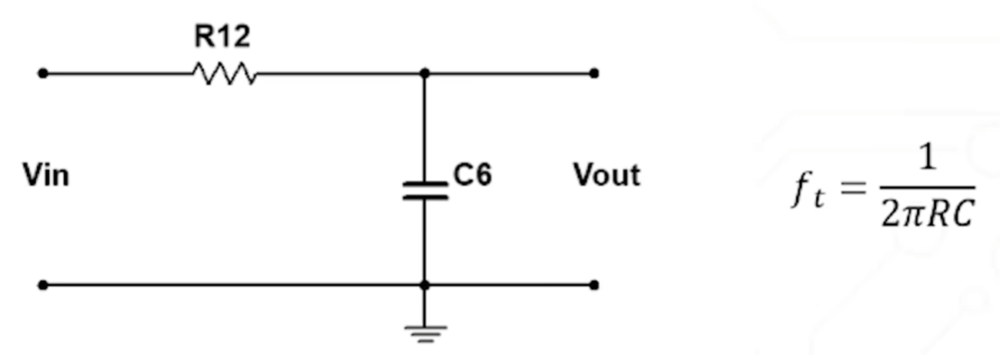

当输入信号的频率等于截止频率的时候，交流信号进入 RC 后，峰值会衰减 -3db，衰减0.707倍

**高通滤波电路**

高通滤波电路可以让“高频”的信号通过，衰减“低频”的信号

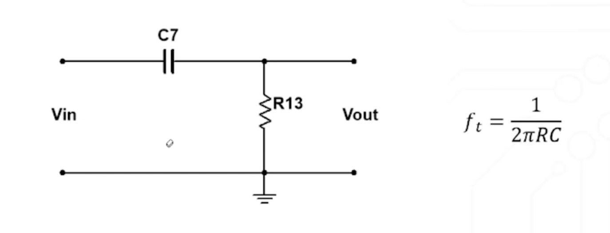

## 电感

电感就是一根导线加一个磁性材料生活中，所有由线圈组成的器件，都是电感。

1. **储能**
2. **阻交流、通直流、阻高频，通低频**
3. **滤波 / 平滑电流**

流过电感的电流不能突变，慢慢上升

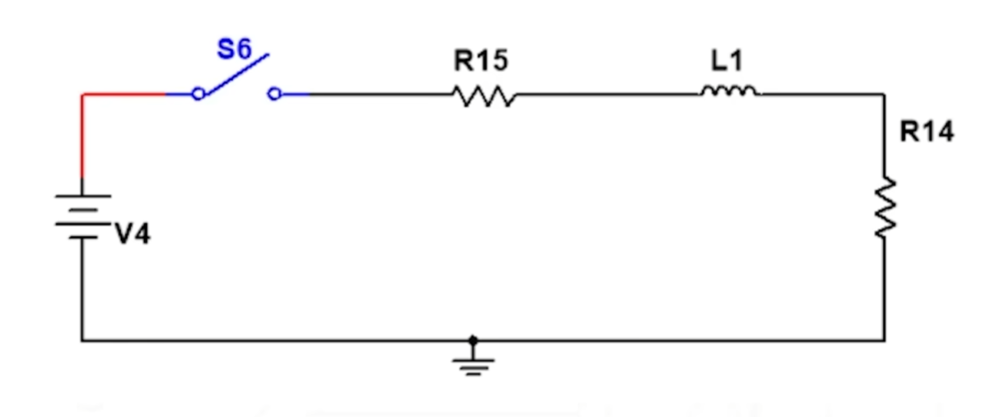

常见电路中，电感只能改变电路中的电流变化速度，但是<mark style="background: #FFB8EBA6;">不能改变电路的电流最大值</mark>

电感回路的电阻突然变很大会怎样？
电感流过电流时，如果电感回路的电阻突变变得很大，电感会感生出一个很高的电压此时<mark style="background: #FFB86CA6;">容易击穿器件</mark>，所以应用电感时，必须要考虑电感的续流回路

**电感的感抗计算公式？**
电感在频率越高时，阻抗越大，频率越低时，阻抗越小。

$$R_L = 2 \pi f L$$


低通滤波电路可以让低频的信号流过，衰减高频信号

**低通滤波电路截止频率计算**

$$f_t = \frac{R}{2 \pi L}$$

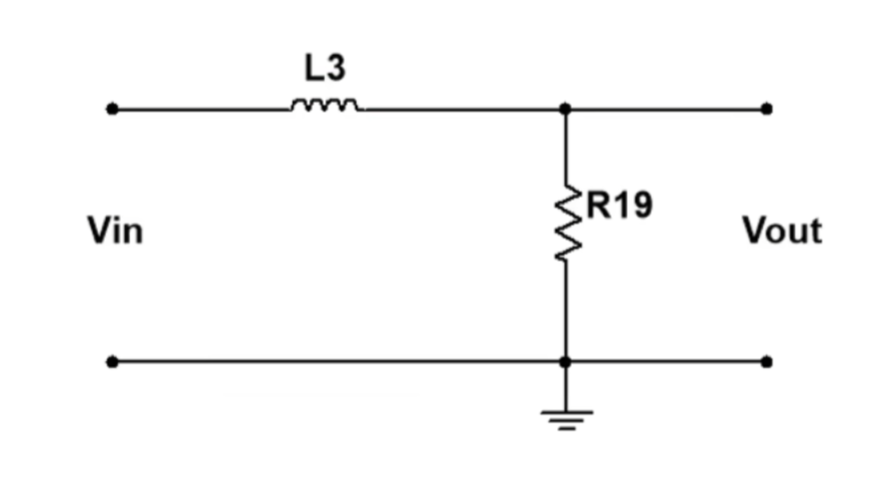

高通滤波电路可以让高频的信号流过，衰减低频信号
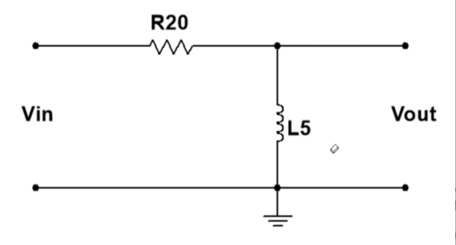

<mark style="background: #FFB86CA6;">LC低通滤波电路</mark>比RC低通滤波、LR低通滤波电路的<mark style="background: #FFB86CA6;">滤波效果更好</mark>
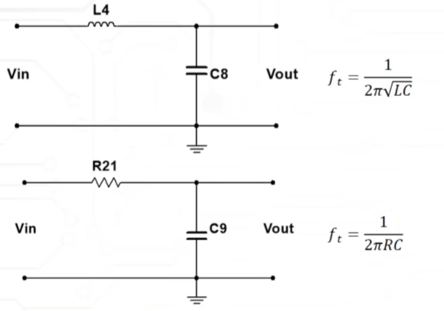

## 二极管

二极管的结构就是一个PN节，导通后肯定会存在压降(硅管0.7V;锗管~0.3V)其结构就像一个漏斗结构，普通二极管只能单向导通

注意: <mark style="background: #FFF3A3A6;">二极管两端不能直接接大于二极管导通压降的电压</mark>，否则电流会很大，烧毁二极管

二极管的单向导通特性
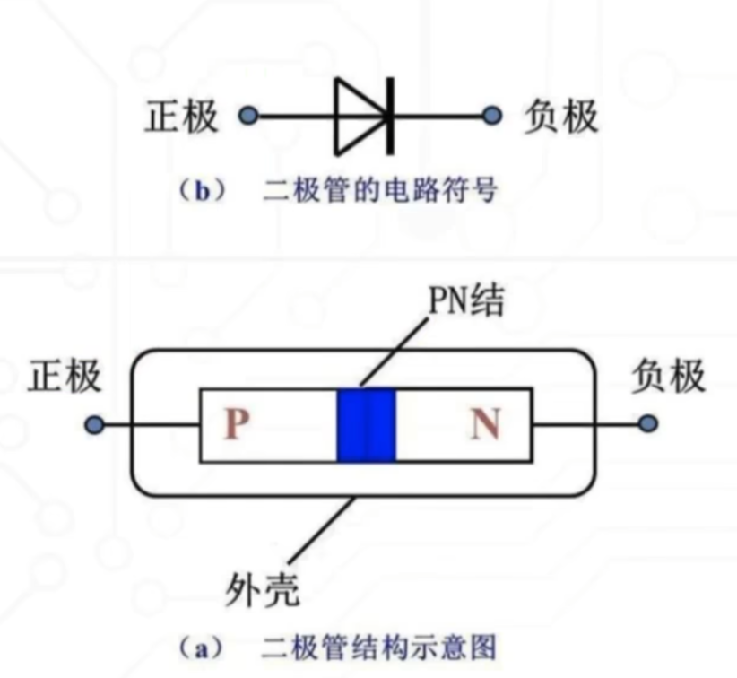

二极管的漏电特性：二极管反向截止并不代表完全关断，其实会有微弱的漏电流其中肖特基二极管的漏电流会比较大

**二极管的整流功能(峰值检波功能)**

将交流电转换为直流电。这是最经典的应用，利用单向导电性，<mark style="background: #D2B3FFA6;">只让交流电的正半周（或负半周）通过</mark>，从而得到脉动的直流电。
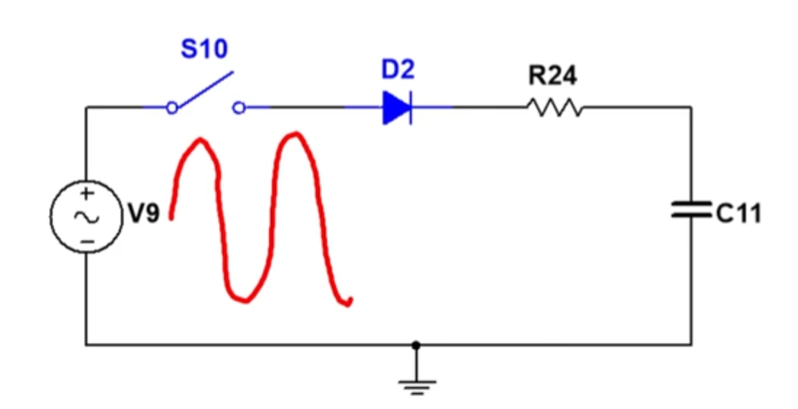

**全波整流电路**
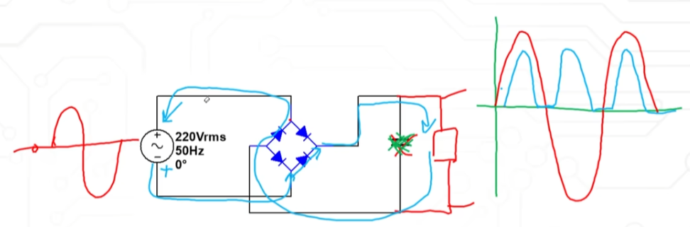

把交流电的整个周期都转换成同极性脉动直流的一种整流方式，效率比半波整流高一倍，纹波也小得多。

**二极管的钳位功能**: 

利用二极管的<mark style="background: #ADCCFFA6;">正向导通压降</mark>（硅管约0.7V， 肖特基管约0.3V），将信号电压限制在某一范围内。保护后级不被高压或负电压打坏。

**防反接保护**
串联在电源入口，只有当电源正负极正确连接时，电流才能通过。如果接反，二极管截止，整个电路断电。这样可以实现反接保护

一般接到电源端，不接到GND

二极管的最大反向耐压，二极管<mark style="background: #FFF3A3A6;">承受反向电压时会自动截止</mark>，但是每一个二极管都有最大反向耐压值

**稳压二极管的基本功能**
稳压二极管是工作在反向击穿状态，当其发生反向击穿时稳压二极管两端的电压会保持在某个电压值


## 三极管

- **三极管**是一个**电流控制型开关/放大器**，擅长处理**模拟信号**。

collector---集电极   emitter---发射极

NPN三极管（最常用），低电平不导通，高电平导通
PNP三极管，高电平不导通，低电平导通

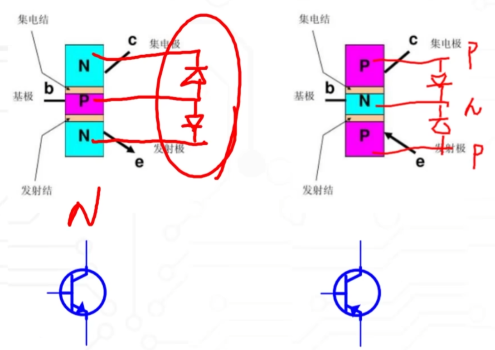

**三极管的开关功能**
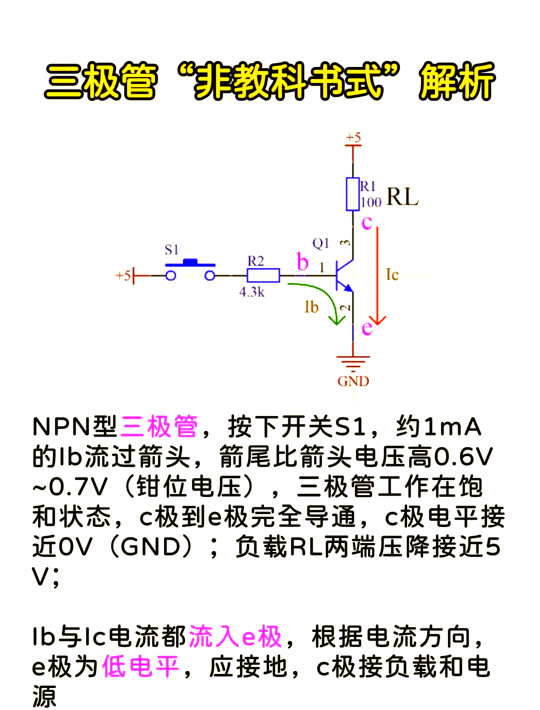

> 三极管的 $V_{be}$ 的导通压降 0.7

三极管可以当成<mark style="background: #BBFABBA6;">电子开关</mark>来使用，用电信号来控制，MCU输入高电平的时候，电流流过be，有了 $I_b$ 电流，ce就会闭合，流过一个 $I_c$ 电流

**三极管开关电路设计注意事项及计算方法**
理想的开关只有“开”和“关”两种状态，但是<mark style="background: #FFF3A3A6;">三极管不是</mark>
一个理想的开关，它有“似开不开、似关不关”的<mark style="background: #FFB8EBA6;">第三种状态</mark>(放大)

**P型三极管开关电路设计注意事项**
当三极管用作开关时，通常 N型三极管 控制负载的GND端，P型三极管 控制负载的Vcc端

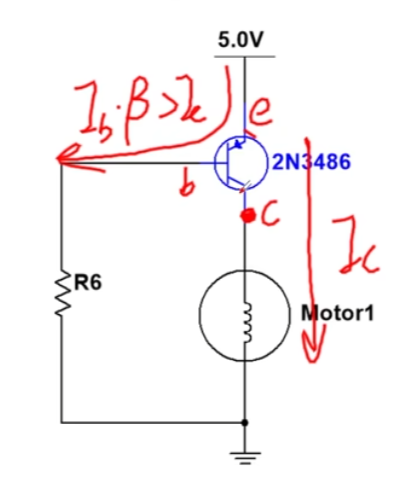

**三极管 $R_b$(基极电阻) 的取值**：

三极管工作在饱和导通状态：$\beta I_b > I_c$ 
三极管工作在放大状态成立：$\beta I_b = I_c$ 

**举例，一个基极MCU和集电极LED的计算方法**
完整算例 条件：VCC = 5 V，驱动 LED 20 mA，V_{LED} = 2 V，MCU 低电平 0.2 V，βsat = 10(*饱和区强制增益*) 
1. $I_B = \frac {1.5 × 20 mA}{10} = 3 mA$ ，1.5 是过驱动系数，按经验'拍'的安全裕度，确保深饱和

2. $R_B ≤ \frac {(5 V – 0.7 V – 0.2 V)}{3 mA} ≈ \frac {4.1 V}{3 mA} ≈ 1.36 kΩ$ 取标准值 1.2 kΩ，实际 $I_B ≈ \frac {4.1 V}{1.2 kΩ} ≈ 3.4 mA$（满足） 

3. $R_C = \frac {(5 V – 0.3 V – 2 V)}{20 mA} ≈ \frac {2.7 V}{20 mA} ≈ 135 Ω$ → 取 130 Ω，0.3是<mark style="background: #BBFABBA6;">三极管饱和时 CE 两极间的压降</mark>，查数据手册

**N型三极管和P型三极管的特性对比**

N型三极管和P型三极管的工作逻辑相反
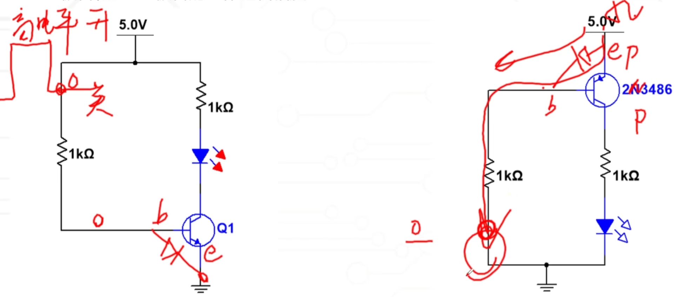

N型三极管,b端高电平才导通，低电平关断
P型三极管，发射极比基极高0.7，b端为低电平

**三极管的输出反向功能**
三极管集电极信号与输入信号的逻辑相反，所以可以利用三极管对信号进行反相

**三极管的基极下拉电阻的重要性**
给N型三极管的基极加下拉电阻可以<mark style="background: #ABF7F7A6;">改善噪声的干扰</mark>，基极加下拉电阻到 GND
 
**三极管的最大耐压**
三极管并不是一个理想开关，每个三极管都有其最大耐压值

**比较器的工作特性**
比较器有两个输入信号 V+ 和 V-; 以及一个输出信号 Vout,当 V+ > V- 时，Vout为高电平 1; 当 V+ < V- 时，Vout 为低电平 0

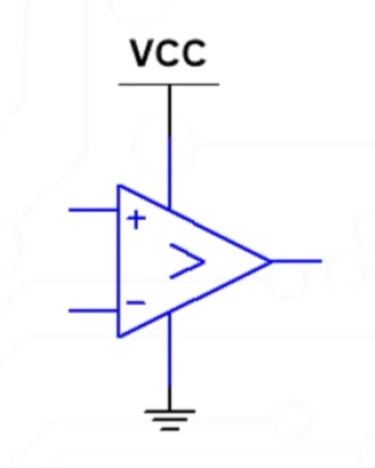


## MOS管

- **MOS管**是一个**电压控制型电子开关**，是**数字控制和功率开关**的绝对主力。

G栅极(gate)   S源极(source)   D漏极(drain)

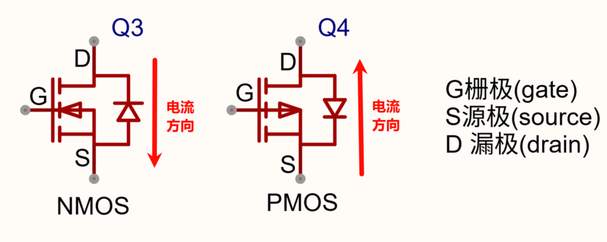
NMOS管，栅源电压 Vgs > Vth (开启阈值电压)，DS 导通 (导通时电流流向D→S)

PMOS管，栅源电压 Vsg > Vth (开启阈值电压))，SD 导通 (导通时电流流向S→D)

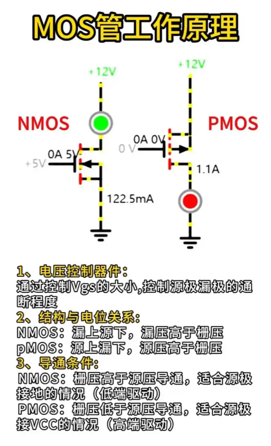

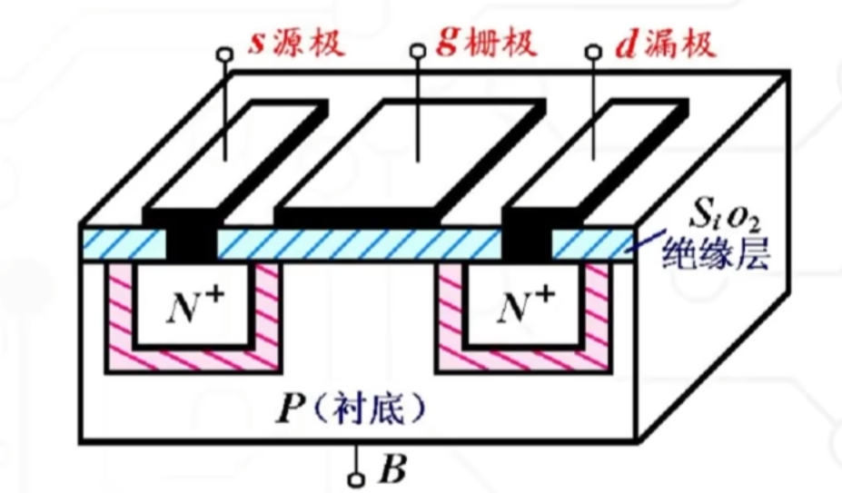
当 Nmos 的 g极 电压比 s极 电压<mark style="background: #FF5582A6;">大于</mark>导通电压(Vth)时，DS 之间闭合当 Pmos 的 g极 电压比 s极 电压<mark style="background: #FF5582A6;">小于</mark>导通电压(Vth)时，DS之间闭合

**MOS的寄生电容问题**
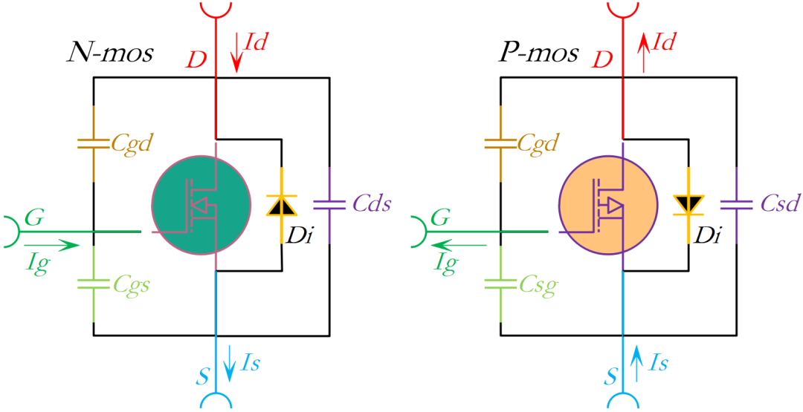

MOS的寄生二极管一定不能忽略，mos管的寄生体二极管不能够忽略，否则容易导致电流反灌的问题，

**Nmos管做电源开关时的注意事项**
Nmos控制负载的工作电源时，需要使用<mark style="background: #BBFABBA6;">自举电容</mark>或者一个<mark style="background: #BBFABBA6;">比电源更高的控制信号</mark>来控制mos栅极

**Pmos的电源开关设计方法**：Pmos做开关时，通常S极接电源

**Pmos防反接电路的工作原理**：
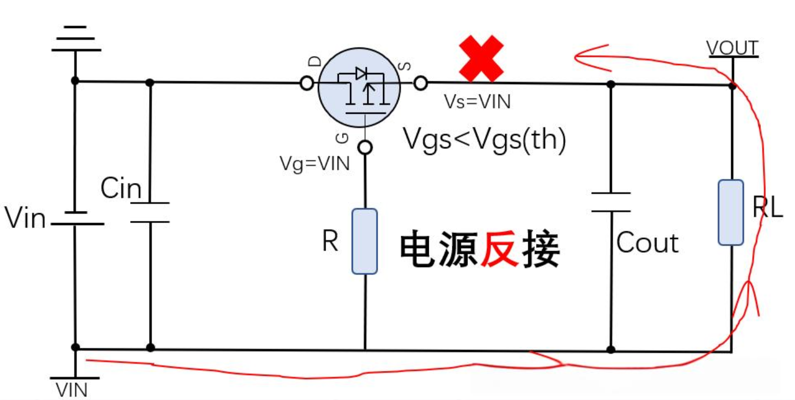

**MOS管的电流可以在DS之间双向流通**：三极管的ce之间有电流方向，但是mos没有，只要mos的gs之间满足导通条件，mos管DS之间的电流可以双向导通


**如何抵消MOS的寄生体二极管**：“抵消”MOS 寄生体二极管，就是让它永远别真正导通；万一非要导通，就给它并联一条更快、更干净的短路，把电流和反向恢复电荷都抢掉。

**MOS管的导通电流与Vgs的关系**：MOS管的导通电流与Vgs的大小成正比，大部分mos当Vgs大于4.5V时，进入饱和状态 

**MOS管的耐压**：只要 D-S 之间电压超过它家规格书写的 V(BR)DSS，哪怕 1 µs，管子就会从‘关断’变成‘雪崩’，<mark style="background: #FF5582A6;">瞬间发热，次数一多就炸</mark>。

**什么时候用MOS管？**--开关电路

1. *当你需要用一个MCU/逻辑芯片控制一个电源通断时*：这是*最常见*的场景，例如控制电机、灯带、加热片的电源。*首选MOS管*，因为驱动简单、效率高。

2. *任何对效率和功耗有要求的功率开关电路*：如开关电源(SMPS)、电机驱动(H桥)。
## 比较器

比较器有两个输入信号 V+ 和 V-; 以及一个输出信号 Vout 当 $V_{-} > V_{+}$ 时，Vout 为高电平 1，当 $V_{-} > V_{+}$ 时，Vout 为低电平 0

工作逻辑
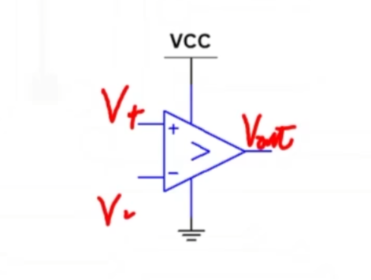

**比较器什么时候要加上拉电阻**：推挽输出三种结构比较器的输出结构主要分为OC || OD(开漏)、其中 <mark style="background: #BBFABBA6;">OC 和 OD 要加上拉电阻</mark>，<mark style="background: #BBFABBA6;">推挽输出不需要加上拉电阻</mark>

- o是open，c是指集电极，d是指漏极

**比较器上拉电阻的使用注意事项**：开漏输出（Open Drain）必须配置上拉电阻；推挽输出（Push-Pull），通常不需要额外配置上拉电阻

**比较器的输入信号范围**：比较器的输入范围不能够超出芯片的供电范围，超过芯片供电范围可能会工作异常。

**如何解决比较器的颤振问题**：先削弱噪声，再让阈值“动”起来，最后降低比较器对高频扰动的敏感度。

**运放**: 运算放大器，常用于做信号处理。如:信号放大、滤波、积分、微分、整流、甚至可以用来做电路主控等等。其功能非常强大

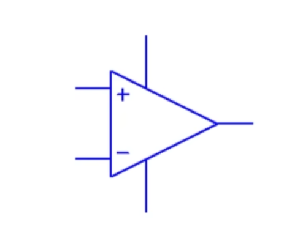
虚短的概念是指运放在正常工作过程中，其V+=V-;

$$V_{out} =(V_{+} -  V_{-})* GAIN_{开环}$$

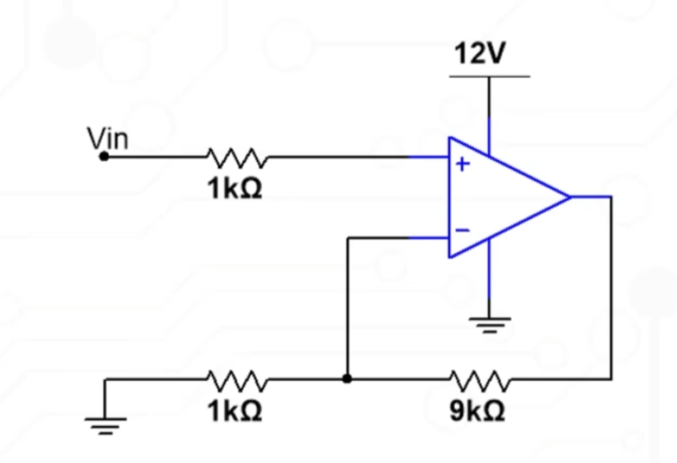
当运放发现V+>V-时，输出Vout上升，当运放发现V+≤V-时，车输出Vout下降

条件：*负反馈回路，输出不饱和*

**虚断电路根本原因**：“虚断”根本不是物理断裂，而是高输入阻抗＋极小偏置电流*带来的等效效应；一旦运放饱和或被拿掉，这条“虚断”立刻消失。

**同相放大电路的推导**

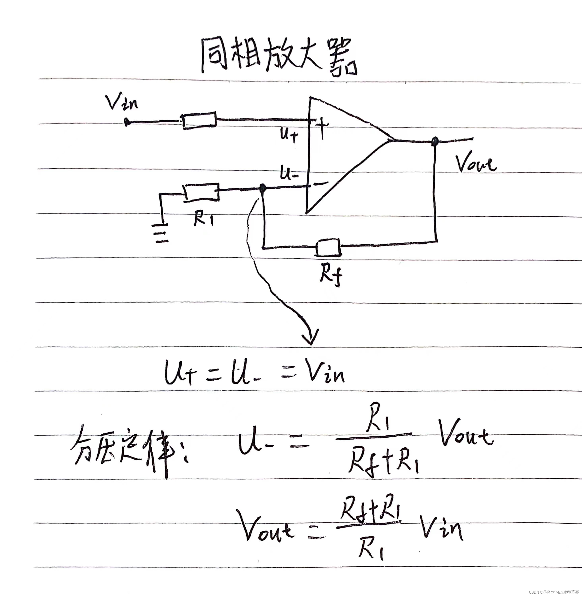

同相放大电路 = 信号直接进运放“＋”端，输出经 Rf 和 R1 分压后送回“－”端，负反馈强迫 v⁻ = v⁺，于是闭环增益 G = 1 + Rf / R1，且输入阻抗≈∞，输出阻抗≈0。

**反相放大电路的推导**

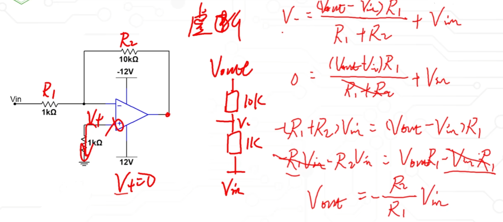

**单电源反相放大电路的推导**

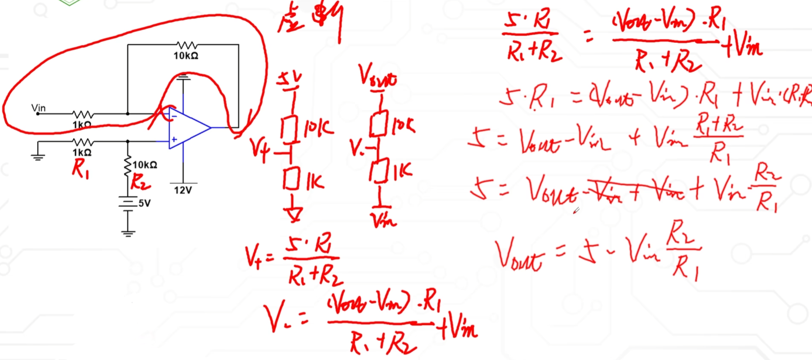

**差分放大电路的推导**

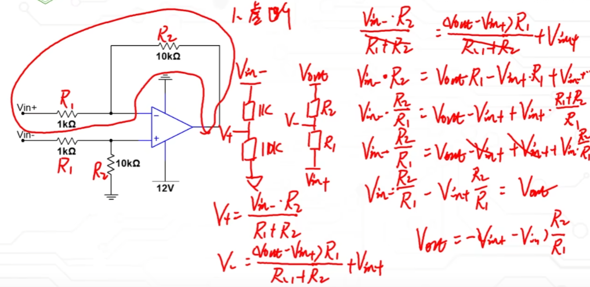

**低端电流采样原理**

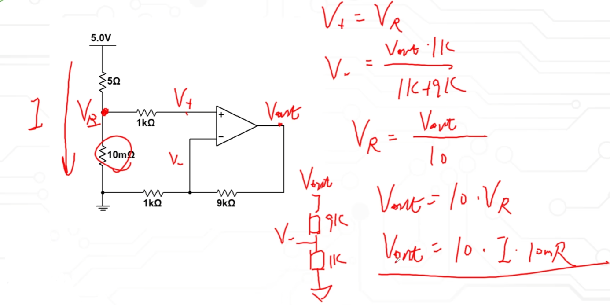

**低端电流采样电路的注意事项及解决方法**
1、运放的输入、输出范围;
2、运放的Vos对电路的影响;

**高端电流采样原理**

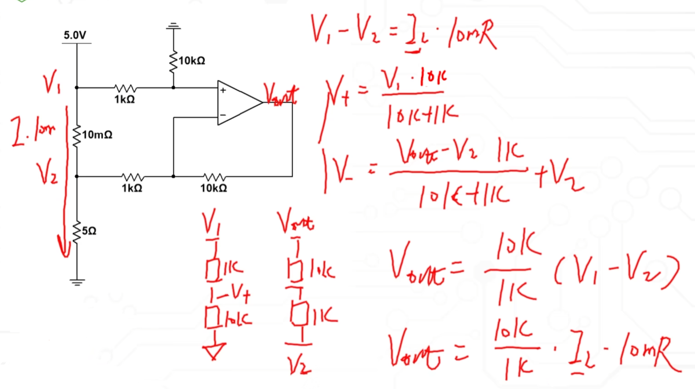

**仪表放大器 高端电流采样原理**

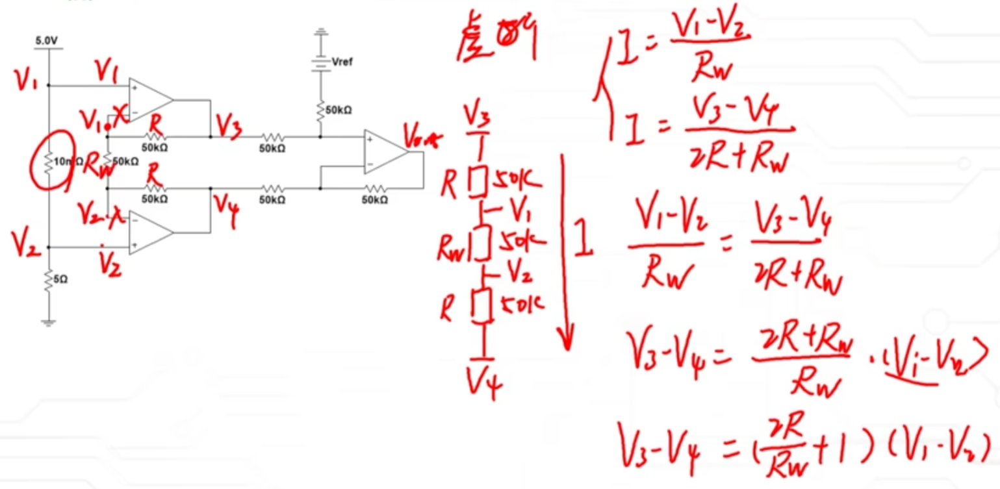

**仪表放大器 带偏置差分放大电路的公式推导**

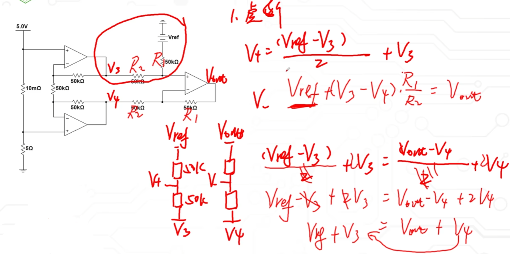

**仪表放大器做高端电流检测的注意事项**

1、运放的输入、输出范围;
2、运放的Vos对电路的影响;

**跨阻放大电路工作原理**

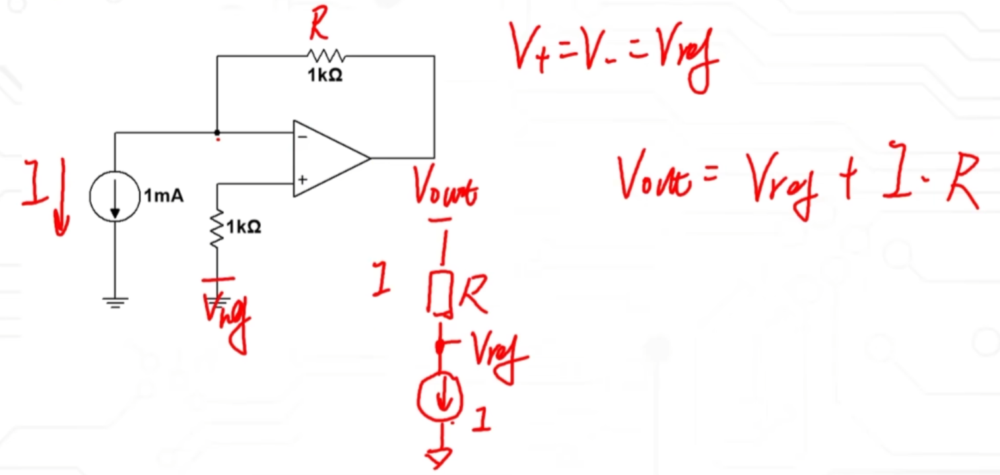

**为什么运放的输入端要做电阻匹配**：运放输入端做电阻匹配，核心目的是*消除输入偏置电流引起的直流误差电压*，同时兼顾温漂、共模抑制等性能。

## 恒流源电路

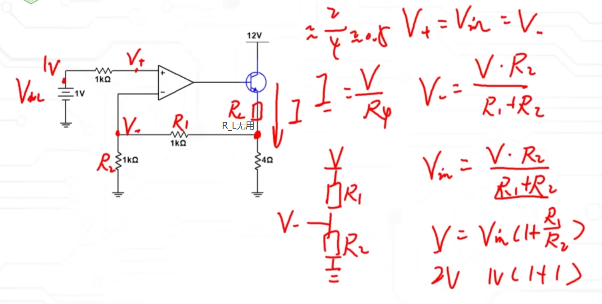

**高端反馈恒流源电路工作原理**

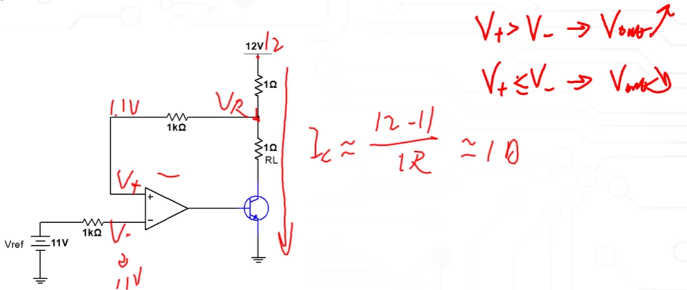

如何解决恒流源自激振荡问题？
恒流源之所以“自己跟自己打起来”（自激振荡），就是因为在某个高频点，*负反馈变成了正反馈*，而且*环路增益还 ≥1*；想让它不吵，只要把“增益”或“相移”任一条件破坏掉即可。

## 直流稳压电源

带反馈
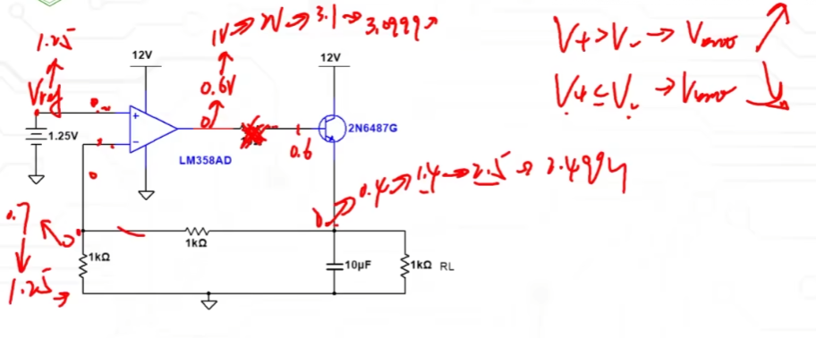

不带反馈
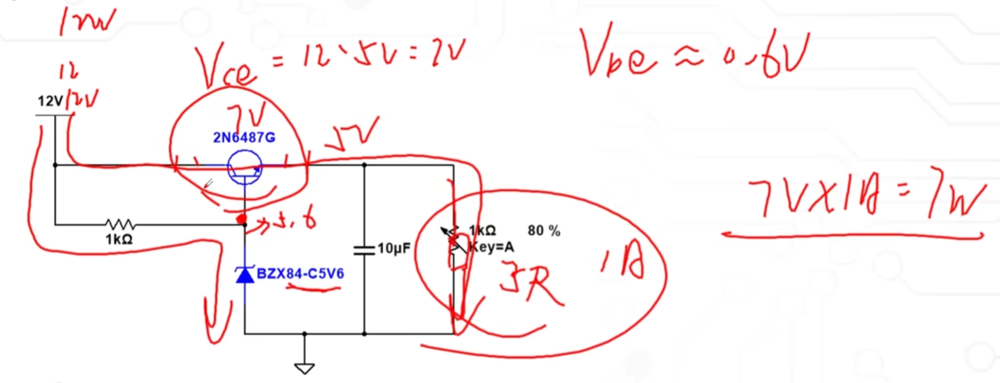

**反馈型和非反馈型直流稳压电源的优缺点**

- 反馈型：用“复杂度+功耗”换“精度与干净输出”，适合精密系统。
- 非反馈型：用“稳压指标”换“简单+低成本”，适合功率小、电压要求宽的场合。

**最原始的开关电源电路结构**

BUCK拓扑
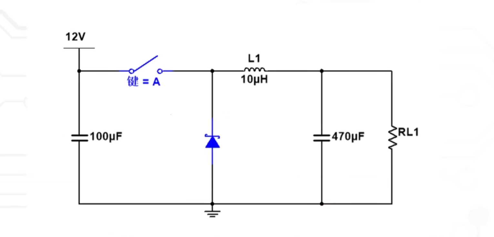

**续流二极管为什么可以解决电感感生的高压问题**
续流二极管并没有“消灭”能量，而是给电感电流提供了一条低阻抗的闭合回路，把“无限大的 di/dt”变成“有限的 di/dt”，于是感生高压就自然消失。

**BOOST的工作原理**
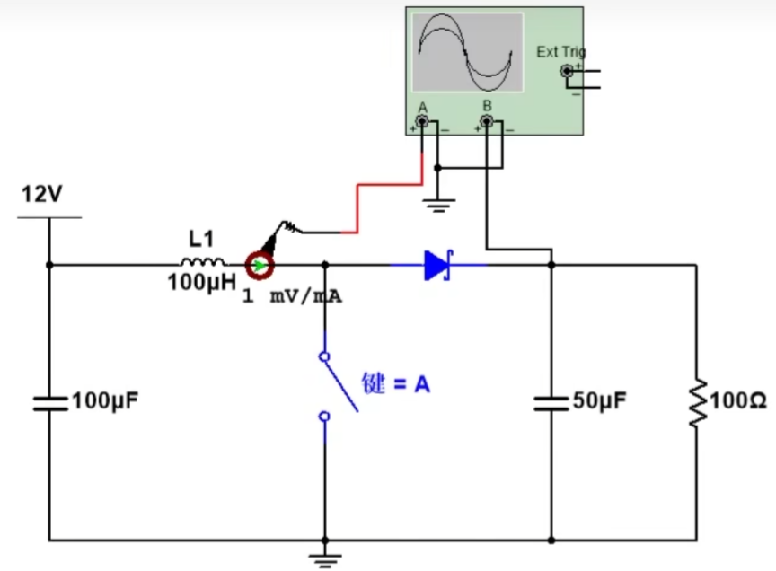


**电荷泵升压工作原理**

电荷泵（Charge Pump）升压的核心是“*用电容代替电感*”，通过高速开关让电容在“并联充电”与“串联放电”两种状态之间来回切换，从而把能量一级级“搬”到更高电位，实现 $V_{OUT} > V_{IN}$ 的目的。

## 各类芯片

[单片机(MCU/MPU/SOC)厂家_型号_价格_规格_品牌-立创商城](https://list.szlcsc.com/catalog/11329.html?spm=sc.hm.hd.ca2.1-1___sc.it.bc.1&lcsc_vid=QFVdVgcATwUIXwVeT1BaBQZWFQNXUV1RRQMMBgBUElcxVlNQRFBeXldXQFJcXztW)


|   |   |   |   |
|---|---|---|---|
|厂家|主要系列/特点|常见型号举例|适用场景|
|意法半导体|产品线极其广泛，从低到高全覆盖，生态成熟，资料丰富，是初学者和企业的首选。|STM32F103 (Cortex-M3, 经典)  <br>STM32F401 (Cortex-M4, 带DSP)  <br>STM32L071 (Cortex-M0+, 低功耗)  <br>STM32H743 (Cortex-M7, 高性能)|工业控制、消费电子、物联网、电机驱动|
|恩智浦|老牌劲旅，在汽车、工业领域口碑极好，性能稳定可靠。|LPC系列 (如LPC845, Cortex-M0+)  <br>[i.MX](http://i.MX) RT系列 (跨界处理器，性能堪比MPU)|汽车电子、工业自动化、高端消费电子|
|微芯科技|产品线最全的厂家之一，从8位到32位都有。抗干扰能力强，在传统工业中地位稳固。|PIC16F877A (8位，经典教学款)  <br>ATmega328P (Arduino Uno核心)  <br>ATSAMD21 (Cortex-M0+, Arduino Zero核心)  <br>SAM E54 (Cortex-M4, 高性能)|汽车、工业、家电、航空航天（8位/PIC）、创客（AVR）|
|英飞凌|在功率控制、汽车电子和安全芯片方面全球领先。|XMC系列 (如XMC1300)  <br>PSoC™系列 (内部集成可编程模拟/数字模块)|电机控制、电源管理、汽车电子|
|兆易创新|中国大陆最大的32位通用MCU供应商，性价比极高，国产替代主力。|GD32F103 (与STM32F103软硬件兼容)  <br>GD32E230 (Cortex-M23, 主打性价比)|消费电子、工业控制、替代ST等国外品牌|
|乐鑫科技|专精于Wi-Fi & Bluetooth MCU，在物联网领域是绝对的王者，生态完善。|ESP8266 (Wi-Fi, 鼻祖级)  <br>ESP32 (Wi-Fi + Bluetooth, 最流行)  <br>ESP32-S3 (支持AI指令)|物联网设备、智能家居、穿戴设备|
|泰凌微电子|在低功耗蓝牙领域非常强大，是许多品牌TWS耳机充电仓的标配。|TLSR8系列  <br>TLSR9系列 (支持蓝牙5.3, 蓝牙Mesh)|蓝牙设备、无线鼠标键盘、智能家居|