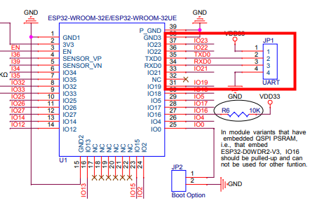
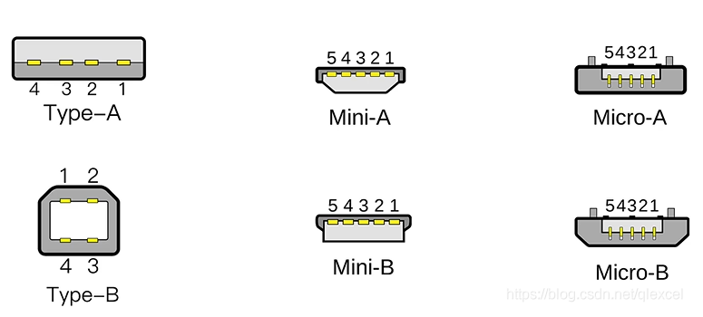
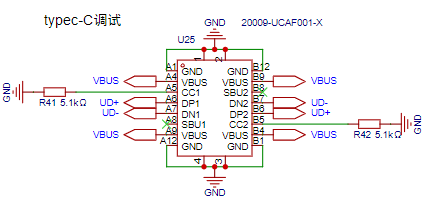
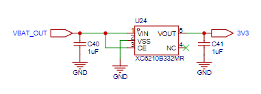
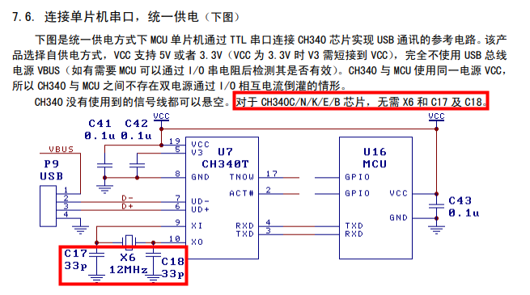
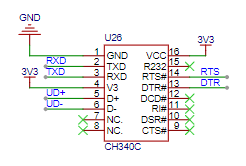
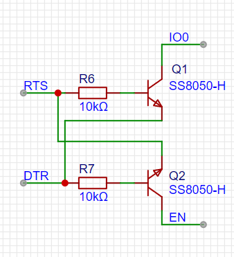

## 前言

在最小系统的版本中，我们的电路板仅仅能满足芯片跑起来的基本功能，如果要<mark style="background: #ABF7F7A6;">调试芯片</mark>，则需要购买 USB 转 TTL 模块，也要把 IO0 和 EN 引脚焊接出来，

1、添加USB线供电、烧录、调试电路
2、添加自动下载电路

## USB线供电、烧录、调试电路部分

以 ESP32 为例子，模组端的下载接口是 UART口 `VCC(3.3V) TX RX GND`，所以我们要做三件事

1. 添加USB TYPEC接口
2. 添加电压转换电路 (5V外部供电 --> 3.3V单片机所需电压)
3. 添加USB转串口模块

### 添加USB TYPEC接口

TYPEC端子我们使用的是 [20009-UCAF001-X](https://item.szlcsc.com/3708441.html)

原理图如下所示：

- CC1 CC2接电阻后接地，这是 Typec口 用于做`接入检测和正反接识别`的，如果这两个口不接悬空，接上充电器时充电器不会输出电压。

> [!tip] 在 CC1、CC2 引脚对地接一个**下拉电阻**（常见阻值为 5.1kΩ）。当充电器检测到这个下拉电阻的电平特征时，就会判定 “有设备接入”，进而启动电压输出。

- VBUS 为电源端，接电脑 USB 或充电器时，默认为 5V
- UD+ UD- 为数据线
- VBUS：USB/Type-C 总线电源正极
- VBAT：电池电源正极

### 把USB的5V转为模组需要的3.3V

需求：由于TYPEC端输入电压是5V，而芯片需要3.3V供电，5V转3.3V，输出电流在500ma以上

使用稳压芯片为：[XC6210B332MR](https://item.szlcsc.com/3544066.html)

|   |   |
|---|---|
|最大输入电压|6V|
|输出电压|3.3V|
|压差|75mV@(100mA)|
|输出电流|最大900mA|

电路设计非常简单，只需要在输入输出添加旁路电容，两个 1μF 的陶瓷电容。

这里的VBAT_OUT我们改为VUSB即可，因为目前我们还没有添加电池部分电路。

### **把USB的D-** D+信号转为TX RX信号

因为ESP32端的下载调试引脚为`串口`，而TypeC端输入信号为`USB信号`，所以需要进行信号转换，使用CH340系列芯片：[CH340C](https://item.szlcsc.com/85852.html)，该芯片带有RTS DTR接口，方便后续进行自动下载电路实现。

## 自动下载电路实现

ESP32要进入下载模式的前提是，IO0 拉低，然后复位芯片（通过<mark style="background: #BBFABBA6;">EN引脚控制</mark>，<mark style="background: #ABF7F7A6;">EN由低电平到高电平</mark>（上升沿）时CPU复位，复位后检测到 <mark style="background: #FF5582A6;">GPIO0 是低电平</mark>，MCU自动进入下载启动模式！）

根据电路原理：EN、IO0默认为 `高`
DTR = 0; RTS = 0, 此时Q1截止，Q2截止，EN = 默认; IO0 = 默认
DTR = 0; RTS = 1，此时Q1导通，Q2截止, EN = 默认; IO0 = 0
DTR = 1; RTS = 0, 此时Q1截止，Q2导通, EN = 0; IO0 = 默认
DTR = 1; RTS = 1, 此时Q1截止，Q2截止, EN = 默认; IO0 = 默认
 
 简单总结：
 1. 当DTR和RTS同时为0或者同时为1时，此时EN和IO0的状态由其他电路决定（内部/外部上拉电阻）。
 
2. 当不同时为0或者1时，EN  = RTS，IO0 = DTR
 
但是这种逻辑下 <mark style="background: #BBFABBA6;">EN 和 IO0 是不可能同时为 0</mark>的，然而进入下载模式则需要如下的序列
- IO = 0; EN = 0
- IO = 0; EN 0 -> 1

 从逻辑表上看是根本无法正常进入下载模式的。
 
问题的答案实际在另外一部分电路，原理其实非常简单：

EN信号连接在一个电容充放电电路上，EN由于电容充电，电平并不会立马变为高电平，而是缓慢上升，我们就可以使用这个时间差。
1. 设置DTR = 1; RTS = 0, 此时 EN=0 IO=1 
2. 设置DTR = 0; RTS = 1, EN=0 IO=0  此时EN引脚由于电容充电，实际还是0
3. 等待电容充电完成，此时 EN=1 IO=0，进入下载模式，具体的DTR、RTS就是由芯片厂家提供的esptool.py下载脚本进行设置的。

