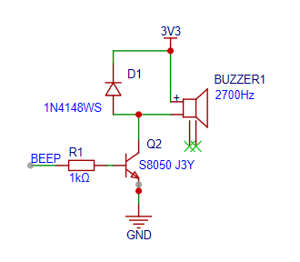
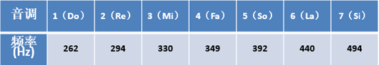

**需求：**

根据项目需求，需要支持连接提示音、报警提示音、打印提示音三种声音。其中

- 连接提示音为：滴-500ms-滴-500ms-滴-500ms
- 报警提示音为：滴-1000ms
- 打印提示音为：滴-500ms

**实现原理：**



硬件中使用的蜂鸣器为<mark style="background: #ABF7F7A6;">无源蜂鸣器</mark>，所以需要使用PWM信号驱动。

脉冲宽度调制(PWM)，是英文“Pulse Width Modulation”的缩写，简称**脉宽调制**

**pwm**的频率：

是指 <mark style="background: #BBFABBA6;">1 秒钟</mark>内信号从高电平到低电平再回到高电平的<mark style="background: #BBFABBA6;">次数</mark>(一个周期)；

如果频率为50Hz ，也就是说1秒内来回了50次，那每次的时间就是20ms，那此信号一个周期就是20ms


**占空比**：

是一个脉冲周期内，<mark style="background: #BBFABBA6;">高电平的时间</mark>与<mark style="background: #ABF7F7A6;">整个周期时间</mark>的比例


通过 LEDC 实现，LEDC(PWM)主要是Arduino中用于控制 LED 的亮度接口，原理是通过控制 <mark style="background: #ABF7F7A6;">PWM波形</mark> 实现亮度控制，但也可以产生 PWM 信号用于蜂鸣器控制。无源蜂鸣器发声就和信号的频率，项目中用到的滴声，频率在2000Hz左右，知道了这个原理，你其实可以用蜂鸣器演奏一首曲子啦。



1. 设置通道的pwm通道号、频率、定时器分辨率
2. 绑定通道与IO引脚
3. 设置通道输出pwm频率控制蜂鸣器的声音

```c
// 引入Arduino核心库，提供基本的初始化、IO操作、延时等核心功能
#include <Arduino.h>

// 定义蜂鸣器所连接的 ESP32 GPIO 引脚号为 18
#define PIN_BEEP 18

// LEDC 是 ESP32 内置的硬件脉宽调制（PWM）控制器，用于生成可调频可调占空比的方波驱动蜂鸣器
int freq = 2000;    // 2000Hz
// LEDC 通道号，ESP32 支持 0~15 共 16 个独立通道，此处选择通道 0
int channel = 0;    
// LEDC 定时器精度（分辨率），取值范围 1~20，此处设置为 8 位
// 8 位精度意味着占空比可以分成 2^8=256 个等级（0~255），精度越高，占空比调节越细腻
int resolution = 8;

// 定义枚举类型，规范蜂鸣器的提示音场景
typedef enum{
    BEEP_CONNECT = 0,    // 场景1：连接成功提示音（三声短鸣）
    BEEP_WARN,           // 场景2：警告提示音（一声长鸣）
    BEEP_PRINTER_START,  // 场景3：打印机启动提示音（一声短鸣）
}beep_type_e;

// 蜂鸣器播放函数 
void run_beep(beep_type_e type){
    // 多分支选择语句，根据不同的提示音类型执行对应的播放逻辑
    switch (type)
    {
    // 场景1：连接成功提示音（三声 D调5阶音符，每声持续500ms，间隔500ms）
    case BEEP_CONNECT:
        // ledcWriteNote：LEDC 专用函数，直接播放指定音符和音阶，无需手动计算频率
        // 参数1：LEDC 通道号；参数2：音符（NOTE_A ~ NOTE_G 等）；参数3：音阶（1~8 阶）
        ledcWriteNote(channel,NOTE_D,5);  // 播放 D调5阶音符
        delay(500);                       // 持续播放 500 毫秒（0.5秒）
        ledcWrite(channel, 0);            // 停止蜂鸣器（设置占空比为 0，无方波输出）
        delay(500);                       // 停止间隔 500 毫秒（0.5秒）
        
        ledcWriteNote(channel,NOTE_D,5);  // 第二次播放 D调5阶音符
        delay(500);
        ledcWrite(channel, 0);
        delay(500);
        
        ledcWriteNote(channel,NOTE_D,5);  // 第三次播放 D调5阶音符
        delay(500);
        ledcWrite(channel, 0);            // 播放完毕，彻底停止蜂鸣器
        break;  // 跳出当前分支，避免执行其他场景逻辑
    
    // 场景2：警告提示音（一声 F调5阶音符，持续1000ms）
    case BEEP_WARN:
        ledcWriteNote(channel,NOTE_F,5);  // 播放 F调5阶音符
        delay(1000);                      // 持续播放 1000 毫秒（1秒）
        ledcWrite(channel, 0);            // 停止蜂鸣器
        break;
    
    // 场景3：打印机启动提示音（一声 D调5阶音符，持续500ms）
    case BEEP_PRINTER_START:
        ledcWriteNote(channel,NOTE_D,5);  // 播放 D调5阶音符
        delay(500);                       // 持续播放 500 毫秒（0.5秒）
        ledcWrite(channel, 0);            // 停止蜂鸣器
        break;
    
    // 默认分支：无匹配场景时，不执行任何操作
    default:
        break;
    }
}

// 初始化函数（仅运行一次） 
void setup() {
  // 初始化串口通信，波特率设置为 9600（串口收发数据的速率）
  // 用于在串口监视器中打印调试信息，排查程序运行问题
  Serial.begin(9600);
  
  // 串口打印调试信息，提示 setup 函数开始执行（可在串口监视器查看）
  Serial.printf("setup\n");

  // 初始化 LEDC 通道参数，配置对应的频率和分辨率
  // 参数1：LEDC 通道号（与后续绑定引脚的通道保持一致）
  // 参数2：LEDC 输出频率（此处为 2000Hz，实际播放音符时会被 ledcWriteNote 覆盖）
  // 参数3：LEDC 分辨率（此处为 8 位，决定占空比调节精度）
  ledcSetup(channel, freq, resolution);
  
  // 将 LEDC 通道 0 与 蜂鸣器引脚 PIN_BEEP（GPIO18）进行绑定
  // 绑定后，该通道的 PWM 信号会从 GPIO18 引脚输出，驱动蜂鸣器发声
  ledcAttachPin(PIN_BEEP, channel);   
}

// 主循环函数（无限循环运行） 
void loop() {
  // 延时 5000 毫秒（5秒），控制蜂鸣器提示音的播放间隔
  delay(5000);
  
  // 调用蜂鸣器播放函数，播放「连接成功」提示音（三声短鸣）
  run_beep(BEEP_CONNECT);
}
```

- 核心逻辑：通过 ESP32 的 LEDC 外设生成 PWM 信号驱动蜂鸣器，定义三种音效场景并实现定时循环播放连接成功音效。
- 关键函数：`ledcSetup()`初始化 LEDC 通道、`ledcAttachPin()`绑定 GPIO 引脚、`ledcWriteNote()`播放指定音符、`ledcWrite()`停止蜂鸣。
