**各类硬件方案设计经验**

硬件方案设计具体细节由硬件技术经理进行评估、设计和把控。

**产品/项目经理了解设计流程、设计标准、设计风险即可。**

## 一、确定功能需求&设计标准

**1.1 确定功能需求**

在进行方案设计前，需要根据产品需求文档确定产品功能需求，硬件需求说明书是描写硬件开发目标、基本功能、主要性能指标、 运行环境、约束条件以及成本等要求，它的要求依据是产品规格说明书和系统需求说明书，它是硬件总体设计和制订硬件开发计划的依据。

例如智能手表硬件功能需求如下：

|        |                                   |
| ------ | --------------------------------- |
| 芯片     | MTKXXXX                           |
| 系统     | Android                           |
| RAM    | 1G                                |
| ROM    | 8G                                |
| LCD尺寸  | 2.0"inch                          |
| LCD分辨率 | 240*320                           |
| 蓝牙     | 支持BT4.2                           |
| 电池容量   | >1000mAh                          |
| 充电     | <3h                               |
| 待机时长   | 1-3天                              |
| 连续工作时长 | >12h                              |
| WIFI   | 5G频段、802.11b/g/n协议、802.11k/v漫游协议。 |
| 移动网络   | LTE                               |
| 震动马达   | 支持震动马达                            |
| 按键     | 开/关机，返回按键                         |
| 喇叭     | 独立腔体喇叭                            |
| 充电方式   | 磁吸充电                              |

**1.2 设计标准**

根据产品需求确定产品应用行业、使用场景，再根据行业和使用场景输出**设计标准和认证标准**，一般成熟企业内部都会有该产品线的企标、国标设计标准，**所有的器件选型和电路设计都需要根据标准进行开展。**

**设计标准：**

|   |   |   |   |   |
|---|---|---|---|---|
||消费级|工业级|汽车级|军工级|
|工作温度范围|0-70°C|-40~85°C|-40~125°C|-55~125°C|
|电路设计|防雷设计、短路保护、热保护等|多级防雷设计、双变压器设计、抗干扰设计、短路保护、热保护、超高压保护等|多级防雷设计、双变压器设计、抗干扰设计、多重短路保护、多重热保护、超高压保护等|辅助和备份电路，多级防雷设计、双变压器设计、抗干扰设计、多重短路保护、多重热保护、超高压保护等|
|工艺处理|防水处理|防水、防潮、防腐、防霉变处理|增强封装设计和散热处理|耐冲击、耐高低温、耐霉菌|
|验证|JESD47  IOS16750|JESD47  IOS16750|AEC-Q100  ISO26262  ISO/TS 16949|NULL|
|使用时间|1~3年|5~10年|15年|NULL|
|系统成本|电路板一体化设计、价格低廉|积木式结构，每个电路带自检功能，价格稍高|积木式结构，每个电路带自检功能并增强散热处理，价格偏高|价格昂贵|

**常见标准认证：**

[CCC认证](http://www.tmc-lab.com/)—中国强制认证
CQC认证—CQC机构名称为中国质量认证中心
CE认证–欧洲安全合格标志
FCC认证–美国 FCC
UL认证–美国 UL
[ROHS认证](http://tmc-lab.com/2015-08-21-06-12-29/rohs)

**网络类相关标准：**

SRRC核准
CTA入网许可

**医疗类标准：**

美国FDA，韩国KFDA，日本PMDA，巴西ANVISA，加拿大CMDCAS，澳大利亚TGA等

**产品相关国标、地标：**

[国家标准、地方标准查询链接](http://www.lcweixin.com/)

**其他产品相关认证：**

MFI Carlife ELV BHMA

## 二、方案设计

硬件设计流程图如下：

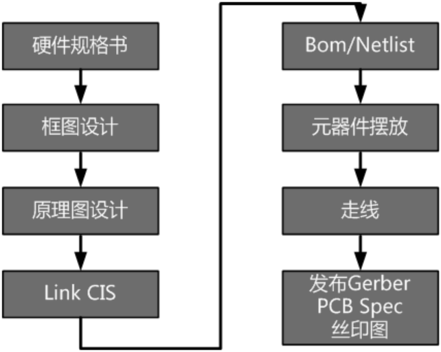 

常见电子产品，可以通过以下几个渠道进行方案分析。

1. 市场上有竞品的，直接购买使用、拆解看方案。
2. 没有竞品的，寻找相关度比较大的方案，购买使用、拆解看方案。
3. 咨询芯片方案代理商获取方案资料。
4. 拜访方案商厂家，了解方案架构。
5. 参加行业相关展会，收集产品信息
6. 网络查找：确定关键词 xx方案 xx模块

- [搜索引擎](https://www.baidu.com/)
- [1688](https://www.1688.com/) 、 [万能的taobao](https://www.taobao.com/)
- 方案类网站 [IOT智库](https://www.iotku.com/) [我爱方案网](http://www.52solution.com/) [华秋开发](http://www.elecfans.com/kf/) [方案交易网](http://www.winpcba.com/) [方案](https://www.ebaina.com/)

分析方案后，确定系统框图

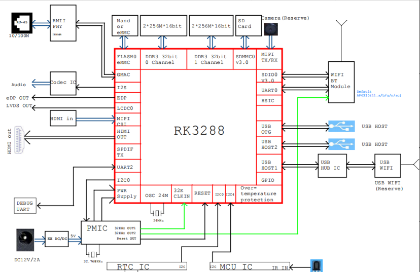 

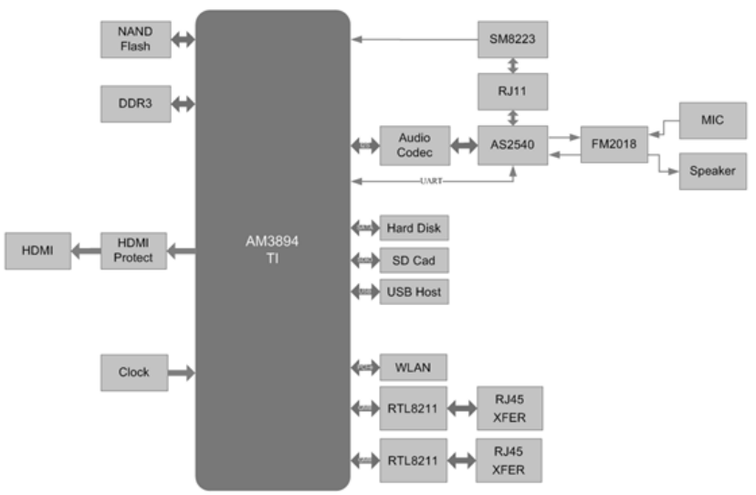 

**2.1 方案查找**

不同位数处理器常见用途（仅为参考）：

|           |                              |                     |
| --------- | ---------------------------- | ------------------- |
| 不同位数处理器用途 |                              |                     |
| 处理器       | 8位                           | 小家电、遥控器、鼠标、锂电池、数码产品 |
| 16位       | 电表、马达、电动玩具、电话录音、键盘、计算机键盘、鼠标  |                     |
| 32位       | 智能家居、物联网、指纹识别、电机、安防、无线耳机、手环  |                     |
| 64位       | 网络音乐、娱乐设备、多媒体、音视频相关、网关、手表、音箱 |                     |

**2.1.1 小家电低配类芯片方案**

[华秋芯片选型](https://www.hqchip.com/app/1378) 

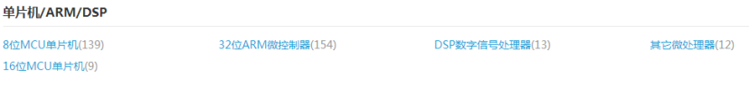 

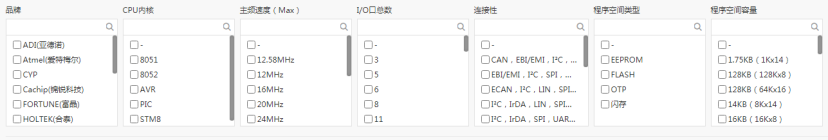 

[立创芯片选型](https://list.szlcsc.com/catalog/470.html) 

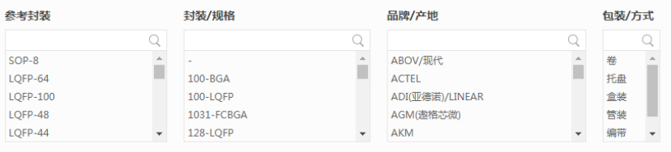 

知名厂家：

**国外：**

• 瑞萨电子(Renesas)
• 恩智浦(NXP)+飞思卡尔(Freescale)(后者被前者收购)
• 微芯科技(Microchip)+爱特梅尔(Atmel)(后者被前者收购)
• 意法半导体(ST)
• 英飞凌(Infineon)
• 德州仪器(TI)

**台湾：**

• 新唐科技
• 合泰半导体
• 义隆电子
• 松翰科技
• 凌阳科技

**大陆：**

• 中颖电子
• 炬力
• 华润微电子
• 北京君正
• 兆易创新
• 紫光微电子
• 爱思科
• 芯海科技
• 富瀚微

**2.1.2 物联网网络类芯片方案**

这里主要针对物理层、数据链路层的芯片和模组进行说明。

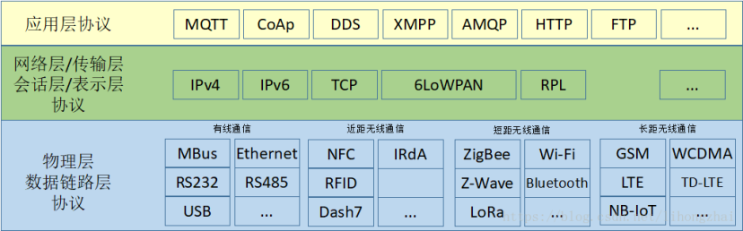 

**短距离：**

• ZigBee、蓝牙、RFID、NFC、UWB、WiFi等

**长距离：**

• LoRa、NB-IoT（低功耗，广域）
• 2G：TDMA，CDMA，GSM…
• 3G：UMTS，HSDPA，WCDMA…
• 4G：LTE，EC-GSM，eMTC…
• 5G：

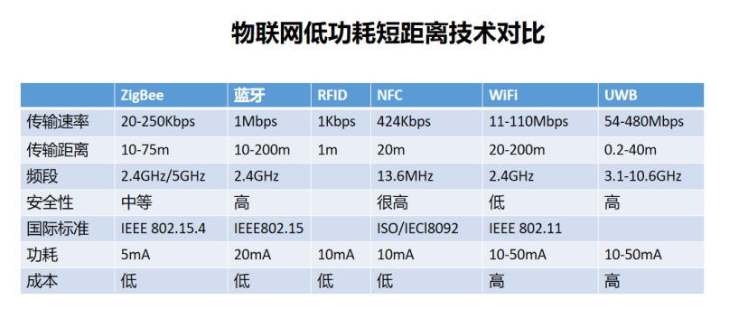 

 

**芯片方案**

• 海思半导体 http://www.hisilicon.com/
• 高通 http://www.qualcomm.cn/
• 深圳市中兴微 http://www.sanechips.com.cn/
• 锐迪科微电子 http://www.rdamicro.com/
• Nordic http://www.nordicsemi.com/
• 台湾联发科 https://www.mediatek.tw/
• 紫光展锐
• 乐鑫
• 汇顶科技
• ASR
• 恩智浦
• 德州仪器
• 博通
•  [瑞昱](https://www.realtek.com/zh-tw/)
• Marvell

**模组方案**

• 移远 http://www.quectel.com/cn/
• 广和通
• 厦门骐俊物联 www.cheerzing.com
• 移柯通信http://www.mobiletek.cn/
• 中移物联网 http://iot.10086.cn/
• 中兴物联 http://www.ztewelink.com/
• 利尔达科技集团
• 有方科技
• 汉枫
• 庆科
• 环旭
• 博鹏发RF-LINK
• 海华科技
• Broadlink
• 正基

**2.1.3 中高端消费电子芯片方案**

• 博通公司 https://www.broadcom.cn/
• 高通 https://www.qualcomm.cn/
• 英伟达 https://www.nvidia.cn/
• 联发科 https://www.mediatek.cn/
• 海思 https://www.hisilicon.com/cn/
• AMD超微 https://www.amd.com/zh-hans
• 英特尔 https://www.intel.cn/content/www/cn/zh/homepage.html
• 恩智浦
• 三星半导体 https://www.samsung.com/semiconductor/cn/
• 赛灵思 https://www.xilinx.com/
• 紫光展锐
• 瑞芯微
• 全志

**2.1.4 工业类、汽车电子类芯片方案**

• 恩智浦
• 高通 https://www.qualcomm.cn/
• 英伟达 https://www.nvidia.cn/
• 英特尔 https://www.intel.cn/content/www/cn/zh/homepage.html
• 安森美
• 微芯
• ADI
• 瑞萨电子
• 英飞凌
• 东芝

**汽车类方案FYI：**

• 谷歌 Waymo：采用英特尔 CPU + Altera FPGA 方案，英飞凌 MCU 作为通信接口。谷歌 Waymo 的计算平台采用英特尔 Xeon 12 核以上 CPU，搭配 Altera 的 Arria系列 FPGA，并采用英飞凌的 Aurix 系列 MCU 作为 CAN 或 FlexRay 网络的通信接。

• 百度 Apollo： 恩智浦/英飞凌/瑞萨 MCU+赛灵思 FPGA/英伟达 GPU。

• 奥迪： Mobileye ASIC + 英伟达 GPU + Altera FPGA + 英飞凌 MCU 的多芯片集成方案。

[车规级芯片介绍](https://tech.hqew.com/sudi_2066333)

**2.1.5 PC、电脑类工控机方案**

IntelAMD是目前最大的两家电脑CPU生产厂商，还有IBM、ARM公司也生产自己的CPU。

国产CPU处理器厂商有兆芯、海光、龙芯等。

**2.1.6 传感器&外设**

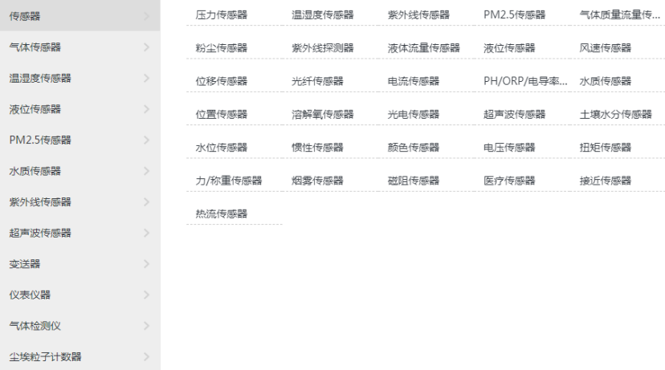 

相关传感器外设专用查找网站如下：

[华秋商城](https://www.hqchip.com/app)

[ofweek商城](https://mall.ofweek.com/)

[采芯网](https://www.findic.com/)

[马可波罗](http://china.makepolo.com/list/d4/)

**2.1.7 屏幕相关**

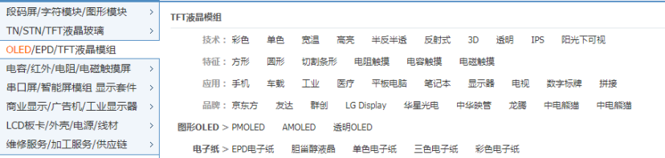 

[屏库](https://www.panelook.cn/index_cn.php)

**2.1.8 电池相关**

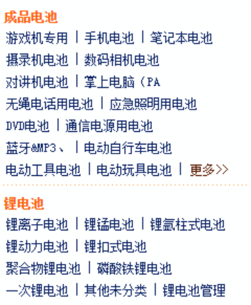 

[电池网](http://www.batterydir.com/product/)

[全球锂电池](http://li.china-nengyuan.com/)

[全球电池网](http://www.qqdcw.com/cp/cp.xhtml)

[电池网2](http://www.itdcw.com/mqmp/)

**2.1.9 执行机构**

[**直流电机**](http://www.31mada.com/product/11-1-1.html)

[直流电动机](http://www.31mada.com/product/1111-1-1.html) : [永磁式直流电机](http://www.31mada.com/product/111111-1-1.html) | [电磁式直流电机](http://www.31mada.com/product/111112-1-1.html) | [直流力矩电机](http://www.31mada.com/product/111113-1-1.html) [永磁式直线直流电机](http://www.31mada.com/product/1112-1-1.html) : [动圈式直线电机](http://www.31mada.com/product/111211-1-1.html) | [摆动式直线电机](http://www.31mada.com/product/111212-1-1.html)

[无刷直流电机](http://www.31mada.com/product/1113-1-1.html) : [有槽电枢无刷直流电机](http://www.31mada.com/product/111311-1-1.html) | [无槽电枢无刷直流电机](http://www.31mada.com/product/111312-1-1.html) | [绕线盘式电枢无刷直流电机](http://www.31mada.com/product/111313-1-1.html) | [片状电枢无刷直流电机](http://www.31mada.com/product/111314-1-1.html) | [无刷直流力矩电机](http://www.31mada.com/product/111315-1-1.html)

[交直流两用电机](http://www.31mada.com/product/1114-1-1.html) | [电机扩大机](http://www.31mada.com/product/1115-1-1.html) | [变流机](http://www.31mada.com/product/1116-1-1.html)

[**步进电机**](http://www.31mada.com/product/13-1-1.html)

[磁阻式步进电机](http://www.31mada.com/product/1311-1-1.html) : [分步式步进电机](http://www.31mada.com/product/131111-1-1.html) | [多段式步进电机](http://www.31mada.com/product/131112-1-1.html)

[永磁式步进电机](http://www.31mada.com/product/1312-1-1.html) : [隐极式步进电机](http://www.31mada.com/product/131211-1-1.html) | [单相永磁步进电机](http://www.31mada.com/product/131212-1-1.html)

[直线与平面步进电机](http://www.31mada.com/product/1313-1-1.html) : [磁阻式直线与平面步进电机](http://www.31mada.com/product/131311-1-1.html) | [混合式直线与平面步进电机](http://www.31mada.com/product/131312-1-1.html) | [螺旋式步进电机](http://www.31mada.com/product/1315-1-1.html)

[**交流电机**](http://www.31mada.com/product/12-1-1.html)

[异步电动机](http://www.31mada.com/product/1211-1-1.html) : [三相异步电动机](http://www.31mada.com/product/121111-1-1.html) | [单相异步电动机](http://www.31mada.com/product/121112-1-1.html)

[交流伺服电动机](http://www.31mada.com/product/1212-1-1.html) : [鼠笼转子伺服电动机](http://www.31mada.com/product/121211-1-1.html) | [非磁性空心杯转子伺服电动机](http://www.31mada.com/product/121212-1-1.html) [交流力矩电动机](http://www.31mada.com/product/1213-1-1.html)

[同步电动机](http://www.31mada.com/product/1214-1-1.html) : [永磁式同步电动机](http://www.31mada.com/product/121411-1-1.html) | [磁滞式同步电动机](http://www.31mada.com/product/121412-1-1.html) | [磁阻式同步电动机](http://www.31mada.com/product/121413-1-1.html) | [电磁减速式同步电动机](http://www.31mada.com/product/121414-1-1.html)

[交流直线电机](http://www.31mada.com/product/1215-1-1.html) : [同步式直线电动机](http://www.31mada.com/product/121511-1-1.html) | [异步式直线电动机](http://www.31mada.com/product/121512-1-1.html)

[交流发电机](http://www.31mada.com/product/1216-1-1.html) : [同步发电机](http://www.31mada.com/product/121611-1-1.html) | [异步发电机](http://www.31mada.com/product/121612-1-1.html)

[**传感电机**](http://www.31mada.com/product/14-1-1.html)

[自整角机](http://www.31mada.com/product/1411-1-1.html) | [旋转变压器](http://www.31mada.com/product/1412-1-1.html) | [测速发电机](http://www.31mada.com/product/1413-1-1.html) | [多极自整角与旋转变压器](http://www.31mada.com/product/1414-1-1.html)

[**专用电机**](http://www.31mada.com/product/16-1-1.html)

[机械设备用电动机](http://www.31mada.com/product/1611-1-1.html) | [调速电机](http://www.31mada.com/product/1612-1-1.html) | [工具用电机](http://www.31mada.com/product/1613-1-1.html) | [电动车用电动机](http://www.31mada.com/product/1614-1-1.html)

[振动电机](http://www.31mada.com/product/1615-1-1.html)

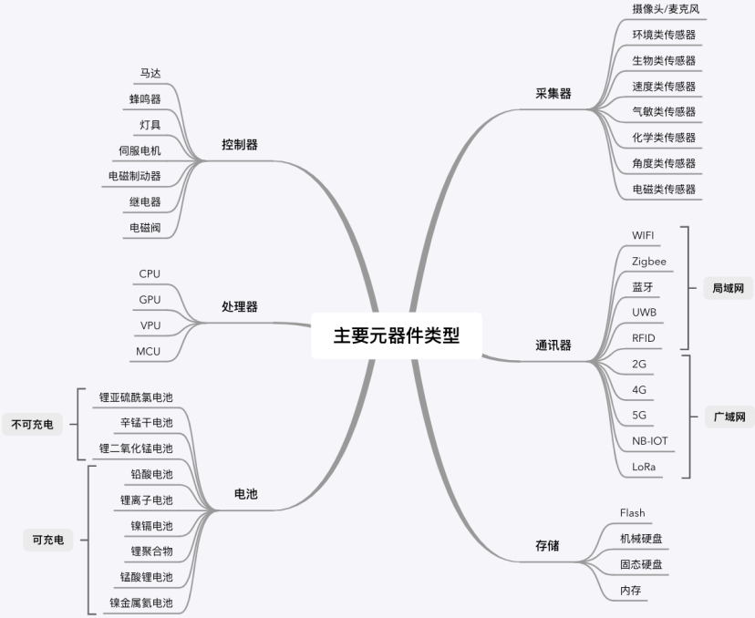 

**2.2 方案验证&评审**  

**确定硬件方案后，开始推进方案进行评审，输出评审报告。**

评审报告应包含以下项：

• 功能能否全部覆盖？
• 性能能否满足业务？
• 成本是否在设计范围内？
• 技术可行性风险评分？
• 相关方案芯片器件采购是否存在风险？
• 相关认证标准是否能满足？
• 芯片器件替代方案是否合理？

评审通过的方案，将进入硬件开发阶段：

[华为硬件设计规范](https://wenku.baidu.com/view/5b2ebb3ec1c708a1294a4437.html)
[硬件流程与开发规范](https://wenku.baidu.com/view/41a0fbc2148884868762caaedd3383c4ba4cb424.html)

开发完成将会进行设计评审：

[硬件开发评审](https://wenku.baidu.com/view/7a8f2ecf0d22590102020740be1e650e52eacfcd.html)
[单板设计评审](https://zhuanlan.zhihu.com/p/94006043)

## 三、 生产加工类

PCB生产贴片推荐：

[华秋贴片](https://www.hqchip.com/)

[立创PCB](https://www.szlcsc.com/)

## 四、 工具类

**4.1 如何计算电池寿命、充电等等硬件相关参数？**

[硬件参数计算器](http://www.eechina.com/tools/) 

**4.2 如何看芯片丝印查询具体芯片型号？**

[丝印反查网](http://www.smdmark.com/) 

**4.3 哪里可以找到芯片参数手册？**

[半导小芯](http://www.semiee.com/)

[元器件查询](https://pdf.elecfans.com/)

[21IC](https://www.21icsearch.com/)

**4.4 哪里有硬件相关的技术资料下载？**

[电子工程网](http://www.eechina.com/download.php)

**4.5 哪里能找到电子类的展会信息?**

[电子展](http://www.cef114.com/)

**4.6 各种硬件相关论坛网站**

• http://www.elecfans.com/ 电子发烧友

• http://[www.dzbzw.com/](http://www.dzbzw.com/) | 电路图下载_说明书下载_标准下载 - 电子标准网

• https://[www.ebaina.com/](http://www.ebaina.com/) | 易百纳技术社区-权威的AI物联网嵌入式开发平台

• https://[www.chyxx.com/](http://www.chyxx.com/) | 中国产业信息网 - 产业前景投资趋势门户-智研旗下产业信息咨询平台

• https://[www.cirmall.com/](http://www.cirmall.com/) | 电路城—专为中国工程师量身打造的电路图、设计方案、资料、技术信息分享平台，致力于成为电子工程师技能进阶的电子设计资源库

• https://[www.zaixinjian.com/](http://www.zaixinjian.com/) | 在芯间-电子元器件采购平台

• http://[www.cmfdesignaward.com/](http://www.cmfdesignaward.com/) | 国际CMF设计奖

• https://[www.shejipi.com/#2](http://www.shejipi.com/#2) | 设计癖 | 关注设计癖 提升幸福感

• https://[www.ifanr.com/](http://www.ifanr.com/) | 爱范儿 · 让未来触手可及

• https://[www.mydrivers.com/](http://www.mydrivers.com/) | 快科技(原驱动之家)--科技改变未来

• https://36kr.com/topics/1004491457024515 | 复盘，人人都要掌握的进步秘籍__热点专题_创投_房产_政策_新闻_36氪

• http://[www.52audio.com/](http://www.52audio.com/) | 我爱音频网 – 我们只谈音频

• http://[www.52audio.com/archives/category/teardowns](http://www.52audio.com/archives/category/teardowns) | 拆解 – 我爱音频网

## 五、参考链接

• 国内外MCU厂家

• https://blog.csdn.net/u012308586/article/details/89706902

• http://www.elecfans.com/d/859966.html

• http://www.elecfans.com/d/1473216.html

• 物联网芯片

• http://news.rfidworld.com.cn/2018_11/210cabc88cd83459.html

• http://www.zlzw188.com/index.php?s=/home/index/news_detail/id/4353.html

• http://www.qianjia.com/html/2018-11/16_311844.html

• http://www.riswing.com/index.php/new/index/g/c/id/12.html

• 模组厂家

• https://www.sohu.com/a/163872633_609521

• https://zhuanlan.zhihu.com/p/162702605

• wifi芯片&模组

• http://www.360doc.com/content/16/0511/18/31509987_558294694.shtml

• 蓝牙芯片

• https://tech.hqew.com/fangan_2018763

• http://www.elecfans.com/d/812572.html

• 汽车IC

• https://www.cnblogs.com/topeet/p/9936304.html

• https://blog.csdn.net/weixin_44124323/article/details/106386676

• https://www.sohu.com/a/285927012_132567

• 硬件设计从框图到PCBA

• https://www.witimes.com/hardware-from-design-to-pcba/