## 介绍

单片机是一种集成了处理器、存储器和外设接口等多种功能于一体的微型计算机、简称MCU。

单片机的优点是<mark style="background: #BBFABBA6;">体积小、功耗低、成本低</mark>，可以实现高效的控制和处理任务。

芯片中断：功能使得程序具备<mark style="background: #BBFABBA6;">紧急事件实时处理</mark>能力。

IIC总线通信
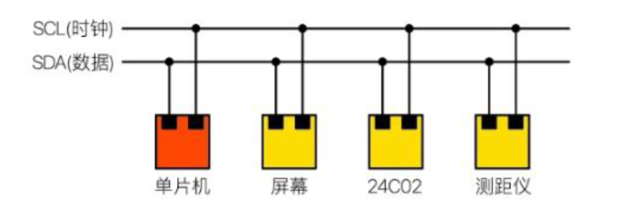

<mark style="background: #FF5582A6;">看门狗</mark>是一种监控单片机正常运行的电路。程序发生死循环的时候（跑飞），能够<mark style="background: #BBFABBA6;">自动复位</mark>。

[立创商城元器件查询手册](https://so.szlcsc.com/global.html?k=stc89c52&hot-key=AD7606BSTZ-RL)

- 厂家命名规则 (STC 89 C 52 RC - 40 I - LQFP 44)
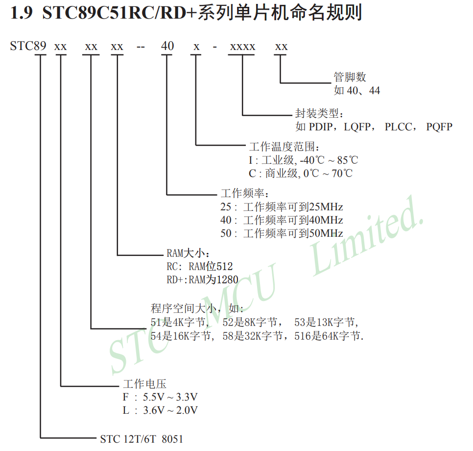

[环境搭建-下载](https://x509p6c8to.feishu.cn/wiki/YprHwje1biStpdkg8N6cIElBnwc)

[固件烧录](https://x509p6c8to.feishu.cn/wiki/M00gwFX3WilLe0kiAmBcPBUsnLc)

## 点亮LED

一般<mark style="background: #BBFABBA6;">插件</mark>LED电流是<mark style="background: #FFB86CA6;">20ma</mark>左右，压降:红/黄色1.8V, 蓝/白色 3V， 实际电压要看 LED 规格书。

一般<mark style="background: #BBFABBA6;">贴片</mark>LED电流是<mark style="background: #FFB86CA6;">5ma</mark>左右，压降:红/绿/橙色1.8V，蓝/白色 3V

例如：供电电压是3.3V，黄色贴片LED，根据 $V = I * R$ ，则 $R= \frac {(3.3 - 1.8)}{0.005} （5ma = 0.005）$, 所以 $R = 300$ 欧姆.

很多时候你看到别人设计的电路中，LED串联的电阻去到几百欧或几千欧都有，是设计错了吗？

实际上这是非常合理的，因为大多数电路中，LED只是一个提示灯，对亮度没有要求，反而希望把功耗降低，所以<mark style="background: #FFB86CA6;">需要增大限流电阻来实现超低电流</mark>，像产品中的贴片LED去到0.5ma也是能看清楚灯光的。

**我们一般选择利用电源直接供电，电流灌入单片机IO口的方式来给LED灯供电**

> P2 = 0x53 = 0101 0011(16 进制)

|二进制位（8 位）|b7（第 7 位）|b6（第 6 位）|b5（第 5 位）|b4（第 4 位）|b3（第 3 位）|b2（第 2 位）|b1（第 1 位）|b0（第 0 位）|
|---|---|---|---|---|---|---|---|---|
|P2 口引脚|P2.7|P2.6|P2.5|P2.4|P2.3|P2.2|P2.1|P2.0|
|0x53 的二进制值|0|1|0|1|0|0|1|1|
IO 口的位赋值为`1`表示输出**高电平**，赋值为`0`表示输出**低电平**

> P2=0x00; //0000 0000 设置P2.0-P2.7输出都为低电平

[编译器编译为汇编代码](https://godbolt.org/)

- 闪烁控制
```c
#include <reg52.h>

sbit led = P2^7;

//带参延时函数 外层500ms，内层是CPU主频从124减到1大约是1ms
void delay_ms(unsigned int xms)   //@12MHz
{
    unsigned int i, j;
    for(i=xms;i>0;i--)
    {
        for(j=124;j>0;j--)
        {}
    }
}

void main()
{
    while(1)
    {
        led = 0;
        delay_ms(500);
        led = 1;
        delay_ms(500);
    }
}
```

- 流水灯
```c
#include <reg52.h>

void delay_ms(unsigned int xms) 
{
    unsigned int i, j;
    for(i=xms;i>0;i--)
    {
        for(j=124;j>0;j--)
        {}
    }
}

// 让 P2 口的第num位输出低电平(点亮对应 LED)，其余位保持高电平
// 移位操作 1 << num：把数字 1 按位左移num位
void open_led(unsigned int num){
    P2 = 0xFF & ~(1 << num);
}

void main()
{
    while(1)
    {
        open_led(7);
        delay_ms(500);
        open_led(6);
        delay_ms(500);
        open_led(5);
        delay_ms(500);
    }
}
```

## 按键

按键按下时，引脚会被<mark style="background: #FF5582A6;">连接到GND</mark>，这时候<mark style="background: #BBFABBA6;">引脚是低电平</mark>，按键松开时，引脚会被<mark style="background: #FF5582A6;">上拉到电源</mark>，这时候<mark style="background: #BBFABBA6;">引脚会变成高电平</mark>，那我们就可以通过读取引脚的电平变化，来判断按键是按下还是松开了。

以TTL电路为例：
TTL电源电压是3.3V，<mark style="background: #BBFABBA6;">高电平是2.4V--3.3V</mark>，<mark style="background: #ABF7F7A6;">低电平0V--0.8V</mark>，按照惯例，使用1来表示高电平，使用0表示低电平。

看原理图可知，板卡上有三个按键，分别接到P3.5 P3.6 P3.7三个IO上，即
```c
#include <reg52.h>

sbit led1= P2^7;         
sbit key1 = P3^7;

void main()
{
    while(1)
    {
        //当按键按下时灯切换
        if(key1 == 0)
        {
            led1= ~led1;
        }
    }                
}
```

- 按键去抖
上面的代码，在实测效果时，有时候我们会发现按下抬起时，灯会变化两次状态，其实这是因为按键在闭合和断开时，**机械触点**会存在抖动现象，所以需要消抖。

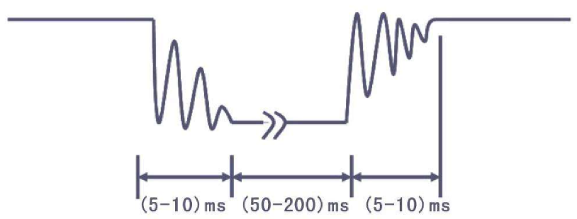

```c
#include <reg52.h>

sbit led1=P2^7;         
sbit key1 = P3^7;

//延时ms函数，参数用来改变延时的具体时间
void delay_ms(unsigned int xms)   //@12MHz
{
    unsigned int i, j;
    for(i=xms;i>0;i--)
    {
        for(j=124;j>0;j--)
        {}
    }
}

//主函数
void main()
{
    while(1) // 死循环：持续检测按键
    {
        //当按键按下时灯切换
        if(key1 == 0)
        {
            delay_ms(10);       // 10ms消抖延时
            if(key1 == 0){      // 再次检测按键是否真的按下
                led1= ~led1;    // LED状态翻转
                delay_ms(1000); // 保持状态1秒
            }
        }
    }                
}
```

## 数码管

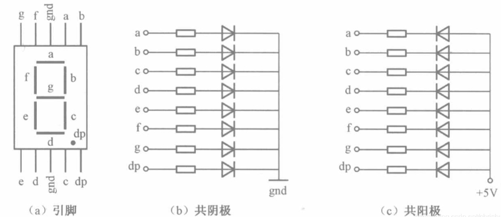

- 单片机控制数码管的问题

1. **IO的驱动能力不够**，51单片机的引脚<mark style="background: #FFB86CA6;">拉电流能力很一般</mark>，1mA左右，直接点亮数码管驱动能力明显不够，这时我们可以<mark style="background: #BBFABBA6;">用三极管电路来增加IO的驱动能力</mark>。

但是，如果我们需要控制多路IO，三极管电路就会显得有点麻烦了，器件非常多。可以考虑集成芯片方案，用一颗74HC245芯片来增加单片机引脚的驱动能力。

```C
#include <reg52.h>       

int main()         //主函数
{
 P2 = 0x06;         //送入段选信号 0x06为16进制表示方法，转换为二进制为0000 0110，代表着显示数字1
 while(1);          //程序到这里停止
}
```

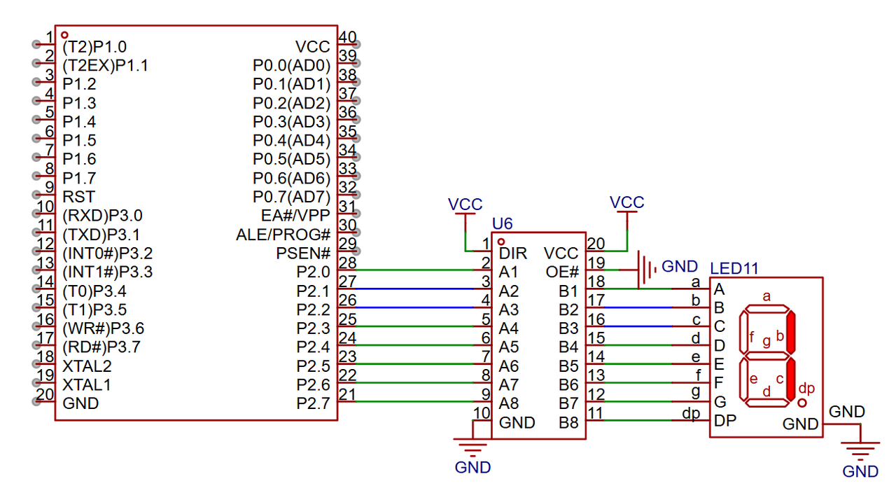

|   |   |   |   |
|---|---|---|---|
|16进制表示|显示的数字|点亮的位置|二进制表示|
|0x3f|0|abcdef亮|00111111|
|0x06|1|bc亮|00000110|
|0x5b|2|abdeg亮|01011011|
|0x4f|3|abcdg亮|01001111|
|0x66|4|abcdg亮|01100110|
|0x6d|5|acdfg亮|01101101|
|0x7d|6|acdefg亮|01111101|
|0x07|7|abc亮|00000111|
|0x7f|8|abcdefg亮|01111111|
|0x6f|9|abcdfg亮|01101111|
|0x77|A|abcefg亮|01110111|
|0x7c|B|cdefg亮|01111100|
|0x39|C|adef亮|00111001|
|0x5e|D|bcdeg亮|01011110|
|0x79|E|adefg亮|01111001|
|0x71|F|aefg亮|01110001|
|0x00|熄灭|全灭|00000000|

如果需要循环显示0-10数字，可以参考，**无需烧录验证，因为开发板没有这部分电路**

```C
#include <reg52.h>

unsigned char table[]={
0x3f,0x06,0x5b,0x4f,
0x66,0x6d,0x7d,0x07,
0x7f,0x6f
};

unsigned char num;

//带参延时函数
void delay_ms(unsigned int xms)   //@12MHz
{
    unsigned int i, j;
    for(i=xms;i>0;i--)
    {
        for(j=124;j>0;j--)
        {}
    }
}

void main()
{
    while(1)
    {        
        for(num=0;num<10;num++)
        {
           P0=table[num];
           delay_ms(500);        
        }
    }
}
```

2. **IO数量不够**

51单片机也就32个IO，如果我们要驱动两个数码管，用上述方法，需要16个IO，驱动三个数码管需要24个IO，那其它功能就没办法做了。

如何用3个IO控制一个数码管?
这时我们就可以考虑这类串行转并行的芯片方案了。简单来说就是通过一个IO控制8个IO的输出，该芯片就是74HC595。

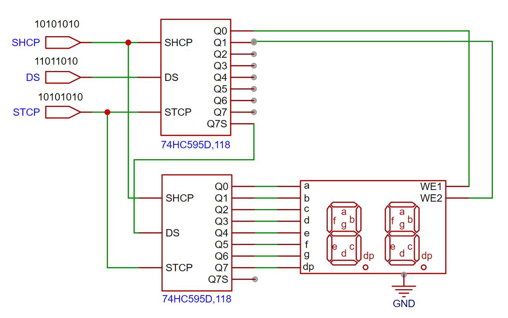

利用**74HC595 串行转并行芯片**，仅通过 3 个单片机 IO 口（ds_pin、stcp_pin、shcp_pin）实现对至少 2 个数码管的控制：在第一个数码管固定显示数字 0，第二个数码管固定显示数字 3。

```C
#include <reg52.h>

sbit ds_pin = P0^3;   // 数据输入引脚（DS）：传输串行数据
sbit stcp_pin = P0^4; // 锁存时钟引脚（STCP）：将移位寄存器数据锁存到输出寄存器
sbit shcp_pin = P0^5; // 移位时钟引脚（SHCP）：控制数据逐位移入移位寄存器

//共阴 数码管数组：0-9
unsigned char num[]={0x3F,0x06,0x5B,0x4F,0x66,0x6D,0x7D,0x07,0x7F,0x6F};

void hc595_send_byte(unsigned char byte)
{
        unsigned int i;
        for(i = 0; i < 8; i++)
        {
                //串行输入引脚，所谓串行就是使数据在一根信号线上按顺序一位一位地传输
                if(byte & 0x80)
                        ds_pin = 1;
                else
                        ds_pin = 0;
                //SHCP发生一次上升沿的时候，74HC595才会从DS引脚上取得当前的数据
                shcp_pin = 0;
                shcp_pin = 1;
                byte <<= 1;
        }
}

//num-需要显示的内容 addr-在哪个数码管显示
void hc595_send_data(unsigned char num, unsigned char addr)
{
        hc595_send_byte(num); //先发需要显示的数字
        //我们将移位寄存器的8个位填满后，再往移位寄存器中塞数据，数据会被从9脚输出。
        //再发需要点亮的数码管，这时候移位寄存器中的数据被移位到第二个595中
        if(addr == 0)
            hc595_send_byte(0xFE);  //Q0控制  0b1111 1110 0xFE 
        else if(addr == 1)    
            hc595_send_byte(0xFD);  //Q1控制  0b1111 1101 0xFD 
        //当移位寄存器的8位数据全部传输完毕后，制造一次锁存器时钟引脚的上升沿（先拉低电平再拉高电平）
        stcp_pin = 0;
        stcp_pin = 1;
}

void main(){
  while(1)
  {
    //在第一个数码管显示数字0
    hc595_send_data(num[0], 0);
    //在第二个数码管显示数字3
    hc595_send_data(num[3], 1);
  }
}
```

## IO端口四种模式

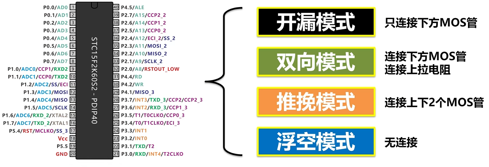

## 中断

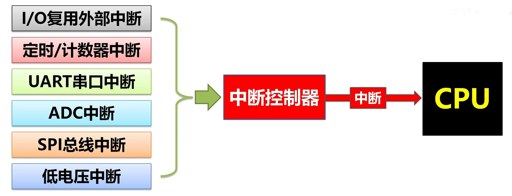

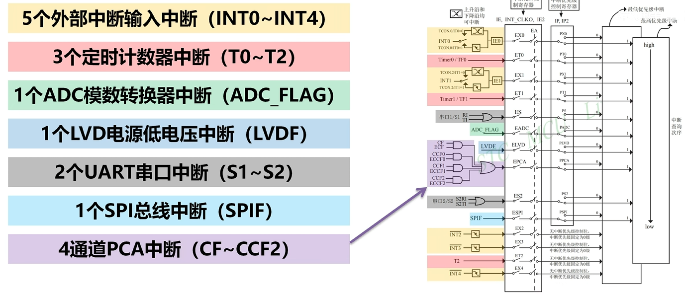

- 中断初始化
```c
void exti0_init(void)
{
    IT2=1;//触发方式：下降沿
    EX2=1;//打开 INT2 的中断允许
    EA=1;//打开总中断
}
```

```c
#include <reg52.h>

sfr P4    = 0xe8;           //定义 P4 口的寄存器地址
sbit INT2 = P4^3; // 定义外部中断 2（INT2）对应的引脚
sbit INT3 = P4^2; // 定义外部中断 3（INT3）对应的引脚

sfr XICON = 0xc0;           //定义扩展中断控制寄存器（XICON）的地址
sbit PX3  = XICON^7;
sbit EX3  = XICON^6;
sbit IE3  = XICON^5;
sbit IT3  = XICON^4;
sbit PX2  = XICON^3;
sbit EX2  = XICON^2;
sbit IE2  = XICON^1;
sbit IT2  = XICON^0;

sbit key1 = P4^3;
sbit led1 = P2^7;

void delay_ms(unsigned int xms)   //@12MHz
{
    unsigned int i, j;
    for(i=xms;i>0;i--)
    {
        for(j=124;j>0;j--)
        {}
    }
}

void exit2() interrupt 6
{
        //当按键按下时灯切换
  if(key1 == 0)
  {
     led1= ~led1;
     delay_ms(1000);
  }
}

void main()
{
    IT2 = 1; //设置中断触发条件为下降沿
    EX2 = 1; //运行中断2经过
    EA = 1;  //使能中断
  
    while(1)
    {
         delay_ms(20000);
    }                
}
```

|位定义|功能说明|
|---|---|
|PX3|INT3 的中断优先级（1 = 高优先级，0 = 低优先级）|
|EX3|INT3 的中断使能位（1 = 开启，0 = 关闭）|
|IE3|INT3 的中断请求标志位（触发中断后由硬件置 1，中断响应后清 0）|
|IT3|INT3 的触发方式（1 = 下降沿触发，0 = 低电平触发）|
|PX2|INT2 的中断优先级（代码未使用）|
|EX2|INT2 的中断使能位（1 = 开启，0 = 关闭）|
|IE2|INT2 的中断请求标志位（硬件自动处理）|
|IT2|INT2 的触发方式（1 = 下降沿触发，0 = 低电平触发）|

## 定时器

可以根据设定的时间间隔，准时产生触发信号，用于控制程序的执行流程。

是 使能 `定时器0` 定时10ms 的完整程序
```c
#include <reg52.h>

#define TIMS (65536-9216)
                     
void main()
{
        TMOD = 0x01;                    //配置定时器0为16位定时器，TH0、TL0全用
        TH0 = TIMS >> 8;                //设置定时初值高8位
        TL0 = TIMS;                     //设置定时初值低8位
        ET0 = 1;  //开启定时器0中断                                          
        EA  = 1;  //开启全局中断                                                      
        TR0 = 1;  //定时器0开始计数        
        while(1);
}

//10ms执行一次
void Timer0() interrupt 1
{
        //每次产生中断后重新设置下次定时器初值 
        TH0 = TIMS >> 8;
        TL0 = TIMS;
        //这里可以写中断函数要执行的操作
}
```

## 串行口通讯

- <mark style="background: #BBFABBA6;">串行通信</mark>是指使用一条数据线，将数据一位一位地依次传输，每一位数据占据一个固定的时间长度。
- <mark style="background: #BBFABBA6;">并行通信</mark>通常是将数据字节的各位用多条数据线同时进行传送，通常是8位，16位，32位等数据一起传输。

**串行通信的基本方式**

1. 单工通信：数据只能单方向传输。
2. 半双工通信：通信双方交替进行双向数据传输，但两个方向的传输不能同时进行。
3. **全双工通信**：通信双方可同时进行数据收发的工作方式。51单片机的串行口是**全双工**传输方式。

串口常用的电平标准有如下三种：

- TTL电平（transistor transistor logic ）： +3V~+5V 表示 1 ， 0V 表示 0
- RS232 电平： -3~-15V 表示 1 ， +3~+15V 表示 0
- RS485 电平：两线压差 +2~+6V 表示 1 ， -2~-6V 表示 0 （差分信号）

**串口的数据结构**


## 蜂鸣器

蜂鸣器是一种<mark style="background: #BBFABBA6;">将电信号转换为声音信号</mark>的器件，常用来产生设备的按键音、报警音等提示信号。

有源蜂鸣器：内部自带振荡源，将正负极接上直流电压即可持续发声，频率固定。

无源蜂鸣器：内部不带振荡源，需要控制器提供振荡脉冲才可发声，调整提供振荡脉冲的频率，可发出不同频率的声音。

蜂鸣器有正负极，顶部印有+号的为正极，若蜂鸣器引脚没剪，则长的为正极。

```C
#include<reg52.h>

sbit speak=P2^1;

//带参延时函数
void delay_ms(unsigned int xms)   //@12MHz
{
    unsigned int i, j;
    for(i=xms;i>0;i--)
    {
        for(j=124;j>0;j--)
        {}
    }
}

void main()
{
   while(1){
   speak=1;
   delay_ms(1);
   speak=0;
   delay_ms(1); 
   }
}
```

## IIC

I2C：一种同步的、多主从的串行通信协议。<mark style="background: #FFB86CA6;">半双工</mark>通信。它使用非常少的引脚（<mark style="background: #FF5582A6;">两根线</mark>）就可以连接多个从设备。这两根线一根是<mark style="background: #ABF7F7A6;">时钟线</mark>，一根是<mark style="background: #ABF7F7A6;">数据线</mark>。

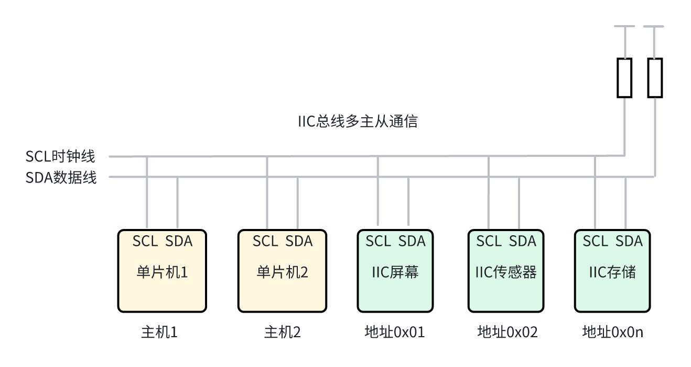

UART：一种异步的、<mark style="background: #BBFABBA6;">点对点</mark>的串行通信协议。它通常用于两个设备之间的<mark style="background: #FFB86CA6;">全双工</mark>通信。你需要<mark style="background: #FF5582A6;">三根数据线</mark>（<mark style="background: #ABF7F7A6;">TX、RX、GND</mark>）来实现双向通信。

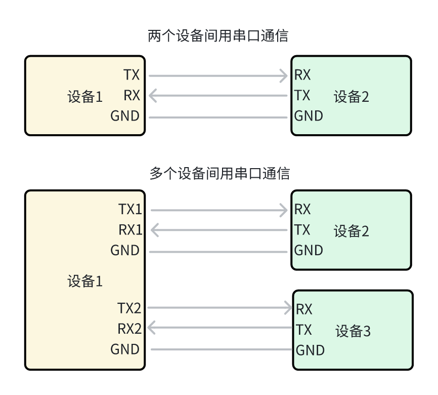

IIC总线会<mark style="background: #ABF7F7A6;">默认需要接上拉电阻</mark>，在没有设备发送数据时，使得IIC总线电平为高电平，也就是如果IIC两根线的电平都为高电平时，代表总线当前为空闲状态。

特别注意：一条总线上的<mark style="background: #BBFABBA6;">每个从设备都有唯一的地址</mark>。

> IIC如何发送数据?  例如：主机通过 IIC 发送 0xF5(<mark style="background: #ABF7F7A6;">0b1111 0101</mark>)

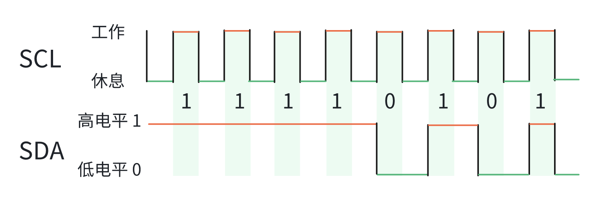

1. IIC的有效数据，是在<mark style="background: #FF5582A6;">SCL高电平</mark>时读取的<mark style="background: #FFF3A3A6;">SDA电平</mark>。
2. IIC的通信速率，是由SCL的速率决定的，SCL翻转速度越快，IIC总线速率越高，实际使用IIC的速率，需要根据从机，传感器可支持的最大速率而定。

> IIC通信帧构成

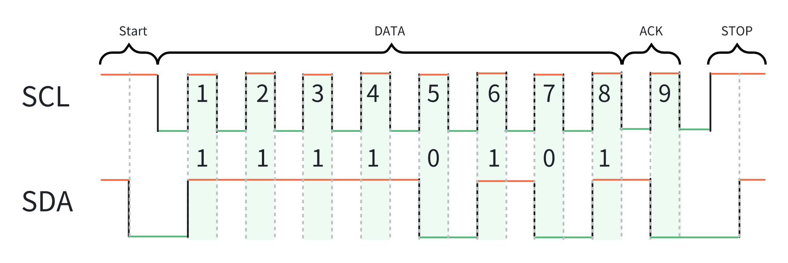

一次完整的IIC通信，除了要发送数据外，还需要有其它信号一起完成，例如起始信号、一个或多个数据帧、应答位、停止信号组成。

**主机发送/读取数据到从机**
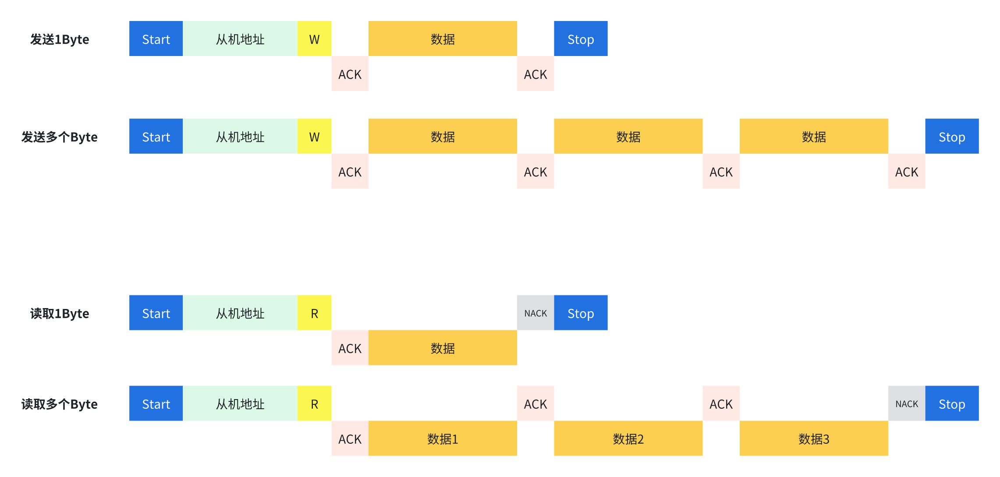

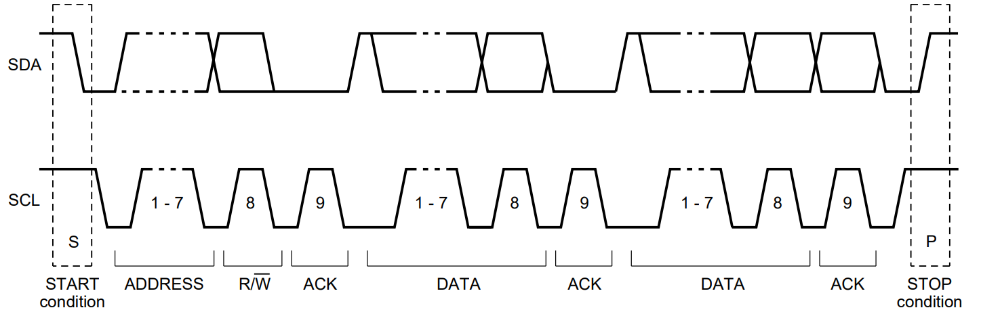

**空闲状态**：SCL线与SDA线<mark style="background: #BBFABBA6;">均处于高电平</mark>状态，<mark style="background: #ABF7F7A6;">等待起始信号</mark>

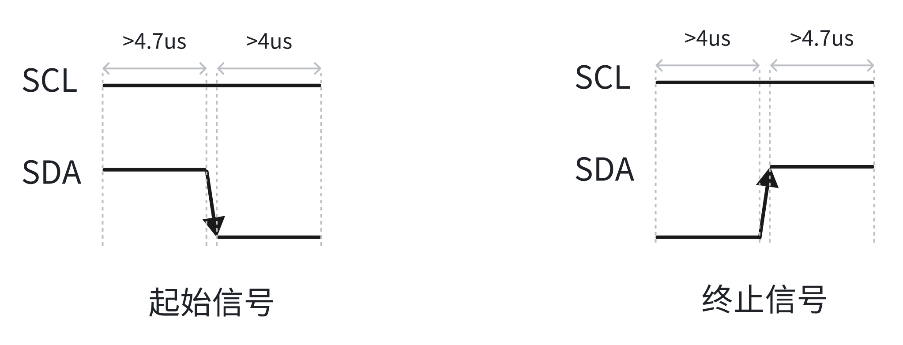
**起始信号**：SCL线为<mark style="background: #BBFABBA6;">高电平</mark>期间，SDA线由<mark style="background: #BBFABBA6;">高电平向低电平</mark>的变化表示<mark style="background: #ABF7F7A6;">起始信号</mark>

```c
#include <reg52.h>

sbit sda = P0^1;
sbit scl = P0^2;

void i2c_start()
{
        scl = 1;
        sda = 1;
        delay10ms(); //起始信号建立时间，高电平时间持续大于4.7us
        sda = 0;     //SDA拉低，下降沿
        delay10ms(); //起始信号保持时间
}
```

**终止信号**：SCL线为<mark style="background: #BBFABBA6;">高电平</mark>期间，SDA线由<mark style="background: #BBFABBA6;">低电平向高电平</mark>的变化表示<mark style="background: #ABF7F7A6;">终止信号</mark>

```c

void i2c_stop()
{
        sda = 0;
        scl = 1;
        delay10ms(); //停止信号建立时间，SDA高电平时间持续大于4.7us
        sda = 1;     //SDA拉高，上升沿
        delay10ms(); //总线空闲时间保持
}
```

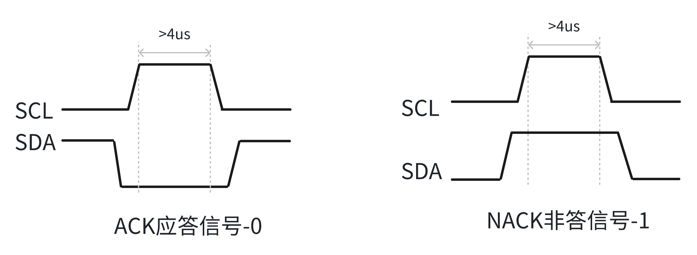
**ACK应答信号**：SCL从低到高再到低时，SDA都为低，表示接收方成功接收字节，要求继续传输。

当接收方成功接收数据，回复应答，要求发送方继续传输。

信号说明：SCL电平从低到高再到低时，SDA都为低。

```c
//发送应答信号
void i2c_ack()
{
        scl = 0;
        sda = 0;     //SDA拉低，发出应答信号
        delay10ms();
        scl = 1;
        delay10ms(); 
        scl = 0;
        delay10ms();
}
```

**NACK非应答信号**：SCL从低到高再到低时，SDA都为高，表示接收方未成功接收或要求停止传输。

当接收方未成功接收或要求停止传输时，发送非应答信号。

信号说明：SCL从低到高再到低时，SDA都为高。

```C

void i2c_nack()
{
        scl = 0;
        sda = 1;     //SDA拉高，发出非应答信号
        delay10ms();
        scl = 1;
        delay10ms(); 
        scl = 0;
        delay10ms();
}
```

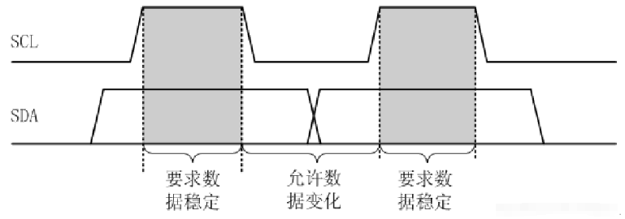
**数据传输**：IIC总线进行数据传送时，时钟信号为高电平期间，数据线上的数据必须保持稳定，只有在时钟线上的信号为低电平期间，数据线上的高电平或低电平状态才允许变化。

数据传输过程中，先发送高位（MSB），再发送低位（LSB）。

例如：IIC发送0xF5(0b11110101)


> 扩展说明

**类型A：无地址映射的从机（直接读取）**

- 特点：每次读取都返回当前状态或数据，无需指定内部地址
- 示例：某些ADC芯片、简单的状态读取设备
- 通信流程：

```JSON
写：
[START] → [器件地址+写] → [等待ACK] → [写数据] → [等待ACK] → [STOP]
读：
[START] → [器件地址+读] → [等待ACK] → [读数据] → [发送NACK] → [STOP]
```

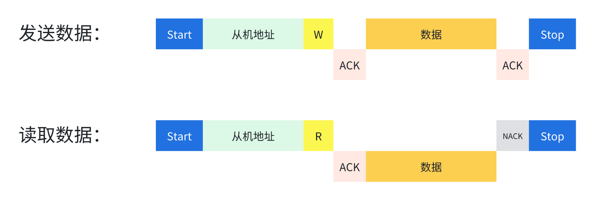

**类型B：有地址映射的从机（需要寄存器地址）**

- 特点：内部有多个寄存器或存储单元
- 示例：EEPROM、传感器芯片、RTC芯片等

例如：存储芯片内部的存储地址和存储的数据

|   |   |   |   |   |   |   |   |
|---|---|---|---|---|---|---|---|
|内部存储地址|0x01|0x02|0x03|0x04|0x05|0x06|0x07|
|内部存储数据|15|22|28|13|18|26|29|

- 通信流程：

```JSON
写：
[START] → [器件地址+写] → [等待ACK] → [寄存器地址] → [等待ACK] → [写数据] → [等待ACK] → [STOP]
读：
[START] → [器件地址+写] → [等待ACK] → [寄存器地址] → [等待ACK] → [START] → [器件地址+读] → [等待ACK] → [读数据] → [NACK] → [STOP]
```

例图：

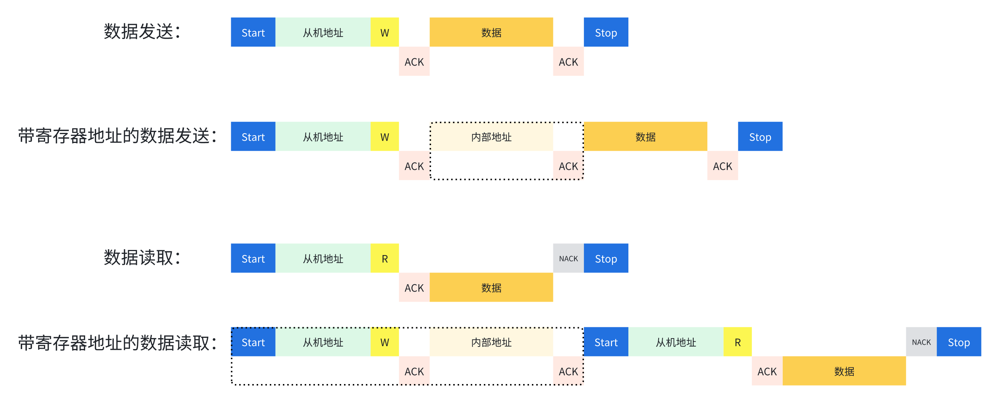

## PWM

PWM (脉冲宽度调制)，它是一种通过调整脉冲信号的高电平和低电平时间比例来控制电路输出的技术。

两个重要的参数，分别是：<mark style="background: #BBFABBA6;">频率</mark>、<mark style="background: #BBFABBA6;">占空比</mark>；

是指1秒钟内信号从高电平到低电平再回到高电平的次数(一个周期)；如果频率为1000Hz ，也就是说1秒内来回了1000次，那每次的时间就是1ms，那此信号一个周期就是1ms.

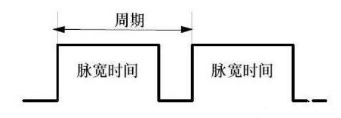

**占空比**：是一个脉冲周期内，高电平的时间与整个周期时间的比例

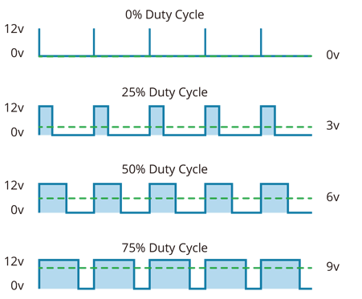

调节占空比最终会反映到输出的电流、电压上，或者可以理解为输出的总能量变化，100%占空比时输出100%能量，50%占空比时，只会输出50%的能量，例如50%占空比控制LED会比较暗，控制电机力气会比较小。

> 呼吸灯控制程序

下面使用IO模拟的方式，实时修改占空比，控制LED的呼吸灯效果：
```C
#include <reg52.h>

sbit led = P2^7;

void Delayus(int t)                //@11.0592MHz
{
        while(t--){
                unsigned char i;
                i = 2;
                while (--i);
        }
}

void main()
{
        int time = 0;
        led = 0;
        while(1)
  {
                for(time = 0;time < 300;time ++){ //从暗逐渐变亮的过程
                        led = 0;
                        Delayus(time);
                        led = 1;
                        Delayus(300 - time);
                }
                for(time = 0;time < 300;time ++){ //从亮逐渐变暗的过程
                        led = 1;
                        Delayus(time);
                        led = 0;
                        Delayus(300 - time);
                }
  }
}
```

除了使用IO模拟的方式，我们也可以通过定时器功能，产生更加精确的PWM波形；设置定时器的溢出时间可以改变PWM的周期频率；设置比较值大小可以调节PWM的占空比；

## 看门狗

启动看门狗计数器 -> 计数器计数 -> 指定时间内不对计数器赋值（主程序跑飞，无法喂狗）-> 溢出，发出复位信号。

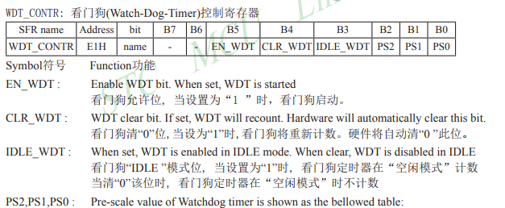

$溢出时间 = \frac {N* Prescale* 32768}{晶振频率}$ (N 是单片机的时钟周期，默认是 12)

Prescale是预分频数，由PS2 PS1 PS0组成

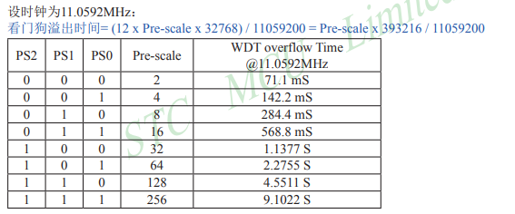

```c
#include <reg52.h>

sfr WDT_CONTR=0xe1; //无需这句是否正常？
sbit led=P2^7;

void delay_ms(unsigned int xms)   //@12MHz
{
    unsigned int i, j;
    for(i=xms;i>0;i--)
    {
        for(j=124;j>0;j--)
        {}
    }
}

void main()
{
    WDT_CONTR=0x35;  //启动看门狗，开始重新计数，预分频数为64，2s不喂狗会溢出并复位
    led=0;
    delayms(500);
    led=1;
    while(1)
    {
        delayms(3000);
        WDT_CONTR=0x35;
    }
}
```

