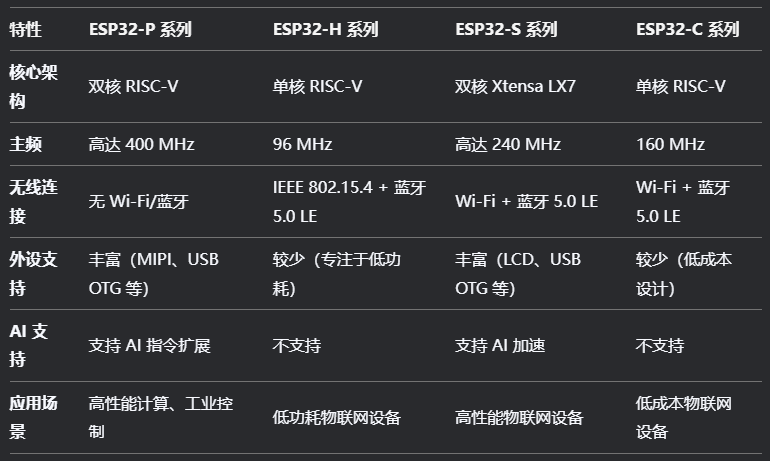
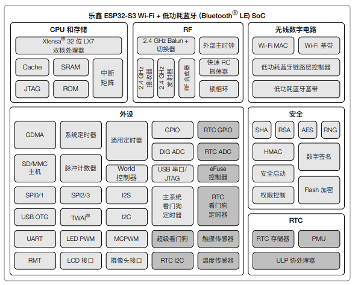
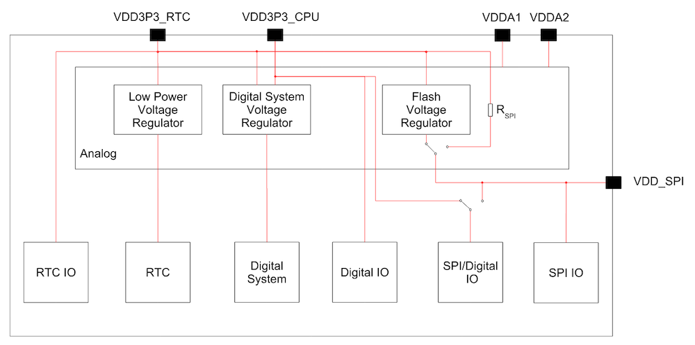

## 前言

[《ESP32-S3 技术参考手册》](https://www.espressif.com.cn/sites/default/files/documentation/esp32-s3_technical_reference_manual_cn.pdf)

[《ESP32-S3 硬件设计指南》](https://www.espressif.com.cn/sites/default/files/documentation/esp32-s3_hardware_design_guidelines_cn.pdf)

[《ESP32-S3 ESP-IDF 编程指南》](https://docs.espressif.com/projects/esp-idf/zh_CN/latest/esp32s3/get-started/index.html)

[ESP32 API手册](https://docs.espressif.com/projects/arduino-esp32/en/latest/libraries.html)

[ESP32 SDK源码](https://github.com/espressif/arduino-esp32)

ESP32-S3 是一款低功耗的MCU 系统级芯片(SoC)，集成2.4 GHz Wi-Fi 和低功耗蓝牙(Bluetooth® LE) 双模无线通信。

[ESP32-S3 系列芯片](https://documentation.espressif.com/esp32-s3_datasheet_cn.pdf)

- 芯片电源管理图

- `VDD`：芯片电源正极的通用标识（对应 `VSS` 为电源负极 / 地）；

- `VDDA1 / VDDA2`：Analog，**模拟电路**；
- `VDDA1`：给 ADC1（模数转换器 1）、触摸传感器等模拟外设供电；
- `VDDA2`：给 ADC2、DAC（数模转换器）等其他模拟外设供电。
- 模拟电路对电源噪声非常敏感，**分域供电可避免不同模拟模块之间的干扰**，从而提升 ADC 采样精度、触摸传感器的灵敏度。

> [!tip] **射频（RF，Radio Frequency）电路**是负责 **2.4 GHz Wi-Fi 和 Bluetooth® 5 (LE) 无线信号收发**的专用电路模块，是芯片实现无线通信的核心。它的作用是在芯片内部数字电路和外部空间之间，搭建**高频无线电信号的转换与传输桥梁**。

