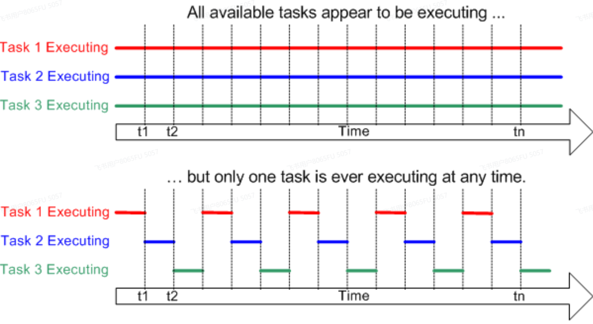
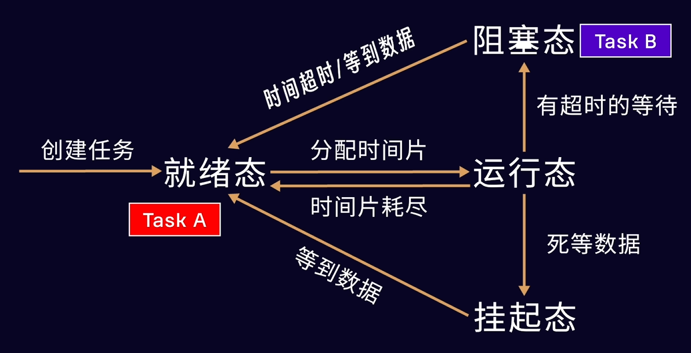
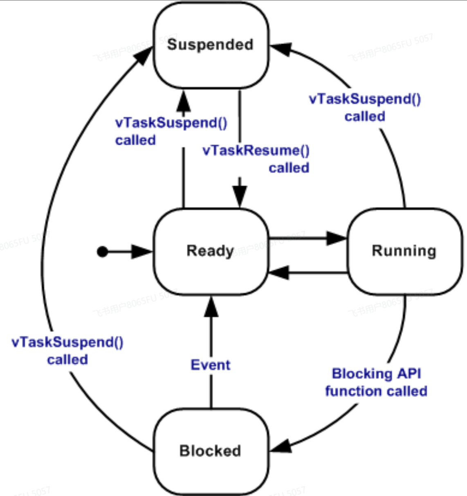

RTOS的全称是**Real-Time Operating System**，实时操作系统，实时性是其最大特征。

除了实时操作系统，还有分时操作系统，像通用的Linux、Window这些系统。

[RTOS文档](https://www.freertos.org/zh-cn-cmn-s/Documentation/01-FreeRTOS-quick-start/01-Beginners-guide/01-RTOS-fundamentals)

什么是任务，任务有什么作用?

任务有哪几种状态？
1. 运行
2. 准备就绪
3. 阻塞
4. 挂起

