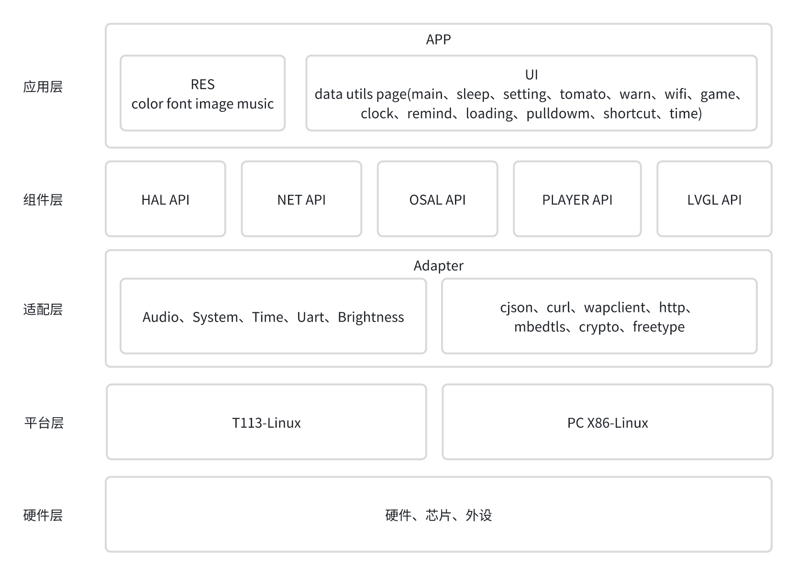

[LVGL](https://lvgl.io/)（Light and Versatile Graphics Library）是一个开源的图形用户界面库，旨在为嵌入式系统和物联网设备提供轻量级、可移植、灵活且易于使用的图形用户界面解决方案。

**SDK的目录结构**

- 应用层：用于实现用户应用，显示，数据效果
- 组件层：提供给应用层的设备能力，包括外设控制、网络协议、系统接口抽象、播放器、WiFi控制、LVGL等
- 适配层：因为各个系统的接口、功能不一样，所以提供一个抽象层，方便<mark style="background: #ABF7F7A6;">统一不同系统的设备接口</mark>
- 系统层：根据不同的芯片，放置不同芯片平台的依赖库、系统接口封装、显示接口封装、输入接口封装、G2D加速接口封装。
- 硬件层：实际硬件部分。

