## 前言

[Linux 命令大全 | 菜鸟教程](https://www.runoob.com/linux/linux-command-manual.html)

## Linux基础知识

- 常见的Linux系统的文件结构
```bash
/bin        二进制文件，系统常规命令
/boot       系统启动分区，系统启动时读取的文件
/dev        设备文件
/etc        大多数配置文件
/home       普通用户的家目录
/lib        32位函数库
/lib64      64位库
/media      手动临时挂载点
/mnt        手动临时挂载点
/opt        第三方软件安装位置
/proc       进程信息及硬件信息
/root       临时设备的默认挂载点
/sbin       系统管理命令
/srv        数据
/var        数据
/sys        内核相关信息
/tmp        临时文件
/usr        用户相关设定
```

- Linux系统命令行的含义
```bash
示例：root@app00:~#
root    //用户名，root为超级用户
@       //分隔符
app00   //主机名称
~       //当前所在目录，默认用户目录为~，会随着目录切换而变化，例如：（root@app00:/bin# ，当前位置在bin目录下）
#       //表示当前用户是超级用户，普通用户为$，例如：（"yao@app00:/root$" ，表示使用用户"yao"访问/root文件夹）
```

- 网络知识

在配网过程中，很多人不知道`172.32.0.100`这些都是什么，IP地址就是一个唯一标识，是一段网络编码，在同一个局域网中，<mark style="background: #FF5582A6;">所有IP必须在同一网段中才可以互相通信</mark>！

例如：一个 IP 地址（如 `192.168.1.10`）和子网掩码（如 `255.255.0.0`）共同决定了它属于哪个网段。如果这样设置子网掩码，那么`192.168.x.x`都是在同一个网段，可以互相ping通的。

结合我们的开发板设置，RNDIS虚拟网口，开发板的默认IP地址是`172.32.0.93`，所以我们设置了电脑为`172.32.0.100`，这样USB线连上去，我们的电脑就可以使用网口连上开发板了，在同一网段下。

`0.0.0.0`又是什么？同学在复刻服务器的代码时，发现有如下LOG：

```bash
[INFO] WebSocket server started on 0.0.0.0:8000
```

这个意思是正在监听本机`所有网络`接口的 8000 端口，等待客户端连接

## Linux基本命令

1. 关闭系统
```bash
(1)立刻关机
shutdown -h now 或者 poweroff
(2)两分钟后关机
shutdown -h 2
```

2. 重启系统
```bash
(1)立刻重启
shutdown -r now 或者 reboot
(2)两分钟后重启
shutdown -r 2
```

3. 帮助命令（help）
```bash
xxx -help
ifconfig -help # ifconfig命令的使用帮助
```

4. 切换目录（cd）
```bash
cd /                 //切换到根目录
cd /bin              //切换到根目录下的bin目录
cd ../               //切换到上一级目录 或者使用命令：cd ..
cd ~                 //切换到home目录
cd -                 //切换到上次访问的目录
```

5. 查看目录（ls）
```bash
ls                   //查看当前目录下的所有目录和文件
ls -a                //查看当前目录下的所有目录和文件（包括隐藏的文件）
ls -l                //列表查看当前目录下的所有目录和文件（列表查看，显示更多信
ls /bin -l           //查看/bin目录下的所有目录和文件 详细信息
```

6. 创建目录（dir）
```bash
mkdir tools          //在当前目录下创建一个名为tools的目录
mkdir /bin/tools     //在指定目录下创建一个名为tools的目录
```

7. 修改目录（mv）
```bash
mv 当前目录名 新目录名        //修改目录名，同样适用与文件操作
mv /usr/tmp/tool /opt       //将/usr/tmp目录下的tool目录剪切到 /opt目录下面
mv -r /usr/tmp/tool /opt    //递归剪切目录中所有文件和文件夹
```

8. 拷贝目录（cp）
```bash
cp /usr/tmp/tool /opt       //将/usr/tmp目录下的tool目录复制到 /opt目录下面
cp -r /usr/tmp/tool /opt    //递归剪复制目录中所有文件和文件夹
```

9. 搜索目录（find）
```bash
find /bin -name 'a*'        //查找/bin目录下的所有以a开头的文件或者目录
```

10. 查看当前目录（pwd）
```bash
pwd                         //显示当前位置路径
```

11. 删除文件夹
```bash
rm -r 目录名 # 普通  
sudo rm -rf 目录名 # 需要 root/强制
```

12. 压缩文件夹
```bash
# 基本语法：zip -r 压缩包名称.zip 要压缩的文件夹路径
zip -r my_folder.zip /path/to/your/folder
```

- 参数说明：`-r` 表示递归压缩子文件夹（必须加，否则只压缩文件夹本身，不包含内部文件）

13. 解压 .zip 文件（最常用）
```bash
# 基本用法：解压到当前目录 
unzip 文件名.zip 
# 解压到指定目录（推荐，避免文件散落） 
unzip 文件名.zip -d 目标目录 
# 示例：将 test.zip 解压到 ~/downloads 目录 
unzip test.zip -d ~/downloads
```

14. 修改目录权限
```bash
chmod 777 file.txt​
chmod -R 777 files
```

## 文本编辑vim

- 输入 `:q` 退出（如果文件未修改）。
- 输入 `:q!` 强制退出，不保存更改。
- 输入 `:wq` 保存并退出。
- 命令模式按 `i` 进入<mark style="background: #ABF7F7A6;">插入模式</mark>，在当前光标位置插入文本。
- 插入模式按ESC可返回命令模式，输入命令后按 `Enter` 执行。

## SSH安装

```Bash
安装网络工具，方便后续查看ubuntu的网络ip
sudo apt install net-tools

安装ssh
sudo apt install openssh-server 
sudo /etc/init.d/ssh start

查看ssh是否运行
ps -e|grep ssh

然后查看本机ip
xiaozhi@ubuntu:~/work$ ifconfig
ens33: flags=4163<UP,BROADCAST,RUNNING,MULTICAST>  mtu 1500
        inet 192.168.200.136  netmask 255.255.255.0  broadcast 192.168.200.255

```

## 编译工具对比

|       |                                              |                                                        |                                                                            |
| ----- | -------------------------------------------- | ------------------------------------------------------ | -------------------------------------------------------------------------- |
| 对比维度  | 手写编译指令                                       | Makefile 构建                                            | CMake 构建                                                                   |
| 基本概念  | 在命令行手动输入编译器（如 GCC）命令来编译和链接代码文件，每次编译都需完整输入命令。 | 编写 Makefile 文件描述项目文件依赖关系和编译规则，使用 make 命令依据该文件自动编译项目。   | 编写 CMakeLists.txt 文件描述项目构建信息，CMake 依据此文件生成不同平台的 Makefile 或其他构建文件，再用对应工具编译。 |
| 自动化程度 | 低，每次修改代码后都要手动输入完整编译命令，易出错且效率低。               | 高，make 命令可根据文件修改时间自动判断哪些文件需重新编译，避免不必要的重复编译。            | 高，CMake 能自动检测系统环境和依赖库，生成合适的构建文件，进一步提高自动化程度。                                |
| 可维护性  | 差，项目结构或依赖关系变化时，需手动调整编译命令，容易遗漏或出错。            | 较好，在 Makefile 中清晰定义文件依赖和编译规则，修改和扩展项目时只需调整 Makefile 内容。 | 好，CMakeLists.txt 文件独立于具体平台和构建工具，修改项目配置时只需修改该文件，CMake 会重新生成相应构建文件。          |
| 适用场景  | 小型项目、学习阶段或需快速验证代码的情况。                        | 中等规模项目，项目结构相对稳定、依赖关系明确。                                | 大型项目、跨平台项目或需与不同开发工具集成的项目。                                                  |
1. 主流使用CMake，新建 `build` 文件夹，`rm -rf *`清空文件夹
2. 使用 `cmake ..`找到上层目录的 `CMakeLists.txt`进行编译
3. 使用 `make` 进行编译
4. 在 `build` 文件夹下运行生成的可执行文件 `./Demo`

这里如果使用 `./Demo&` 可以在终端启动程序且可交互
`ps` 可查看运行的进程
`cat /proc/xxxx/status` 可查看该进程状态

## 文件IO

[中文api手册](https://www.bookstack.cn/read/linuxapi/POSIX-IO)

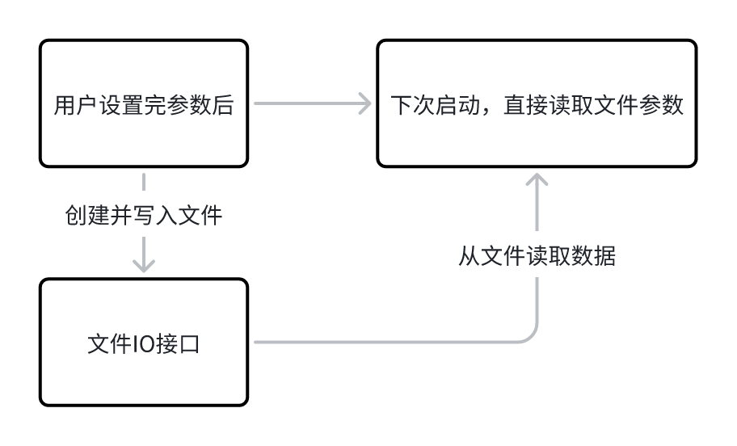

“Linux 一切皆文件”（Everything is a file）其实是一种设计思想，意味着系统将几乎所有硬件设备、进程、网络连接等资源都抽象为文件，通过统一的文件操作接口（如 `open()`、`read()`、`write()`、`close()`）来访问和管理，这种设计使得 Linux 操作系统编程更加统一和简洁。

- 打开文件：系统io函数open
```C
#include <fcntl.h> //头文件
int open(const char *pathname, int flags, mode_t mode);

// 参数解析：
// pathname：需要打开文件的路径名

// flags：打开文件的标志位
// 必选其一：O_RDONLY（只读）、O_WRONLY（只写）、O_RDWR（读写）
// 可选组合：O_CREAT（不存在则创建）、O_TRUNC（清空）、O_APPEND（追加）
// 高级选项：O_NONBLOCK（非阻塞）、O_SYNC（同步写入）

// mode（仅O_CREAT时有效）：权限
// 如0644，对应权限-rw-r--r--

// 返回值：
// 成功：返回 文件描述符
// 失败：返回 -1
```

- 关闭文件：系统io函数close​
```C
#include <unistd.h> //头文件
int close(int fd);

// 参数解析：
// fd:文件描述符

// 返回值：
// 成功：返回 0
// 失败：返回 -1
```

- 示例
```C
#include <stdio.h>    // 包含标准输入输出函数
#include <fcntl.h>    // 包含 open() 函数的声明
#include <unistd.h>   // 包含 close() 函数的声明

int main() {
    int fd;
    
    // 打开文件（如果不存在则创建，设置读写权限）
    fd = open("example.txt", O_RDWR | O_CREAT, 0644);
    
    if (fd == -1) {
        printf("打开文件失败");
        return 1;
    }
    
    // 使用文件描述符进行读写操作...
    
    // 关闭文件
    close(fd);
    return 0;
}
```

- 写入文件：系统io函数write
```C++
头文件：
#include <unistd.h>
ssize_t write(int fd, const void *buf, size_t count);

参数说明
fd：文件描述符
表示要写入的文件（如 open() 返回的值）。
buf：指向内存缓冲区的指针
要写入的数据。
count：请求写入的字节数。

返回值
成功：返回实际写入的字节数。
失败：返回 -1

FYI:
size_t
定义：unsigned long 或 unsigned long long 的类型别名（具体取决于平台，32/64 位）。
ssize_t
定义：signed long 或 signed long long 的类型别名（与 size_t 对应的有符号版本）
```

- 读取文件：系统io函数read
```C++
头文件：
#include <unistd.h>
ssize_t read(int fd, void *buf, size_t count);

参数说明
fd：文件描述符
表示要读取的文件。
buf：指向内存缓冲区的指针
用于存储读取的数据。
count：请求读取的最大字节数。

返回值
成功：返回实际读取的字节数（可能小于 count，例如读到文件末尾）。
0：表示已到达文件末尾（EOF）。
-1：表示出错
```

- 设置文件的读写位置：系统io函数lseek
- ```C++
头文件：
#include <unistd.h>
off_t lseek(int fd, off_t offset, int whence);

参数说明
fd：文件描述符
表示要操作的文件。
offset：偏移量（字节数）
可为正（向后移动）、负（向前移动）或 0（不移动）。
whence：
基准位置，取值为以下三个宏：
SEEK_SET：从文件开头计算偏移量。
SEEK_CUR：从当前位置计算偏移量。
SEEK_END：从文件末尾计算偏移量（offset 可为负数，表示倒数位置）。

返回值
成功：返回新的文件偏移量（从文件开头算起的字节数）。
失败：返回 -1。
```

- 系统IO函数示例
```C
#include <fcntl.h>      // 包含open函数
#include <unistd.h>     // 包含read、write、close函数
#include <stdio.h>      // 包含标准输入输出函数
#include <string.h>     // 包含strlen函数

int main() {
    int fd;
    char write_buf[] = "Hello, World!";
    char read_buf[100];
    ssize_t bytes_written, bytes_read;

    // 打开文件，如果不存在则创建，设置读写权限
    fd = open("test.txt", O_RDWR | O_CREAT | O_TRUNC, 0644);
    if (fd == -1) {
        printf("打开文件失败");
        return 1;
    }

    // 写入数据
    bytes_written = write(fd, write_buf, strlen(write_buf));
    if (bytes_written == -1) {
        printf("写入失败");
        close(fd);
        return 1;
    }
    printf("成功写入 %zd 字节\n", bytes_written);

    // 将文件指针重置到文件开头
    if (lseek(fd, 0, SEEK_SET) == -1) {
        printf("重置文件指针失败");
        close(fd);
        return 1;
    }

    // 读取数据
    bytes_read = read(fd, read_buf, sizeof(read_buf) - 1);
    if (bytes_read == -1) {
        printf("读取失败");
        close(fd);
        return 1;
    }
    read_buf[bytes_read] = '\0';  // 添加字符串结束符
    printf("成功读取 %zd 字节: %s\n", bytes_read, read_buf);

    // 关闭文件
    if (close(fd) == -1) {
        printf("关闭文件失败");
        return 1;
    }

    return 0;
}
```

标准 I/O 与 系统 I/O
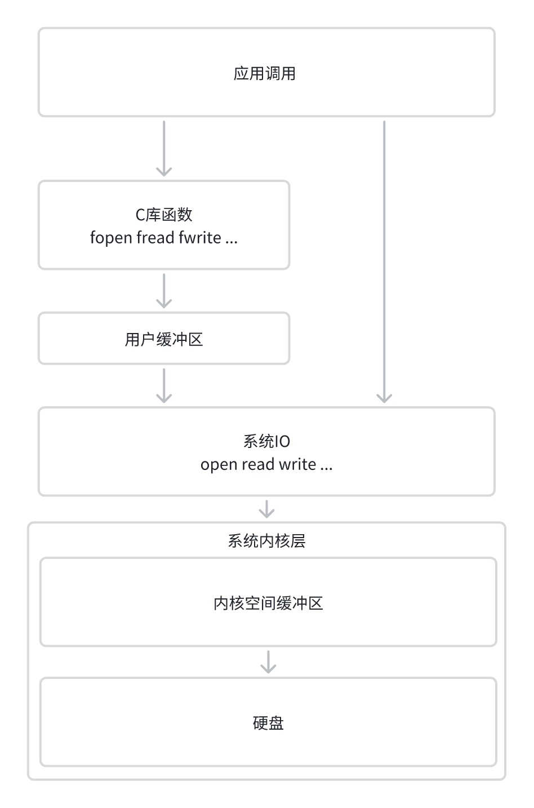

**用户缓冲区的作用**：
在进行数据的读写的过程中，先不把数据直接写入或者读入设备中，而是写或者读入内存空间，当满足一定条件时候，将该空间的文件写入文件或设备中。这样可以减少操作系统调用的次数，提高读写的速度，和代码的效率。因为每一次系统调用的过程都是很浪费系统资源的。

**内核缓冲区的作用**：
了提高磁盘 I/O 性能，操作系统使用了缓冲区（页缓存）技术。当调用 write 时，数据首先被复制到内核的页缓存中，而不是直接写入磁盘。这是因为磁盘 I/O 操作相对较慢，通过缓冲区可以将多次小的写入操作合并成一次大的写入操作，减少磁盘寻道和旋转延迟，从而提高整体性能。

缓冲区数据什么时候写入设备中？
1、缓冲区已满
2、手动强制写入
3、程序结束
4、关闭文件

- mode：打开文件的权限

|      |       |             |      |                  |
| ---- | ----- | ----------- | ---- | ---------------- |
| 模式   | 描述    | 文件不存在时      | 初始位置 | 说明               |
| "r"  | 只读模式  | 报错（返回 NULL） | 文件开头 | 用于读取已存在的文件。      |
| "w"  | 只写模式  | 创建新文件       | 文件开头 | 若文件已存在，会清空内容！    |
| "a"  | 追加写模式 | 创建新文件       | 文件末尾 | 写入内容追加到文件末尾。     |
| "r+" | 读写模式  | 报错          | 文件开头 | 可读写，不会清空文件。      |
| "w+" | 读写模式  | 创建新文件       | 文件开头 | 若文件已存在，会清空内容！    |
| "a+" | 读写模式  | 创建新文件       | 文件末尾 | 读取从开头开始，写入追加到末尾。 |

C 标准函数(fopen, fread..)案例
```c
#include <stdio.h>
#include <stdlib.h>
#include <string.h>

int main() {
    FILE *fp;
    char write_buffer[] = "Hello, World!";
    char read_buffer[100];
    size_t bytes_written, bytes_read;

    // 创建并写入文件
    fp = fopen("example.txt", "w+");
    if (fp == NULL) {
        printf("无法创建文件");
        return 1;
    }

    // 使用fwrite写入数据
    bytes_written = fwrite(write_buffer, sizeof(char), strlen(write_buffer), fp);
    if (bytes_written != strlen(write_buffer)) {
        printf("写入失败");
        fclose(fp);
        return 1;
    }
    printf("成功写入 %zu 字节\n", bytes_written);

    // 使用fseek将文件指针重置到文件开头
    if (fseek(fp, 0, SEEK_SET) != 0) {
        printf("重置文件指针失败");
        fclose(fp);
        return 1;
    }

    // 读取数据
    bytes_read = fread(read_buffer, sizeof(char), sizeof(read_buffer) - 1, fp);
    if (bytes_read > 0) {
        read_buffer[bytes_read] = '\0';  // 添加字符串结束符
        printf("成功读取 %zu 字节: %s\n", bytes_read, read_buffer);
    } else {
        printf("读取失败");
    }

    fclose(fp);
    return 0;
}
```


## 进程

### Linux的父子进程

Ubuntu内核在启动时，会创建第一个pid为 1 的进程，后续其它进程都是由此进程创建和管理（当然除了僵尸进程），所以我们可以理解Linux其实<mark style="background: #ABF7F7A6;">把所有进程都放在一个树状的结构体中进行管理</mark>，这点我们可以执行命令pstree看到

在这里，我们可以认为命令行窗口bash就是父进程，hello就是子进程，因为我们是在命令行窗口执行hello的。

打开进程树
```bash
pstree
```

- **父进程**：创建子进程，可以向子进程发送信号，等待子进程结束。
- **子进程**：是父进程的副本，可以继承父进程的资源，可以向父进程发送信号。

那什么是孤儿进程和僵尸进程呢？

- **孤儿进程**：当父进程终止时，子进程如果还未终止，则会成为孤儿进程。孤儿进程会被 `init` 进程（PID 为 1）收养。
- **僵尸进程**：当子进程终止时，如果父进程没有调用 `wait` 或 `waitpid` 获取子进程的退出状态，子进程会变成僵尸进程。僵尸进程占用少量资源，但不会消耗 CPU 时间。

- **终止进程**
```C
// 1、进程调用return
int main() {
    return 0; 
}

// 2、进程调用 exit 函数
#include <stdlib.h>
void exit(int status);

// status:进程退出状态码，是进程终止时向父进程传递的一个整数值（范围为 0~255）。它的核心作用是标识进程的执行结果状态，便于父进程或调用者判断进程是否正常结束、是否发生错误。

void func() {
    exit(1);  // 在非main函数中调用，进程直接退出
}
```

### 进程的状态监控
```c
#include <sys/wait.h>
pid_t waitpid(pid_t pid, int *status, int options);

// 父进程等待子进程终止。

// pid：指定等待的子进程ID：> 0：等待 PID 等于该值的子进程，-1：等待任意子进程 等同于 wait()。
// status：同 wait()，存储子进程退出状态。
// options：位掩码，常用选项：0：阻塞等待指定子进程终止；WNOHANG：非阻塞模式，若无子进程终止立即返回 0。

// 返回值：
// > 0成功返回结束的子进程PID。
// 0 非阻塞模式（WNOHANG）下，没有子进程退出。
// -1 错误（如无子进程、信号中断等），通过 errno 获取具体原因。


#include <sys/wait.h>
pid_t wait(int *status);
// 等待任意一个子进程结束。
// status：同 wait()，存储子进程退出状态。
```

- **exec 系列函数**：在现有进程中加载并执行新的程序。
```C++
#include <unistd.h>
int execl(const char *path, const char *arg, ...);

// 参数:
// path: 可执行文件的绝对路径。
// arg: 可执行程序的参数列表，第一个参数通常是可执行文件的名字，最后一个参数必须是 NULL。
// arg0（程序名称）:通常是程序本身的名字，会作为 argv[0] 传递给新程序。
// 例如：execl("/bin/ls", "ls", "-l", NULL) 中的 "ls"。
// 后续参数（arg1, arg2, ..., NULL）:从 arg1 开始是真正的命令行参数。
// 必须以 (char *) NULL 结尾，否则会导致未定义行为。

// 返回值:
// 成功时无返回值。
// 失败时返回 -1，并设置 errno。
```

通常，fork 和 execl 会结合使用，先通过 fork 创建子进程，然后在子进程中调用 execl 来执行新的程序。 这样可以在不影响父进程的情况下启动新的程序。

exec族实际包含有 6 个不同的 exec 函数，它们功能一样，主要是传参的形式不同， 函数原型分别如下：
```c
int execl(const char *path, const char *arg, ...); 
int execle(const char *path, const char *arg, ..., char *const envp[]); 
int execv(const char *path, char *const argv[]); 
int execve(const char *path, char *const argv[], char *const envp[]); 
int execlp(const char *file, const char *arg, ...); 
int execvp(const char *file, char *const argv[]);
```

### 进程间通信

模块化开发：一个大项目中有不同的模块，例如UI显示的，网络交互的，算法的，可以把这些模块作为独立的仓库进行开发，然后使用IPC进行数据交互，这种方法的好处是，只需要规范好IPC接口和协议，不同模块可以由不同开发人员进行开发，互不影响，而且一个模块的BUG也不会影响到其它模块运行。

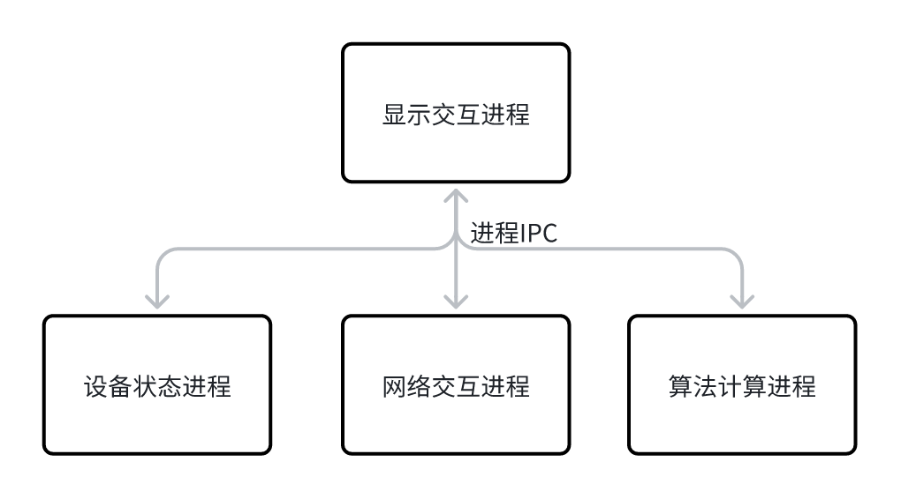

1. 管道（Pipes） **匿名管道**：<mark style="background: #ADCCFFA6;">半双工</mark>，用于<mark style="background: #ABF7F7A6;">具有亲缘关系的进程之间</mark>的通信。创建管道后，父进程可以通过 fork 创建子进程，然后父子进程之间可以通过管道进行通信。 **命名管道（FIFO）**：<mark style="background: #ADCCFFA6;">半双工</mark>，类似于匿名管道，但可以通过文件系统路径名访问，因此<mark style="background: #ABF7F7A6;">可以在没有亲缘关系的进程之间使用</mark>。

2. 共享内存（Shared Memory） **共享内存**：<mark style="background: #ADCCFFA6;">全双工</mark>，允许多个进程共享同一块内存区域，从而实现<mark style="background: #BBFABBA6;">高效的数据交换</mark>。通常与信号量结合使用，以确保数据的一致性和同步。 

3. 消息队列（Message Queues） **消息队列**：<mark style="background: #ADCCFFA6;">全双工</mark>，提供了一种在进程间传递结构化消息的机制。消息队列可以存储多个消息，并且可以设置消息的优先级。 

4. 信号（Signals） **信号**：用于进程间的异步通知。发送信号可以用来通知接收进程发生了某个事件，接收进程可以通过信号处理函数来响应这些事件。

- 例，下方使用fork创建子进程，然后在父子进程间进行通信。
```C
#include <stdio.h>
#include <stdlib.h>
#include <unistd.h>
#include <string.h>
#include <sys/wait.h>

int main() {
    int pipefd[2];  // 管道文件描述符数组，用于存储管道的两个文件描述符。pipefd[0] 是读端，pipefd[1] 是写端。
    pid_t pid;
    char buf[100];  // 缓冲区用于读取数据

    // 创建管道
    if (pipe(pipefd) == -1) {
        printf("pipe error");
        exit(1);
    }
    // 创建子进程
    pid = fork();
    if (pid == -1) {
        printf("fork error");
        exit(1);
    }
    if (pid == 0) {
        // 子进程
        close(pipefd[1]);  // 关闭写端
        // 从管道读取数据
        ssize_t bytes_read = read(pipefd[0], buf, sizeof(buf));
        if (bytes_read == -1) {
            printf("read error");
            exit(1);
        }
        printf("Child received: %s\n", buf);
        close(pipefd[0]);  // 关闭读端
    } else {
        // 父进程
        close(pipefd[0]);  // 关闭读端
        const char *msg = "Hello, World!";
        // 向管道写入数据
        ssize_t bytes_written = write(pipefd[1], msg, strlen(msg) + 1);
        if (bytes_written == -1) {
            printf("write error");
            exit(1);
        }
        close(pipefd[1]);  // 关闭写端
        // 等待子进程结束
        wait(NULL);
    }

    return 0;
}
```

上方代码流程如下：
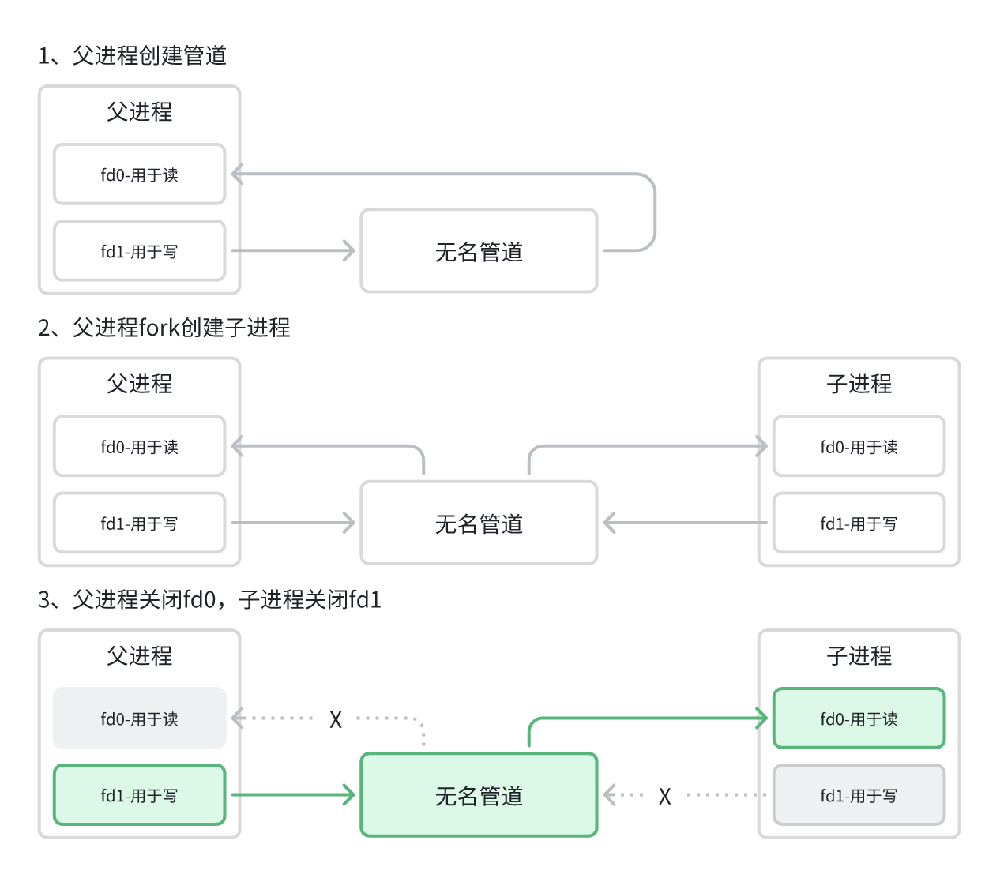

上方代码中，由于管道的单向特性，我们设计了只能从父进程往子进程传递消息，如果需要从子进程中往父进程发送消息？应该如何实现呢？

我们可以使用两个管道来实现。一个管道用于从进程 A 到进程 B 的通信，另一个管道用于从进程 B 到进程 A 的通信。

子进程的核心逻辑是：**关闭无用管道端 → 读取父进程发送的消息 → 向父进程回复消息 → 关闭剩余管道端**

父进程的核心逻辑是：**关闭无用管道端 → 向子进程发送消息 → 读取子进程的回复 → 关闭剩余管道端 → 等待子进程退出**

- **有名管道/命名管道（FIFO）**
类似于匿名管道，但可以通过文件系统路径名访问，因此可以在没有亲缘关系的进程之间使用。


构建两个单独进程，先运行 `./Demo_read`，在运行 `./Demo_write`

fifo_write
```C++
#include <stdio.h>
#include <stdlib.h>
#include <sys/types.h>
#include <sys/stat.h>
#include <fcntl.h>
#include <unistd.h>
#include <string.h>

int main()
{
    printf("run fifo write\n");
    const char *fifo_name = "/tmp/myfifo";
    mode_t mode = 0666;
    char buf[100];
    if(access(fifo_name, F_OK) == -1)
    {
        if(mkfifo(fifo_name, mode) == -1)
        {
            printf("mkfifo error");
            return 1;
        }
    }
    // 打开命名管道进行读取
    const char *msg = "Hello, Child!";
    // 打开命名管道进行写入
    int fd = open(fifo_name, O_WRONLY, 0644);
    if (fd == -1)
    {
        printf("open error");
        return 1;
    }
    while (1)
    {
        printf("write data\n");
        // 向命名管道写入数据
        ssize_t bytes_written = write(fd, msg, strlen(msg) + 1);
        if (bytes_written == -1)
        {
            printf("write error");
            return 1;
        }
        usleep(1000*1000);
    }
    close(fd);
    printf("write finish\n");
    return 0;
}
```

fifo_read
```C
#include <stdio.h>
#include <stdlib.h>
#include <sys/types.h>
#include <sys/stat.h>
#include <fcntl.h>
#include <unistd.h>

int main()
{
    printf("run fifo read\n");

    const char *fifo_name = "/tmp/myfifo";
    mode_t mode = 0666;

    if(access(fifo_name, F_OK) == -1)
    {
        if(mkfifo(fifo_name, mode) == -1)
        {
            printf("mkfifo error");
            return 1;
        }
    }

    char buf[100];
    // 打开命名管道进行读取
    int fd = open(fifo_name, O_RDONLY, 0644);
    if (fd == -1)
    {
        printf("open error");
        return 1;
    }
    while(1){
        // 从命名管道读取数据
        ssize_t bytes_read = read(fd, buf, sizeof(buf));
        if (bytes_read == -1)
        {
            printf("read error");
            return 1;
        }else if (bytes_read == 0) {  
            printf("Writer closed the FIFO.\n");
            break;
        }else
            printf("Child received: %s\n", buf);
    }
    close(fd);

    return 0;
}
```

同理，如果你需要实现两个进程的双向通信，那就可以创建两个管道。
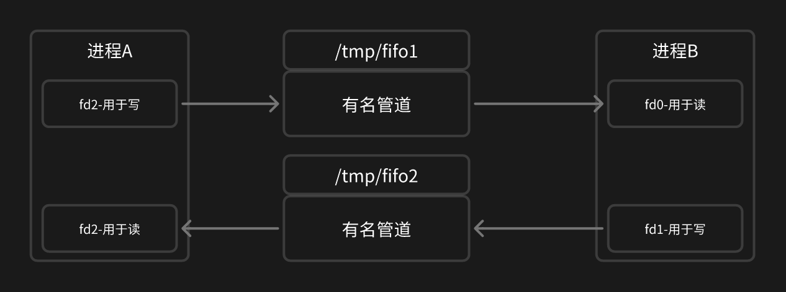

**有名管道和无名管道的异同点？**
```C
1、相同点
open打开管道文件以后，在内存中开辟了一块空间，管道的内容在内存中存放，有两个指针—-头指针（指向写的位置）和尾指针（指向读的位置）指向它。读写数据都是在给内存的操作，并且都是半双工通讯。

2、区别
有名在任意进程之间使用，无名在父子进程之间使用。
```

### 共享内存

新项目优先选择 <mark style="background: #ABF7F7A6;">POSIX</mark>，特别是你的应用需要在不同的操作系统平台之间移植，POSIX 信号量因其良好的标准化而更有优势。

在 Linux C 中，共享内存是一种高效的<mark style="background: #ADCCFFA6;">进程间通信</mark>（IPC）方式。通过共享内存，<mark style="background: #BBFABBA6;">多个进程可以访问同一块内存区域</mark>，从而实现数据的快速交换。

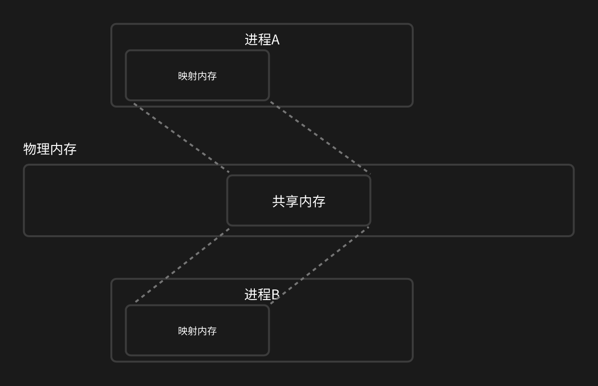

`shm_open` **- 创建或打开共享内存对象**
```c
// 创建或打开共享文件（如果不存在则创建，设置读写权限）
int shm_fd = shm_open("/my_shared_memory", O_CREAT | O_RDWR, 0666);
```

`ftruncate` **- 设置共享内存大小**
```c
int ftruncate(int fd, off_t length);
```

`mmap` **- 将共享内存映射到进程地址空间**
```c
// 创建共享映射
char *map = mmap(NULL, 1024, PROT_READ | PROT_WRITE, MAP_SHARED, fd, 0);
```

`munmap` **- 解除共享内存映射**
```c
int munmap(void *addr, size_t length);
```

`shm_unlink` **- 删除共享内存对象**
```c
int shm_unlink(const char *name);
```

### 消息队列

**消息队列**：提供了一种在进程间传递结构化消息的机制，传输结构化数据指的是通过消息队列发送的不是简单的字符串或字节流，而是具有明确格式和逻辑结构的自定义数据类型（例如结构体）。消息队列可以存储多个消息，并且可以<mark style="background: #ABF7F7A6;">设置消息的优先级</mark>。

`mq_open` **- 创建或打开一个消息队列**
```c
mqd_t mq_open(const char *name, int oflag, mode_t mode, struct mq_attr *attr);
```

`mq_send` / `mq_receive` **- 发送和接收消息**
```c
int mq_send(mqd_t mqdes, const char *msg_ptr, size_t msg_len, unsigned int msg_prio); 
ssize_t mq_receive(mqd_t mqdes, char *msg_ptr, size_t msg_len, unsigned int *msg_prio);
```

`mq_close` **- 关闭消息队列**
```c
int mq_close(mqd_t mqdes);
```

`mq_unlink` **- 删除消息队列**
```c
int mq_unlink(const char *name);
```

### 信号

|     |           |                                                                                                                                                                                |                   |
| --- | --------- | ------------------------------------------------------------------------------------------------------------------------------------------------------------------------------ | ----------------- |
| 信号值 | 名称        | 描述                                                                                                                                                                             | 默认处理              |
| 1   | SIGHUP    | 控制终端被关闭时产生。                                                                                                                                                                    | 终止                |
| 2   | SIGINT    | 程序终止(interrupt)信号，在用户键入INTR字符（通常是Ctrl + C）时发出，用于通知前台进程组终止进程。                                                                                                                   | 终止                |
| 3   | SIGQUIT   | SIGQUIT 和SIGINT类似，但由QUIT字符（通常是Ctrl + ）来控制，进程在因收到SIGQUIT退出时会产生core文件，在这个意义上类似于一个程序错误信号。                                                                                         | 终止并产生转储文件（core文件） |
| 4   | SIGILL    | CPU检测到某进程执行了非法指令时产生，通常是因为可执行文件本身出现错误， 或者试图执行数据段、堆栈溢出时也有可能产生这个信号。                                                                                                               | 终止并产生转储文件（core文件） |
| 5   | SIGTRAP   | 由断点指令或其它trap指令产生，由debugger使用。                                                                                                                                                  | 终止并产生转储文件（core文件） |
| 6   | SIGABRT   | 调用系统函数 abort()时产生。                                                                                                                                                             | 终止并产生转储文件（core文件） |
| 7   | SIGBUS    | 总线错误时产生。一般是非法地址，包括内存地址对齐（alignment）出错。比如访问一个四个字长的整数，但其地址不是4的倍数。它与SIGSEGV的区别在于后者是由于对合法存储地址的非法访问触发的（如访问不属于自己存储空间或只读存储空间）。                                                        | 终止并产生转储文件（core文件） |
| 8   | SIGFPE    | 处理器出现致命的算术运算错误时产生，不仅包括浮点运算错误，还包括溢出及除数为0等其它所有的算术的错误。                                                                                                                            | 终止并产生转储文件（core文件） |
| 9   | SIGKILL   | 系统杀戮信号。用来立即结束程序的运行，本信号不能被阻塞、处理和忽略。如果管理员发现某个进程终止不了，可尝试发送这个信号将进程杀死。                                                                                                              | 终止                |
| 10  | SIGUSR1   | 用户自定义信号。                                                                                                                                                                       | 终止                |
| 11  | SIGSEGV   | 访问非法内存时产生，进程试图访问未分配给自己的内存，或试图往没有写权限的内存地址写数据。                                                                                                                                   | 终止                |
| 12  | SIGUSR2   | 用户自定义信号。                                                                                                                                                                       | 终止                |
| 13  | SIGPIPE   | 这个信号通常在进程间通信产生，比如采用FIFO（管道）通信的两个进程，读管道没打开或者意外终止就往管道写，写进程会收到SIGPIPE信号。此外用Socket通信的两个进程，写进程在写Socket的时候，读进程已经终止，也会产生这个信号。                                                         | 终止                |
| 14  | SIGALRM   | 定时器到期信号，计算的是实际的时间或时钟时间，alarm函数使用该信号。                                                                                                                                           | 终止                |
| 15  | SIGTERM   | 程序结束（terminate）信号，与SIGKILL不同的是该信号可以被阻塞和处理。通常用来要求程序自己正常退出，shell命令kill缺省产生这个信号，如果进程终止不了，才会尝试SIGKILL。                                                                             | 终止                |
| 16  | SIGSTKFLT | 已废弃。                                                                                                                                                                           | 终止                |
| 17  | SIGCHLD   | 子进程暂停或终止时产生，父进程将收到这个信号，如果父进程没有处理这个信号，也没有等待（wait）子进程，子进程虽然终止，但是还会在内核进程表中占有表项，这时的子进程称为僵尸进程，这种情况我们应该避免。父进程默认是忽略SIGCHILD信号的，我们可以捕捉它，做成异步等待它派生的子进程终止，或者父进程先终止，这时子进程的终止自动由init进程来接管。 | 忽略                |
| 18  | SIGCONT   | 系统恢复运行信号，让一个停止（stopped）的进程继续执行，本信号不能被阻塞，可以用一个handler来让程序在由stopped状态变为继续执行时完成特定的工作                                                                                              | 恢复运行              |
| 19  | SIGSTOP   | 系统暂停信号，停止进程的执行。注意它和terminate以及interrupt的区别：该进程还未结束，只是暂停执行，本信号不能被阻塞，处理或忽略。                                                                                                      | 暂停                |
| 20  | SIGTSTP   | 由控制终端发起的暂停信号，停止进程的运行，但该信号可以被处理和忽略，比如用户键入SUSP字符时（通常是Ctrl+Z）发出这个信号。                                                                                                              | 暂停                |
| 21  | SIGTTIN   | 后台进程发起输入请求时控制终端产生该信号。                                                                                                                                                          | 暂停                |
| 22  | SIGTTOU   | 后台进程发起输出请求时控制终端产生该信号。                                                                                                                                                          | 暂停                |
| 23  | SIGURG    | 套接字上出现紧急数据时产生。                                                                                                                                                                 | 忽略                |
| 24  | SIGXCPU   | 处理器占用时间超出限制值时产生。                                                                                                                                                               | 终止并产生转储文件（core文件） |
| 25  | SIGXFSZ   | 文件尺寸超出限制值时产生。                                                                                                                                                                  | 终止并产生转储文件（core文件） |
| 26  | SIGVTALRM | 由虚拟定时器产生的虚拟时钟信号，类似于SIGALRM，但是计算的是该进程占用的CPU时间。                                                                                                                                  | 终止                |
| 27  | SIGPROF   | 类似于SIGALRM / SIGVTALRM，但包括该进程用的CPU时间以及系统调用的时间。                                                                                                                                 | 终止                |
| 28  | SIGWINCH  | 窗口大小改变时发出。                                                                                                                                                                     | 忽略                |
| 29  | SIGIO     | 文件描述符准备就绪, 可以开始进行输入/输出操作。                                                                                                                                                      | 终止                |
| 30  | SIGPWR    | 启动失败时产生。                                                                                                                                                                       | 终止                |
| 31  | SIGUNUSED | 非法的系统调用。                                                                                                                                                                       |                   |

## 线程

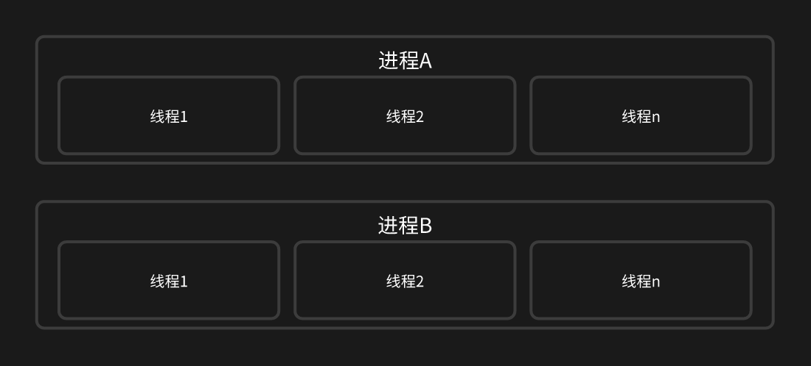
- **资源开销**：
- <mark style="background: #BBFABBA6;">进程拥有独立的地址空间</mark>，这意味着每个进程都有自己的一套数据段、堆栈段和代码段，这导致创建和销毁进程的开销较大。
- <mark style="background: #ABF7F7A6;">线程共享同一进程的地址空间</mark>，包括内存资源和文件描述符等，因此创建和销毁线程的开销较小。

- **通信效率**：
- 进程间通信（IPC）需要通过特定的机制如管道、消息队列、共享内存等来实现，这增加了通信的复杂性和开销。
- 同一进程内的线程可以<mark style="background: #ABF7F7A6;">直接访问共享的内存区域</mark>，使得线程间的通信更加高效和简单。

- **调度灵活性**：
 - 操作系统调度的基本单位是进程，这意味着如果一个进程中的任务需要等待 I/O 操作完成，整个进程都会被阻塞。
- 线程作为更细粒度的调度单位，可以在一个线程等待 I/O 操作时，让其他线程继续执行，<mark style="background: #ADCCFFA6;">提高了系统的响应速度和资源利用率</mark>。

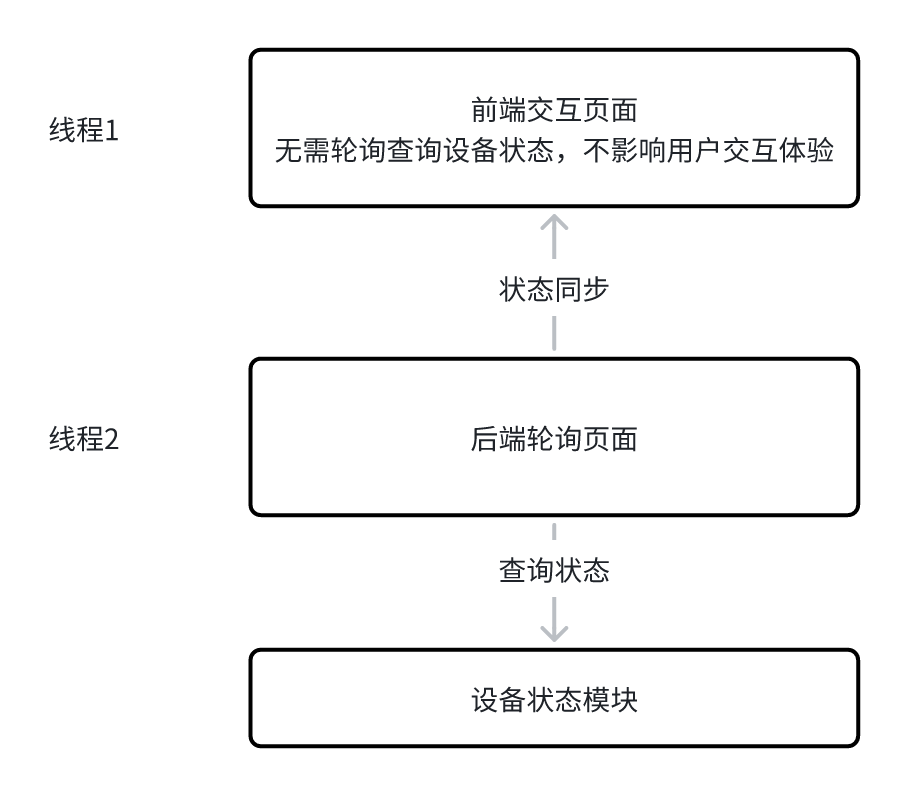
```c
#include <pthread.h>
pthread_create
int pthread_create(pthread_t *thread, const pthread_attr_t *attr, void *(*start_routine) (void *), void *arg);

// 功能：创建一个新的线程。
// thread：用于存储新创建线程的标识符。
// attr：用于指定线程属性（如栈大小、优先级等）。通常设置为 NULL 表示使用默认属性。
// start_routine：线程的入口函数，类型为 void *(*start_routine)(void *)。
// arg：传递给 start_routine 函数的参数，类型为 void *。
// 返回值：成功时返回 0，失败时返回错误码。

pthread_join
int pthread_join(pthread_t thread, void **retval);

// 功能：等待指定的线程结束，并获取其返回值。
// thread：要等待的线程的标识符。
// retval：指向 void * 类型的指针，用于存储线程的返回值。如果不需要获取返回值，可以设置为 NULL。
// 返回值：成功时返回 0，失败时返回错误码。

pthread_exit
void pthread_exit(void *retval);

// 功能：使当前线程终止，并返回一个值。
// retval：线程的返回值，类型为 void *。这个值可以通过 pthread_join 函数获取。
// 返回值：无返回值，因为该函数不会返回。

pthread_cancel
int pthread_cancel(pthread_t thread);

// 功能：请求取消指定的线程。可以用于一个线程取消另一个线程
// thread：要取消的线程的标识符。
// 返回值：成功时返回 0，失败时返回错误码。
```


### 互斥锁（Mutex）是一种常用的同步机制

互斥锁（Mutex）是一种常用的<mark style="background: #BBFABBA6;">同步机制</mark>，用于保护共享资源，防止多个线程同时访问同一资源而导致的<mark style="background: #ABF7F7A6;">数据不一致问题</mark>。互斥锁的主要功能是确保<mark style="background: #ADCCFFA6;">同一时间只有一个线程可以访问临界区</mark>（即需要保护的代码段）。

```C
// 初始化互斥锁
int pthread_mutex_init(pthread_mutex_t *mutex, const pthread_mutexattr_t *attr);

// 功能：初始化一个互斥锁。
// mutex：指向 pthread_mutex_t 类型的指针，用于存储互斥锁。
// attr：指向 pthread_mutexattr_t 类型的指针，用于指定互斥锁属性。通常设置为 NULL 表示使用默认属性。
// 返回值：成功时返回 0，失败时返回错误码。

// 获取互斥锁
int pthread_mutex_lock(pthread_mutex_t *mutex);

// 功能：获取互斥锁。如果锁已被其他线程占用，调用线程会阻塞，直到锁被释放。

// mutex：指向 pthread_mutex_t 类型的指针，用于获取互斥锁。
// 返回值：成功时返回 0，失败时返回错误码。

// 尝试获取互斥锁
int pthread_mutex_trylock(pthread_mutex_t *mutex);
功能：尝试获取互斥锁，如果锁已被其他线程持有，则立即返回。

// mutex：指向 pthread_mutex_t 类型的指针，用于尝试获取互斥锁。
//返回值：
// 成功时返回 0。
// 如果锁已被其他线程持有，返回 EBUSY。
// 其他错误返回相应的错误码。

// 释放互斥锁
int pthread_mutex_unlock(pthread_mutex_t *mutex);
功能：释放互斥锁。

// mutex：指向 pthread_mutex_t 类型的指针，用于释放互斥锁。
// 返回值：成功时返回 0，失败时返回错误码。

//销毁互斥锁
int pthread_mutex_destroy(pthread_mutex_t *mutex);
功能：销毁一个互斥锁。

// mutex：指向 pthread_mutex_t 类型的指针，用于销毁互斥锁。
// 返回值：成功时返回 0，失败时返回错误码。
```

下面我们来看下如何使用互斥锁来保护 共享资源
```c
#include <stdio.h>
#include <stdlib.h>
#include <pthread.h>
#include <unistd.h>

// 共享资源
int shared_data = 0;

// 互斥锁
pthread_mutex_t mutex;

// 线程入口函数
void *thread1_function(void *arg) {
    for (int i = 0; i < 1000; i++) {
        // 获取互斥锁
        pthread_mutex_lock(&mutex);
        // 临界区
        shared_data++;
        printf("Thread 1: shared_data = %d\n", shared_data);
        // 释放互斥锁
        pthread_mutex_unlock(&mutex);
        // 模拟一些工作
        usleep(1);
    }
    pthread_exit(NULL);
}

void *thread2_function(void *arg) {
    for (int i = 0; i < 1000; i++) {
        pthread_mutex_lock(&mutex);
        shared_data++;
        printf("Thread 2: shared_data = %d\n", shared_data);
        pthread_mutex_unlock(&mutex);
        usleep(1);
    }
    pthread_exit(NULL);
}

int main() {
    pthread_t thread1, thread2;
    // 初始化互斥锁
    if (pthread_mutex_init(&mutex, NULL) != 0) {
        printf("pthread_mutex_init fail\n");
        return 1;
    }

    // 创建线程
    if (pthread_create(&thread1, NULL, thread1_function, NULL) != 0) {
        printf("pthread_create fail\n");
        return 1;
    }
    if (pthread_create(&thread2, NULL, thread2_function, NULL) != 0) {
        printf("pthread_create fail\n");
        return 1;
    }

    // 等待线程结束
    pthread_join(thread1, NULL);
    pthread_join(thread2, NULL);

    // 销毁互斥锁
    if (pthread_mutex_destroy(&mutex) != 0) {
        printf("pthread_mutex_destroy fail\n");
        return 1;
    }

    return 0;
}
```

### 线程同步

C 语言提供了条件变量（Condition Variables）来实现线程间的同步。条件变量通常与互斥锁（Mutex）结合使用，以实现更复杂的同步逻辑。

## Socket通信

前面我们说到的通信方式，其实程序都是在一台电脑中的，如果多台通过网线连接的电脑，它们之间需要进行通信，那有什么方式呢？那就是Socket通信了，当然了，Socket也可以用于同一台机器的两个进程间进行通信。

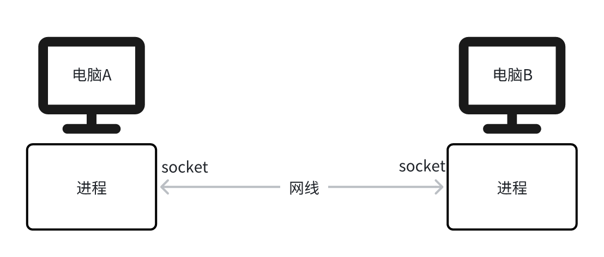

**什么是Socket通信？**

Socket（套接字）是网络通信的编程接口，用于不同设备之间的数据传输。它基于IP地址 + 端口号的组合，允许应用程序通过网络发送和接收数据。

Socket通信的核心是客户端-服务器模型：

1. <mark style="background: #ABF7F7A6;">服务器</mark>：监听某个端口，等待客户端连接。
2. <mark style="background: #ADCCFFA6;">客户端</mark>：主动向服务器的IP和端口发起连接请求。
3. 建立连接后，双方可以互相发送数据。

```c
+-----------------------+
| HTTP FTP MQTT(应用层)   |  ← 基于文本/二进制的应用协议（如GET /index.html）
+-----------------------+
|    TCP UDP(传输层)      |  ← 可靠连接、流量控制、数据分段（端口号：80/443）
+-----------------------+
|      IP (网络层)        |  ← 寻址和路由（如192.168.1.1 → 公网IP）
+-----------------------+
|    Socket (编程接口)    |  ← 操作系统提供的API（如socket()、bind()、send()）
+-----------------------+
|物理层(有线网络/WiFi模块) |  ← 实际数据传输（如WiFi模组）
+-----------------------+
```

### TCP通信流程

TCP（传输控制协议）是一种<mark style="background: #ABF7F7A6;">需要连接的</mark>，可靠的协议，它确保数据在发送和接收之间的完整性和顺序。
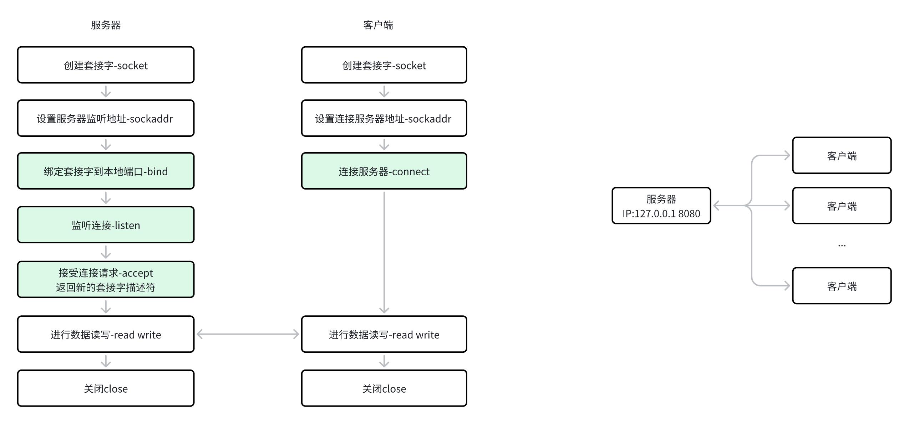

**服务器端**
创建套接字：使用 `socket 函数`创建一个套接字。
绑定地址：使用 `bind 函数`将套接字绑定到本地地址和端口。
监听连接：使用 `listen 函数`使套接字进入监听状态。
接受连接：使用 `accept 函数`接受客户端的连接请求。
读写数据：使用 `read 和 write 函数`进行数据的读写。
关闭套接字：使用 `close 函数`关闭套接字。

**客户端**
创建套接字：使用 `socket 函数`创建一个套接字。
连接服务器：使用 `connect 函数`连接到服务器。
读写数据：使用 `read 和 write 函数`进行数据的读写。
关闭套接字：使用 `close 函数`关闭套接字。

服务端
```C
#include <stdio.h>
#include <string.h>
#include <unistd.h>
#include <arpa/inet.h>

#define PORT 8080
#define BUFFER_SIZE 1024

int main() {
    int server_fd, new_socket;
    struct sockaddr_in address;
    char buffer[BUFFER_SIZE] = {0};
    const char *message = "Hello from server";

    // 创建套接字
    if ((server_fd = socket(AF_INET, SOCK_STREAM, 0)) == 0) {
        printf("socket failed");
        return 1;
    }

    // 绑定监听地址
    address.sin_family = AF_INET;
    address.sin_addr.s_addr = INADDR_ANY;
    address.sin_port = htons(PORT);

    if (bind(server_fd, (struct sockaddr *)&address, sizeof(address)) < 0) {
        printf("bind failed");
        close(server_fd);
        return 1;
    }

    // 监听连接
    if (listen(server_fd, 3) < 0) {
        printf("listen failed");
        close(server_fd);
        return 1;
    }

    printf("Server listening on port %d\n", PORT);

    // 接受连接
    if ((new_socket = accept(server_fd, NULL, NULL)) < 0) {
        printf("accept failed");
        close(server_fd);
        return 1;
    }

    printf("Connection accepted\n");

    // 读取数据
    read(new_socket, buffer, BUFFER_SIZE);
    printf("Received from client: %s\n", buffer);

    // 发送数据
    write(new_socket, message, strlen(message));

    // 关闭套接字
    close(new_socket);
    close(server_fd);

    return 0;
}
```

客户端
```c
#include <stdio.h>
#include <stdlib.h>
#include <string.h>
#include <unistd.h>
#include <arpa/inet.h>

#define PORT 8080
#define BUFFER_SIZE 1024

int main() {
    int sock = 0;
    struct sockaddr_in serv_addr;
    char buffer[BUFFER_SIZE] = {0};
    const char *message = "Hello from client";

    // 创建套接字
    if ((sock = socket(AF_INET, SOCK_STREAM, 0)) < 0) {
        printf("socket failed");
        return 1;;
    }
    // 设置服务器地址
    serv_addr.sin_family = AF_INET;
    serv_addr.sin_port = htons(PORT);
    // 将 IP 地址从字符串转换为二进制形式并存入serv_addr.sin_addr
    if (inet_pton(AF_INET, "127.0.0.1", &serv_addr.sin_addr) <= 0) {
        printf("inet_pton failed");
        close(sock);
        return 1;;
    }

    // 连接服务器
    if (connect(sock, (struct sockaddr *)&serv_addr, sizeof(serv_addr)) < 0) {
        printf("connect failed");
        close(sock);
        return 1;;
    }

    printf("Connected to server\n");

    // 发送数据
    write(sock, message, strlen(message));

    // 读取数据
    read(sock, buffer, BUFFER_SIZE);
    printf("Received from server: %s\n", buffer);

    // 关闭套接字
    close(sock);

    return 0;
}
```

### UDP 通信流程

UDP（用户数据报协议）是一种<mark style="background: #ABF7F7A6;">无连接的</mark>，不可靠的协议，它不保证数据的完整性或顺序。
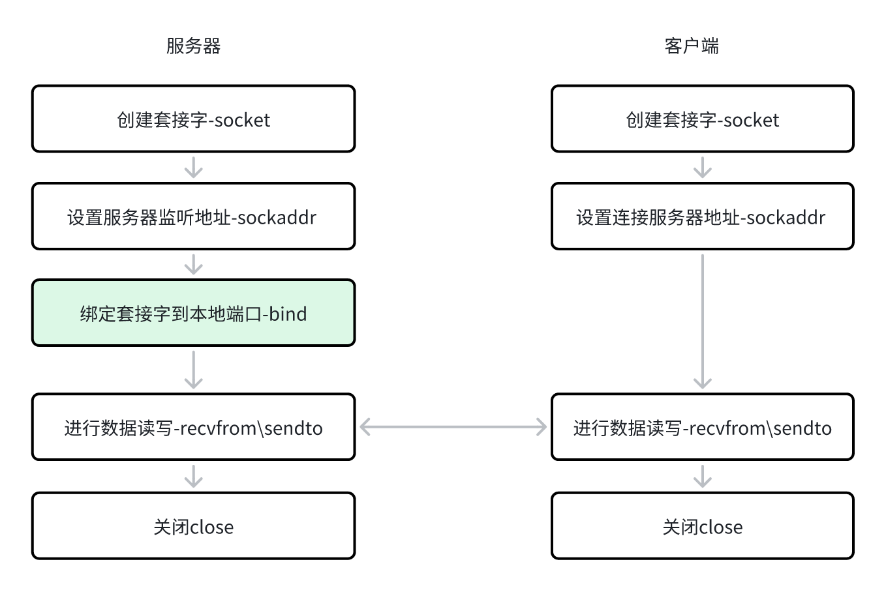

**服务器端**
创建套接字：使用 `socket 函数`创建一个套接字。
绑定地址：使用 `bind 函数`将套接字绑定到本地地址和端口。
读写数据：使用 `recvfrom 和 sendto 函数`进行数据的读写。
关闭套接字：使用 `close 函数`关闭套接字。

**客户端**
创建套接字：使用 `socket 函数`创建一个套接字。
读写数据：使用 `sendto 和 recvfrom 函数`进行数据的读写。
关闭套接字：使用 `close 函数`关闭套接字。

**UDP服务端**
```C
#include <stdio.h>
#include <stdlib.h>
#include <string.h>
#include <unistd.h>
#include <arpa/inet.h>

#define PORT 8080
#define BUFFER_SIZE 1024

int main() {
    int server_fd;
    struct sockaddr_in address;
    int addrlen = sizeof(address);
    
    // 创建套接字
    if ((server_fd = socket(AF_INET, SOCK_DGRAM, 0)) < 0) {
        printf("socket failed");
        return 1;
    }
    // 绑定地址
    address.sin_family = AF_INET;
    address.sin_addr.s_addr = INADDR_ANY;
    address.sin_port = htons(PORT);
    if (bind(server_fd, (struct sockaddr *)&address, sizeof(address)) < 0) {
        printf("bind failed");
        close(server_fd);
        return 1;
    }
    printf("UDP Server listening on port %d\n", PORT);

    // 读取数据
    char buffer[BUFFER_SIZE] = {0};
    int n = recvfrom(server_fd, buffer, BUFFER_SIZE, 0, (struct sockaddr *)&address, (socklen_t*)&addrlen);
    printf("Received from client: %s\n", buffer);
    // 发送数据
    const char *message = "Hello from server";
    sendto(server_fd, message, strlen(message), 0, (struct sockaddr *)&address, addrlen);

    // 关闭套接字
    close(server_fd);
    return 0;
}
```

**UDP客户端**
```C
#include <stdio.h>
#include <stdlib.h>
#include <string.h>
#include <unistd.h>
#include <arpa/inet.h>

#define PORT 8080
#define BUFFER_SIZE 1024

int main() {
    int sock = 0;
    struct sockaddr_in serv_addr;
    
    // 创建套接字
    if ((sock = socket(AF_INET, SOCK_DGRAM, 0)) < 0) {
        printf("socket failed");
        return 1;
    }

    serv_addr.sin_family = AF_INET;
    serv_addr.sin_port = htons(PORT);
    // 将 IP 地址从字符串转换为二进制形式
    if (inet_pton(AF_INET, "127.0.0.1", &serv_addr.sin_addr) <= 0) {
        printf("inet_pton failed");
        close(sock);
        return 1;
    }

    // 发送数据
    const char *message = "Hello from client";
    sendto(sock, message, strlen(message), 0, (struct sockaddr *)&serv_addr, sizeof(serv_addr));

    // 读取数据
    char buffer[BUFFER_SIZE] = {0};
    int n = recvfrom(sock, buffer, BUFFER_SIZE, 0, NULL, NULL);
    printf("Received from server: %s\n", buffer);

    // 关闭套接字
    close(sock);
    return 0;
}
```