## 前言

[STM32立创资料](https://so.szlcsc.com/global.html?k=STM32&hot-key=TPS54160DGQR)

[环境搭建](https://x509p6c8to.feishu.cn/wiki/DQsBw76bCiWaO4kS8TXcWDs0nAh)

> [!tip] 专业名词
- **SRAM** 静态随机存取存储器，芯片内部的**高速缓存**
- **PSRAM** 伪静态随机存取存储器，比纯 SRAM **成本低、容量大**
- **NOR Flash** 或非闪存，属于非易失性存储器，可以按字节随机读写
- **NAND Flash** 与非闪存，也是非易失性存储器，**按块读写**
- **FSMC** 可配置的静态存储器控制器
- **并行 LCD 接口** LCD 屏幕和主控芯片之间，通过多根数据线同时传输数据 / 指令的连接方式
- **RC振荡器** 用 RC 的充放电快慢决定振荡频率，再通过电路让这个充放电循环起来，就形成了持续的振荡信号
- **DMA** 直接存储器访问，核心是**让外设和内存之间直接传数据，全程不用 CPU 插手**
- **VDD**：芯片 / 元器件的**主电源正极**（供电端）
- **VSS**：芯片 / 元器件的**电源负极 / 地**（接地端GND）
- **VCC** = 正极，**VEE** = 负极（地 / 负电源）**模拟芯片**

## STM32CubeMX介绍

芯片要运行起来，必须要有<mark style="background: #BBFABBA6;">时钟源</mark>，在STM32中，我们可以选择外部或内部时钟作为芯片时钟源。

> 内部时钟 LSI HSI
> STM32 MCU内部自带RC振荡电路，其内部时钟就是RC振荡器产生的。
> 但是RC振荡器精度远低于晶振，且容易受到温度的影响。

 > 外部时钟 LSE HSE (一般两种接法)
 > 外部接有源晶振或其他直接时钟输入源：BYPASS Clock Source模式（旁路时钟源）
 > 外部接无源晶振：Crystal/Ceramic Resonator模式（晶体/陶瓷晶振）

## 烧录方式

目前常用的两种接口是 <mark style="background: #BBFABBA6;">JTAG</mark> 和 <mark style="background: #BBFABBA6;">SWD</mark>

使用SWD接口作为调试接口，SWD（Serial Wire Debug 串行调试），接口仅需4个，分别是VCC、GND、SWIO（双向数据接口）、SWCLK（时钟）。

## HAL API接口

**1、设置GPIO输出电平函数**

`HAL_GPIO_WritePin` 是 STM32 HAL 库中用于**设置指定 GPIO 引脚输出电平**的函数，其参数和使用方式如下：

```c
void HAL_GPIO_WritePin(GPIO_TypeDef* GPIOx, uint16_t GPIO_Pin, GPIO_PinState PinState);
```

|   |   |   |
|---|---|---|
|参数名|类型|含义与取值|
|GPIOx|GPIO_TypeDef*|GPIO 端口号，指定要操作的 GPIO 外设（如 GPIOA、GPIOB、GPIOC 等）取决于芯片型号支持的 GPIO 端口。|
|GPIO_Pin|uint16_t|GPIO 引脚号，指定要操作的具体引脚，例如GPIO_PIN_6|
|PinState|GPIO_PinState|输出电平状态，指定引脚输出高电平或低电平。  <br>取值：  <br>- GPIO_PIN_SET：输出高电平（逻辑 1）；  <br>- GPIO_PIN_RESET：输出低电平（逻辑 0）。|

  

**2、毫秒级延时函数**

`HAL_Delay` 是 STM32 HAL 库中用于实现**毫秒级延时**的函数，广泛用于需要短暂等待的场景（如外设初始化后等待稳定、时序控制等）。

`void HAL_Delay(uint32_t Delay);`

|   |   |   |
|---|---|---|
|参数名|类型|含义与取值|
|Delay|uint32_t|延时时间，单位为 毫秒（ms）。取值范围：0 ~ 0xFFFFFFFF）。|

实际代码中，这部分功能的完整执行顺序是：

```c
// 1. 使能GPIOA时钟（必须！STM32外设使用前要先开时钟）
__HAL_RCC_GPIOA_CLK_ENABLE();

// 2. 配置GPIO初始化结构体
GPIO_InitTypeDef GPIO_InitStruct = {0};
GPIO_InitStruct.Pin = GPIO_PIN_6;
GPIO_InitStruct.Mode = GPIO_MODE_OUTPUT_PP;
GPIO_InitStruct.Pull = GPIO_PULLUP;
GPIO_InitStruct.Speed = GPIO_SPEED_FREQ_LOW;

// 3. 应用配置到GPIOA硬件寄存器
HAL_GPIO_Init(GPIOA, &GPIO_InitStruct);

// 4. 设置GPIOA6输出高电平
HAL_GPIO_WritePin(GPIOA, GPIO_PIN_6, GPIO_PIN_SET);
```

## 不同编程方式-寄存器、标准库、HAL库、LL库

**寄存器编程**是最接近底层的编程方式，也是运行效率最高的，但缺点是编程效率低，维护难度高，排查问题效率低

- 寄存器编程与库函数编程
```C
// 1.实现设置GPIOC PIN13为输出模式，控制LED的亮灭

//基于寄存器编程
#include "stm32f10x.h"                  
int main(void)
{
        /*打开时钟 APB2 IOPC*/
        RCC->APB2ENR = 0x00000010;
        /*配置GPIOC13 设置推挽输出 速率50MHZ*/
        GPIOC->CRH = 0x00300000;
        /*设置GPIO输出*/
        GPIOC->ODR = 0x00002000;       
        while(1)
        {
                
        }
}

//基于库编程
#include "stm32f10x.h"
int main(void)
{
        /*打开时钟*/
        RCC_APB2PeriphClockCmd(RCC_APB2Periph_GPIOC, ENABLE);                        
        /*配置GPIO*/
        GPIO_InitTypeDef GPIO_InitStructure;
        GPIO_InitStructure.GPIO_Mode        = GPIO_Mode_Out_PP; 
        GPIO_InitStructure.GPIO_Speed       = GPIO_Speed_50MHz;
        GPIO_InitStructure.GPIO_Pin         = GPIO_Pin_13;
        GPIO_Init(GPIOC, &GPIO_InitStructure);
        /*设置GPIO输出*/
        GPIO_SetBits(GPIOC, GPIO_Pin_13);                   
        while(1)
        {
                
        }
}

// 2.实现设置串口USART1 波特率115200 8位数据位 1位停止位 无奇偶校验

//寄存器编程
void uart_init(u32 pclk2,u32 baudrate)
{           
        float temp;
        u16 mantissa;                
        u16 fraction;           
        temp=(float)(pclk2*1000000)/(baudrate*16);//得到USARTDIV
        mantissa=temp;                         //得到整数部分
        fraction=(temp-mantissa)*16;           //得到小数部分         
        mantissa<<=4;
        mantissa+=fraction; 
        RCC->APB2ENR|=1<<2;   //使能PORTA口时钟  
        RCC->APB2ENR|=1<<14;  //使能串口时钟 
        GPIOA->CRH&=0XFFFFF00F;//IO状态设置
        GPIOA->CRH|=0X000008B0;//IO状态设置 
        RCC->APB2RSTR|=1<<14;   //复位串口1
        RCC->APB2RSTR&=~(1<<14);//停止复位                      
        USART1->BRR=mantissa; // 波特率设置         
        USART1->CR1|=0X200C;  //1位停止,无校验位.
}

//库函数编程
void MX_USART1_UART_Init(u32 baudrate)
{
        //IO初始化
        GPIO_InitStruct.Pin = GPIO_PIN_2;
        GPIO_InitStruct.Mode = GPIO_MODE_AF_PP;
        GPIO_InitStruct.Speed = GPIO_SPEED_FREQ_HIGH;
        HAL_GPIO_Init(GPIOA, &GPIO_InitStruct);
        GPIO_InitStruct.Pin = GPIO_PIN_3;
        GPIO_InitStruct.Mode = GPIO_MODE_INPUT;
        GPIO_InitStruct.Pull = GPIO_NOPULL;
        HAL_GPIO_Init(GPIOA, &GPIO_InitStruct);
        //串口初始化
        UART_HandleTypeDef huart1;
        huart1.Instance = USART1;
        huart1.Init.BaudRate = baudrate;
        huart1.Init.WordLength = UART_WORDLENGTH_8B;
        huart1.Init.StopBits = UART_STOPBITS_1;
        huart1.Init.Parity = UART_PARITY_NONE;
        huart1.Init.Mode = UART_MODE_TX_RX;
        HAL_UART_Init(&huart1);
}

//从编程难度、维护难度、移植难度几个维度对比，库函数编程都是优于寄存器编程的。
```

- 标准库（Standard Peripheral Library）是STMicroelectronics提供的最基本的库。标准库是最早的，现在已经<mark style="background: #FF5582A6;">停止维护</mark>
- HAL库提供了一种更易用和可移植的编程模型，并减少了编写底层代码的工作量。它还支持多种开发板和外设，提供了一致的接口，简化了代码移植和复用。<mark style="background: #BBFABBA6;">主流</mark>
- 使用LL库，开发人员可以直接编写更底层的代码，实现对微控制器和外设的精细控制。

## GPIO输入 按键

- 开启引脚外部浮空/上拉/下拉：

- 模式的作用？
1. 设置为浮空模式，IO会变成高阻态，IO电平由外部电平决定。
2. 设置为上拉模式，在无外部信号输入时，IO电平是高电平。
3. 设置为下拉模式，在无外部信号输入时，IO电平是低电平。

- 如何选择？
所以我们可以根据原理图设计选择，如果<mark style="background: #FFF3A3A6;">外部是有上拉</mark>的，我们可以<mark style="background: #BBFABBA6;">选择浮空</mark>。如果<mark style="background: #FFF3A3A6;">外部没有上下拉</mark>的，<mark style="background: #FFF3A3A6;">内部就选择上下拉</mark>，钳住IO电平，让IO信号更稳定

1. 外部有效信号是高的，选择下拉。 
2. 外部有效信号是低的，选择上拉。

因为我们电路已经有上拉电阻，这里可以选择浮空即可。  

TTL肖特基触发器：信号经过触发器后，模拟信号转化为0和1的数字信号。

我们可以实现读取按键是否按下，设置LED亮灭功能
```C
  while (1)
  {
    /* USER CODE END WHILE */

    /* USER CODE BEGIN 3 */
       if(HAL_GPIO_ReadPin(KEY1_GPIO_Port,KEY1_Pin) == 0) //判断按键KEY是否被按下
       {
            HAL_Delay(10);//延时10ms消除按键抖动
            if(HAL_GPIO_ReadPin(KEY1_GPIO_Port,KEY1_Pin) == 0){    //再次判断按键KEY是否依然被按下
                 HAL_GPIO_TogglePin(LED1_GPIO_Port,LED1_Pin);      //对LED引脚进行取反操作 
                 while(HAL_GPIO_ReadPin(KEY1_GPIO_Port,KEY1_Pin) == 0);  //等待按键抬起
            }
        }
  }
  /* USER CODE END 3 */
```

## 调试

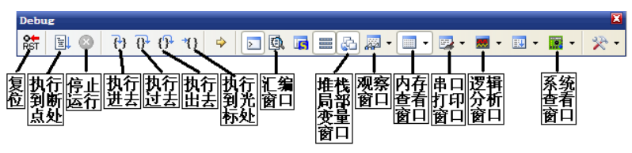
上图的DEBUG工具条是比较常用，作为一般的使用者或者说入门的使用者来说，最常使用的还是下面加黑的几个。

## 继电器

**什么是继电器**：功率继电器简单来说就是一个开关，具有隔离功能，支持低压控制高压。广泛应用于自动控制、机电一体化及电力电子设备中。

**继电器的原理**：是通过小电流来控制其中的线圈，线圈一通电就会产生磁场，磁场会把活动触点吸下来，改变输出触点的连通或断开状态。

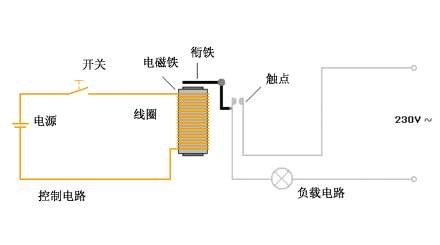

## 定时器

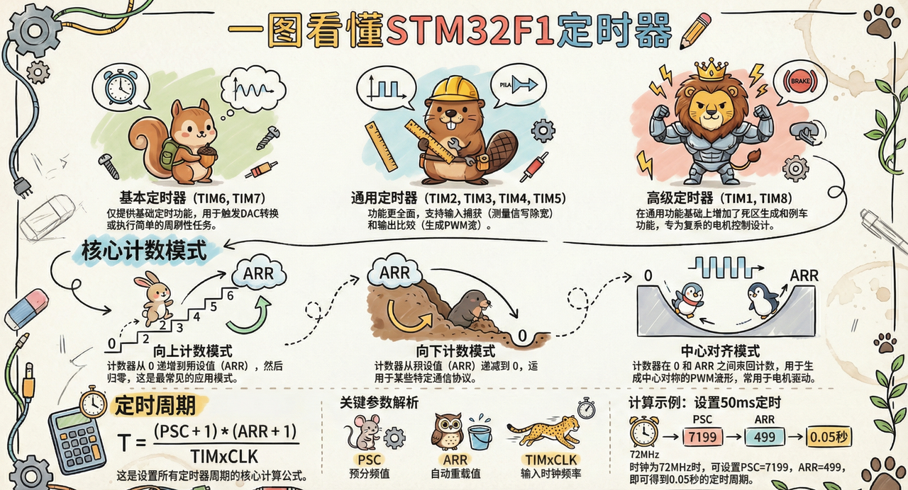

- 定时器的定时时间 $T =\frac{ (PSC+1)(ARR+1)}{TIM*CLK}$
```C
T为定时器的定时时间（单位为s）
PSC为定时器预分频系数（范围0--65535）
ARR为自动重装载值（范围0--65535）
TIMxCLK为TIM的输入时钟频率（单位为hz）
```

## 触控检测芯片

当有人体手指靠近触摸按键时，人体手指与大地构成的感应电容<mark style="background: #FFB86CA6;">并联</mark>焊盘与大地构成的感应电容，会<mark style="background: #BBFABBA6;">使总感应电容值增加</mark>。

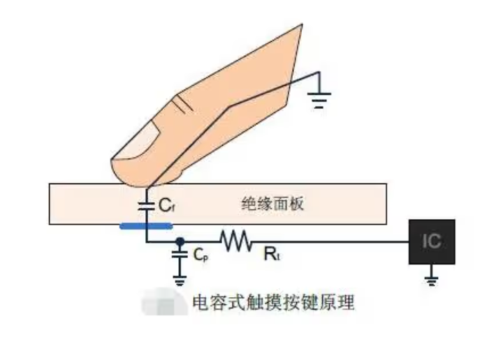

电容式触摸按键IC在检测到某个按键的感应电容值发生改变后，将输出某个按键被按下的确定信号。

## 串口UART

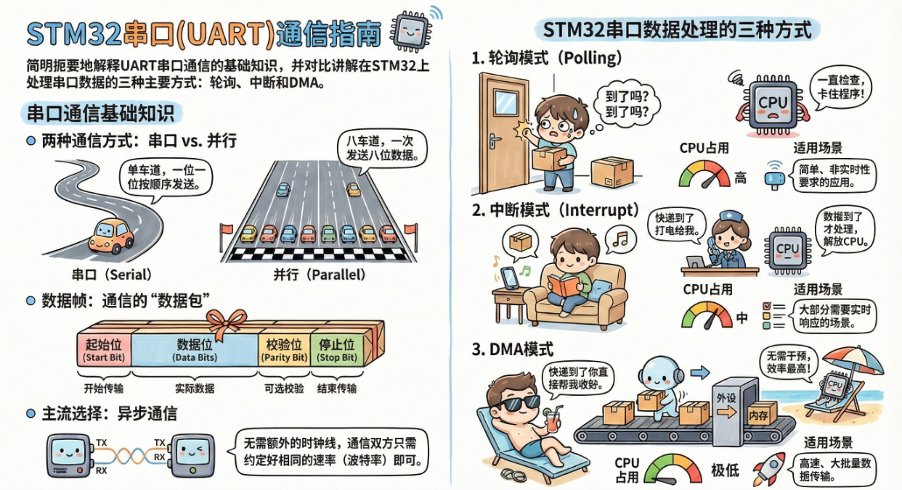

串口（Serial Port）是一种"一位一位顺序发送数据"的通信接口。

**什么是异步通信？什么是同步通信？**

```C
TX：发送数据输出引脚。
RX：接收数据输入引脚。
SCLK：发送器时钟输出引脚，这个引脚仅适用于同步模式，用于时钟同步，一般不使用。

流控引脚：如果发送设备发送太快，接收设备来不及处理，可以通过流控来控制传输的速度，一般不使用。
nRTS是请求发送，是输出脚，就是告诉别人，我当前能不能接收，用于硬件流控
nCTS是清除发送，是输入脚，用于接收别人nRTS的信号，用于硬件流控
```

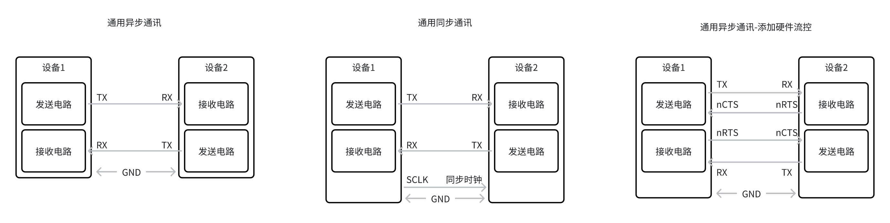

```C
硬件流控说明，例如：
接收端可以接收数据时，会设置nRTS输出低电平，此时发送端读取到低电平，开始发送数据。
接收端处理不过来时，设置nRTS为高电平，此时发送端读取到高电平，停止发送数据。
```

## 485

RS485是美国电子工业协会（Electronic Industries Association，EIA）于1983年发布的<mark style="background: #BBFABBA6;">串行通信接口标准</mark>。

总线标准，RS485具有支持多节点，<mark style="background: #ADCCFFA6;">一条RS485总线能并联多少台设备</mark>要看什么芯片，可以控制多少个设备的问题是与该485网络中的电气特性和协议特性所决定的，并和所用电缆的品质相关，节点越多、传输距离越远、电磁环境越恶劣，所选的电缆要求就越高。

支持32个节点数的芯片：SN75176，SN75276，SN75179，SN75180，MAX485，MAX488，MAX490 
支持64个节点数的芯片：SN75LBC184 
支持128个节点数的芯片：MAX487，MAX1487 
支持256个节点数的芯片：MAX1482，MAX1483，MAX3080～MAX3089

<mark style="background: #FFF3A3A6;">传输距离远</mark>（最大1219m）

连接简单（在构成通信网络时，仅需要一对双绞线作传输线）

能抑制共模干扰（差分传输）

在多站、远距离通信等多种工控环境中获得了广泛应用。

**多个设备进行485通讯的接线**

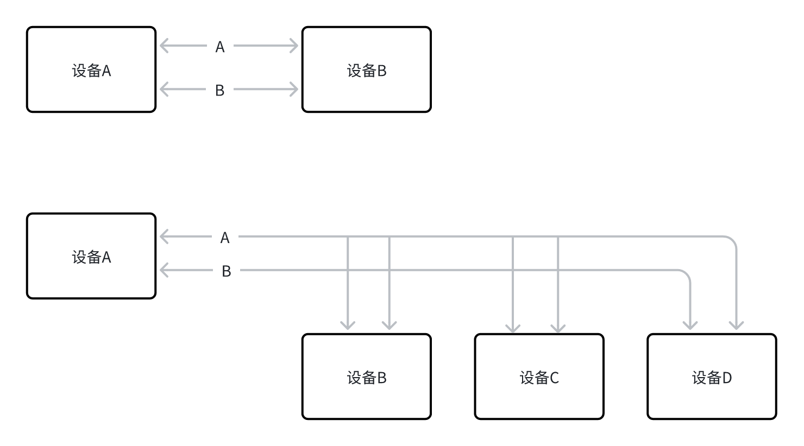

## ADC

用于将模拟形式的连续信号转换为数字形式的离散信号的一类设备。

## 编码器

**拨轮滚轮旋转编码器**
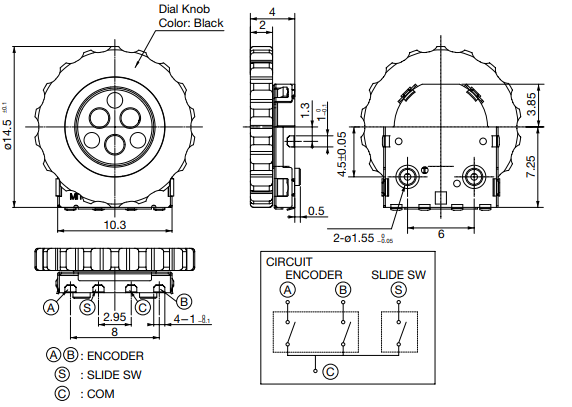

编码器有四根线，A\B是编码输出，S是按钮状态，C是公共端。

可以从图中可以看出当从 CW 方向转动的时候，A的波形上升沿比B波形的上升沿快，具体快多少，这里数据手册给出 24±3°，当从CCW方向转动的这个时候恰好相反，B的相位上升沿快于A的上升沿。这样可以通过捕获上升沿的顺序来判断编码器的方向。

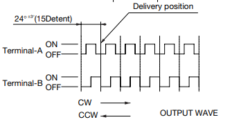

因此：我们有两种方式来判断编码器转动和方向：

1、设置IOA为<mark style="background: #BBFABBA6;">上升沿触发中断</mark>，在中断中检测B的电平状态，来判断旋转方向，这种方式比较简单。

2、可以同时捕获A项的上升、下降边沿，然后判断A项第一个边沿中断时候获取B和A项的电平，在第二个边沿触发中断的时候捕获B和A项的电平，根据两次捕获B和A项的值就可以知道旋转的方向。

## SPI

SPI，是一种高速的，全双工，同步的通信总线。
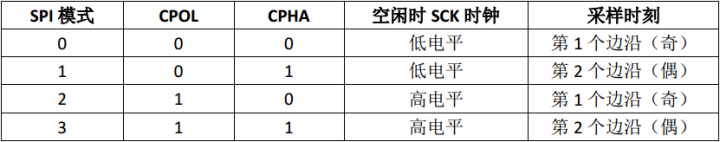

SPI接口一般使用四条信号线通信

**MOSI**(Master Output Slave Input)： 主设备输出/从设备输入引脚。该引脚在主模式下发送数据，在从模式下接收数据。

**MISO**(Master Input Slave Output)： 主设备输入/从设备输出引脚。该引脚在从模式下发送数据，在主模式下接收数据。

**SCLK**：串行时钟信号，由主设备产生。

**CS/SS**：从设备片选信号，由主设备控制。它的功能是用来作为“片选引脚”，也就是选择指定的从设备，让主设备可以单独地与特定从设备通讯，避免数据线上的冲突。

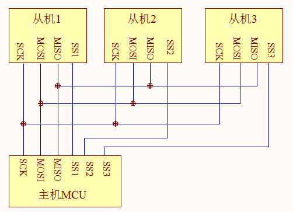

**UART、IIC、SPI的对比**

|   |   |   |   |
|---|---|---|---|
||UART|IIC|SPI|
|通讯方式|异步|同步|同步|
|通讯线|TXD 发送<br><br>RXD 接收<br><br>GND 地|SDA 数据<br><br>SCL 时钟|MOSI 主发从收<br><br>MISO 主收从发<br><br>SCK 时钟<br><br>CS 片选|
|设备从属|一对一|总线|总线|
|通讯速率|从几十Kbps到几Mbps|标准模式下可达100kbps，快速模式下可达400kbps，高速模式下可达3.4Mbps|几十Mbps甚至上百Mbps|
|场景|**UART** 常用于串行通信，如RS-232、RS-485通信，以及计算机与嵌入式设备间的通信。|**I²C** 因其简洁的连线和地址机制，适用于板级设备间的通信，如传感器、EEPROM等。|**SPI** 适用于短距离、高速数据传输，常见于传感器、屏幕、存储器（如Flash）与MCU之间的通信。|

## WiFi模组

