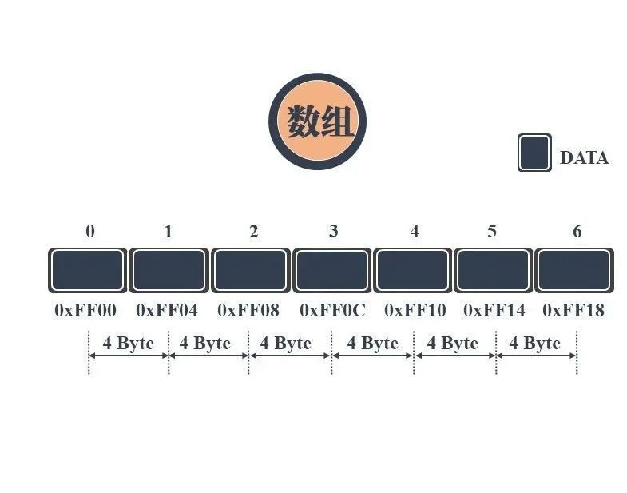
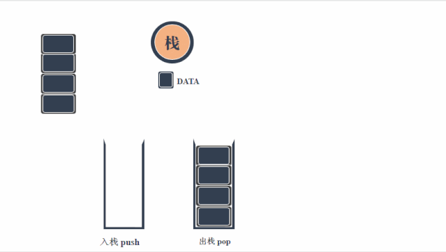
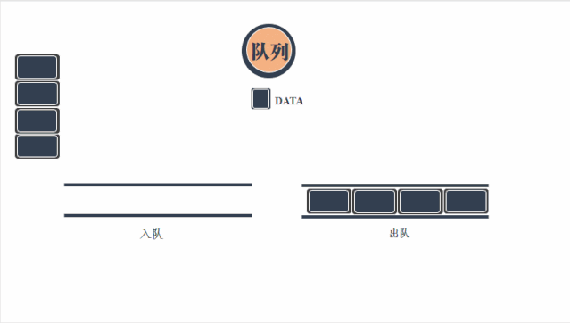
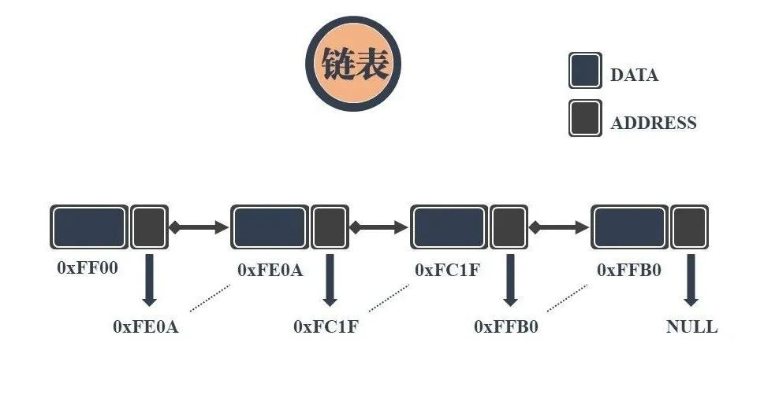
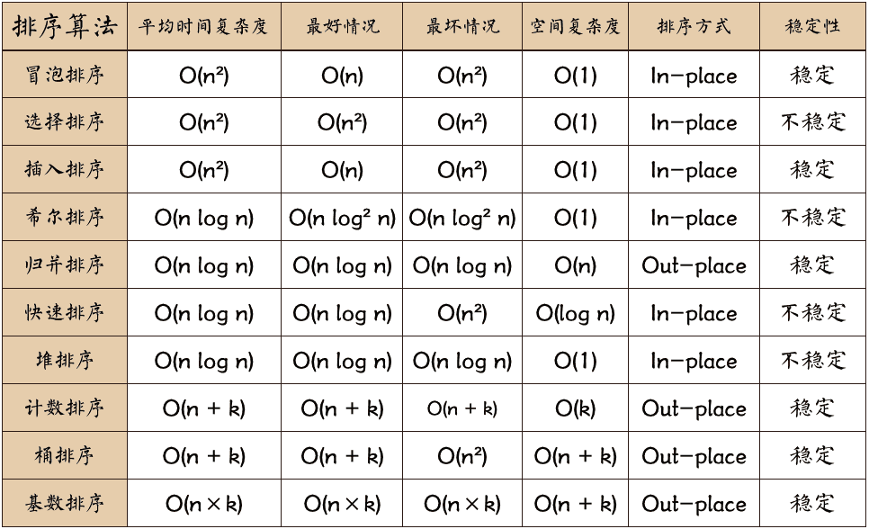

## 存储结构

顺序存储


链式存储


## 常用数据结构

### 栈

先进后出


后退/前进功能：网页浏览器中的后退和前进按钮可以使用栈来实现。在浏览网页时，每次访问一个新页面时，当前页面的信息将被推入栈中。当用户点击后退按钮时，程序将从栈中弹出最近的访问页面，并显示上一个页面。

```c
// 引入标准输入输出头文件，用于printf、scanf、fgets等输入输出操作
#include <stdio.h>
// 引入标准库头文件，提供通用工具函数（此处备用）
#include <stdlib.h>
// 引入字符串处理头文件，用于strcpy、strlen、strcspn等字符串操作
#include <string.h>

// 定义栈的最大容量：最多存储100个URL，每个URL的最大长度也为100（含结束符）
#define MAX_STACK_SIZE 100

/**
 * @brief 栈元素结构体：存储单个URL字符串
 */
typedef struct {
    char url[MAX_STACK_SIZE];  // 存储URL的字符数组，长度限定为MAX_STACK_SIZE
} StackItem;

/**
 * @brief 栈结构体：管理栈的核心信息
 */
typedef struct {
    StackItem items[MAX_STACK_SIZE];  // 存储所有栈元素的数组
    int top;                          // 栈顶指针：-1表示空栈，0表示第一个元素，99表示栈满
} Stack;

/**
 * @brief 初始化栈：将栈顶指针置为-1，代表栈初始为空
 * @param stack 指向栈结构体的指针（传地址避免拷贝，提高效率）
 */
void initStack(Stack *stack) {
    stack->top = -1;
}

/**
 * @brief 判断栈是否为空
 * @param stack 指向栈结构体的指针
 * @return 1：栈空；0：栈非空
 */
int isStackEmpty(Stack *stack) {
    return stack->top == -1;
}

/**
 * @brief 判断栈是否已满
 * @param stack 指向栈结构体的指针
 * @return 1：栈满；0：栈未满
 */
int isStackFull(Stack *stack) {
    return stack->top == MAX_STACK_SIZE - 1;
}

/**
 * @brief 入栈操作：将URL添加到栈顶
 * @param stack 指向栈结构体的指针
 * @param url 要入栈的URL字符串（外部传入）
 */
void push(Stack *stack, char *url) {
    // 检查栈是否已满，满则提示溢出并返回
    if (isStackFull(stack)) {
        printf("【错误】栈已满，无法入栈！\n");
        return;
    }
    stack->top++;  // 栈顶指针上移一位，指向新的空位置
    // 将传入的URL复制到栈顶元素的url字段（strcpy是字符串赋值的标准方式）
    strcpy(stack->items[stack->top].url, url);
}

/**
 * @brief 出栈操作：删除并返回栈顶的URL
 * @param stack 指向栈结构体的指针
 * @return 栈顶URL的字符串地址；栈空时返回NULL
 */
char* pop(Stack *stack) {
    // 检查栈是否为空，空则提示下溢并返回NULL
    if (isStackEmpty(stack)) {
        printf("【错误】栈为空，无法出栈！\n");
        return NULL;
    }
    // 取出栈顶元素的URL地址（注意：返回的是栈内数组的地址，非拷贝）
    char *url = stack->items[stack->top].url;
    stack->top--;  // 栈顶指针下移一位，代表栈顶元素被删除
    return url;
}

/**
 * @brief 清空输入缓冲区：解决scanf后fgets读取到空行的问题
 */
void clearInputBuffer() {
    // 循环读取缓冲区剩余字符，直到读到换行符或文件结束
    while (getchar() != '\n');
}

/**
 * @brief 主函数：提供交互式菜单，实现栈的入栈、出栈、退出操作
 * @return 0：程序正常结束
 */
int main() {
    char inputurl[MAX_STACK_SIZE];  // 存储用户输入的URL字符串
    int choice;                     // 存储用户选择的菜单选项（1/2/3）
    Stack stack;                    // 定义一个栈对象
    initStack(&stack);              // 初始化栈（必须调用，否则栈顶指针为随机值）

    // 无限循环展示菜单，直到用户选择退出（选项3）
    while (1) {
        // 打印交互式菜单
        printf("\n======= URL栈操作菜单 =======\n");
        printf("1: 入栈（添加URL）\n");
        printf("2: 出栈（删除并查看栈顶URL）\n");
        printf("3: 退出程序\n");
        printf("=============================\n");
        printf("请输入操作选项（1/2/3）：");
        
        // 读取用户输入的选项（处理输入错误）
        if (scanf("%d", &choice) != 1) {
            clearInputBuffer();  // 清空缓冲区的非法输入
            printf("【错误】请输入数字1、2或3！\n");
            continue;  // 重新循环展示菜单
        }
        clearInputBuffer();  // 清空scanf后缓冲区的换行符

        // 根据选项执行对应操作
        switch (choice) {
            case 1:  // 入栈操作
                printf("请输入要入栈的URL（支持空格，最大长度99）：");
                // 使用fgets读取带空格的字符串，避免scanf无法处理空格的问题
                fgets(inputurl, MAX_STACK_SIZE, stdin);
                // 去除fgets读取到的换行符（否则URL末尾会多一个换行）
                inputurl[strcspn(inputurl, "\n")] = '\0';
                // 检查URL是否为空
                if (strlen(inputurl) == 0) {
                    printf("【错误】URL不能为空！\n");
                    break;
                }
                push(&stack, inputurl);  // 调用入栈函数
                printf("【成功】URL入栈完成！\n");
                break;

            case 2:  // 出栈操作
                if (!isStackEmpty(&stack)) {  // 先判断栈是否非空
                    char *url = pop(&stack);  // 调用出栈函数
                    printf("【成功】出栈的URL：%s\n", url);
                } else {
                    printf("【提示】栈为空，无数据可出栈！\n");
                }
                break;

            case 3:  // 退出程序
                printf("【提示】程序已退出！\n");
                return 0;  // 结束main函数，退出程序

            default:  // 无效选项
                printf("【错误】无效选项，请输入1、2或3！\n");
                break;
        }
    }
    return 0;
}
```

### 队列

场景：编写代码，实现演唱会购票用户（id、座位区域（A、B、C））购票与出票。

分析：按购票顺序先后处理，<mark style="background: #BBFABBA6;">先购票先出票</mark>



```C
#include <stdio.h>

#define MAX_AREA_SIZE 10
#define MAX_QUEUE_SIZE 5

typedef struct {
    int id;
    char area[MAX_AREA_SIZE];
} User;

typedef struct {
    User data[MAX_QUEUE_SIZE];
    int front;    //队列头位置
    int rear;     //队列尾位置
} Queue;

/**
 * @brief 初始化队列
 * 初始化时，由于队列为空，队列头和尾位置都在0
 * @param q 
 */
void initQueue(Queue *q) {
    q->front = q->rear = 0;
}

/**
 * @brief 判断队列是否为空
 * 当队列头位置和尾位置相同时，队列为空
 * @param q 
 * @return int 
 */
int isQueueEmpty(Queue *q) {
    return q->front == q->rear;
}

/**
 * @brief 判断队列是否满
 * 当队列尾位置+1等于队列头位置时，队列满（队列尾位置追上头位置）
 * @param q 
 * @return int 
 */
int isQueueFull(Queue *q) {
    return (q->rear + 1) % MAX_QUEUE_SIZE == q->front;
}

/**
 * @brief 入队
 * 先判断队列是否满，然后存储数据到队列尾位置，队列尾位置+1
 * @param q 
 * @param s 
 * @return int 
 */
int enqueue(Queue *q, User *s) {
    if (isQueueFull(q)) {
        return 0;
    }
   printf("id=%d, area=%s ", s->id, s->area);
    q->data[q->rear] = *s;
    q->rear = (q->rear + 1) % MAX_QUEUE_SIZE;
    return 1;
}
/**
 * @brief 出队
 * 先判断队列是否空，然后读取队列头的数据，队列头位置+1
 * @param q 
 * @param s 
 * @return int 
 */
int dequeue(Queue *q, User *s) {
    if (isQueueEmpty(q)) {
        return 0;
    }
    *s = q->data[q->front];
    printf("id=%d, area=%s\n", s->id, s->area);
    q->front = (q->front + 1) % MAX_QUEUE_SIZE;
    return 1;
}

int main() {
    int id = 0;
    User user;
    int choice;
    Queue q;
    initQueue(&q);

    while (1)
    {
        printf("------》1:顾客购票\n");
        printf("------》2:工作人员出票\n");
        scanf("%d",&choice);
        switch (choice)
        {
        case 1:
            printf("请输入购票区域：");
            user.id = id ++;
            scanf("%s",user.area);
            if(enqueue(&q, &user) == 1)
                printf("支付成功，等待工作人员处理\n");
            else
                printf("支付失败，当前无票\n");
            break;
        case 2:
            printf("出票:");
            User s;
            if (!dequeue(&q, &s)) {
                printf("已没有购票需要处理\n");
            }
            break;
        default:
            printf("无效操作\n");
            break;
        }
    }
    return 0;
}
```

### 链表

场景：实现一个用户信息管理系统，支持插入、查找、删除

分析：


```C
#include <stdio.h>
#include <stdlib.h>
#include <string.h>

// 定义用户结构体
typedef struct User {
    char name[50];
    int age;
    struct User *next;
} User;

// 初始化链表头节点
User *head = NULL;

// 插入用户信息
void insertUser() {
    User *newUser = (User *) malloc(sizeof(User));
    printf("请输入用户名：");
    scanf("%s", newUser->name);
    printf("请输入年龄：");
    scanf("%d", &newUser->age);
    newUser->next = NULL;

    if (head == NULL) {
        head = newUser;
    } else {
        User *temp = head;
        while (temp->next != NULL) {
            temp = temp->next;
        }
        temp->next = newUser;
    }

    printf("用户信息插入成功！\n");
}

// 删除用户信息
void deleteUser() {
    if (head == NULL) {
        printf("链表为空，无法删除用户信息！\n");
        return;
    }

    char name[50];
    printf("请输入要删除的用户名：");
    scanf("%s", name);

    User *temp = head;
    User *prev = NULL;
    while (temp != NULL && strcmp(temp->name, name) != 0) {
        prev = temp;
        temp = temp->next;
    }

    if (temp == NULL) {
        printf("未找到要删除的用户信息！\n");
        return;
    }

    if (prev == NULL) {
        head = temp->next;
    } else {
        prev->next = temp->next;
    }

    free(temp);
    printf("用户信息删除成功！\n");
}

// 查找用户信息
void findUser() {
    if (head == NULL) {
        printf("链表为空，无法查找用户信息！\n");
        return;
    }

    char name[50];
    printf("请输入要查找的用户名：");
    scanf("%s", name);

    User *temp = head;
    while (temp != NULL && strcmp(temp->name, name) != 0) {
        temp = temp->next;
    }

    if (temp == NULL) {
        printf("未找到要查找的用户信息！\n");
    } else {
        printf("用户名：%s，年龄：%d\n", temp->name, temp->age);
    }
}

int main() {
    int choice;

    while (1) {
        printf("请选择要执行的操作：\n");
        printf("1. 插入用户信息\n");
        printf("2. 删除用户信息\n");
        printf("3. 查找用户信息\n");
        printf("4. 退出程序\n");
        printf("请输入操作编号：");
        scanf("%d", &choice);

        switch (choice) {
            case 1:
                insertUser();
                break;
            case 2:
                deleteUser();
                break;
            case 3:
                findUser();
                break;
            case 4:
                exit(0);
            default:
                printf("输入的操作编号有误，请重新输入！\n");
                break;
        }
    }

    return 0;
}
```

## 常用排序算法



### 冒泡排序

<mark style="background: #ABF7F7A6;">比较相邻的元素，把大的交换到右边</mark>，从第一对到最后一对，这步做完后，最后的元素会是最大的数。

对剩余数据重复以上步骤，找第二大的数、第三大的数直至最后。

### 选择排序

- 首先在<mark style="background: #ABF7F7A6;">未排序序列中找到最小元素</mark>，存放到排序序列的起始位置。

- 再从剩余未排序元素中继续寻找最小元素，然后放到已排序序列的末尾。

- 重复第二步，直到所有元素均排序完毕。

### 插入排序

插入排序，只要打过扑克牌的人都应该能够秒懂，它的步骤如下：

- 将第一个元素看做一个有序序列，把第二个元素到最后一个元素当成是未排序序列。

- 依次扫描未排序序列，将扫描到的每个元素插入有序序列的适当位置。

### 快速排序

快速排序的名字起的是简单粗暴，因为一听到这个名字你就知道它存在的意义，就是快，而且效率高！它是处理大数据最快的排序算法之一了。

1. 从数列中挑出一个元素，称为 "<mark style="background: #BBFABBA6;">基准值</mark>";

2. 重新排序数列，<mark style="background: #BBFABBA6;">所有元素比基准值小的摆放在基准前面</mark>，<mark style="background: #ABF7F7A6;">所有元素比基准值大的摆在基准的后面</mark>。在这个分区退出之后，该基准就处于数列的中间位置。这个称为分区操作；

3. 递归地（recursive）把小于基准值元素的子数列和大于基准值元素的子数列排序；

## 常用查找算法

### ## 顺序查找

**查找算法**是指：从一些数据之中，找到一个特殊的数据的实现方法。查找算法与遍历有极高的相似性，唯一的不同就是查找算法可能并不一定会将每一个数据都进行访问，有些查找算法如二分查找等，并不需要完全访问所有的数据。

查找算法适用于很多场景，最典型的应用场景就是已知次品商品的特征，如何从一堆商品当中查找出这些次品。

顺序查找算法是最简单的查找算法，其意思为：线性的从一个端点开始，将所有的数据依次访问，并求得所需要查找到的数据的位置，此时，线性查找可以称呼为遍历。

.gif)
### 二分查找

**二分查找**也称**折半查找**（Binary Search），多数的人喜欢叫他二分查找。它是一种效率较高的查找方法。但是，折半查找要求线性表必须采用顺序存储结构，而且表中元素按关键字有序排列，注意必须要是有序排列。

